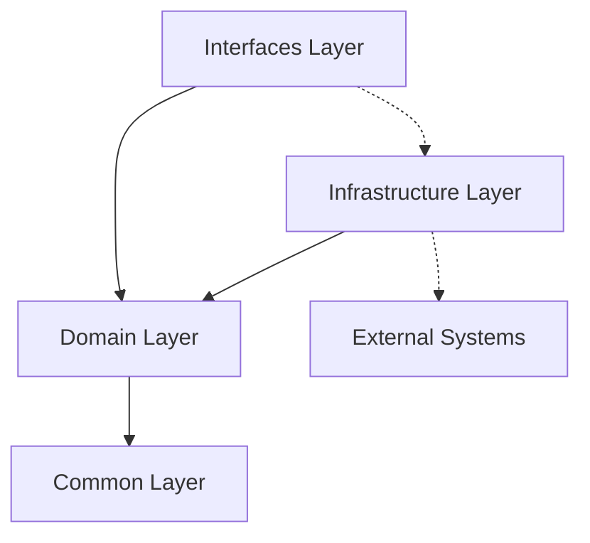

# 아키텍처 설계서

## 📋 프로젝트 개요

본 프로젝트는 **도메인 중심 실용적 아키텍처(Domain-Centric Pragmatic Architecture)**를 기반으로 설계된 이커머스 서비스입니다. 사용자가 원하는 차를 커스텀 배합하여 박스 형태로 주문할 수 있는 서비스를 제공합니다.

### 핵심 기능
- 🍵 **커스텀 차 박스 구성**: 사용자 취향에 맞는 차 배합
- 🛒 **장바구니 관리**: 배합 비율 검증 및 재고 확인
- 📦 **주문 처리**: 복합 트랜잭션 기반 주문 생성
- 💰 **포인트 결제**: 포인트와 PG 혼합 결제
- 🎫 **선착순 쿠폰**: Redis 기반 동시성 제어
- 📊 **재고 관리**: 실시간 재고 추적 및 복구

## 🏗️ 아키텍처 설계 원칙

### 1. 도메인 우선 설계 (Domain-First Design)
비즈니스 로직이 기술적 관심사에 의존하지 않도록 설계하되, 실용성을 위해 합리적인 타협점을 선택했습니다.

### 2. 실용적 DIP 적용 (Pragmatic Dependency Inversion)
멘토님의 조언을 반영하여 변경이 빈번하지 않은 JPA 기술에 대해서는 도메인 엔티티에 직접 어노테이션을 사용합니다.

### 3. CQRS 패턴 적용 (Command Query Responsibility Segregation)
명령(Command)과 조회(Query)의 책임을 분리하여 성능과 확장성을 고려했습니다.

### 4. 테스트 주도 개발 (Test-Driven Development)
각 계층별 독립적인 단위 테스트가 가능하도록 설계했습니다.

## 🛡️ 검증(Validation) 패턴 가이드

### 검증 로직 분리 기준

비즈니스 로직을 도메인에 구현하면서 검증 로직이 분산되는 문제를 방지하기 위해 명확한 기준을 정의했습니다.

#### 1. Value Objects (VO) - 입력값 형식 검증
**목적**: 불변성과 입력값 유효성을 보장하는 원시 타입 래핑
**사용 기준**:
- 원시 타입(Long, Int, String)을 도메인 의미있는 값으로 래핑
- 생성 시점에 형식/범위 검증
- 비즈니스 의미가 명확한 값

```kotlin
@JvmInline
value class ChargeAmount private constructor(val value: Long) {
    companion object {
        operator fun invoke(amount: Long): ChargeAmount {
            require(amount >= MIN_CHARGE) { "최소 충전 금액은 ${MIN_CHARGE}원입니다" }
            require(amount <= MAX_CHARGE) { "최대 충전 금액은 ${MAX_CHARGE}원입니다" }
            require(amount % UNIT == 0L) { "충전은 ${UNIT}원 단위로만 가능합니다" }
            return ChargeAmount(amount)
        }
    }
}
```

#### 2. Validator Classes - 복잡한 비즈니스 규칙 검증
**목적**: 여러 데이터를 조합한 복잡한 비즈니스 규칙 검증
**사용 기준**:
- 여러 값을 조합한 검증이 필요한 경우
- DB 조회 없이 순수 로직만으로 검증 가능
- 도메인 엔티티 코드가 복잡해지는 것을 방지

```kotlin
object PaymentValidator {
    fun validateBalance(currentBalance: Long, paymentAmount: Long) {
        if (currentBalance < paymentAmount) {
            throw PaymentException.InsufficientBalance(currentBalance, paymentAmount)
        }
    }
}
```

#### 3. Entity Methods - 상태 변경 관련 검증
**목적**: 엔티티 상태 변경 시 필요한 검증
**사용 기준**:
- 현재 상태를 기반으로 한 검증
- 상태 전이 규칙 검증
- 엔티티 자체의 불변 조건 검증

```kotlin
fun cancel(cancelledBy: Long) {
    if (!canBeCancelled()) {
        throw OrderException.OrderCancellationNotAllowed(orderNumber, status)
    }
    this.status = OrderStatus.CANCELLED
}
```

#### 4. Exception Classes - 도메인별 예외 처리
**목적**: 각 검증 단계에서 발생하는 예외를 타입 안전하게 처리
**구조**:
- ErrorCode enum (에러 코드 + HTTP 상태)
- BusinessException 추상 클래스 (로그 레벨 + 메타데이터)
- 도메인별 sealed class 예외 계층

```kotlin
sealed class PaymentException(
    errorCode: PaymentErrorCode,
    message: String = errorCode.message,
    logLevel: Level = Level.WARN,
    data: Map<String, Any> = emptyMap()
) : BusinessException(errorCode, message, logLevel, data) {

    class InsufficientBalance(currentBalance: Long, paymentAmount: Long) : PaymentException(
        errorCode = PaymentErrorCode.INSUFFICIENT_BALANCE,
        data = mapOf("currentBalance" to currentBalance, "paymentAmount" to paymentAmount)
    )
}
```

### 검증 로직 실행 순서 (3단계 패턴)
1. **VO 검증** → 입력값 형식/범위 검증 (생성 시점)
2. **Validator 검증** → 복잡한 비즈니스 로직 (UseCase/Service 레벨)
3. **Entity 상태변경** → 최소한의 상태 검증 후 변경

### 다국어 지원 고려사항
- 현재 `require` 메시지는 개발용
- 프로덕션에서는 ErrorCode 기반 MessageSource 사용
- ErrorCode enum에 다국어 키 정의 후 locale별 메시지 로드

## 🔢 Snowflake ID 생성

### 라이브러리 선택
**cn.ipokerface:snowflake-id-generator:2.5.0** (Maven Central 최신 버전)

### 특징
- **64bit 구조**: 1bit(미사용) + 41bit(timestamp) + 5bit(datacenterId) + 5bit(workerId) + 12bit(sequence)
- **성능**: 초당 최대 4,096,000개 ID 생성 가능
- **수명**: 약 69년간 사용 가능 (2020-10-01 기준)
- **분산 안전**: workerId(0-31) + datacenterId(0-31)로 충돌 방지

### 사용 예시
```kotlin
@Service
class OrderService(private val snowflakeGenerator: SnowflakeGenerator) {

    fun createOrder(userId: Long, totalAmount: Long, createdBy: Long): Order {
        // Service에서 Snowflake ID 생성
        val orderNumber = snowflakeGenerator.generateOrderNumber() // "ORDABC123DEF456"

        // Entity에 미리 생성된 번호 전달
        return Order.create(
            orderNumber = orderNumber,
            userId = userId,
            totalAmount = totalAmount,
            createdBy = createdBy
        )
    }
}
```

### 아키텍처 구현
- ✅ **Service 계층에서 ID 생성**: Entity에서 직접 생성하지 않음
- ✅ **의존성 주입**: `@Component` SnowflakeGenerator를 Service에 주입
- ✅ **환경설정**: `MACHINE_ID` 환경변수로 서버별 고유 ID 설정 (0-1023)
- ✅ **분산 안전**: 여러 서버에서도 유니크 보장

## 📁 프로젝트 구조

```
src/main/kotlin/io/hhplus/ecommerce/
├── common/                          # 공통 기능
│   ├── response/                    # 표준 응답 형식
│   ├── exception/                   # 전역 예외 처리
│   ├── util/                        # 공통 유틸리티
│   └── lock/                        # 동시성 제어 유틸
├── config/                          # 스프링 설정
│   ├── JpaConfig.kt
│   ├── RedisConfig.kt
│   └── SecurityConfig.kt
├── infrastructure/                  # 인프라스트럭처 계층
│   ├── persistence/                 # 영속성 관련
│   │   ├── user/                    # 사용자 도메인 영속성
│   │   │   ├── database/
│   │   │   │   └── UserBalanceTable.kt
│   │   │   └── repository/
│   │   │       └── JpaUserRepository.kt
│   │   ├── product/                 # 상품 도메인 영속성
│   │   │   ├── database/
│   │   │   │   └── InventoryTable.kt
│   │   │   └── repository/
│   │   │       ├── JpaProductRepository.kt
│   │   │       └── JpaInventoryRepository.kt
│   │   ├── cart/                    # 장바구니 도메인 영속성
│   │   │   └── repository/
│   │   │       └── JpaCartRepository.kt
│   │   ├── order/                   # 주문 도메인 영속성
│   │   │   └── repository/
│   │   │       └── JpaOrderRepository.kt
│   │   ├── payment/                 # 결제 도메인 영속성
│   │   │   ├── database/
│   │   │   │   └── BalanceHistoryTable.kt
│   │   │   └── repository/
│   │   │       └── JpaPaymentRepository.kt
│   │   └── coupon/                  # 쿠폰 도메인 영속성
│   │       ├── database/
│   │       │   └── CouponCountTable.kt
│   │       └── repository/
│   │           └── JpaCouponRepository.kt
│   ├── external/                    # 외부 시스템 연동
│   │   ├── pg/                      # PG 연동
│   │   └── notification/            # 알림 시스템
│   └── event/                       # 이벤트 발행/구독
├── domain/                          # 도메인 계층
│   ├── user/                        # 사용자 도메인
│   │   ├── entity/
│   │   │   ├── User.kt
│   │   │   └── UserBalance.kt
│   │   ├── repository/              # Repository 인터페이스
│   │   │   └── UserRepository.kt
│   │   ├── service/                 # 도메인 서비스
│   │   │   ├── UserQueryService.kt
│   │   │   └── BalanceService.kt
│   │   ├── usecase/                 # 유스케이스
│   │   │   ├── GetUserBalanceUseCase.kt
│   │   │   ├── ChargeBalanceUseCase.kt
│   │   │   └── DeductBalanceUseCase.kt
│   │   └── exception/               # 도메인 예외
│   ├── product/                     # 상품 도메인
│   │   ├── entity/
│   │   │   ├── Product.kt
│   │   │   ├── Category.kt
│   │   │   └── Inventory.kt
│   │   ├── repository/
│   │   │   ├── ProductRepository.kt
│   │   │   └── InventoryRepository.kt
│   │   ├── service/
│   │   │   ├── ProductQueryService.kt
│   │   │   ├── InventoryService.kt
│   │   │   └── CategoryService.kt
│   │   ├── usecase/
│   │   │   ├── GetProductsUseCase.kt
│   │   │   ├── CheckInventoryUseCase.kt
│   │   │   ├── ReserveStockUseCase.kt
│   │   │   └── RestoreStockUseCase.kt
│   │   └── vo/                      # Value Objects
│   │       ├── ProductPrice.kt
│   │       └── StockQuantity.kt
│   ├── cart/                        # 장바구니 도메인
│   │   ├── entity/
│   │   │   ├── Cart.kt
│   │   │   └── CartItem.kt
│   │   ├── repository/
│   │   ├── service/
│   │   │   ├── CartService.kt
│   │   │   └── CartValidationService.kt
│   │   ├── usecase/
│   │   │   ├── AddToCartUseCase.kt
│   │   │   ├── GetCartUseCase.kt
│   │   │   └── RemoveFromCartUseCase.kt
│   │   └── validator/
│   │       └── TeaRatioValidator.kt
│   ├── order/                       # 주문 도메인
│   │   ├── entity/
│   │   │   ├── Order.kt
│   │   │   └── OrderItem.kt
│   │   ├── repository/
│   │   ├── service/
│   │   │   ├── OrderQueryService.kt
│   │   │   └── OrderValidationService.kt
│   │   ├── usecase/
│   │   │   ├── CreateOrderUseCase.kt
│   │   │   ├── GetOrdersUseCase.kt
│   │   │   ├── CancelOrderUseCase.kt
│   │   │   └── UpdateOrderStatusUseCase.kt
│   │   └── facade/
│   │       └── OrderProcessFacade.kt
│   ├── payment/                     # 결제 도메인
│   │   ├── entity/
│   │   │   ├── Payment.kt
│   │   │   ├── UserBalance.kt
│   │   │   └── BalanceHistory.kt
│   │   ├── repository/
│   │   ├── service/
│   │   │   ├── PaymentService.kt
│   │   │   └── PointService.kt
│   │   ├── usecase/
│   │   │   ├── ProcessPaymentUseCase.kt
│   │   │   ├── ChargePointsUseCase.kt
│   │   │   └── RefundPaymentUseCase.kt
│   │   └── vo/
│   │       └── PaymentAmount.kt
│   └── coupon/                      # 쿠폰 도메인
│       ├── entity/
│       │   ├── Coupon.kt
│       │   └── UserCoupon.kt
│       ├── repository/
│       ├── service/
│       │   ├── CouponValidationService.kt
│       │   └── DiscountCalculationService.kt
│       ├── usecase/
│       │   ├── IssueCouponUseCase.kt
│       │   ├── GetAvailableCouponsUseCase.kt
│       │   ├── ApplyCouponUseCase.kt
│       │   └── ExpireCouponsUseCase.kt
│       └── strategy/
│           ├── DiscountStrategy.kt
│           ├── PercentageDiscount.kt
│           └── FixedAmountDiscount.kt
└── interfaces/                      # 인터페이스 계층
    ├── api/                         # REST API
    │   ├── ProductController.kt
    │   ├── CartController.kt
    │   ├── OrderController.kt
    │   ├── PaymentController.kt
    │   └── CouponController.kt
    ├── dto/                         # Data Transfer Objects
    │   ├── request/
    │   └── response/
    └── event/                       # 이벤트 핸들러
        └── OrderEventHandler.kt
```

## 🔄 계층별 책임과 분리 이유

### 1. Interfaces Layer (인터페이스 계층)
**위치**: `interfaces/`
**책임**: 외부 세계와의 모든 상호작용을 담당

#### 1.1 API 컨트롤러 (`interfaces/api/`)
```kotlin
@RestController
@RequestMapping("/api/v1/orders")
class OrderController(
    private val createOrderUseCase: CreateOrderUseCase,
    private val getOrdersUseCase: GetOrdersUseCase
) {
    @PostMapping
    fun createOrder(@RequestBody request: CreateOrderRequest): ApiResponse<OrderResponse> {
        val result = createOrderUseCase.execute(request.toCommand())
        return ApiResponse.success(OrderResponse.from(result))
    }
}
```

**분리 이유**:
- HTTP 요청/응답 처리에만 집중
- 도메인 로직과 외부 인터페이스 분리
- API 변경이 도메인에 영향을 주지 않음
- 다양한 인터페이스(REST, GraphQL, gRPC) 추가 용이

#### 1.2 DTO (`interfaces/dto/`)
```kotlin
// Controller 전용 DTO
data class CreateOrderRequest(
    val cartItemIds: List<Long>,
    val couponCode: String?,
    val deliveryAddress: DeliveryAddressRequest
) {
    fun toCommand(): CreateOrderCommand = CreateOrderCommand(
        cartItemIds = this.cartItemIds,
        couponCode = this.couponCode,
        deliveryAddress = this.deliveryAddress.toDomain()
    )
}
```

**분리 이유**:
- 외부 API 스펙과 내부 도메인 모델 분리
- API 버전 관리 용이성
- 클라이언트 요구사항 변경에 대한 유연성

### 2. Domain Layer (도메인 계층)
**위치**: `domain/{도메인명}/`
**책임**: 핵심 비즈니스 로직과 규칙 포함

#### 2.1 Entity (`domain/{domain}/entity/`)
```kotlin
@Entity
@Table(name = "orders")
class Order(
    @Id @GeneratedValue(strategy = GenerationType.IDENTITY)
    val id: Long = 0,

    @Column(unique = true, nullable = false)
    val orderNumber: String,

    @Enumerated(EnumType.STRING)
    var status: OrderStatus
) {
    fun cancel(): OrderCancelResult {
        validateCanCancel()
        this.status = OrderStatus.CANCELLED
        return OrderCancelResult.of(this)
    }

    private fun validateCanCancel() {
        if (!canCancel()) {
            throw OrderCannotBeCancelledException("주문을 취소할 수 없는 상태입니다")
        }
    }
}
```

**분리 이유**:
- 비즈니스 규칙을 엔티티 내부에 캡슐화
- 도메인 지식의 응집도 향상
- JPA 어노테이션 사용으로 실용성 확보 (멘토님 조언 반영)

#### 2.2 UseCase (`domain/{domain}/usecase/`)
```kotlin
@Component
@Transactional
class CreateOrderUseCase(
    private val orderRepository: OrderRepository,
    private val reserveStockUseCase: ReserveStockUseCase,
    private val applyCouponUseCase: ApplyCouponUseCase
) {
    fun execute(command: CreateOrderCommand): CreateOrderResult {
        // 1. 재고 예약
        val stockReservation = reserveStockUseCase.execute(command.toStockCommand())

        try {
            // 2. 쿠폰 적용
            val couponResult = applyCouponUseCase.execute(command.toCouponCommand())

            // 3. 주문 생성
            val order = Order.create(command, couponResult.discount)
            return CreateOrderResult.success(orderRepository.save(order))

        } catch (e: Exception) {
            stockReservation.rollback()
            throw e
        }
    }
}
```

**분리 이유**:
- API 명세를 유스케이스로 직접 구현
- 복잡한 비즈니스 플로우의 체계적 관리
- 트랜잭션 경계 명확화
- 각 유스케이스별 독립적인 테스트 가능

#### 2.3 Domain Service (`domain/{domain}/service/`)
```kotlin
@Service
class InventoryService(
    private val inventoryRepository: InventoryRepository
) {
    fun calculateRequiredAmount(cartItem: CartItem): Int {
        val totalTeaBags = cartItem.boxType.days * cartItem.dailyServing
        return totalTeaBags * AVERAGE_TEA_BAG_WEIGHT
    }
}
```

**분리 이료**:
- 여러 엔티티에 걸친 도메인 로직 처리
- 도메인 지식의 중복 제거
- 단일 엔티티로는 처리하기 어려운 비즈니스 규칙 구현

#### 2.4 Repository Interface (`domain/{domain}/repository/`)
```kotlin
interface OrderRepository {
    fun save(order: Order): Order
    fun findById(id: Long): Order?
    fun findByOrderNumber(orderNumber: String): Order?
    fun findByUserIdAndStatus(userId: Long, status: OrderStatus): List<Order>
}
```

**분리 이유**:
- 도메인과 인프라스트럭처 계층 분리
- 테스트 시 Mock 객체 활용 가능
- 구현체 교체 용이성 (JPA → MongoDB 등)

### 3. Infrastructure Layer (인프라스트럭처 계층)
**위치**: `infrastructure/`
**책임**: 외부 시스템과의 연동 및 기술적 구현

#### 3.1 Persistence (`infrastructure/persistence/{domain}/`)
```kotlin
// infrastructure/persistence/order/repository/JpaOrderRepository.kt
@Repository
class JpaOrderRepository(
    private val springDataRepository: SpringDataOrderRepository
) : OrderRepository {
    override fun save(order: Order): Order = springDataRepository.save(order)
    override fun findById(id: Long): Order? = springDataRepository.findById(id).orElse(null)
}

// infrastructure/persistence/order/database/OrderTable.kt
@Component
class OrderTable {
    private val orders = ConcurrentHashMap<Long, Order>()
    private val sequence = AtomicLong(1)

    fun save(order: Order): Order {
        val savedOrder = if (order.id == 0L) {
            order.copy(id = sequence.getAndIncrement())
        } else order
        orders[savedOrder.id] = savedOrder
        return savedOrder
    }
}
```

**분리 이유**:
- 도메인별 영속성 관리 분리
- 인메모리 DB와 실제 DB 구현체 공존
- 영속성 기술 변경에 대한 영향도 최소화
- 도메인별 독립적인 데이터 관리

#### 3.2 External (`infrastructure/external/`)
```kotlin
@Component
class PaymentGatewayClient {
    fun processPayment(request: PaymentRequest): PaymentResult {
        // PG사 연동 로직
        return PaymentResult.success(request.amount)
    }
}
```

**분리 이유**:
- 외부 시스템 변경에 대한 격리
- 외부 의존성 최소화
- Mock을 활용한 테스트 용이성

### 4. Common Layer (공통 계층)
**위치**: `common/`
**책임**: 전역적으로 사용되는 공통 기능

```kotlin
// common/response/ApiResponse.kt
data class ApiResponse<T>(
    val success: Boolean,
    val data: T? = null,
    val error: ErrorInfo? = null
) {
    companion object {
        fun <T> success(data: T): ApiResponse<T> = ApiResponse(true, data)
        fun <T> error(error: ErrorInfo): ApiResponse<T> = ApiResponse(false, error = error)
    }
}

// common/lock/LockManager.kt
@Component
class LockManager {
    fun <T> withLock(key: String, timeout: Duration = Duration.ofSeconds(3), action: () -> T): T {
        // 분산 락 구현
    }
}
```

**분리 이유**:
- 횡단 관심사의 중앙화
- 코드 중복 제거
- 표준화된 응답 형식 보장

## 🔗 의존성 규칙 및 플로우

### 의존성 방향


### 핵심 규칙
1. **상위 계층은 하위 계층에 의존 가능**
2. **하위 계층은 상위 계층에 의존 불가**
3. **도메인 계층은 인프라스트럭처를 직접 의존하지 않음**
4. **인터페이스를 통한 의존성 역전 적용**

### 실행 플로우
```
HTTP Request → Controller → UseCase → Domain Service → Repository Interface
                                                     ↓
                                           Infrastructure Repository → Database
```

## 🚀 MSA 전환 준비

현재 구조는 **Modular Monolith**이지만, 향후 MSA 전환을 고려한 설계입니다.

### 전환 시나리오
1. **Phase 1**: 현재 구조 (Modular Monolith)
2. **Phase 2**: 인증 서비스 분리
3. **Phase 3**: 결제 서비스 분리
4. **Phase 4**: 도메인별 마이크로서비스 분리

### 전환 용이성 확보 방법
- 도메인별 수직 분할 구조
- 외부 서비스 클라이언트 인터페이스 준비
- 이벤트 기반 비동기 통신 구조
- 독립적인 데이터베이스 스키마

## 🧪 테스트 전략

### 계층별 테스트 접근법

#### 1. Unit Test (단위 테스트)
```kotlin
@Test
class CreateOrderUseCaseTest {
    private val orderRepository = mockk<OrderRepository>()
    private val reserveStockUseCase = mockk<ReserveStockUseCase>()
    private val createOrderUseCase = CreateOrderUseCase(orderRepository, reserveStockUseCase)

    @Test
    fun `재고 부족 시 주문 생성 실패`() {
        // given
        every { reserveStockUseCase.execute(any()) } throws InsufficientStockException()

        // when & then
        shouldThrow<InsufficientStockException> {
            createOrderUseCase.execute(createOrderCommand())
        }
    }
}
```

#### 2. Integration Test (통합 테스트)
```kotlin
@SpringBootTest
@Transactional
class OrderIntegrationTest {
    @Autowired
    private lateinit var createOrderUseCase: CreateOrderUseCase

    @Test
    fun `전체 주문 프로세스 정상 동작`() {
        val result = createOrderUseCase.execute(createOrderCommand())
        assertThat(result.isSuccess).isTrue()
    }
}
```

#### 3. 인메모리 독립 테스트
각 계층이 외부 의존성 없이 독립적으로 테스트 가능하도록 설계했습니다.

## 🏃 실행 방법

### 개발 환경 실행
```bash
./gradlew bootRun --args='--spring.profiles.active=local'
```

### 테스트 실행
```bash
./gradlew test
```

### 커버리지 확인
```bash
./gradlew jacocoTestReport
```

## 📝 핵심 비즈니스 정책

상세한 비즈니스 정책은 [`docs/api/business-policies.md`](docs/api/business-policies.md)를 참고하세요.

### 주요 정책
- **장바구니**: 최대 10개 항목, 동일 박스타입 중복 방지
- **재고**: 실시간 재고 확인, 일일 생산 한도 제한
- **쿠폰**: 선착순 발급, 중복 방지, 유효성 검증
- **결제**: 포인트 잔액 확인, 혼합 결제 지원
- **주문**: 복합 트랜잭션, 실패 시 자동 롤백

## 📖 관련 문서

- [API 명세서](docs/api/api-specification.md)
- [데이터 모델 설계](docs/api/data-models.md)
- [비즈니스 정책](docs/api/business-policies.md)
- [시퀀스 다이어그램](docs/api/sequences/)
