# 체크아웃 플로우 리팩토링 보고서

## 개요

주문 생성 시점과 재고 차감 시점을 변경하여 사용자 경험을 개선하고, 결제 중 재고 부족으로 인한 주문 취소 문제를 해결하기 위한 리팩터링 진행

---

## 배경 및 문제점

### 기존 흐름의 문제

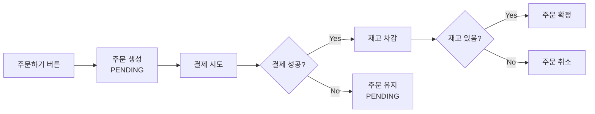

**문제 1: 결제 전 이탈 시 주문 노출**
- 결제 전 이탈해도 주문이 PENDING 상태로 남아 "내 주문 목록"에 노출
- 사용자 혼란 유발

**문제 2: 결제 후 재고 부족**
- 결제 진행 중 다른 사용자가 동일 상품 구매 가능
- 결제 성공 후 재고 부족으로 주문 취소되는 케이스 발생
- "결제했는데 품절" 경험으로 사용자 불만 초래

---

## 해결 방안

### 핵심 변경 사항

1. **주문 생성 시점 변경**: 주문하기 클릭 시 `PENDING_PAYMENT` 상태로 주문 생성
2. **재고 선점 도입**: 주문하기 시 재고 예약 → 결제 완료 시 예약 확정
3. **사용자 가시성 관리**: 결제 전 주문은 사용자에게 노출되지 않음
4. **자동 만료 처리**: 일정 시간 내 결제 미완료 시 예약 해제 및 주문 만료

---

## 아키텍처 변경

### 도메인 구조

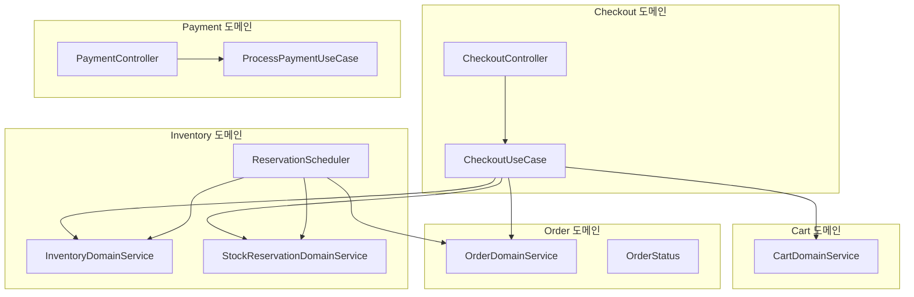

### 주문 상태 전이

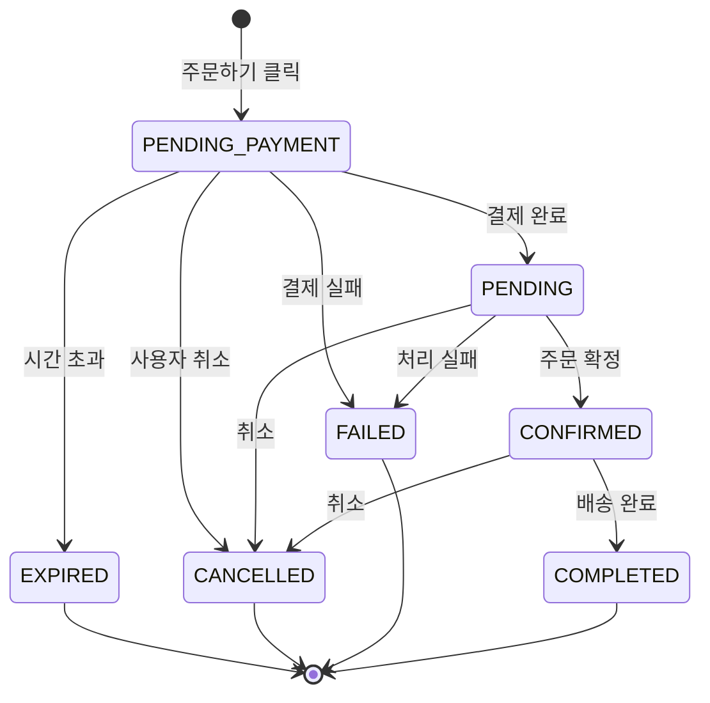

**사용자에게 노출되는 상태**: `PENDING`, `CONFIRMED`, `COMPLETED`, `CANCELLED`

**노출되지 않는 상태**: `PENDING_PAYMENT`, `EXPIRED`

---

## 체크아웃 플로우

### API 엔드포인트

| 엔드포인트 | 설명 |
|-----------|------|
| `POST /api/v1/checkout/initiate` | 주문하기 (재고 예약 + PENDING_PAYMENT 주문 생성) |
| `POST /api/v1/checkout/{orderId}/cancel` | 주문창 이탈 (재고 예약 해제 + 주문 만료) |
| `POST /api/v1/payments/process` | 결제 처리 (결제 성공 시 PaymentCompleted 이벤트 발행) |

### 주문하기 요청 방식

**1. 장바구니에서 주문하기**
```json
POST /api/v1/checkout/initiate
{
  "userId": 100,
  "cartItemIds": [1, 2, 3]
}
```

**2. 상품에서 바로 주문**
```json
POST /api/v1/checkout/initiate
{
  "userId": 100,
  "directOrderItems": [
    { "productId": 10, "quantity": 2, "giftWrap": false }
  ]
}
```

### 정상 흐름

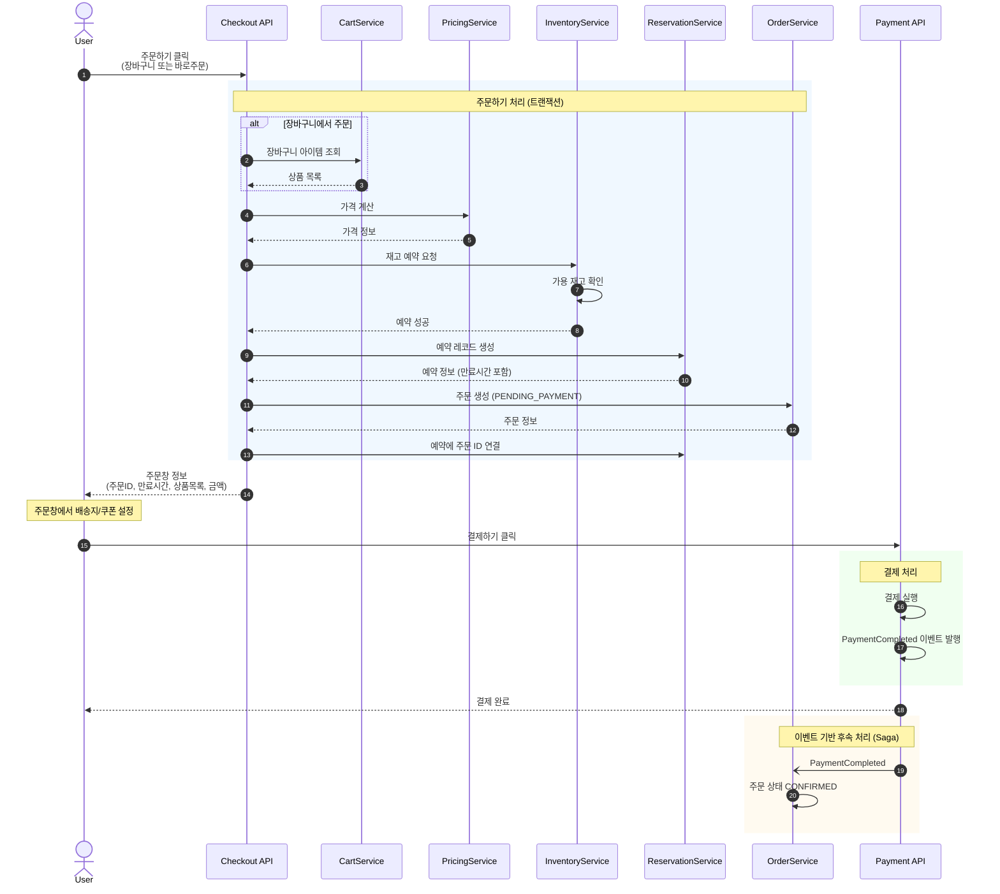

### 재고 부족 시 흐름

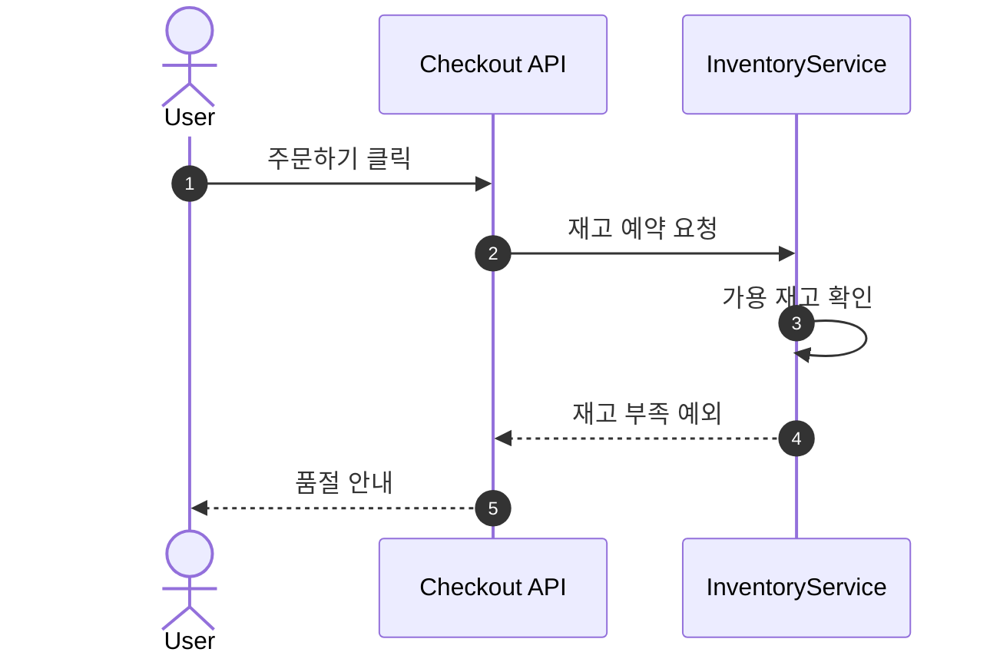

---

## 결제 흐름

### 결제 처리 구조

기존에는 `OrderCreated` 이벤트를 `PaymentEventHandler`가 받아 **자동 결제**를 수행했으나,
실제 비즈니스 흐름에 맞게 **사용자가 직접 결제 API를 호출**하는 방식으로 변경.

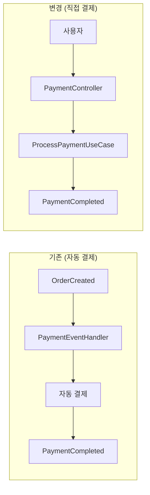

**변경 사항:**
- `PaymentEventHandler` 삭제 (자동 결제 제거)
- `ProcessPaymentUseCase`에서 결제 성공 시 `PaymentCompleted` 이벤트 발행

### 결제 완료 후 이벤트 처리

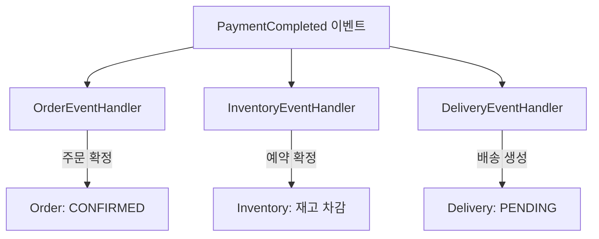

---

## 타임아웃 처리

### 자동 만료 플로우

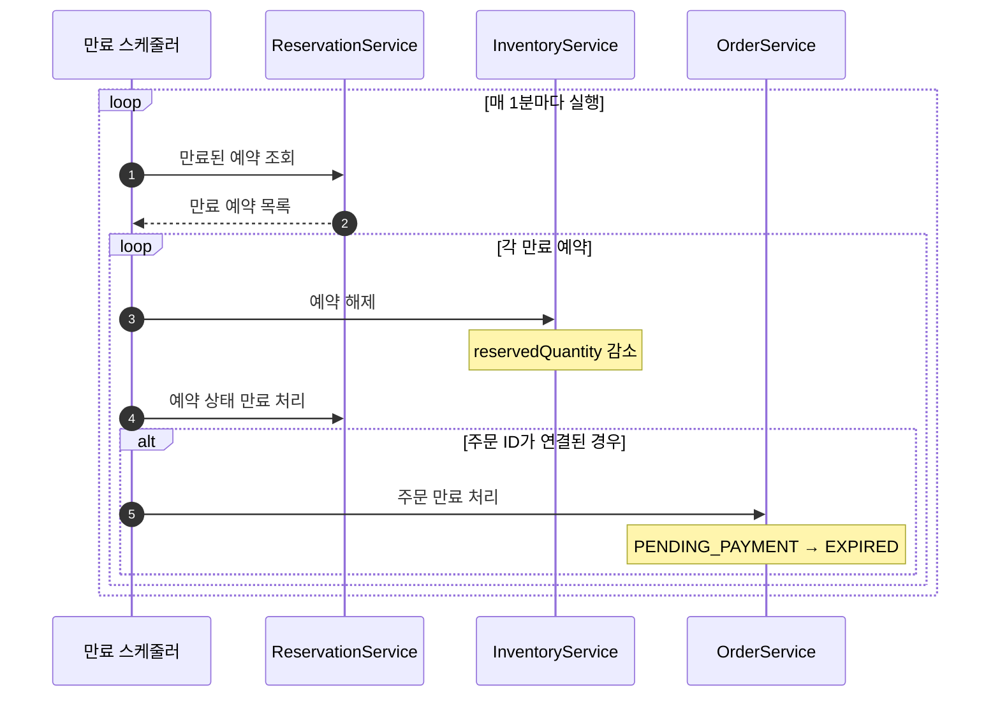

### 예약 시간 정책

| 상품 유형 | 예약 시간 |
|---------|----------|
| 일반 상품 | 10분 |
| 예약 상품 | 30분 |

---

## 재고 관리 모델

### 재고 수량 구조

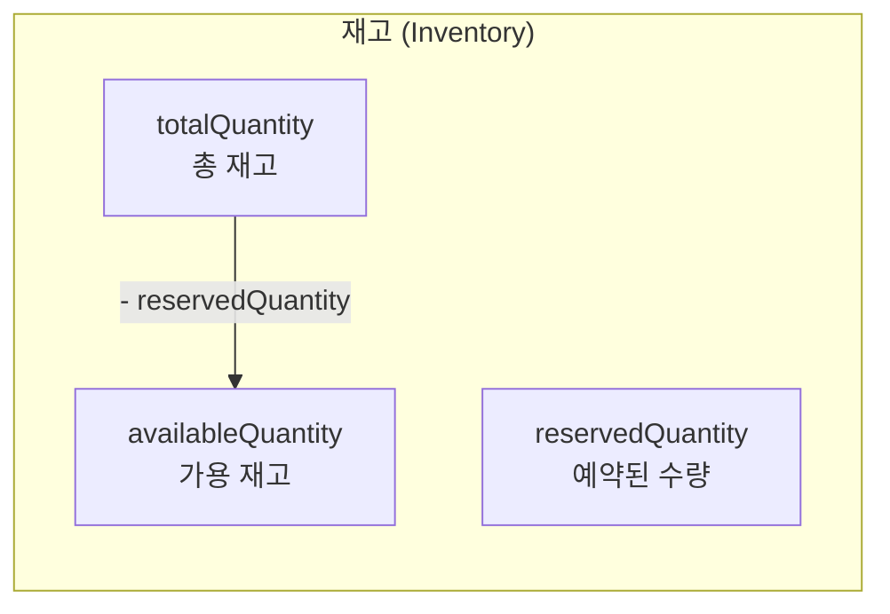

### 재고 변경 시나리오

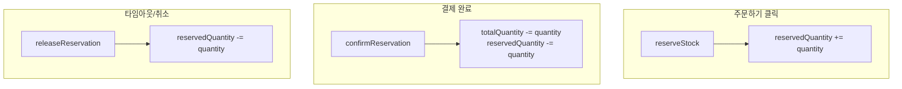

---

## 주요 설계 결정

### 1. Checkout 도메인 분리

체크아웃 관련 로직을 별도 도메인으로 분리하여 Order, Inventory, Cart 도메인과의 결합도를 낮춤.

### 2. 장바구니/바로주문 이원화

- `cartItemIds`: 장바구니에서 선택한 아이템으로 주문
- `directOrderItems`: 상품 상세에서 바로 주문

### 3. 배송지/쿠폰 분리

주문하기 시점에는 상품과 재고만 처리하고, 배송지와 쿠폰은 결제 시점에 처리.

### 4. 예약 기반 재고 관리

즉시 차감 대신 예약/확정 2단계 방식을 도입하여 결제 중 재고 선점 보장.

### 5. 분산 락 적용

동시 주문하기 시 데이터 정합성을 보장하기 위해 사용자별 분산 락 적용.

### 6. 스케줄러 기반 만료 처리

만료된 예약을 주기적으로 정리하여 재고 회수 및 주문 상태 정리 자동화.

### 7. 결제 API 직접 호출

결제는 이벤트 기반이 아닌 동기 API 호출로 처리. 사용자에게 즉시 결제 결과를 반환해야 하므로.

---

## 결과 및 기대 효과

### 사용자 경험 개선

- 결제 진행 중 재고가 보장되어 "결제했는데 품절" 상황 방지
- 결제 전 이탈한 주문이 목록에 노출되지 않아 혼란 해소

### 시스템 안정성 향상

- 재고 정합성 강화
- 상태 전이 규칙 명확화
- 자동 만료 처리로 운영 부담 감소

### 확장성 확보

- Checkout 도메인 분리로 결제 수단 추가 등 확장 용이
- 예약 시간 정책을 상품 유형별로 차등 적용 가능

---

## 추가 리팩터링 사항

### 1. 다중 쿠폰 적용 지원

#### 변경 사항

기존 단일 쿠폰(`usedCouponId: Long?`)에서 다중 쿠폰(`usedCouponIds: List<Long>`)으로 변경.

**변경된 파일**:
- `Order.kt`: `usedCouponId` → `usedCouponIds: List<Long>`
- `OrderJpaEntity.kt`: JSON 컬럼으로 `usedCouponIds` 저장
- `LongListConverter.kt`: kotlinx.serialization 기반 JPA AttributeConverter 추가
- `PricingDomainService.kt`: `calculatePricingWithCoupons()` 메서드 추가
- `CouponDomainService.kt`: `markCouponsAsUsed()`, `releaseCoupons()` 메서드 추가
- 모든 관련 DTO, Event Payload, Test 파일

#### 쿠폰 적용 순서

다중 쿠폰 적용 시 Scope에 따라 순서대로 적용:

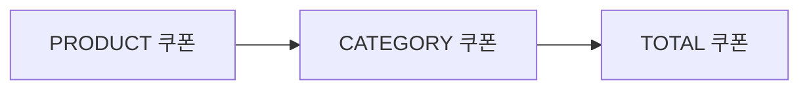

1. **PRODUCT**: 특정 상품에만 적용
2. **CATEGORY**: 특정 카테고리 상품에 적용
3. **TOTAL**: 전체 금액에 적용

각 쿠폰은 누적 적용되며, 최종 금액 계산 시 순서대로 할인 적용.

### 2. 상품 랭킹 배치 처리

#### 변경 사항

기존 이벤트 기반 직접 DB 업데이트에서 **Redis + 배치 동기화** 방식으로 변경.

**아키텍처**:

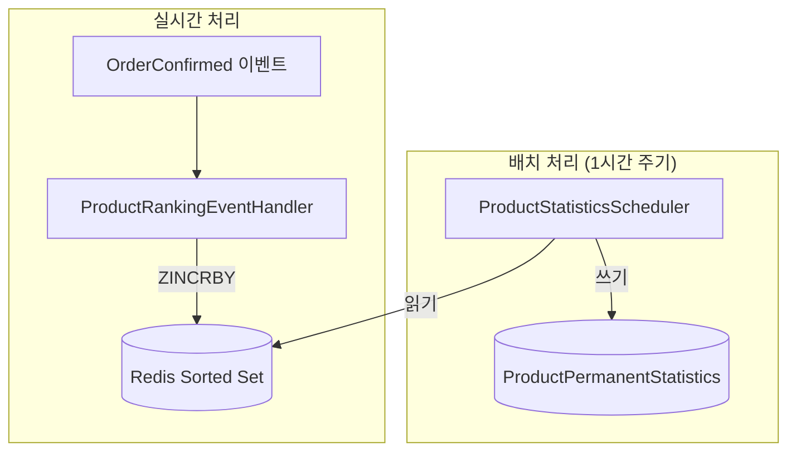

**흐름**:
1. `OrderConfirmed` 이벤트 발생 시 `ProductRankingEventHandler`가 Redis Sorted Set에 판매량 증가
2. `ProductStatisticsScheduler`가 1시간 주기로 Redis 데이터를 DB(`ProductPermanentStatistics`)에 동기화
3. 실시간 랭킹 조회는 Redis에서, 영구 통계는 DB에서 조회

**장점**:
- 실시간 랭킹 조회 성능 향상 (Redis 활용)
- DB 부하 감소 (배치 처리)
- 데이터 영속성 보장 (주기적 DB 동기화)
