# 인프라 설계 문서

## 개요

AWS 인프라 설계를 정리한 문서입니다.

---

## 설계 목표

1. **최소 비용**: 학습/테스트 목적에 맞는 비용 최적화
2. **서비스 분리**: 각 컴포넌트별 독립적인 리소스 할당
3. **정확한 성능 측정**: 부하 테스트 시 병목 지점 명확히 파악
4. **학습 가치**: 직접 운영 경험을 통한 인프라 이해

---

## 최종 인프라 구성

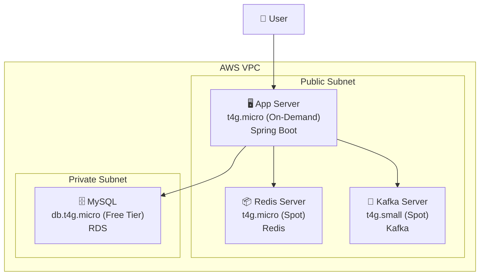

> **보안 참고**: Redis/Kafka가 Public Subnet에 있지만, Security Group에서 App SG로부터만 접근을 허용합니다. 인터넷에서 직접 접근은 차단되어 있습니다. Private Subnet 사용 시 NAT Gateway 비용(~$32/월)이 발생하므로, 학습/테스트 목적에서는 현재 구성이 비용 효율적입니다.

---

## 비용 구조

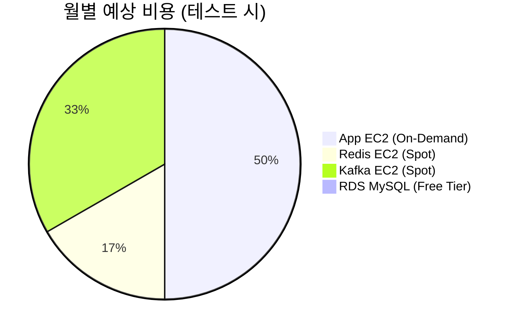

| 서비스 | 인스턴스 | 타입 | 월 비용 |
|-------|---------|------|--------|
| App | t4g.micro (2 vCPU, 1GB) | On-Demand | ~$6 |
| Redis | t4g.micro (2 vCPU, 1GB) | Spot | ~$2 |
| MySQL | db.t4g.micro (2 vCPU, 1GB) | RDS Free Tier | 무료 |
| Kafka | t4g.small (2 vCPU, 2GB) | Spot | ~$4 |

### 상황별 비용

| 상황 | 구성 | 월 비용 |
|-----|------|--------|
| 평상시 | App + Redis + RDS | ~$8 |
| 부하 테스트 | App + Redis + RDS + Kafka | ~$12 |

---

## 의사결정 과정

### 1. 서비스 분리 vs 통합

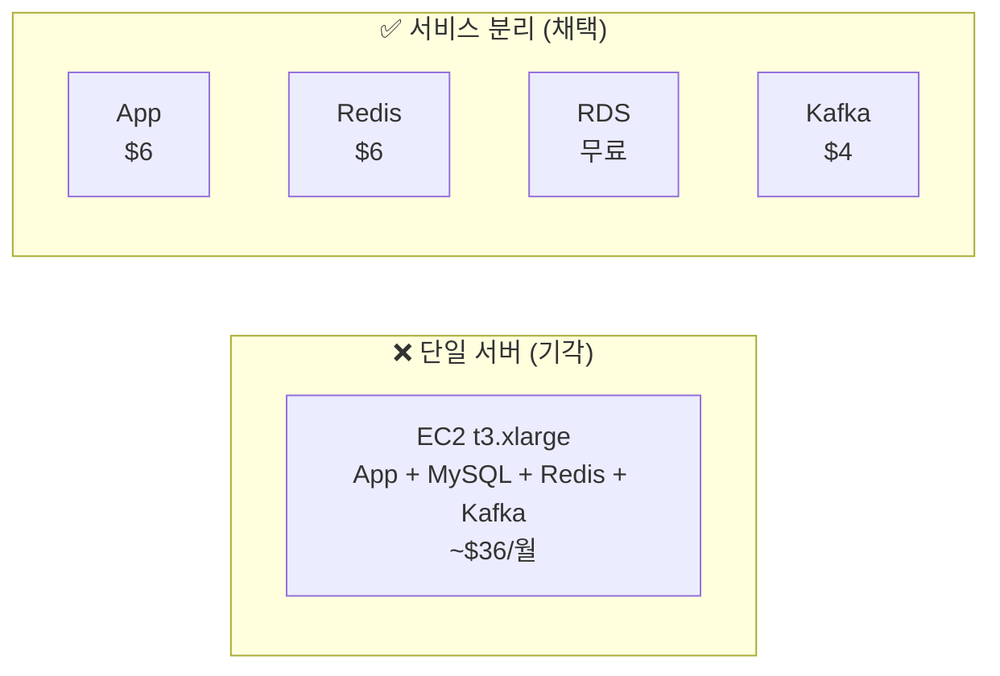

**기각 사유 (단일 서버)**:
- 리소스 경쟁으로 성능 측정 부정확
- MySQL 쿼리 폭주 시 App도 영향
- 병목 지점 파악 어려움

**채택 사유 (서비스 분리)**:
- 각 컴포넌트 독립적 리소스 사용
- 부하 테스트 시 정확한 병목 파악 가능
- 실무와 유사한 아키텍처 경험

### 2. Spot vs On-Demand 인스턴스

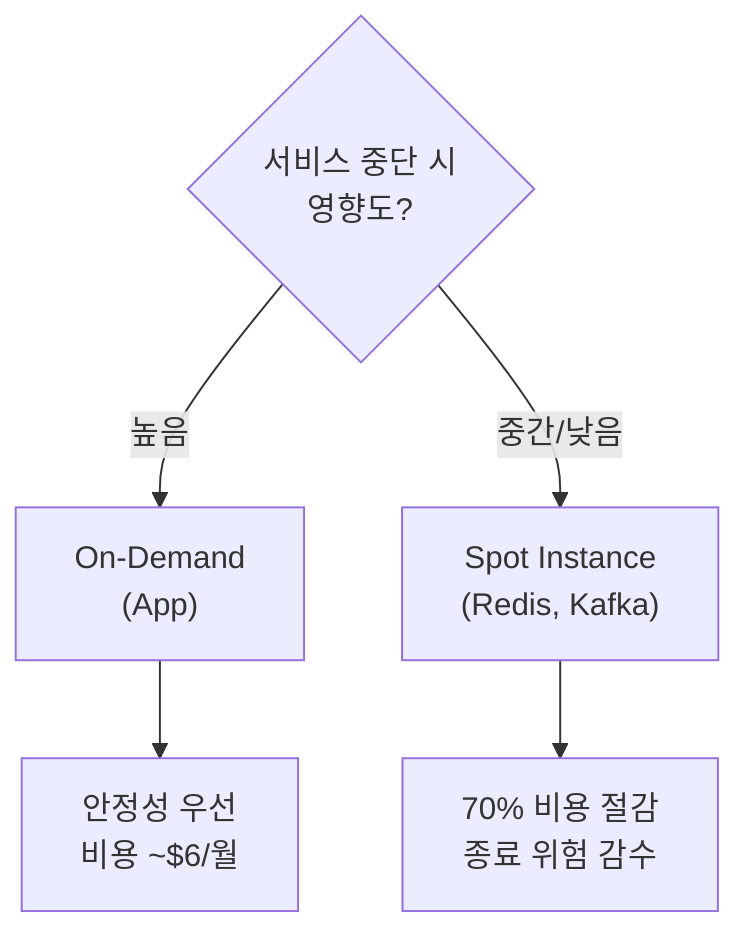

| 서비스 | 선택 | 이유 |
|-------|------|------|
| App | On-Demand | 사용자 요청 처리, 중단 불가 |
| Redis | Spot | 테스트 환경이므로 캐시 유실 허용, 비용 절감 |
| Kafka | Spot | 테스트 용도, 종료되면 재시작하면 됨 |

> **참고**: 프로덕션 환경에서는 Redis를 On-Demand로 전환하거나 ElastiCache 사용을 권장합니다. Spot Instance는 stateful 서비스에 적합하지 않지만, 학습/테스트 환경에서는 비용 절감 효과가 큽니다.

### 3. RDS vs EC2 MySQL

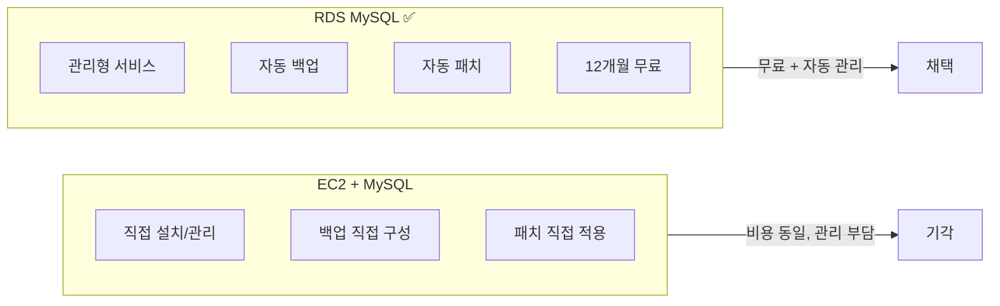

**RDS 선택 이유**:
- 12개월 Free Tier (db.t4g.micro)
- 자동 백업, 패치, 장애 복구
- 추후 확장 용이 (버튼 클릭으로 스케일업)

### 4. ElastiCache vs EC2 Redis

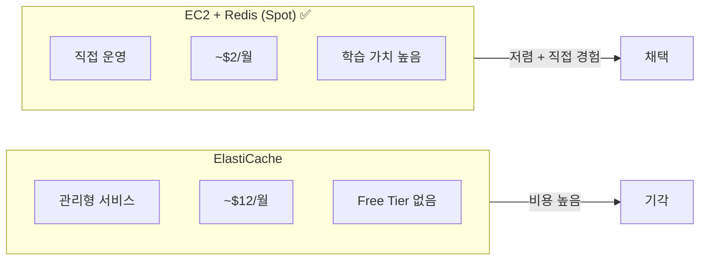

**EC2 + Redis (Spot) 선택 이유**:
- 학습 목적: 직접 운영해봐야 이해됨
- ElastiCache 대비 ~85% 비용 절감 (Spot 활용)
- Redis 설정/튜닝 직접 경험
- 테스트 환경이므로 Spot 종료 시 재시작하면 됨

### 5. Kafka 노드 수 결정

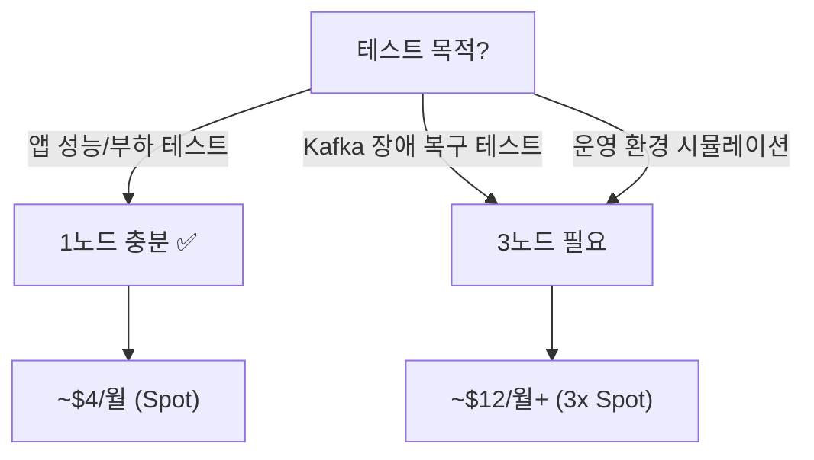

**1노드 선택 이유**:
- 테스트 목적: 앱이 트래픽을 얼마나 버티는지
- Kafka 장애 복구 테스트는 현재 범위 외

---

## 성능 테스트 아키텍처

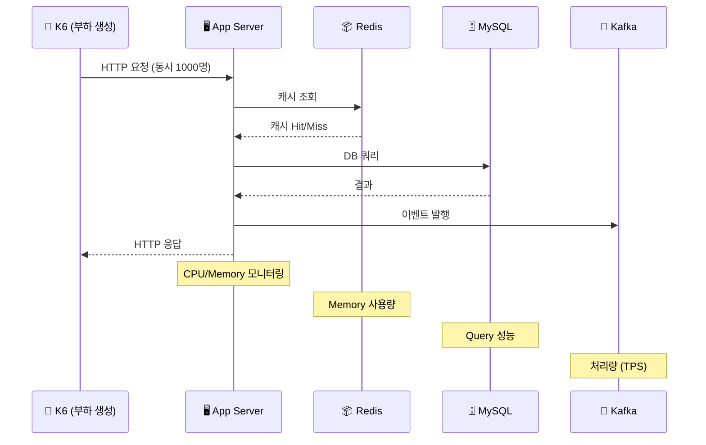

### 분리 구성의 장점

서비스가 분리되어 있어 부하 테스트 시 **병목 지점을 명확히 파악** 가능:

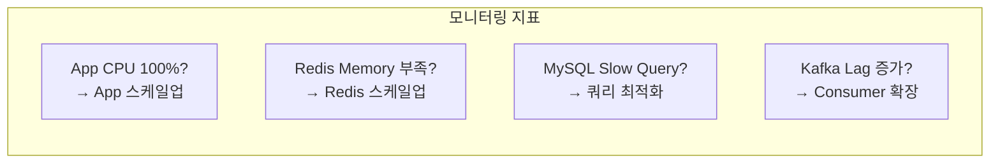

---

## 환경별 설정

### 로컬 개발 환경

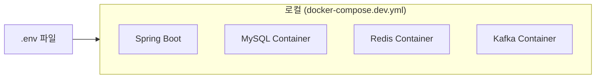

### AWS 운영 환경

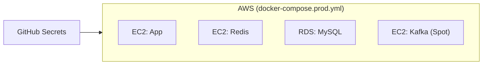

---

## 확장 계획

현재 구성에서 트래픽 증가 시 확장 경로:

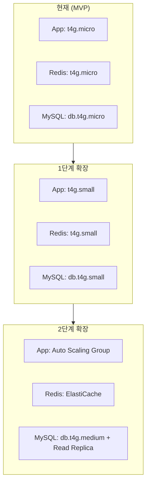

---

## 참고

### ARM 인스턴스 (t4g) 선택 이유

- x86 (t3) 대비 **20% 저렴**
- 동일 스펙에서 **성능 더 좋음**
- Kafka, MySQL, Redis 모두 ARM 지원

### 비용 최적화

1. **Kafka는 테스트할 때만 켜기**: 평상시 ~$8/월
2. **RDS Free Tier 활용**: 12개월 무료
3. **Spot Instance**: Redis, Kafka에 적용하여 ~70% 비용 절감
4. **같은 AZ 배치**: 네트워크 비용 절감
5. **Public Subnet 활용**: NAT Gateway 비용(~$32/월) 절약, Security Group으로 보안 확보
