# Kafka 기반 이벤트 아키텍처 설계서

## 개요

본 문서는 e-commerce 시스템의 Kafka 기반 이벤트 아키텍처를 설명합니다. 기존 폴링 기반 Outbox 패턴에서 CDC(Change Data Capture)와 Kafka를 활용한 이벤트 드리븐 아키텍처로 전환하여 실시간성과 확장성을 확보했습니다.

---

## 1. 전체 아키텍처

### 1.1 시스템 구성도

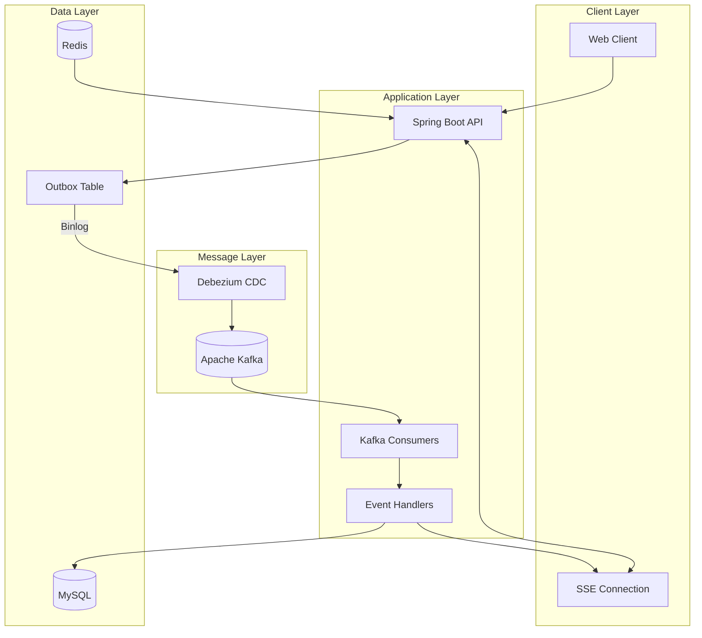

### 1.2 이벤트 흐름 개요

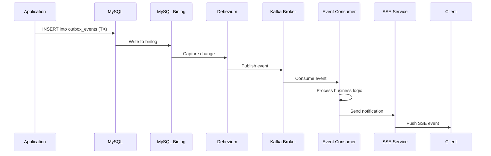

---

## 2. CDC (Change Data Capture) 구조

### 2.1 Debezium 아키텍처

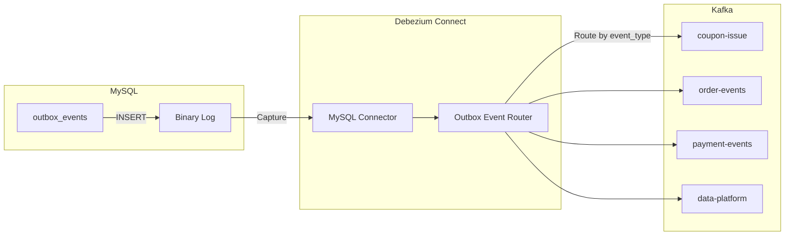

### 2.2 CDC vs 폴링 비교

| 항목 | 폴링 방식 (Before) | CDC 방식 (After) |
|------|-------------------|------------------|
| 지연 시간 | 최대 5초 | < 100ms |
| DB 부하 | 주기적 SELECT 쿼리 | 없음 (binlog 읽기) |
| 실시간성 | 낮음 | 높음 |
| 확장성 | 단일 프로세서 | Kafka 파티션 기반 |

---

## 3. 쿠폰 발급 시스템

### 3.1 선착순 쿠폰 발급 흐름

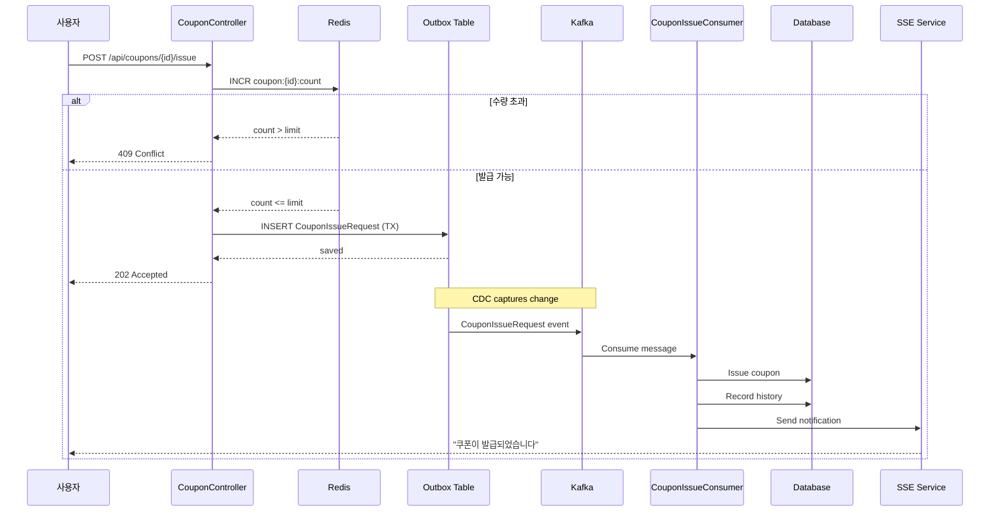

### 3.2 쿠폰 발급 컴포넌트

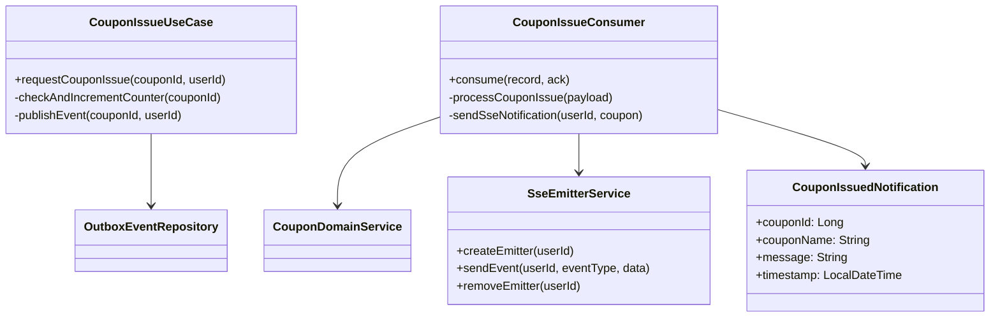

### 3.3 Kafka 토픽 구성 - 쿠폰

```yaml
Topic: coupon-issue
  Partitions: 3
  Replication Factor: 1
  Retention: 7 days

Message Format:
  Key: couponId (파티셔닝 키)
  Value: CouponIssueRequestPayload
    - couponId: Long
    - userId: Long
    - requestedAt: String (ISO-8601)
```

---

## 4. 주문 처리 시스템

### 4.1 주문 생성 및 결제 흐름

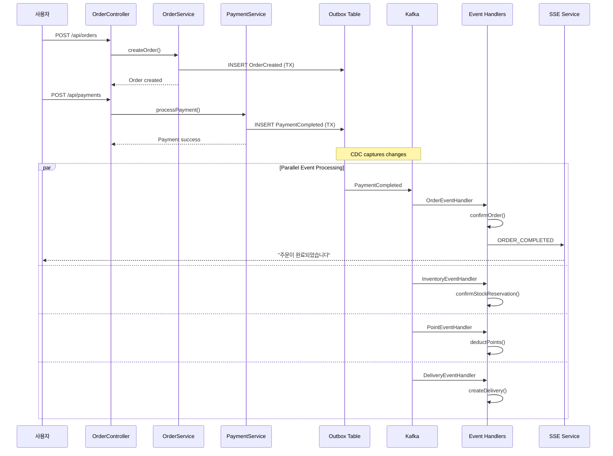

### 4.2 주문 취소 보상 트랜잭션

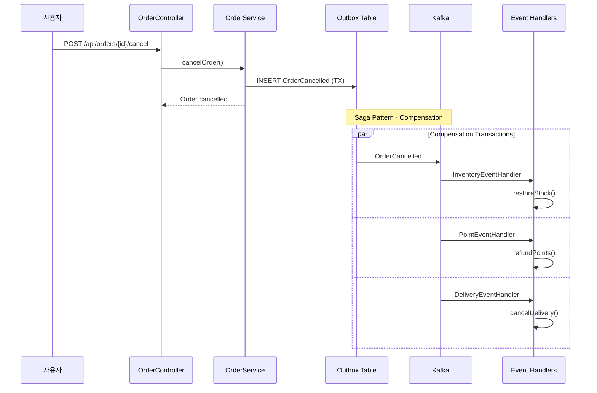

### 4.3 주문 상태 머신

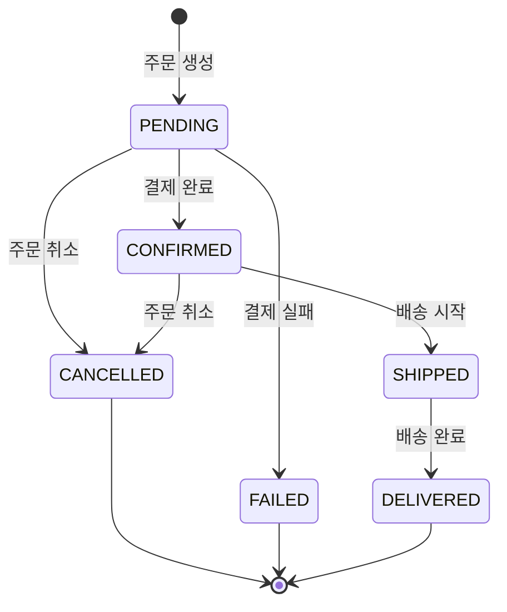

---

## 5. SSE (Server-Sent Events) 알림

### 5.1 SSE 구조

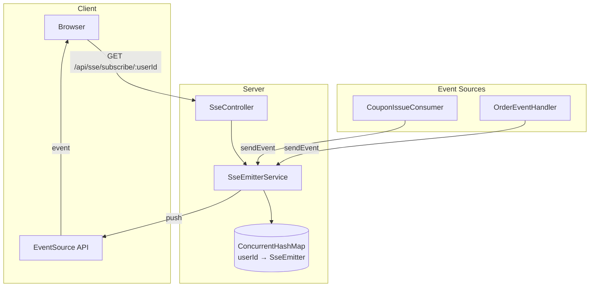

### 5.2 SSE 이벤트 타입

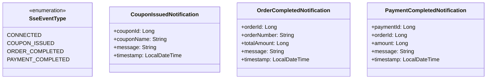

### 5.3 클라이언트 사용 예시

```javascript
// SSE 연결
const eventSource = new EventSource('/api/sse/subscribe/1');

// 쿠폰 발급 알림
eventSource.addEventListener('coupon-issued', (e) => {
  const data = JSON.parse(e.data);
  showNotification(`🎫 ${data.couponName} 쿠폰이 발급되었습니다!`);
});

// 주문 완료 알림
eventSource.addEventListener('order-completed', (e) => {
  const data = JSON.parse(e.data);
  showNotification(`✅ 주문번호 ${data.orderNumber} 주문이 완료되었습니다!`);
});

// 연결 확인
eventSource.addEventListener('connected', (e) => {
  console.log('SSE 연결됨:', e.data);
});
```

---

## 6. 멱등성 처리

### 6.1 멱등성 계층

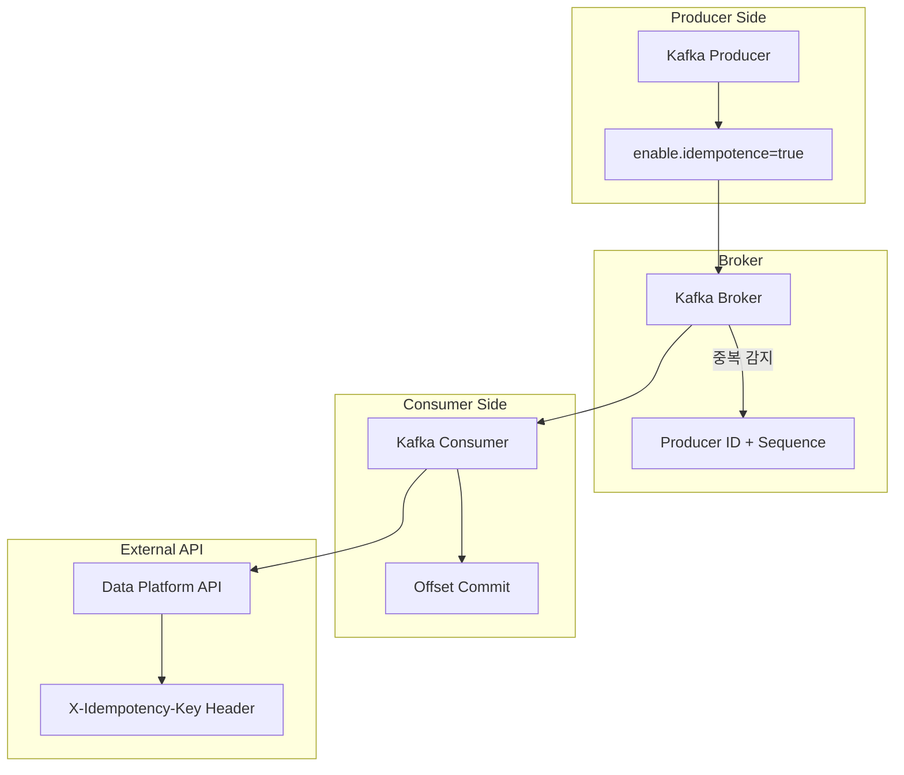

### 6.2 멱등성 전략

| 계층 | 방식 | 설명 |
|------|------|------|
| Producer → Broker | Idempotent Producer | PID + Sequence로 중복 방지 |
| Consumer | Offset Commit | At-least-once + 비즈니스 멱등성 |
| 외부 API | Idempotency Key | `orderId-status` 형태의 고유 키 |

---

## 7. Kafka 토픽 설계

### 7.1 토픽 목록

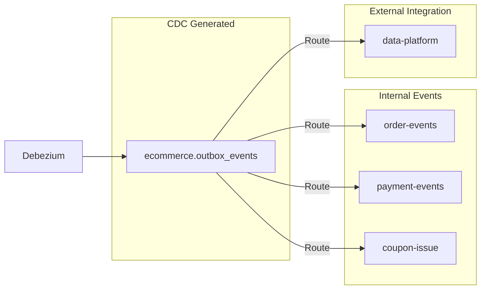

### 7.2 토픽 설정

```yaml
Topics:
  coupon-issue:
    partitions: 3
    replication-factor: 1
    retention.ms: 604800000  # 7 days
    key: couponId

  order-events:
    partitions: 6
    replication-factor: 1
    retention.ms: 604800000
    key: orderId

  payment-events:
    partitions: 3
    replication-factor: 1
    retention.ms: 604800000
    key: paymentId

  data-platform:
    partitions: 3
    replication-factor: 1
    retention.ms: 2592000000  # 30 days
    key: orderId
```

---

## 8. 장애 처리

### 8.1 재시도 및 DLQ

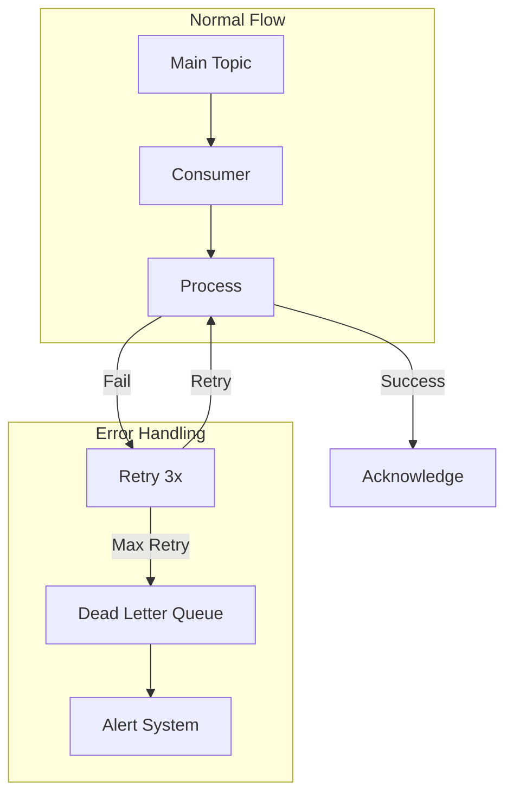

### 8.2 Circuit Breaker 패턴

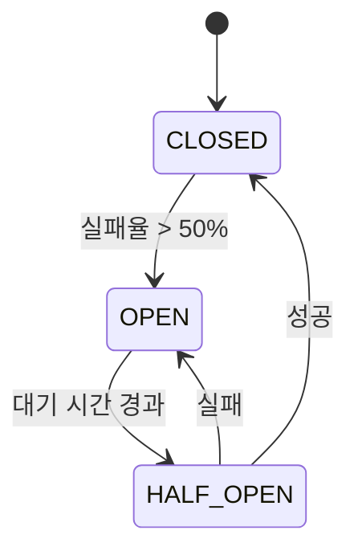

---

## 9. 모니터링

### 9.1 메트릭 수집 구조

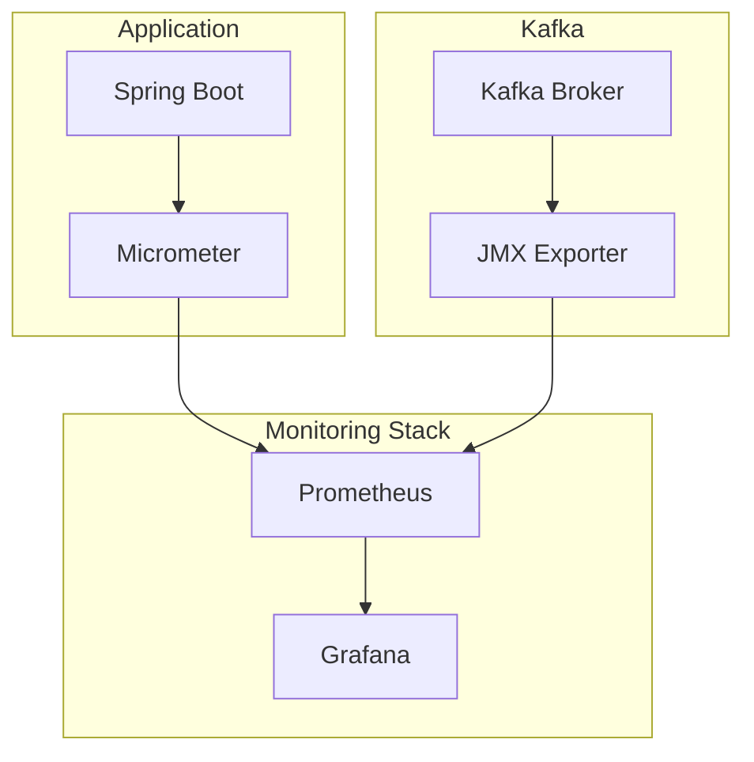

### 9.2 주요 메트릭

| 카테고리 | 메트릭 | 설명 |
|---------|--------|------|
| Kafka | `kafka_consumer_lag` | Consumer 지연 메시지 수 |
| Kafka | `kafka_producer_record_send_total` | 전송된 메시지 수 |
| Application | `coupon_issue_count` | 쿠폰 발급 수 |
| Application | `order_completed_count` | 주문 완료 수 |
| SSE | `sse_connection_count` | 활성 SSE 연결 수 |

---

## 10. 성능 개선 효과

### 10.1 Before vs After

```mermaid
gantt
    title 이벤트 처리 지연 시간 비교
    dateFormat X
    axisFormat %L ms

    section Before (폴링)
    Outbox 폴링 대기    :0, 5000
    이벤트 처리         :5000, 5100

    section After (CDC)
    Binlog 캡처        :0, 50
    Kafka 전송         :50, 80
    이벤트 처리        :80, 180
```

### 10.2 수치 비교

| 항목 | Before | After | 개선율 |
|------|--------|-------|--------|
| 이벤트 지연 | 최대 5000ms | < 200ms | **96% 감소** |
| DB 폴링 쿼리 | 12회/분 | 0회 | **100% 제거** |
| 쿠폰 발급 지연 | 최대 500ms | < 100ms | **80% 감소** |
| 처리량 | 단일 스레드 | 파티션 × Consumer | **수평 확장 가능** |

---

## 11. 결론

### 11.1 달성 목표

1. **실시간성 확보**: CDC를 통한 < 100ms 이벤트 전달
2. **확장성**: Kafka 파티션 기반 수평 확장
3. **사용자 경험**: SSE를 통한 실시간 알림
4. **안정성**: Saga 패턴 보상 트랜잭션
5. **간소화**: Redis SETNX 2단계 체크 제거

### 11.2 기술 스택

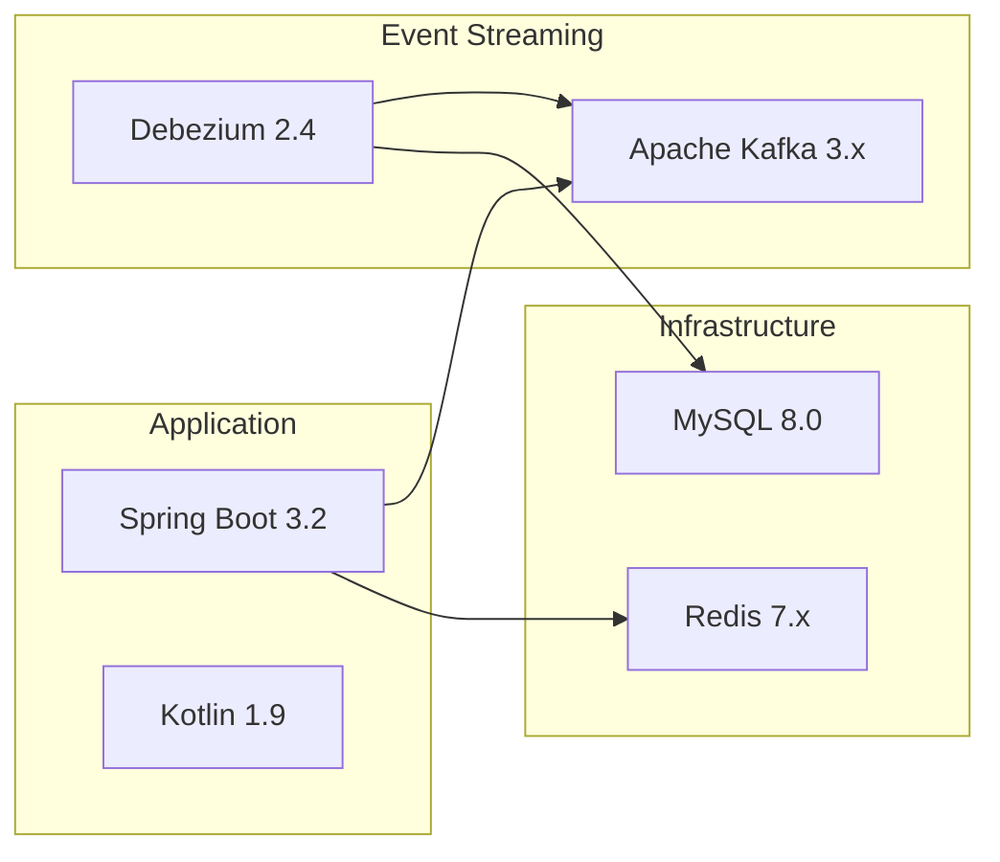
