# Apache Kafka 기초 학습

이커머스 시스템에서 대용량 트래픽 처리와 이벤트 기반 아키텍처를 위한 Kafka 학습 문서

---

## Part 1: Kafka 기초 개념

### 1.1 Kafka란?

Apache Kafka는 **분산 이벤트 스트리밍 플랫폼**이다. 높은 처리량(High Throughput), 내결함성(Fault Tolerance), 수평 확장성(Horizontal Scalability)을 제공하며, 실시간 데이터 파이프라인과 스트리밍 애플리케이션 구축에 사용된다.

#### 왜 Kafka를 사용하는가?

| 특성 | 설명 |
|------|------|
| **서비스 간 디커플링** | Producer와 Consumer가 서로를 알 필요 없이 독립적으로 동작. 장애 격리와 독립 배포 가능 |
| **비동기 처리** | 요청-응답 패턴에서 벗어나 이벤트 기반으로 처리. API 응답 시간 단축 및 시스템 탄력성 확보 |
| **높은 처리량** | 파티션을 통한 병렬 처리로 초당 수백만 메시지 처리 가능 |
| **메시지 영속성** | 디스크에 메시지를 저장하므로 Consumer 장애 시에도 메시지 유실 없이 재처리 가능 |
| **이벤트 리플레이** | offset을 조정하여 과거 이벤트를 다시 처리할 수 있어 데이터 복구, 신규 서비스 동기화에 유용 |

---

### 1.2 핵심 구성요소

#### Broker

Kafka 서버의 기본 단위로, 메시지를 수신/저장/전달하는 역할을 수행한다.

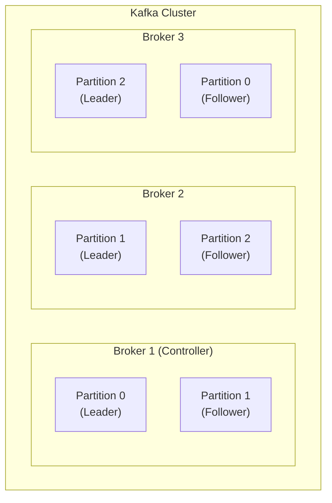

**주요 역할:**
- Producer의 메시지를 받아 offset 지정 후 디스크에 저장
- Consumer의 파티션 읽기 요청에 응답하여 디스크의 메시지 전송
- Cluster 내 특수 역할:
  - **Controller**: 브로커 모니터링, Leader 재분배
  - **Coordinator**: 컨슈머 그룹 모니터링, Rebalance 수행

---

#### Topic & Partition

Topic은 메시지를 분류하는 기준이며, N개의 Partition으로 구성된다. Partition은 순서 보장과 병렬 처리의 핵심 단위이다.

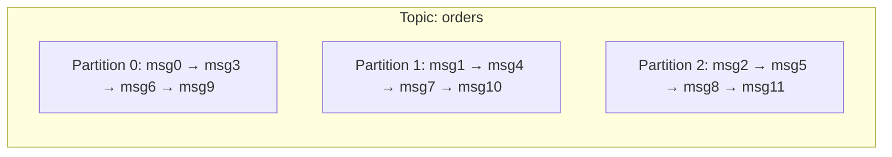

> **핵심 포인트**: 같은 파티션 내에서만 순서가 보장된다. 전체 토픽의 순서 보장은 안 됨!

**파티션 설계 원칙:**
- 메시지의 키 해시값으로 파티션 결정 → 같은 키는 항상 같은 파티션으로
- 키가 없으면 Round-Robin 방식으로 메시지 분배
- 예시: userId를 키로 설정하면, 동일 유저의 주문은 항상 같은 파티션에서 순차 처리

```kotlin
// 키 해시로 파티션 결정 예시
val key = "user-123"
val hash = key.hashCode()      // 예: 50649483
val partitionCnt = 3

val targetPartition = Math.abs(hash) % partitionCnt  // 결과: 0, 1, 또는 2
```

---

#### Producer

메시지를 Kafka 브로커에 적재(발행)하는 클라이언트.

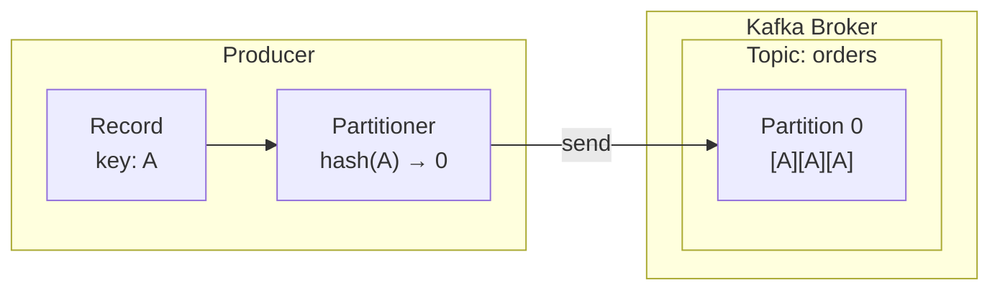

**주요 설정:**

| 설정 | 값 | 설명 |
|------|-----|------|
| `acks` | `0` | 확인 안 함 (성능 최고, 안정성 최저) |
| `acks` | `1` | Leader만 확인 (기본값) |
| `acks` | `all` | ISR 전체 확인 (안정성 최고) |
| `enable.idempotence` | `true` | 중복 발행 방지 (멱등성 보장) |

---

#### Consumer & Consumer Group

Consumer는 토픽에서 메시지를 읽는 클라이언트이며, Consumer Group은 동일한 토픽을 함께 소비하는 컨슈머들의 논리적 묶음이다.

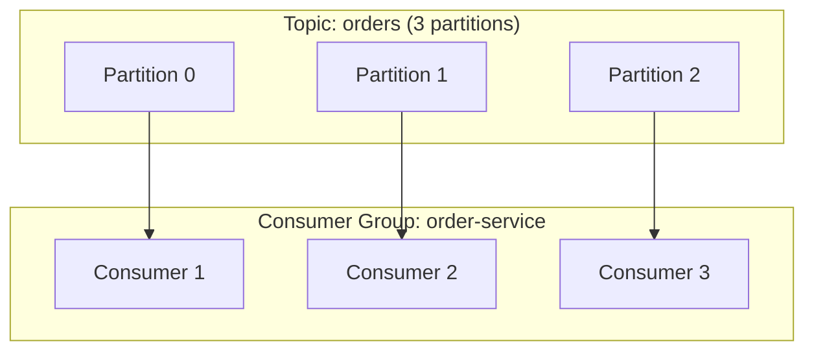

**핵심 개념:**
- `CURRENT-OFFSET`: 컨슈머가 마지막으로 처리한 메시지 위치
- `auto.offset.reset`: 초기 컨슈머가 어디서부터 읽을지 결정
  - `latest`: 최신 메시지부터 (기본값)
  - `earliest`: 처음부터 모든 메시지
- **하나의 파티션은 그룹 내 하나의 컨슈머만 소비 가능**
- 컨슈머 수 > 파티션 수 → 일부 컨슈머는 유휴 상태

> **실무 팁**: 파티션 수 >= 컨슈머 수로 설계. 파티션은 삭제가 불가능하므로 신중하게 결정

---

### 1.3 Producer, Partition, Consumer 수에 따른 데이터 흐름

#### 케이스 1: Producer 1개, Partition 3개, Consumer 3개 (이상적)

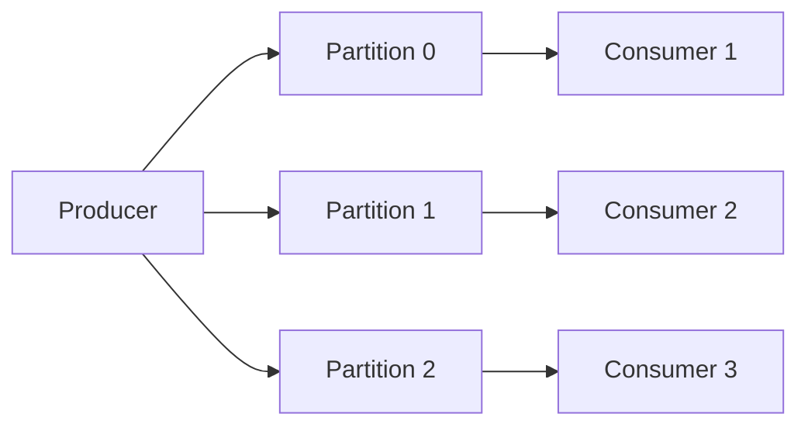

- 각 컨슈머가 하나의 파티션을 담당
- 최대 병렬 처리 가능
- **메시지 처리량 = 3배**

---

#### 케이스 2: Producer 1개, Partition 3개, Consumer 1개

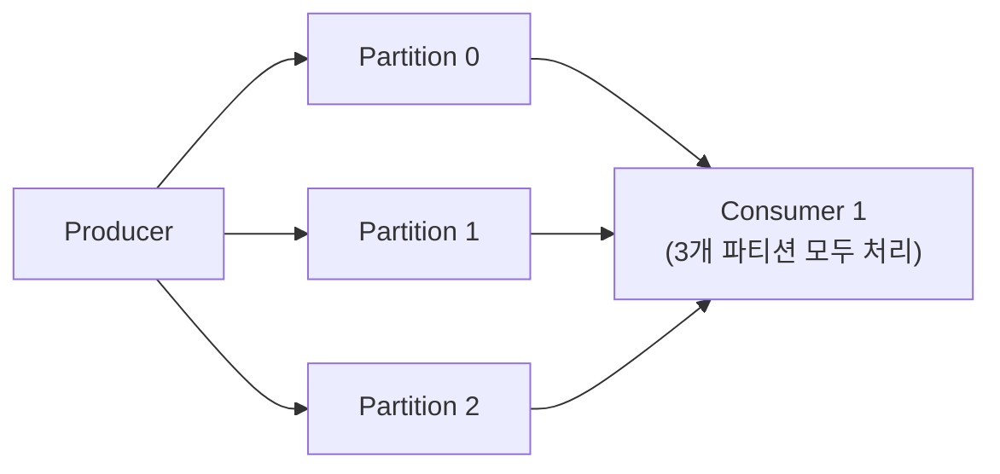

- 하나의 컨슈머가 모든 파티션을 순차 처리
- 처리량 제한 (병목 발생 가능)
- 스케일 아웃 시 컨슈머만 추가하면 됨

---

#### 케이스 3: Producer 1개, Partition 3개, Consumer 5개

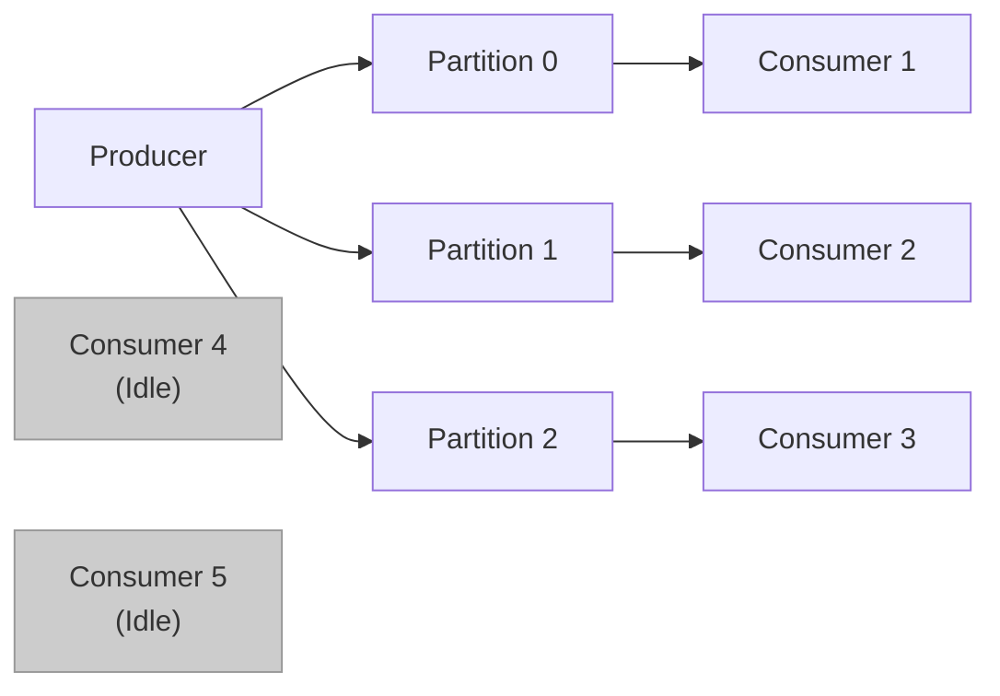

- 파티션 수보다 컨슈머가 많으면 일부는 유휴 상태
- **낭비되는 리소스 발생**
- 해결책: 파티션 수 증가 또는 컨슈머 수 감소

---

#### 케이스 4: Producer 3개, Partition 3개, Consumer 3개

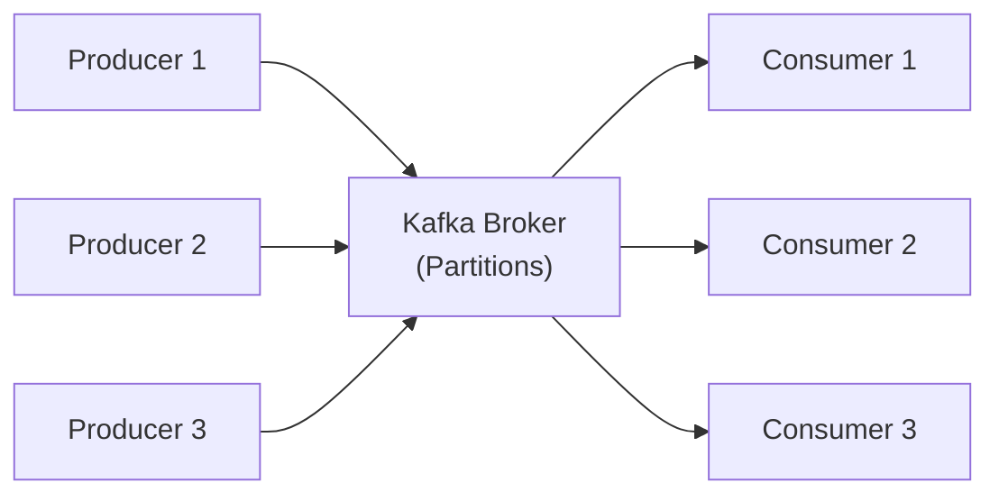

- 여러 Producer가 동시에 메시지 발행 가능
- Broker가 메시지를 파티션에 분배
- Producer 수는 처리량에 제한 없이 확장 가능

---

#### 케이스 5: Consumer Group 2개 (서로 다른 서비스)

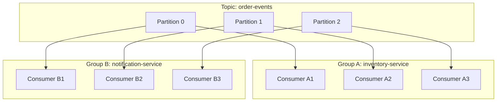

- **각 Consumer Group은 토픽의 모든 메시지를 독립적으로 수신**
- 같은 메시지가 여러 서비스에서 처리됨
- 재고 서비스와 알림 서비스가 동일한 주문 이벤트를 각각 처리

---

### 1.4 Rebalancing

컨슈머 그룹 내에서 파티션 소유권을 재배분하는 과정이다.

**발생 조건:**
- 컨슈머 추가/제거
- 파티션 추가
- 컨슈머 장애 감지 (heartbeat 타임아웃)

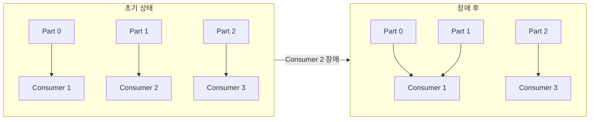

> **주의**: Rebalancing 중에는 메시지 소비가 일시 중단된다! 파티션 확장 시 `earliest` 설정 필수 (새 파티션의 메시지 유실 방지)

---

### 1.5 Cluster & Replication

고가용성을 위해 여러 브로커로 클러스터를 구성하고, 파티션을 복제한다.

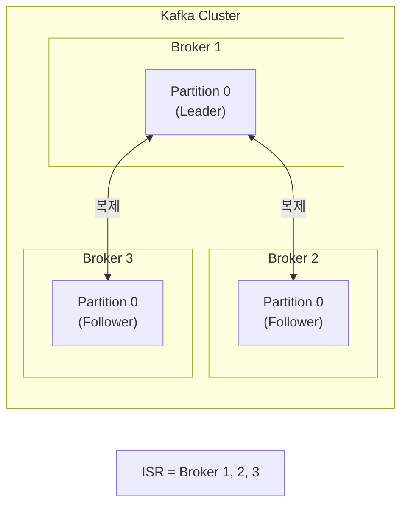

| 용어 | 설명 |
|------|------|
| **Leader** | 프로듀서/컨슈머와 직접 통신하는 대표 파티션 |
| **Follower** | Leader를 복제하는 대기 파티션, 장애 시 Leader로 승격 |
| **ISR** | Leader와 동기화된 Follower 집합 |
| **replication.factor** | 복제본 수 (보통 3 권장) |

---

### 1.6 메시지 전달 보장 (Delivery Semantics)

Kafka는 세 가지 메시지 전달 보장을 제공한다:

| 보장 수준 | 설명 | 특징 |
|----------|------|------|
| **At-Most-Once** | 메시지가 최대 1회 전달 | 유실 가능, 성능 최고 |
| **At-Least-Once** | 메시지가 최소 1회 전달 | 중복 가능, 가장 일반적 |
| **Exactly-Once** | 메시지가 정확히 1회 전달 | Kafka Transactions 필요, 오버헤드 있음 |

> **실무 권장**: At-Least-Once + Idempotent Consumer 패턴이 가장 실용적. Exactly-Once는 성능 오버헤드가 크고, Kafka-to-Kafka 처리에만 완전한 보장 제공

#### Idempotent Consumer 패턴

중복 메시지를 안전하게 처리하기 위한 패턴:

```kotlin
@KafkaListener(topics = ["order-events"])
fun handleOrderEvent(event: OrderEvent) {
    // 1. 이미 처리된 메시지인지 확인
    if (processedMessageRepository.existsById(event.messageId)) {
        log.info("Duplicate message ignored: ${event.messageId}")
        return
    }

    // 2. 비즈니스 로직 처리
    orderService.process(event)

    // 3. 처리 완료 기록
    processedMessageRepository.save(ProcessedMessage(event.messageId))
}
```

---

## Part 2: 이커머스 Kafka 적용 패턴

### 2.1 주문 처리 이벤트 흐름

이커머스에서 Kafka는 주문 생명주기를 이벤트 기반으로 관리한다. 각 단계가 독립적인 서비스로 분리되어 느슨한 결합을 유지한다.

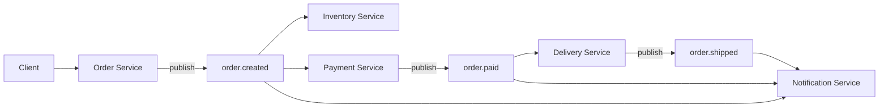

**토픽 설계 예시:**
- `order.created` → 주문 생성 시 발행
- `order.paid` → 결제 완료 시 발행
- `order.shipped` → 배송 시작 시 발행
- `order.delivered` → 배송 완료 시 발행

**흐름:**
1. 주문 서비스: 주문 생성 → `order.created` 발행
2. 재고 서비스: `order.created` 구독 → 재고 차감
3. 결제 서비스: `order.created` 구독 → 결제 처리 → `order.paid` 발행
4. 배송 서비스: `order.paid` 구독 → 배송 처리
5. 알림 서비스: 각 토픽 구독 → 고객에게 상태 알림

---

### 2.2 Transactional Outbox 패턴

DB 트랜잭션과 메시지 발행의 원자성을 보장하는 패턴이다.

#### 문제 상황

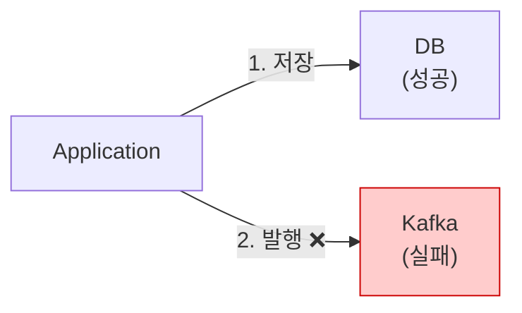

**결과**: DB에는 주문 있음, 하지만 다른 서비스는 모름!

#### 해결책: Outbox 테이블

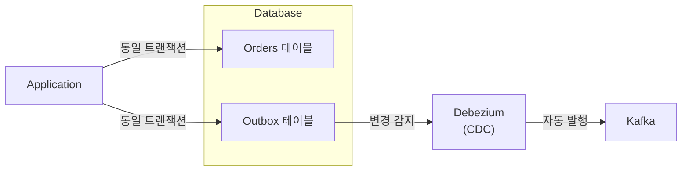

1. 비즈니스 데이터와 Outbox 테이블에 **동일 트랜잭션**으로 저장
2. Debezium(CDC)이 Outbox 테이블의 변경사항을 감지
3. 변경사항을 Kafka로 자동 발행

> **보장**: DB 커밋 실패 시 Outbox도 롤백되므로 메시지 발행 안 됨. DB 커밋 성공 시 Outbox도 저장되어 CDC가 발행함.

**Outbox 테이블 구조:**

```sql
CREATE TABLE outbox_events (
    id              UUID PRIMARY KEY,
    aggregate_type  VARCHAR(255),      -- Order, Payment 등
    aggregate_id    VARCHAR(255),      -- 도메인 엔티티 ID
    event_type      VARCHAR(255),      -- OrderCreated, OrderPaid 등
    payload         JSONB,             -- 이벤트 데이터
    created_at      TIMESTAMP
);
```

---

### 2.3 실시간 알림 전달 (SSE/WebSocket)

주문/쿠폰 완료 이벤트를 사용자에게 실시간으로 전달하는 패턴이다.

| 방식 | 통신 방향 | 특징 | 적합한 케이스 |
|------|----------|------|--------------|
| **SSE** | 서버 → 클라이언트 | HTTP 기반, 자동 재연결 | 주문 상태 알림, 쿠폰 발급 |
| **WebSocket** | 양방향 | 낮은 레이턴시 | 채팅, 라이브 경매 |

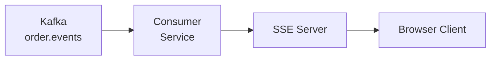

> **실무 권장**: 이커머스 주문 알림에는 SSE가 적합. 단방향이고 구현이 간단하며 HTTP/2와 함께 사용 시 효율적이다.

---

## Part 3: 국내 기업 Kafka 활용 사례

### 3.1 배달의민족 (우아한형제들)

배달의민족 딜리버리서비스팀은 Kafka를 핵심 메시징 시스템으로 사용한다.

**규모:**
- 하루 100만 건 이상의 배민배달 중계
- 여러 주문서비스(배민배달, B마트, 배민스토어)의 배달을 통합 관리

**적용 패턴:**
- **이벤트 소싱 패턴**: 도메인 이벤트를 Kafka에 저장하여 상태 변화 추적
- **Transactional Outbox 패턴**: MySQL source connector를 활용하여 데이터 정합성 확보
- **Debezium**: CDC를 통한 DB 변경 감지 및 이벤트 발행
- **Kafka Streams**: 실시간 이벤트 스트림 처리

**아키텍처 특징:**
- 주문과 배달을 처리하는 분산시스템 이벤트 기반 아키텍처
- 카프카를 이벤트 브로커로 사용하여 이벤트 순서 보장
- 여러 배달서비스 중 하나로 분배하고, 배달과정을 중계/관리

> 참고: [우아한형제들 기술블로그 - 우리 팀은 카프카를 어떻게 사용하고 있을까](https://techblog.woowahan.com/17386/)

---

### 3.2 오늘의집 (버킷플레이스)

오늘의집은 **광고 정산 시스템**에 Kafka Streams를 도입하여 CPC(클릭당 과금) 광고의 정확한 정산을 구현했다.

**도입 배경:**
- RDB 기반 설계에서 offset 업데이트 실패 시 중복 차감 문제 발생
- 멱등성 로직을 비즈니스 코드에 내장하면 복잡도 증가

**적용 기술:**
- **Kafka Streams**: exactly-once semantics 보장
- **In-Memory State Store**: 외부 RDB 조회 없이 로컬 상태 유지, Kafka 토픽에 백업
- **Kafka Transactions**: 상태 업데이트와 offset 커밋을 원자적으로 처리

**성과:**
- 인스턴스당 약 **60,000 TPS** 처리량 달성
- 파티션 분산을 통한 수평 확장 가능
- Interactive Query로 분산 상태에서 실시간 예산 조회
- Kafka Connect(S3 sink connector)를 통해 처리 내역을 S3로 저장, Apache Spark로 통계 분석

> 참고: [오늘의집 블로그 - 광고 정산 시스템에 Kafka Streams 도입하기](https://www.bucketplace.com/post/2022-05-20-광고-정산-시스템에-kafka-streams-도입하기/)

---

## Part 4: 추가 학습

### 4.1 Parallel Consumer (Confluent)

파티션 수 이상으로 병렬 처리를 늘리는 기법. 파티션 추가 없이 체감 처리량을 높일 수 있다.

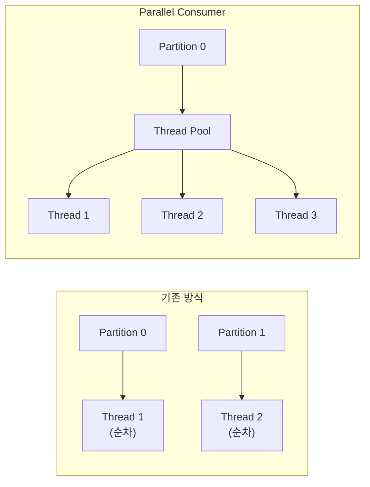

**모드:**

| 모드 | 순서 보장 | 병렬 수준 | 사용 케이스 |
|------|----------|----------|------------|
| `PARTITION` | 파티션 단위 | 낮음 | 기존과 동일 |
| `KEY` | 키 단위 | 중간 | 같은 키는 순차, 다른 키는 병렬 |
| `UNORDERED` | 없음 | 최대 | 순서가 중요하지 않은 경우 |

**적합한 경우:**
- 파티션 수가 고정된 상태에서 높은 레이턴시 외부 호출(DB, 마이크로서비스)이 많을 때

> 참고: [우아콘 2025 - Kafka Parallel Consumer 적용기](https://youtu.be/UhnERp2AYRo?si=IORTd8lMQq_EjROY)

---

### 4.2 CDC (Change Data Capture)

DB 변경사항을 실시간으로 캡처하는 기술. **Debezium**이 대표적이다.

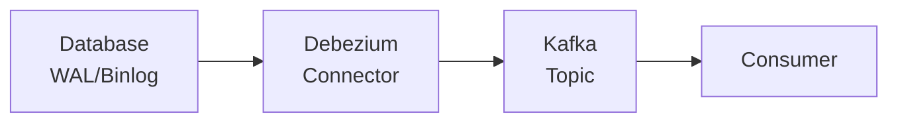

**동작 원리:**
1. DB의 트랜잭션 로그(WAL/Binlog) 모니터링
2. 변경된 레코드를 Kafka로 발행
3. 컨슈머가 변경 이벤트 처리

**장점:**
- 애플리케이션 코드 수정 없이 데이터 동기화 가능
- Outbox 패턴과 함께 사용 시 이벤트 발행 신뢰성 확보
- 실시간 데이터 복제, 캐시 무효화 등에 활용

---

### 4.3 Kafka Connect

Kafka와 외부 시스템을 연결하는 프레임워크.

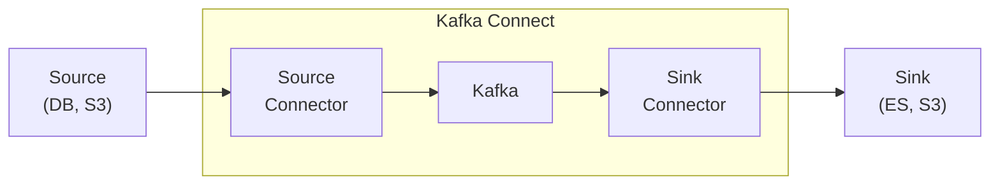

**주요 커넥터:**
- **Source Connector**: DB, 파일 시스템 → Kafka
  - Debezium MySQL/PostgreSQL Connector
  - JDBC Source Connector
- **Sink Connector**: Kafka → 외부 시스템
  - Elasticsearch Sink Connector
  - S3 Sink Connector
  - JDBC Sink Connector

---

### 4.4 Kafka Streams

Kafka 토픽의 데이터를 실시간으로 처리하는 스트림 처리 라이브러리.

```kotlin
val builder = StreamsBuilder()

// 주문 이벤트 스트림
val orders: KStream<String, Order> = builder.stream("orders")

// 실시간 집계: 카테고리별 주문 금액 합계
val categoryTotals: KTable<String, Long> = orders
    .groupBy { _, order -> order.category }
    .aggregate(
        { 0L },
        { _, order, total -> total + order.amount }
    )

// 결과를 새로운 토픽으로 발행
categoryTotals.toStream().to("category-totals")
```

**특징:**
- 별도 클러스터 없이 애플리케이션에 라이브러리로 내장
- exactly-once semantics 지원
- Stateful 처리 (집계, 조인, 윈도우)
- Interactive Query로 로컬 상태 조회

---

## 참고 자료

- [Apache Kafka 공식 문서](https://kafka.apache.org/documentation/)
- [Confluent Developer Documentation](https://docs.confluent.io/)
- [Debezium Outbox Event Router](https://debezium.io/documentation/reference/stable/transformations/outbox-event-router.html)
- [우아한형제들 기술블로그 - 우리 팀은 카프카를 어떻게 사용하고 있을까](https://techblog.woowahan.com/17386/)
- [오늘의집 블로그 - 광고 정산 시스템에 Kafka Streams 도입하기](https://www.bucketplace.com/post/2022-05-20-광고-정산-시스템에-kafka-streams-도입하기/)
- [우아콘 2025 - Kafka Parallel Consumer 적용기](https://youtu.be/UhnERp2AYRo?si=IORTd8lMQq_EjROY)