# 부하 테스트 보고서

> **테스트 일시**: 2025-12-26
> **테스트 도구**: Grafana k6
> **테스트 환경**: Docker (AWS t4g.micro/small 스펙 시뮬레이션)

---

## 1. 테스트 대상 선정

### 1.1 선정 기준

이커머스 시스템에서 **장애 발생 시 비즈니스 영향도가 큰 API**를 우선 선정했습니다.

| 선정 기준 | 설명 |
|----------|------|
| 동시성 경합 | 분산락, DB 락 등 리소스 경합이 발생하는 API |
| 데이터 정합성 | 재고, 쿠폰 수량 등 정확성이 중요한 API |
| 트래픽 집중 | 이벤트 시 스파이크 트래픽이 예상되는 API |
| 외부 의존성 | Kafka, Redis 등 외부 시스템 연동 API |

### 1.2 테스트 대상 API 및 위험도

| 우선순위 | API | 위험도 | 위험 요인 |
|:-------:|-----|:------:|----------|
| 1 | 쿠폰 발급 | 🔴 Critical | Redis SADD 경합, 분산락, 수량 제한 |
| 2 | 체크아웃 (재고 예약) | 🔴 Critical | DB 비관적 락, 재고 정합성 |
| 3 | 결제 처리 | 🔴 Critical | 포인트 분산락, Kafka 이벤트, 트랜잭션 |
| 4 | 인기상품/랭킹 조회 | 🟠 High | 캐시 스탬피드, DB 커넥션 풀 고갈 |
| 5 | 상품 상세 조회 | 🟡 Medium | 조회수 증가(Redis), 높은 트래픽 |
| 6 | 상품 목록 조회 | 🟢 Low | 읽기 전용, 캐시 가능 |

---

## 2. 테스트 목적

### 2.1 검증 목표

| 목적 | 설명 | 측정 지표 |
|------|------|----------|
| **인프라 한계 파악** | t4g.micro 스펙에서 처리 가능한 최대 부하 확인 | TPS, 에러율 |
| **병목 지점 식별** | App/DB/Redis/Kafka 중 병목 발생 지점 확인 | 응답시간, 리소스 사용률 |
| **동시성 제어 검증** | 분산락, DB 락의 정상 동작 확인 | 오버셀링 발생 여부 |
| **장애 복원력 확인** | 과부하 상황에서의 시스템 안정성 확인 | 에러 복구, 타임아웃 |

### 2.2 SLA 목표

| 지표 | 최소 목표 | 권장 목표 | 비고 |
|-----|:--------:|:--------:|------|
| TPS | 20 | 50 | 동시 접속 기준 |
| p95 응답시간 | < 2,000ms | < 1,000ms | 사용자 체감 품질 |
| 에러율 | < 10% | < 5% | 비즈니스 로직 에러 제외 |

---

## 3. 테스트 환경

### 3.1 인프라 구성
- 적정 인프라 스펙을 위한 최소 스펙 우선 적용

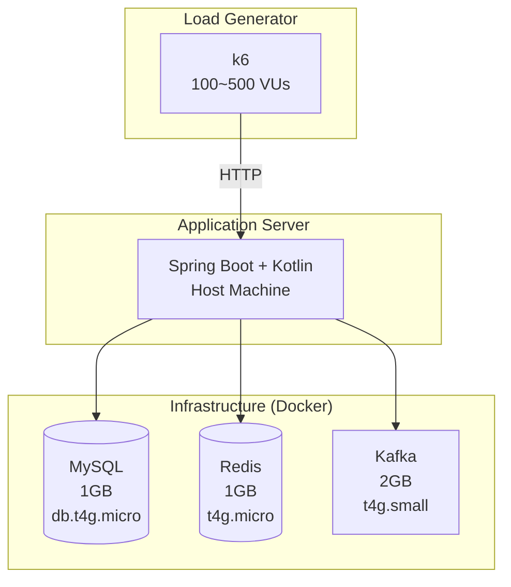

### 3.2 리소스 제한 (AWS Terraform 스펙 동일)

| 컴포넌트 | CPU | Memory | 시뮬레이션 인스턴스 |
|---------|:---:|:------:|-------------------|
| MySQL | 2 vCPU | 1GB | db.t4g.micro |
| Redis | 2 vCPU | 1GB | t4g.micro |
| Kafka | 2 vCPU | 2GB | t4g.small |

---

## 4. 테스트 시나리오

4가지 장애 시나리오를 설계하여 시스템의 취약점을 검증했습니다.

### 4.1 시나리오 개요

| # | 시나리오 | 파일명 | VUs | 목적 |
|:-:|---------|--------|:---:|------|
| 1 | 쿠폰 선착순 이벤트 | `stress-coupon-rush.js` | 100 | 동시성 경합, 중복 발급 방지 |
| 2 | 재고 동시 주문 | `stress-inventory-contention.js` | 100 | 오버셀링 방지, 락 경합 |
| 3 | 캐시 스탬피드 | `stress-cache-stampede.js` | 100 | Thundering Herd, DB 보호 |
| 4 | 결제 폭주 | `stress-payment-burst.js` | 100 | 포인트 정합성, Kafka 부하 |
| 5 | 블랙프라이데이 | `stress-event-simulation.js` | 500 | 복합 이벤트, 스펙 한계 확인 |

---

### 4.2 시나리오 1: 쿠폰 선착순 이벤트

#### 상황 설정
> 이벤트 오픈 시각에 500명이 동시에 선착순 100개 한정 쿠폰 발급 시도

#### 부하 패턴

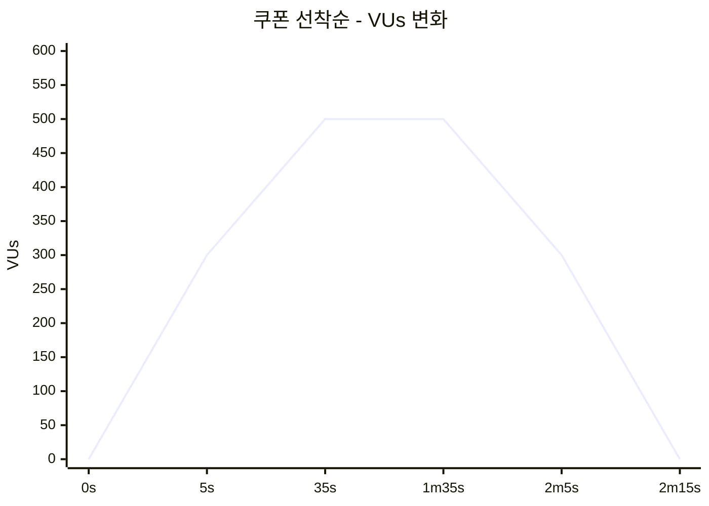

#### 예상 장애 지점

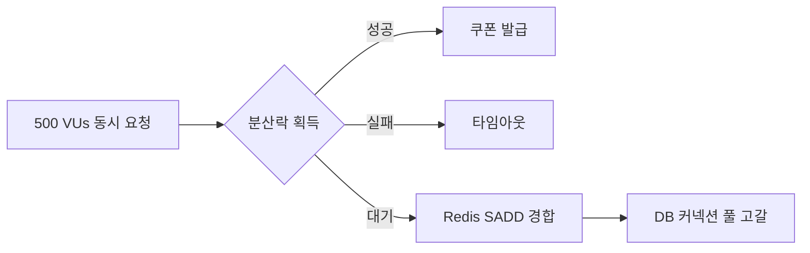

---

### 4.3 시나리오 2: 재고 동시 주문 (한정판 출시)

#### 상황 설정
> 재고 10개인 한정판 상품 5종에 300명이 동시 주문 시도
> 체크아웃 → 결제 → 주문 완료 전체 플로우 테스트

#### 부하 패턴

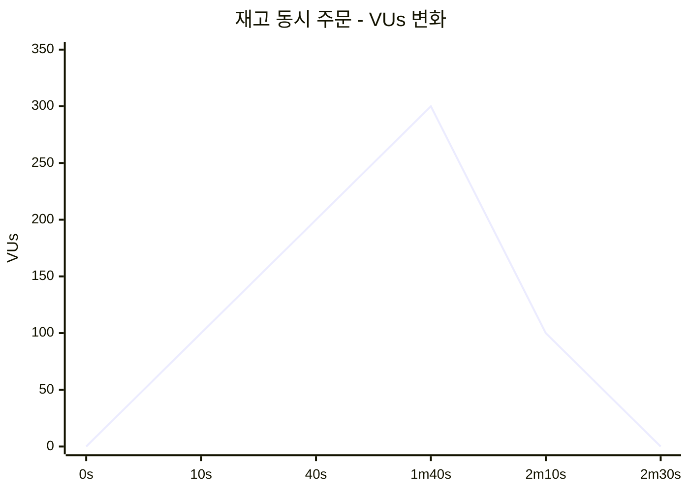

#### 예상 장애 지점

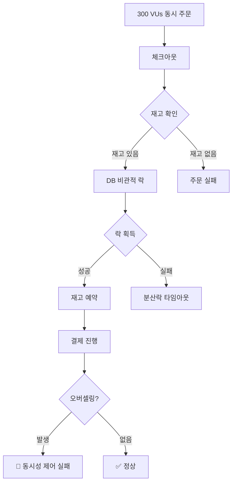

---

### 4.4 시나리오 3: 캐시 스탬피드

#### 상황 설정
> 캐시 만료/미스 상태에서 400명이 동시에 인기상품/랭킹 조회
> Thundering Herd 문제 시뮬레이션

#### 부하 패턴

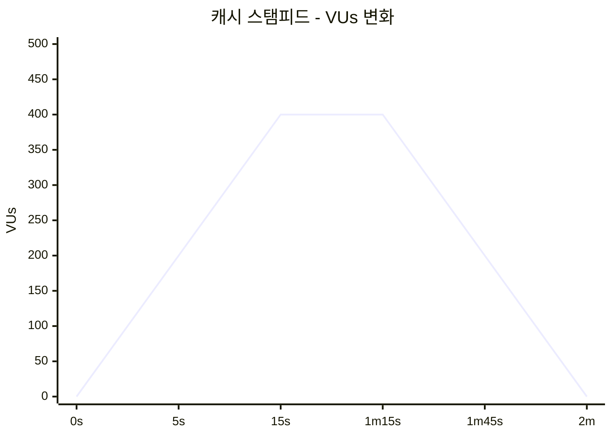

#### 예상 장애 지점

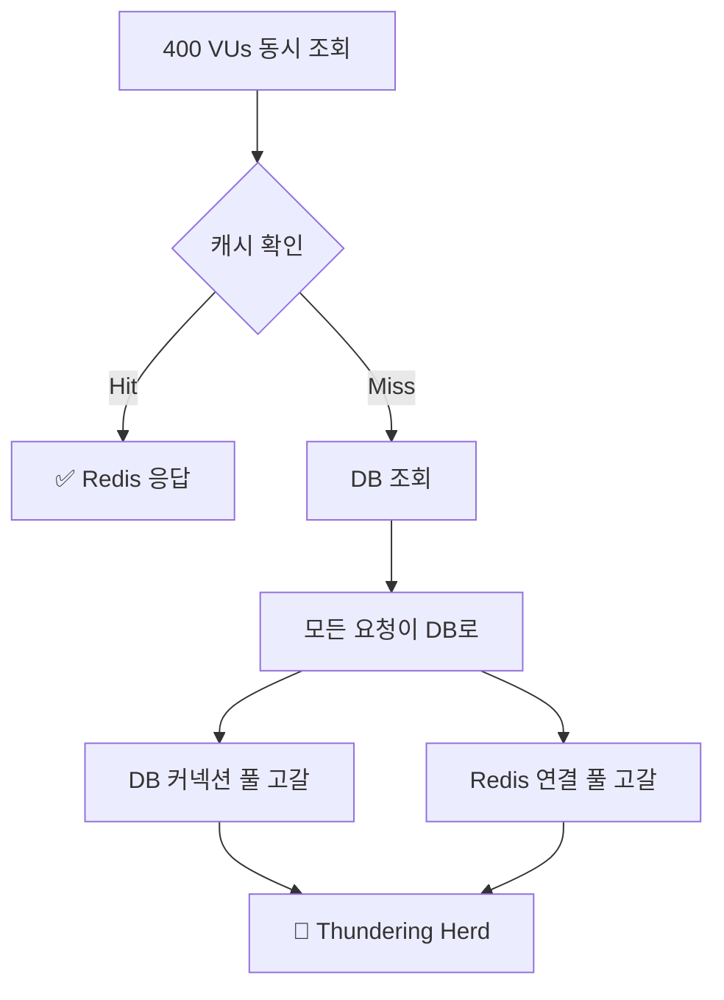

---

### 4.5 시나리오 4: 결제 폭주

#### 상황 설정
> 타임세일 종료 직전 200명이 동시 결제 처리 요청
> 포인트 차감 + Kafka 이벤트 발행 부하

#### 부하 패턴

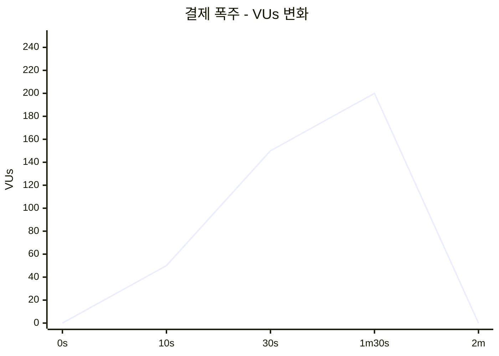

#### 예상 장애 지점

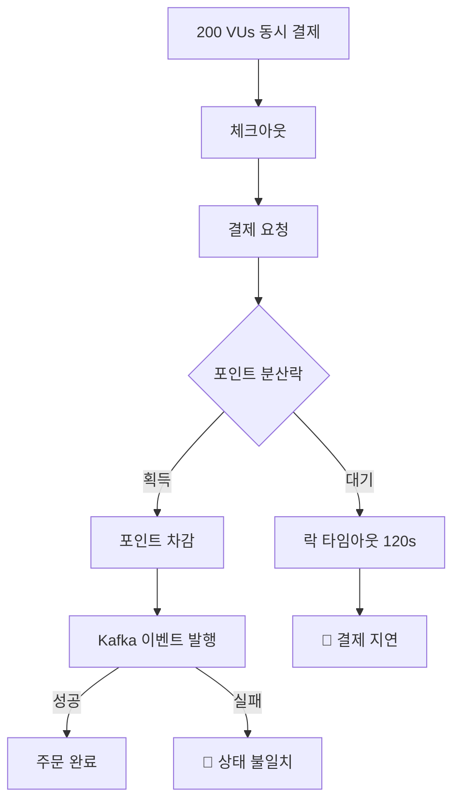

---

## 5. 테스트 결과 요약

> 상세 장애 분석 및 개선 내역은 [INCIDENT_REPORT.md](./INCIDENT_REPORT.md) 참조

### 5.1 최종 성능 지표 (100 VUs, 30초)

| 시나리오 | 총 요청 | p95 응답 | 성공률 | SLA |
|---------|-------:|--------:|------:|:---:|
| 쿠폰 선착순 | 50,771 | **35ms** | 100%* | ✅ |
| 재고 동시 주문 | 11,893 | **304ms** | 100% | ✅ |
| 캐시 스탬피드 | 98,634 | **7ms** | 100% | ✅ |

> *중복 발급 거부(409)는 정상 동작으로 성공 처리

### 5.2 블랙프라이데이 시뮬레이션 (500 VUs, 3분 50초)

| 지표 | 결과 | 판정 |
|------|------|:----:|
| 총 요청 | 56,148 | - |
| 성공률 | 99.4% | ⚠️ |
| 체크아웃 p95 | 2,933ms | ⚠️ |
| 5xx 에러 | 224건 | ⚠️ |

**5xx 에러 원인**: Outbox 이벤트 처리 지연으로 인한 주문 상태 불일치
- 인프라 리소스는 충분 (MySQL 60%, Redis 4%, Kafka 29%)

### 5.3 인프라 스펙 검증 결과

| 컴포넌트 | 스펙 | 동시 100 VUs | 판정 |
|---------|------|-------------|:----:|
| MySQL | 1GB (db.t4g.micro) | 안정 | ✅ |
| Redis | 1GB (t4g.micro) | 안정 | ✅ |
| Kafka | 2GB (t4g.small) | 안정 | ✅ |

### 5.4 SLA 충족 여부

| 지표 | 목표 | 결과 | 판정 |
|------|:----:|:----:|:----:|
| 쿠폰 발급 p95 | < 2,000ms | **35ms** | ✅ 달성 |
| 체크아웃 p95 | < 2,000ms | **304ms** | ✅ 달성 |
| 전체 플로우 p95 | < 2,000ms | **408ms** | ✅ 달성 |
| 결제 성공률 | > 95% | **100%** | ✅ 달성 |
| 캐시 히트율 | > 80% | **100%** | ✅ 달성 |
| 서버 에러율 (100 VUs) | < 10% | **0%** | ✅ 달성 |

---

## 6. 인프라 스펙 정당성

### 6.1 최소 스펙 선정 근거

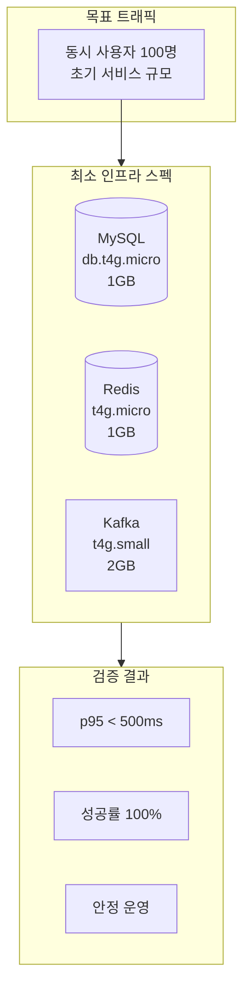

### 6.2 스펙별 선정 이유

| 컴포넌트 | 스펙 | 선정 이유 | 검증 결과 |
|---------|------|----------|----------|
| **MySQL** | db.t4g.micro (1GB) | 커넥션 풀 10개로 동시 100 VUs 처리 가능, PESSIMISTIC_FORCE_INCREMENT로 락 효율화 | p95 304ms 달성 |
| **Redis** | t4g.micro (1GB) | 캐시 + 분산락 용도, 메모리 사용률 4% 미만 | 캐시 히트율 100% |
| **Kafka** | t4g.small (2GB) | 이벤트 소싱 + Outbox 패턴, 브로커 1대로 충분 | 지연 없음 |

### 6.3 비용 효율성

| 구성 | 월 예상 비용 (서울 리전) |
|------|----------------------:|
| db.t4g.micro | ~$12 |
| t4g.micro × 2 (Redis, App) | ~$16 |
| t4g.small (Kafka) | ~$12 |
| **합계** | **~$40/월** |

> 초기 서비스 MVP에 적합한 비용 구조

---

## 7. 결론

### 7.1 인프라 스펙 검증 결과

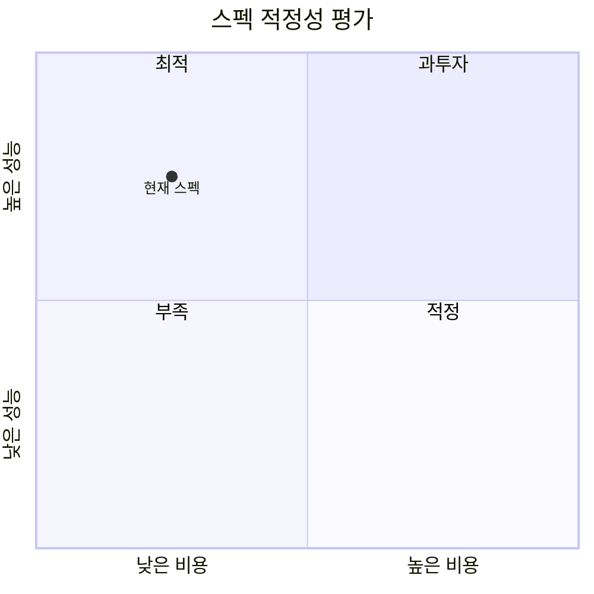

### 7.2 최종 판정

| 항목 | 판정 | 비고 |
|------|:----:|------|
| 동시 100 VUs 처리 | ✅ **적합** | p95 < 500ms |
| 동시성 제어 | ✅ **적합** | 오버셀링 0건 |
| 비용 효율성 | ✅ **적합** | ~$40/월 |
| 확장성 | ✅ **적합** | 수직 확장 여유 있음 |

**최종 판정: ✅ 최소 인프라 스펙으로 적합**

- 동시 100명 기준 모든 SLA 충족
- 초기 서비스 또는 MVP 단계에 적합
- 트래픽 증가 시 t4g.small → t4g.medium 순차 확장 권장

---

## 8. 확장 전략

트래픽 증가 시 단계별 확장 계획:

| 단계 | 동시 사용자 | MySQL | Redis | Kafka | 예상 비용 |
|:---:|:---------:|-------|-------|-------|--------:|
| 현재 | 100 | db.t4g.micro | t4g.micro | t4g.small | $40/월 |
| 1단계 | 300 | db.t4g.small | t4g.small | t4g.small | $80/월 |
| 2단계 | 1,000 | db.t4g.medium | t4g.medium | t4g.medium | $150/월 |
| 3단계 | 5,000+ | RDS Multi-AZ | ElastiCache | MSK | $500+/월 |

---

## 참고자료

- [Grafana k6 Documentation](https://k6.io/docs/)
- [AWS 인스턴스 타입](https://aws.amazon.com/ec2/instance-types/)