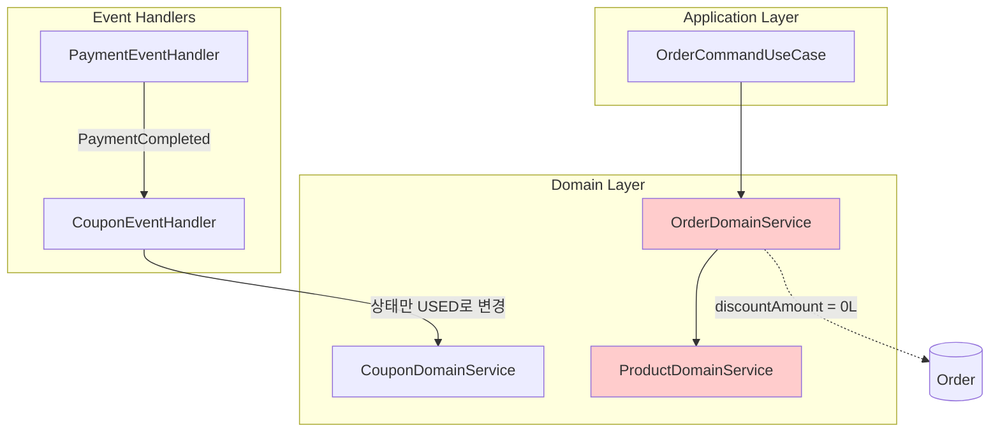
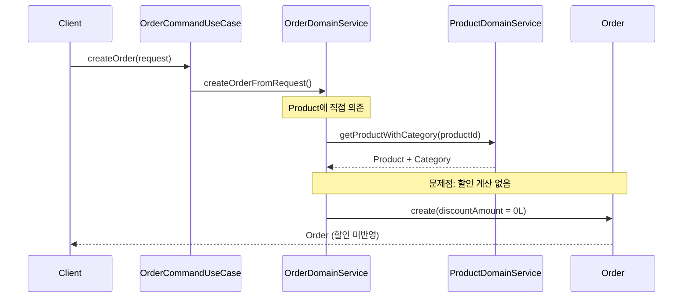
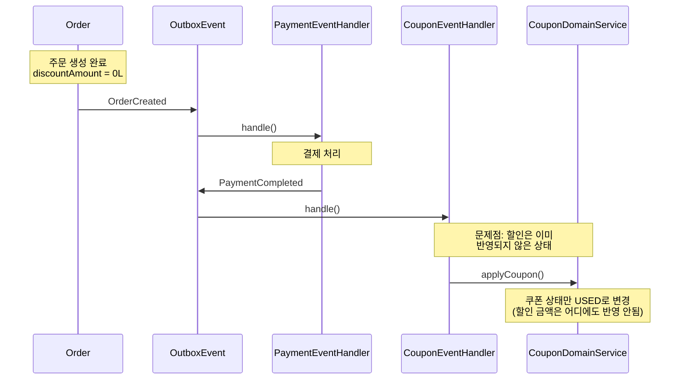
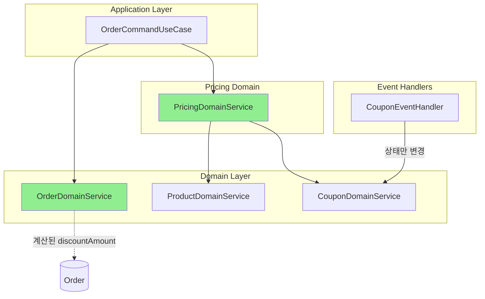
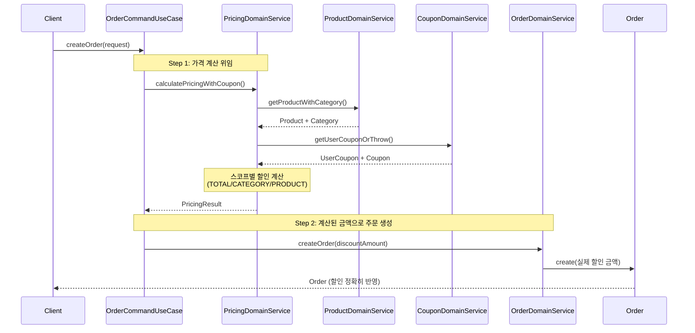
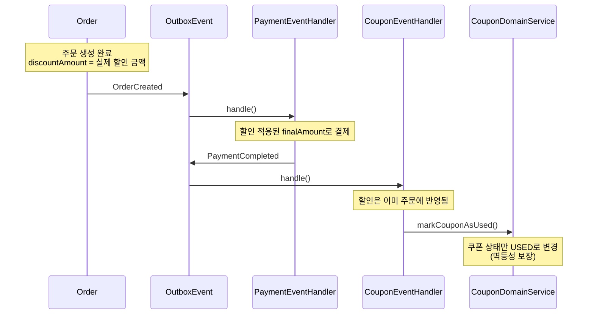
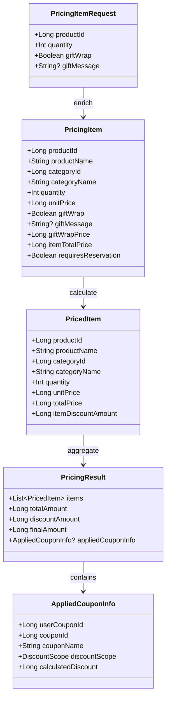
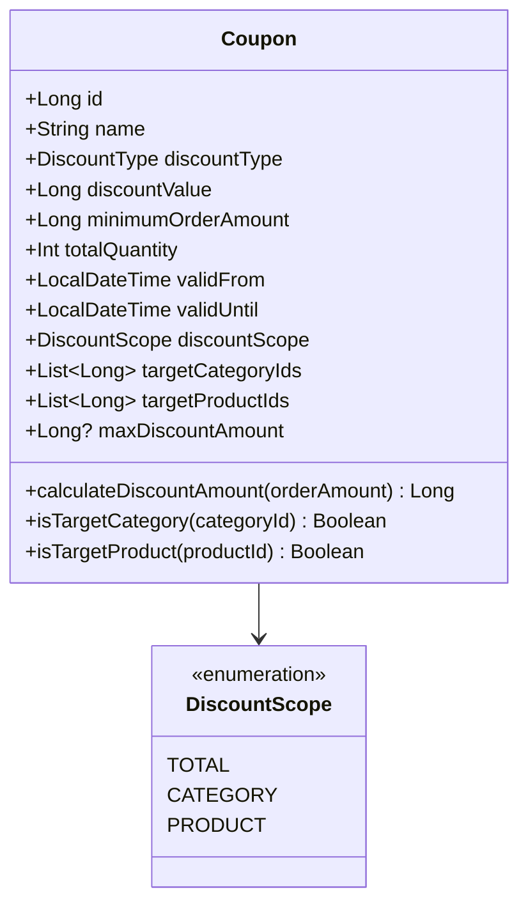
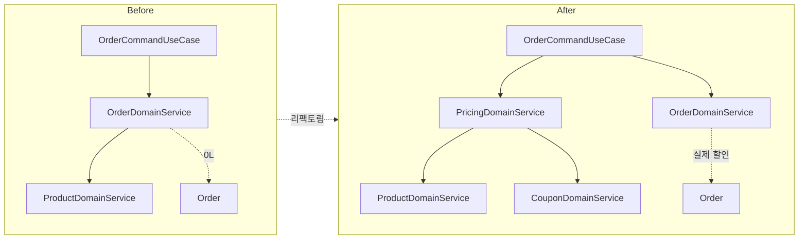

# PricingDomainService 도입 리팩토링 보고서

> **목적**: Order 도메인의 Product/Coupon 의존성 제거 및 가격 계산 책임 분리

---

## 1. 개요

### 1.1 배경
기존 아키텍처에서 `OrderDomainService`가 `ProductDomainService`에 직접 의존하고, 쿠폰 할인이 주문 생성 시점이 아닌 결제 완료 후에야 "상태만" 변경되는 구조적 문제가 있었습니다.

### 1.2 목표
- Order → Product 직접 의존성 제거
- 가격 계산 책임을 `PricingDomainService`로 분리
- 주문 생성 시점에 할인 금액이 정확히 반영되도록 개선
- 카테고리별/상품별 스코프 할인 지원

---

## 2. 이전 구조 (Before)

### 2.1 의존성 구조



### 2.2 주문 생성 흐름 (Before)



### 2.3 쿠폰 할인 흐름 (Before)



### 2.4 문제점 요약

| 문제 | 설명 | 영향 |
|------|------|------|
| **하드코딩된 할인** | `discountAmount = 0L` | 쿠폰을 사용해도 할인이 적용되지 않음 |
| **하드코딩된 카테고리** | `categoryName = "기본카테고리"` | 실제 카테고리 정보 누락 |
| **직접 의존성** | `OrderDomainService → ProductDomainService` | 도메인 간 강결합 |
| **스코프 할인 미지원** | TOTAL 스코프만 지원 | 카테고리별/상품별 할인 불가 |
| **할인 상한 미지원** | `maxDiscountAmount` 없음 | 퍼센트 할인 무제한 적용 |

---

## 3. 개선된 구조 (After)

### 3.1 의존성 구조



### 3.2 주문 생성 흐름 (After)



### 3.3 스코프별 할인 계산 로직

```mermaid
flowchart TD
    START[할인 계산 시작] --> SCOPE{DiscountScope?}

    SCOPE -->|TOTAL| TOTAL[전체 금액에 할인 적용]
    SCOPE -->|CATEGORY| CAT[대상 카테고리 필터링]
    SCOPE -->|PRODUCT| PROD[대상 상품 필터링]

    CAT --> CAT_SUM[해당 카테고리 금액 합계]
    PROD --> PROD_SUM[해당 상품 금액 합계]

    TOTAL --> CALC[할인 계산]
    CAT_SUM --> CALC
    PROD_SUM --> CALC

    CALC --> MAX{maxDiscountAmount<br/>설정됨?}

    MAX -->|Yes| APPLY_MAX[min(계산할인, 최대할인)]
    MAX -->|No| FINAL[최종 할인 금액]

    APPLY_MAX --> FINAL
```

### 3.4 이벤트 기반 쿠폰 상태 관리 (After)



---

## 4. 핵심 변경 사항

### 4.1 새로 생성된 파일

#### Pricing 모듈

```
pricing/
├── domain/
│   ├── model/
│   │   └── PricingModels.kt          # 가격 계산 도메인 모델
│   └── service/
│       └── PricingDomainService.kt   # 가격 계산 서비스
└── exception/
    └── PricingException.kt           # 가격 관련 예외
```

#### Coupon 도메인 확장

```
coupon/domain/constant/
└── DiscountScope.kt                  # 할인 스코프 enum
```

### 4.2 수정된 파일

| 파일 | 변경 내용 |
|------|-----------|
| `Coupon.kt` | discountScope, targetCategoryIds, targetProductIds, maxDiscountAmount 추가 |
| `CouponJpaEntity.kt` | 새 컬럼 매핑 추가 |
| `CouponMapper.kt` | List ↔ String 변환 로직 추가 |
| `CouponDomainService.kt` | `markCouponAsUsed()` 메서드 추가 |
| `CouponEventHandler.kt` | `applyCoupon()` → `markCouponAsUsed()` 변경 |
| `OrderItemData.kt` | categoryId 필드 추가, fromPricedItems() 변환 메서드 |
| `OrderDomainService.kt` | ProductDomainService 의존성 제거 |
| `OrderCommandUseCase.kt` | PricingDomainService 통합 |

### 4.3 데이터 모델 변경

#### PricingModels.kt 주요 클래스



#### Coupon 엔티티 확장



---

## 5. 스코프별 할인 계산 상세

### 5.1 TOTAL 스코프

전체 주문 금액에 할인을 적용합니다.

```kotlin
// 예시: 10% 전체 할인 쿠폰
val coupon = Coupon(
    discountType = PERCENTAGE,
    discountValue = 10,
    discountScope = DiscountScope.TOTAL,
    maxDiscountAmount = 5000  // 최대 5,000원
)

// 주문 금액: 100,000원
// 계산: min(100,000 * 10%, 5,000) = 5,000원 할인
```

### 5.2 CATEGORY 스코프

특정 카테고리 상품에만 할인을 적용합니다.

```kotlin
// 예시: 전자기기 카테고리 20% 할인
val coupon = Coupon(
    discountType = PERCENTAGE,
    discountValue = 20,
    discountScope = DiscountScope.CATEGORY,
    targetCategoryIds = listOf(1L, 2L)  // 다중 카테고리 지원
)

// 전자기기 카테고리 주문 금액: 50,000원
// 다른 카테고리 주문 금액: 30,000원
// 계산: 50,000 * 20% = 10,000원 할인 (다른 카테고리는 할인 X)
```

### 5.3 PRODUCT 스코프

특정 상품에만 할인을 적용합니다.

```kotlin
// 예시: 특정 상품 5,000원 정액 할인
val coupon = Coupon(
    discountType = FIXED,
    discountValue = 5000,
    discountScope = DiscountScope.PRODUCT,
    targetProductIds = listOf(101L, 102L, 103L)  // 다중 상품 지원
)

// 대상 상품 주문 금액: 20,000원
// 계산: 5,000원 할인 (대상 상품 금액 내에서만)
```

---

## 6. 테이블 스키마 변경

### 6.1 coupon 테이블 추가 컬럼

```sql
ALTER TABLE coupon ADD COLUMN discount_scope VARCHAR(20) DEFAULT 'TOTAL';
ALTER TABLE coupon ADD COLUMN target_category_ids VARCHAR(500) DEFAULT '';
ALTER TABLE coupon ADD COLUMN target_product_ids VARCHAR(500) DEFAULT '';
ALTER TABLE coupon ADD COLUMN max_discount_amount BIGINT NULL;
```

> **참고**: JPA auto-ddl을 사용하므로 별도 마이그레이션 스크립트 불필요

### 6.2 데이터 저장 형식

- `target_category_ids`: `"1,2,3"` (콤마 구분 문자열)
- `target_product_ids`: `"101,102,103"` (콤마 구분 문자열)

---

## 7. Before/After 비교 요약

### 7.1 아키텍처 비교



### 7.2 기능 비교

| 기능 | Before | After |
|------|--------|-------|
| 주문 시 할인 적용 | `discountAmount = 0L` | 실제 계산된 할인 금액 |
| 카테고리 정보 | `"기본카테고리"` | 실제 카테고리명 |
| Order → Product 의존 | 직접 의존 | PricingDomainService 통해 간접 |
| CATEGORY 스코프 할인 | 미지원 | 지원 |
| PRODUCT 스코프 할인 | 미지원 | 지원 |
| 다중 카테고리/상품 타겟 | 미지원 | 지원 |
| 할인 상한 (maxDiscountAmount) | 미지원 | 지원 |
| 쿠폰 처리 시점 | 결제 후 상태만 변경 | 주문 생성 시 할인 계산, 결제 후 상태 변경 |

### 7.3 코드 품질 비교

| 측면 | Before | After |
|------|--------|-------|
| 단일 책임 원칙 | OrderDomainService가 가격 계산까지 담당 | PricingDomainService가 가격 계산 전담 |
| 의존성 방향 | Order → Product (양방향 가능성) | Order → Pricing → {Product, Coupon} (단방향) |
| 테스트 용이성 | Product 모킹 필요 | PricingDomainService 모킹으로 단순화 |
| 확장성 | 새 할인 타입 추가 어려움 | DiscountScope enum으로 쉽게 확장 |

---

## 8. 결론

### 8.1 달성한 목표

1. **의존성 분리**: Order 도메인이 Product 도메인에 직접 의존하지 않음
2. **할인 정확성**: 주문 생성 시점에 실제 할인 금액이 반영됨
3. **스코프 할인**: 전체/카테고리/상품별 할인 지원
4. **다중 타겟**: 여러 카테고리나 상품을 동시에 할인 대상으로 지정 가능
5. **할인 상한**: 퍼센트 할인의 최대 금액 제한 가능

### 8.2 설계 원칙 준수

- **단일 책임 원칙 (SRP)**: PricingDomainService가 가격 계산만 담당
- **의존성 역전 원칙 (DIP)**: 고수준 모듈(Order)이 저수준 모듈(Product)에 직접 의존하지 않음
- **개방-폐쇄 원칙 (OCP)**: DiscountScope enum으로 새 할인 타입 쉽게 추가 가능

### 8.3 향후 확장 가능성

- 복합 할인 (여러 쿠폰 동시 적용)
- 시간대별 할인 (해피아워 등)
- 회원 등급별 추가 할인
- A/B 테스트를 위한 할인 전략 분기