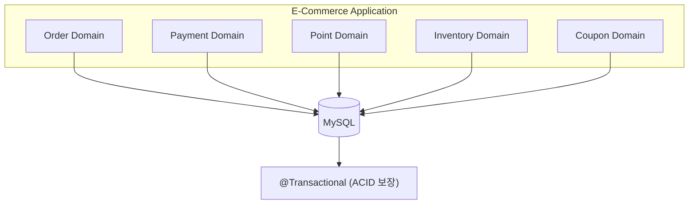
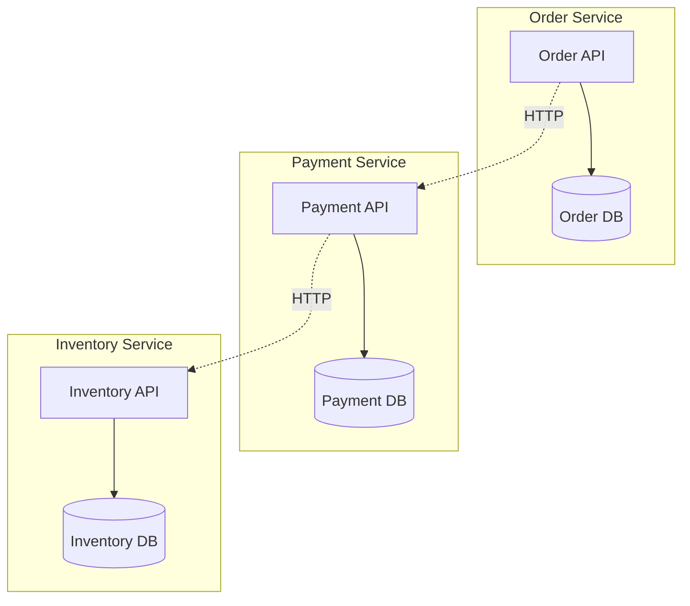
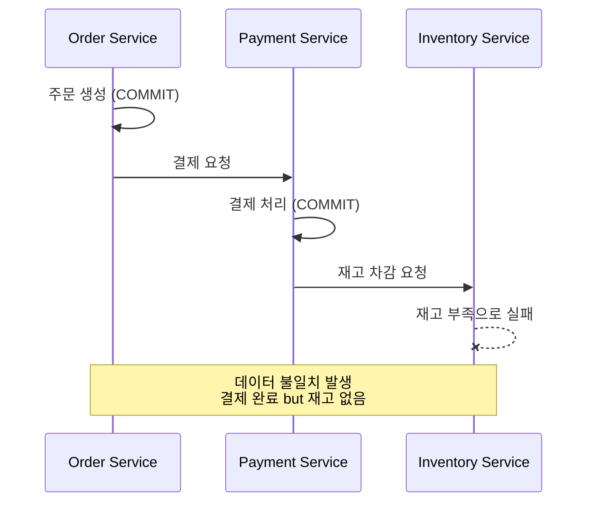
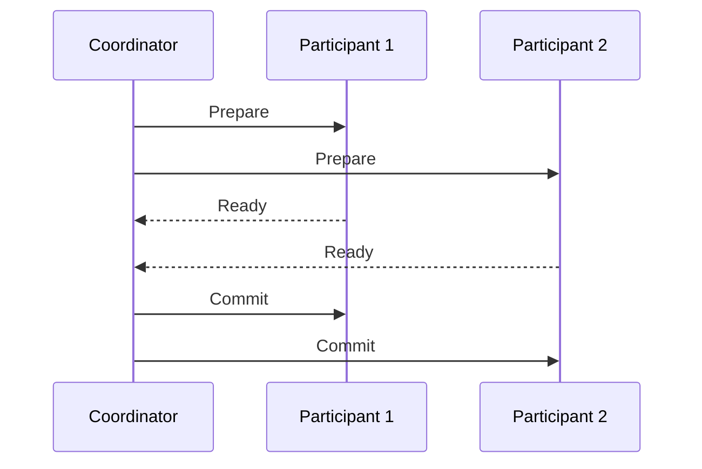
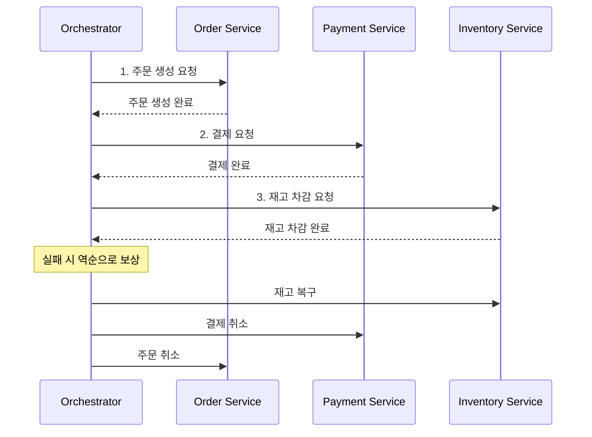
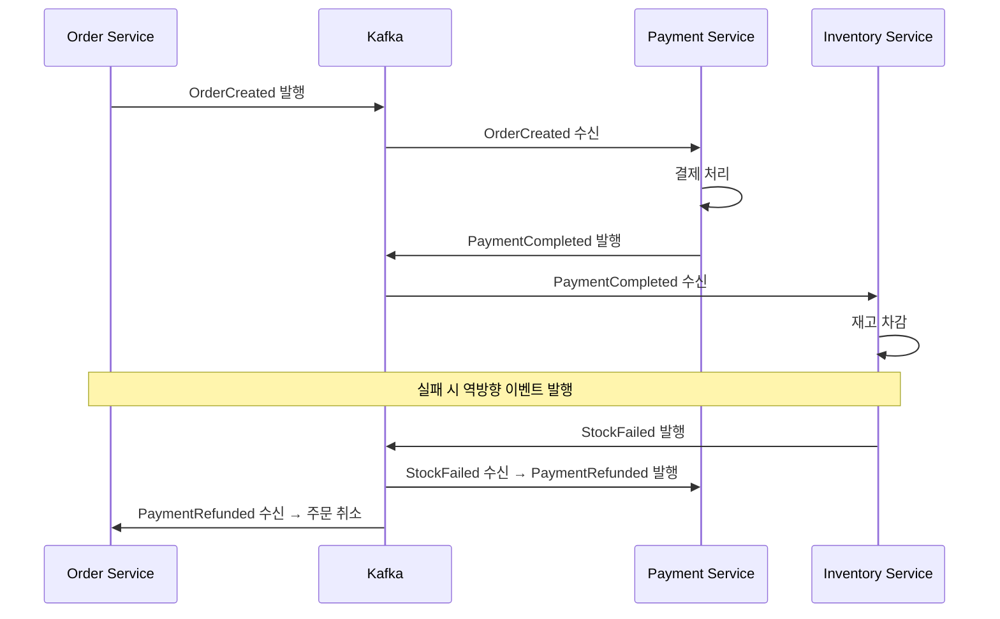
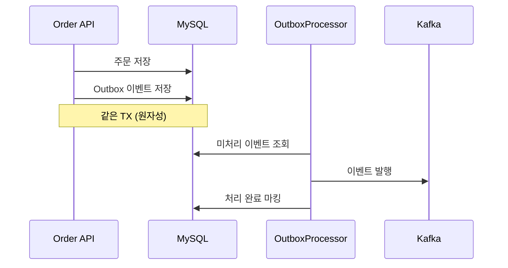
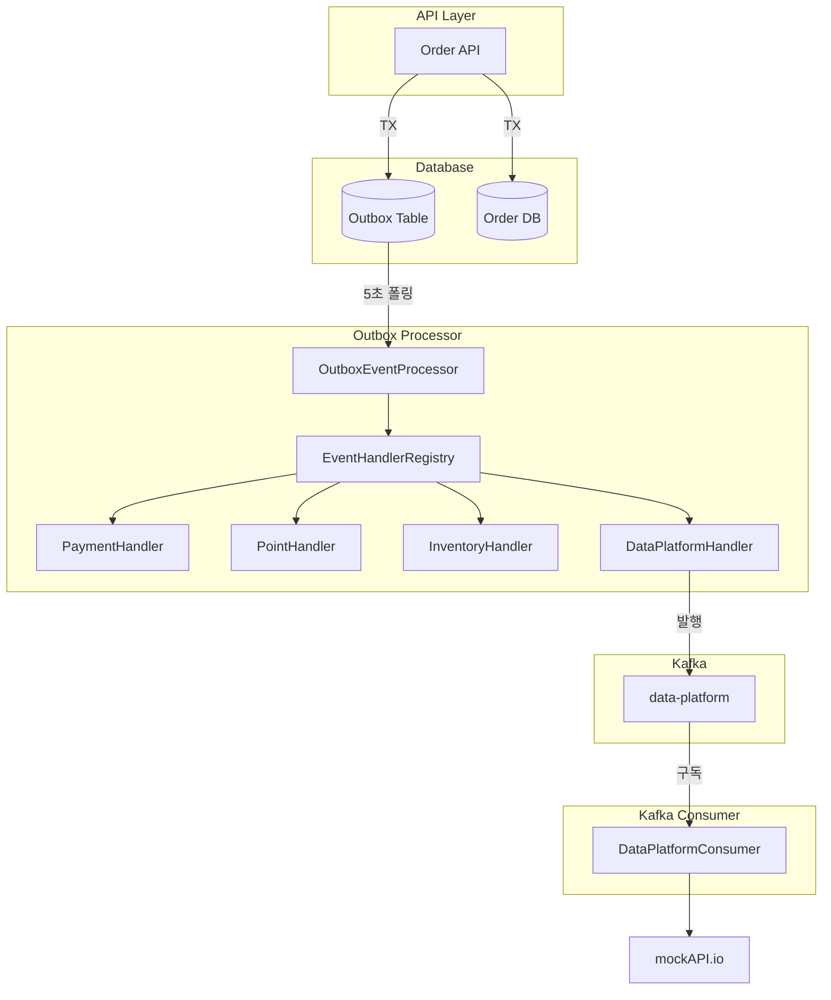
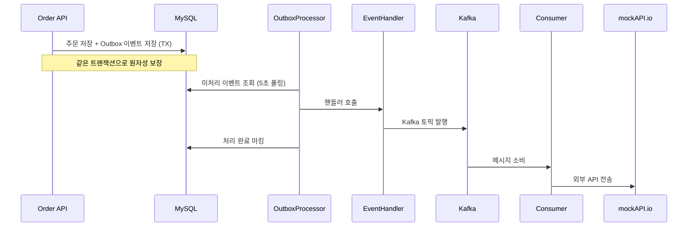
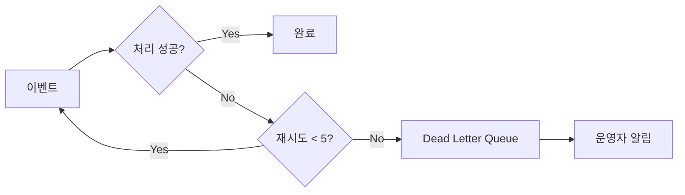

# Transaction Diagnosis

> 도메인별 서비스/DB 분리 시 트랜잭션 처리의 한계와 대응 방안

---

## 1. 현재 아키텍처

### 1.1 모놀리식 구조



### 1.2 현재 트랜잭션 처리

```kotlin
@Transactional
fun createOrder(request: CreateOrderRequest): Order {
    val order = orderRepository.save(order)
    outboxEventService.publishEvent("OrderCreated", orderPayload)
    return order
}  // COMMIT → 주문 + 이벤트 원자적 저장
```

**장점:** `@Transactional`로 ACID 보장, 롤백 시 전체 원복

---

## 2. MSA 전환 시 트랜잭션 한계

### 2.1 분리된 아키텍처



각 서비스가 독립된 DB를 사용하면 **단일 트랜잭션으로 묶을 수 없음**.

### 2.2 부분 실패 문제



### 2.3 발생 가능한 문제 유형

| 문제 | 상황 | 결과 |
|------|------|------|
| **부분 실패** | 결제 성공 후 재고 차감 실패 | 결제됐는데 상품 없음 |
| **중복 처리** | 동일 이벤트 2회 전달 | 포인트 2번 차감 |
| **순서 역전** | 취소가 생성보다 먼저 도착 | 잘못된 상태 |
| **롱 트랜잭션** | 동기 호출로 락 장시간 점유 | 타임아웃, 동시성 저하 |

---

## 3. 대응 방안 비교

### 3.1 방안별 특성 비교

| 방안 | 일관성 | 가용성 | 구현 복잡도 | 적용 난이도 |
|------|:------:|:------:|:----------:|:----------:|
| **2PC** | 강함 | 낮음 | 중간 | 높음 |
| **Saga (Orchestration)** | 최종 | 중간 | 높음 | 중간 |
| **Saga (Choreography)** | 최종 | 높음 | 중간 | 중간 |
| **Transactional Outbox** | 최종 | 높음 | 낮음 | 낮음 |

### 3.2 2PC (Two-Phase Commit)



**한계:**
- Coordinator 장애 시 전체 블로킹
- 모든 참여자 응답 대기 필요 (성능 저하)
- NoSQL(Redis, MongoDB) 미지원

### 3.3 Saga 패턴

#### Orchestration vs Choreography

| 방식 | 설명 | 장점 | 단점 |
|------|------|------|------|
| **Orchestration** | 중앙 조정자가 흐름 제어 | 흐름 파악 용이, 중앙 관리 | 단일 장애점, Orchestrator 의존 |
| **Choreography** | 각 서비스가 독립적으로 이벤트 반응 | 느슨한 결합, 확장 용이 | 흐름 파악 어려움, 디버깅 복잡 |

#### Orchestration 흐름



#### Choreography 흐름



### 3.4 Transactional Outbox



**장점:**
- DB 저장과 이벤트 발행의 원자성 보장
- 네트워크 실패에도 이벤트 유실 없음
- At-least-once 전달 보장

---

## 4. 선택한 방안: Saga (Choreography) + Transactional Outbox

### 4.1 선택 근거

| 기준 | Choreography + Outbox | 2PC | Saga (Orchestration) |
|------|:---------------------:|:---:|:--------------------:|
| 구현 복잡도 | 중간 | 중간 | 높음 |
| 이벤트 유실 | 없음 | 가능 | 가능 |
| 결합도 | 낮음 | 높음 | 중간 |
| 단일 장애점 | 없음 | 있음 | 있음 (Orchestrator) |

**선택 이유:**
1. **모놀리식 환경**에서 이벤트 기반 아키텍처 적용 가능
2. DB 저장과 이벤트 발행의 **원자성 보장** (같은 트랜잭션)
3. 각 핸들러가 **독립적으로 이벤트 구독** (느슨한 결합)
4. 향후 MSA 전환 시 **핸들러를 독립 서비스로 분리** 가능

### 4.2 구현 아키텍처



### 4.3 이벤트 처리 흐름



### 4.4 순수 Choreography와의 차이

| 구분 | 순수 Choreography | 현재 구현 |
|------|:-----------------:|:---------:|
| 핸들러 배포 | 독립 서비스/컨테이너 | 같은 프로세스 |
| 이벤트 전달 | Kafka 직접 구독 | OutboxProcessor가 호출 |
| 결합도 | 완전 분리 | 런타임 분리 |

**현재 구현의 특징:**
- 핸들러가 Kafka를 직접 구독하지 않고 `EventHandlerRegistry`에 등록되어 호출됨
- 모놀리식 환경에서 Choreography **패턴**을 적용한 형태
- MSA 전환 시 핸들러를 독립 서비스로 분리하고 Kafka 구독으로 변경 필요

---

## 5. 문제 시나리오별 해결

### 5.1 외부 API 실패

**문제:** 데이터 플랫폼 전송 실패

**해결:** 재시도 + DLQ



### 5.2 중복 이벤트 처리

**문제:** At-least-once 특성으로 동일 이벤트 2회 이상 도착 가능

**해결 방향:** Idempotent Consumer 패턴 적용 필요

### 5.3 이벤트 순서 역전

**문제:** 취소 이벤트가 생성 이벤트보다 먼저 도착할 수 있음

**해결 방향:** 이벤트 버전 관리 또는 상태 기반 검증 필요

---

## 6. 현재 구현 상태

### 6.1 구현 현황

| 항목 | 상태 | 비고 |
|------|:----:|------|
| Transactional Outbox | ✅ | 원자적 이벤트 발행 |
| Saga (Choreography) | ✅ | 이벤트 기반 흐름 제어 |
| 보상 트랜잭션 | ✅ | ORDER_CANCELLED → 재고 복구, 포인트 환불 |
| DLQ 처리 | ✅ | 실패 이벤트 격리 |
| Kafka 연동 | ✅ | MessagePublisher 추상화 |
| 외부 API 분리 | ✅ | DataPlatformConsumer |
| 멱등성 처리 | ❌ | 미구현 |
| Circuit Breaker | ❌ | 미구현 |

### 6.2 추가 개선 필요사항

**1. 멱등성 처리**

현재 미구현. At-least-once 특성으로 인한 중복 처리 방지 필요.

**2. Circuit Breaker**

외부 API 연쇄 장애 방지를 위해 도입 필요.

**3. 분산 추적 강화**

현재 `traceId`를 MDC로 전파 중. OpenTelemetry 도입으로 전체 흐름 가시화 가능.

---

## 7. 결론

### 7.1 선택 근거

**Saga (Choreography) + Transactional Outbox** 조합을 선택한 이유:

1. **모놀리식 환경**에서 이벤트 기반 아키텍처 적용 가능
2. DB 저장과 이벤트 발행의 **원자성 보장**
3. 각 핸들러가 **독립적으로 이벤트 구독** (느슨한 결합)
4. **MSA 전환 시** 핸들러를 독립 서비스로 점진적 분리 가능

### 7.2 데이터 일관성 전략

```
Eventual Consistency (최종 일관성)
├── 즉각적 강한 일관성 대신 시간차 일관성
├── 재시도 + DLQ로 실패 복구
└── 멱등성 처리로 중복 방지 (구현 필요)
```

---

## 8. 파일 구조

```
src/main/kotlin/io/hhplus/ecommerce/
├── common/
│   ├── client/
│   │   ├── DataPlatformClient.kt
│   │   └── MockDataPlatformClient.kt
│   ├── consumer/
│   │   └── DataPlatformConsumer.kt
│   ├── messaging/
│   │   ├── MessagePublisher.kt
│   │   ├── InMemoryMessagePublisher.kt
│   │   └── KafkaMessagePublisher.kt
│   └── outbox/
│       ├── EventHandler.kt              # 핸들러 인터페이스
│       ├── OutboxEvent.kt               # Entity
│       ├── OutboxEventRepository.kt     # Repository 인터페이스
│       ├── OutboxEventService.kt        # Application Service
│       ├── infra/
│       └── dlq/
├── config/
│   ├── event/
│   │   └── EventRegistry.kt             # 이벤트 타입/메타데이터 정의
│   ├── KafkaConfig.kt
│   └── KafkaTopicConfig.kt
└── order/
    └── application/
        ├── handler/
        │   └── OrderDataPlatformHandler.kt
        └── mapper/
            └── OrderPayloadMapper.kt
```
