# Transaction Diagnosis

> 도메인별 서비스/DB 분리 시 트랜잭션 처리의 한계와 대응 방안

---

## 1. 현재 아키텍처

### 1.1 모놀리식 구조

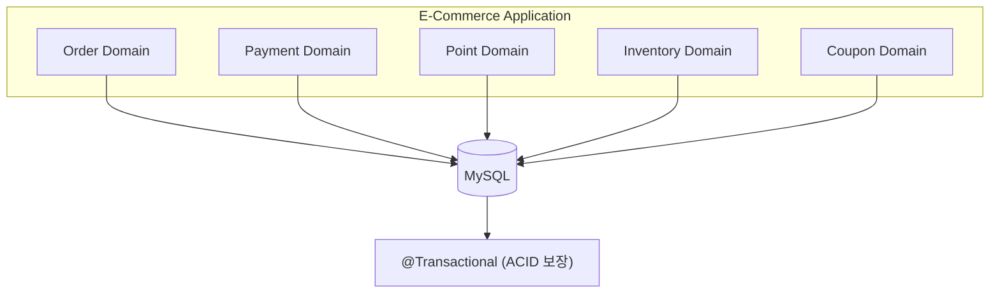

### 1.2 현재 트랜잭션 처리

```kotlin
@Transactional
fun createOrder(request: CreateOrderRequest): Order {
    val order = orderRepository.save(order)
    outboxEventService.publishEvent("OrderCreated", orderPayload)
    return order
}  // COMMIT → 주문 + 이벤트 원자적 저장
```

**장점:** `@Transactional`로 ACID 보장, 롤백 시 전체 원복

---

## 2. MSA 전환 시 트랜잭션 한계

### 2.1 분리된 아키텍처

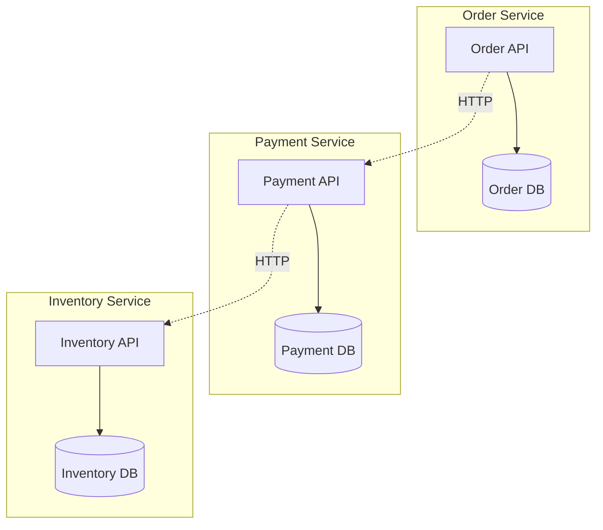

각 서비스가 독립된 DB를 사용하면 **단일 트랜잭션으로 묶을 수 없음**.

### 2.2 부분 실패 문제

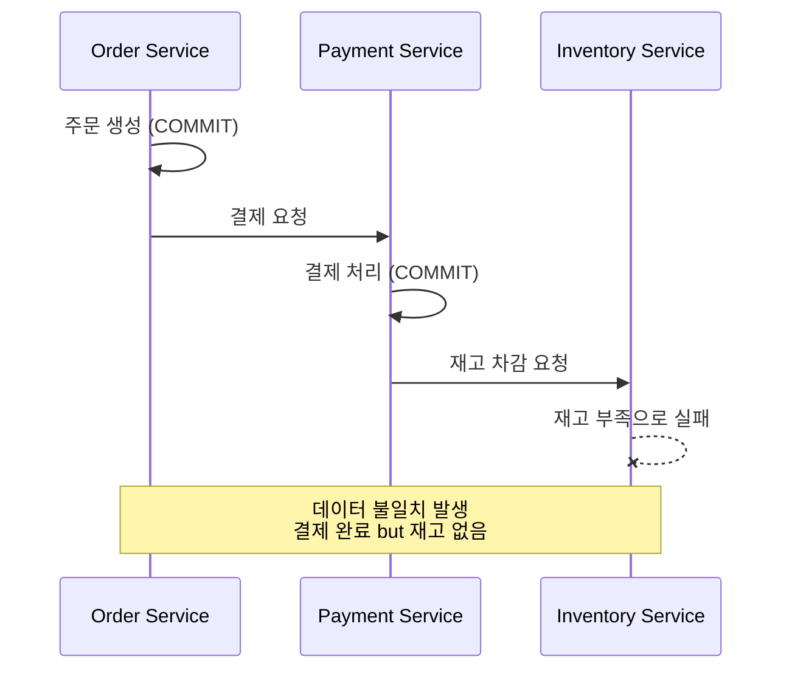

### 2.3 발생 가능한 문제 유형

| 문제 | 상황 | 결과 |
|------|------|------|
| **부분 실패** | 결제 성공 후 재고 차감 실패 | 결제됐는데 상품 없음 |
| **중복 처리** | 동일 이벤트 2회 전달 | 포인트 2번 차감 |
| **순서 역전** | 취소가 생성보다 먼저 도착 | 잘못된 상태 |
| **롱 트랜잭션** | 동기 호출로 락 장시간 점유 | 타임아웃, 동시성 저하 |

---

## 3. 대응 방안 비교

### 3.1 방안별 특성 비교

| 방안 | 일관성 | 가용성 | 구현 복잡도 | 적용 난이도 |
|------|:------:|:------:|:----------:|:----------:|
| **2PC** | 강함 | 낮음 | 중간 | 높음 |
| **Saga (Orchestration)** | 최종 | 중간 | 높음 | 중간 |
| **Saga (Choreography)** | 최종 | 높음 | 중간 | 중간 |
| **Transactional Outbox** | 최종 | 높음 | 낮음 | 낮음 |

### 3.2 2PC (Two-Phase Commit)

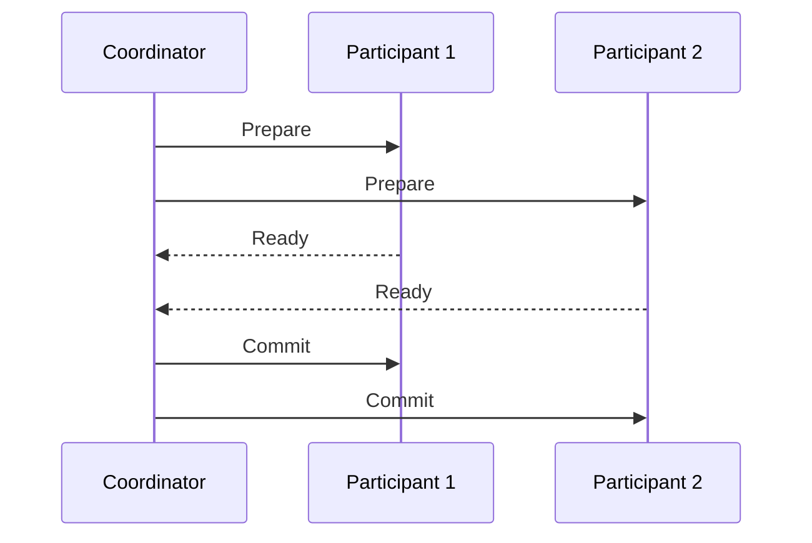

**한계:**
- Coordinator 장애 시 전체 블로킹
- 모든 참여자 응답 대기 필요 (성능 저하)
- NoSQL(Redis, MongoDB) 미지원

### 3.3 Saga 패턴

#### Orchestration vs Choreography

| 방식 | 설명 | 장점 | 단점 |
|------|------|------|------|
| **Orchestration** | 중앙 조정자가 흐름 제어 | 흐름 파악 용이, 중앙 관리 | 단일 장애점, Orchestrator 의존 |
| **Choreography** | 각 서비스가 독립적으로 이벤트 반응 | 느슨한 결합, 확장 용이 | 흐름 파악 어려움, 디버깅 복잡 |

#### Orchestration 흐름

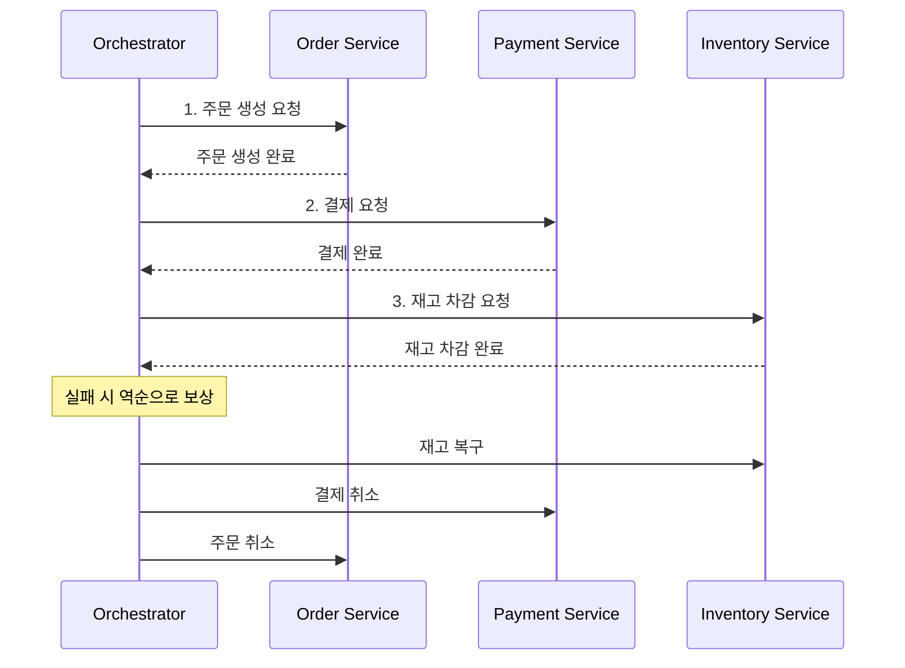

#### Choreography 흐름

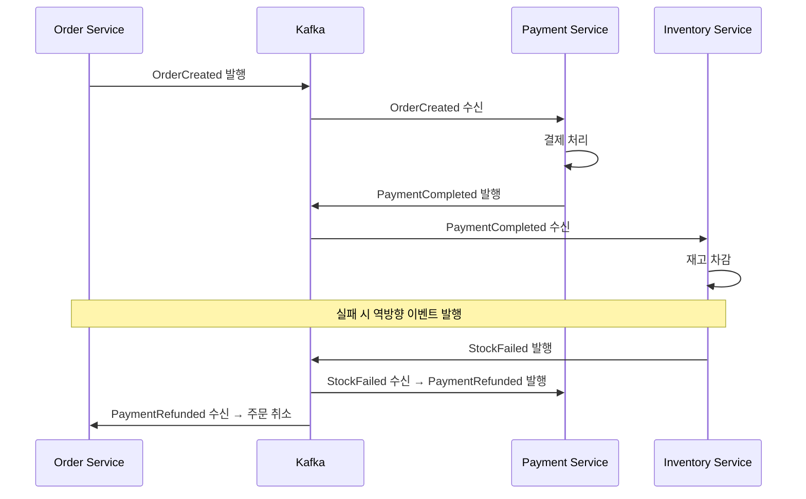

### 3.4 Transactional Outbox

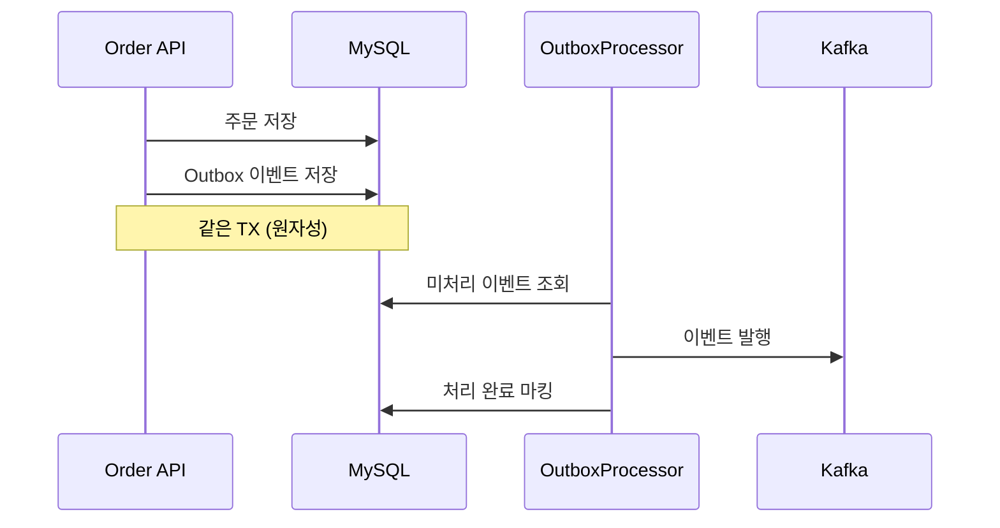

**장점:**
- DB 저장과 이벤트 발행의 원자성 보장
- 네트워크 실패에도 이벤트 유실 없음
- At-least-once 전달 보장

---

## 4. 선택한 방안: Saga (Choreography) + Transactional Outbox

### 4.1 선택 근거

| 기준 | Choreography + Outbox | 2PC | Saga (Orchestration) |
|------|:---------------------:|:---:|:--------------------:|
| 구현 복잡도 | 중간 | 중간 | 높음 |
| 이벤트 유실 | 없음 | 가능 | 가능 |
| 결합도 | 낮음 | 높음 | 중간 |
| 단일 장애점 | 없음 | 있음 | 있음 (Orchestrator) |

**선택 이유:**
1. **모놀리식 환경**에서 이벤트 기반 아키텍처 적용 가능
2. DB 저장과 이벤트 발행의 **원자성 보장** (같은 트랜잭션)
3. 각 핸들러가 **독립적으로 이벤트 구독** (느슨한 결합)
4. 향후 MSA 전환 시 **핸들러를 독립 서비스로 분리** 가능

### 4.2 구현 아키텍처

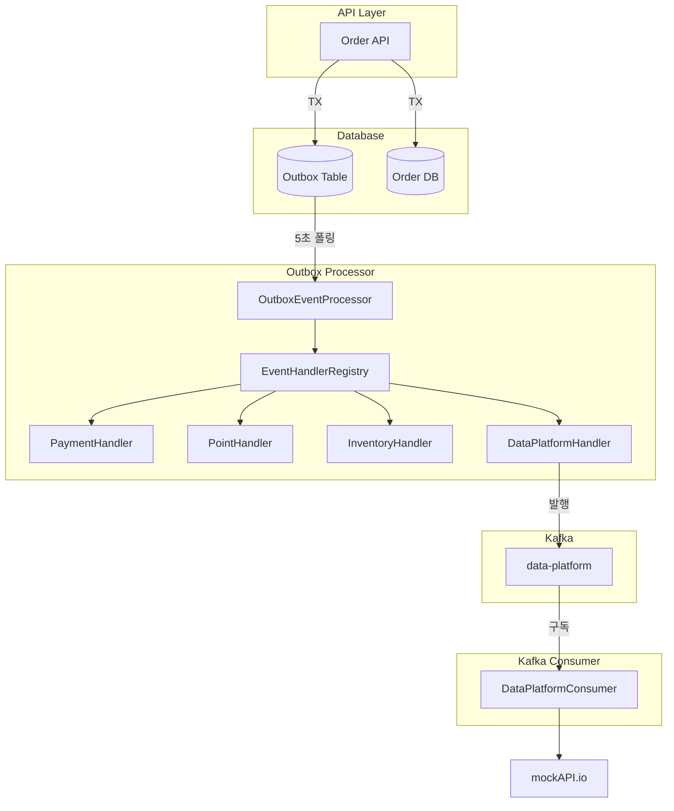

### 4.3 이벤트 처리 흐름

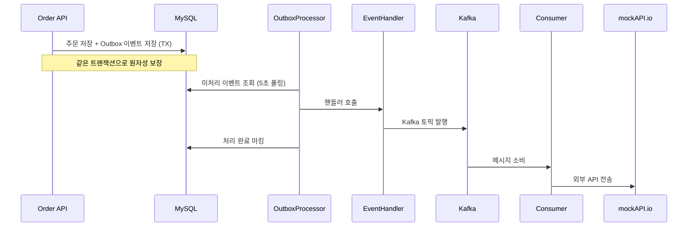

### 4.4 순수 Choreography와의 차이

| 구분 | 순수 Choreography | 현재 구현 |
|------|:-----------------:|:---------:|
| 핸들러 배포 | 독립 서비스/컨테이너 | 같은 프로세스 |
| 이벤트 전달 | Kafka 직접 구독 | OutboxProcessor가 호출 |
| 결합도 | 완전 분리 | 런타임 분리 |

**현재 구현의 특징:**
- 핸들러가 Kafka를 직접 구독하지 않고 `EventHandlerRegistry`에 등록되어 호출됨
- 모놀리식 환경에서 Choreography **패턴**을 적용한 형태
- MSA 전환 시 핸들러를 독립 서비스로 분리하고 Kafka 구독으로 변경 필요

---

## 5. 문제 시나리오별 해결

### 5.1 외부 API 실패

**문제:** 데이터 플랫폼 전송 실패

**해결:** Retry + Circuit Breaker (Resilience4j)

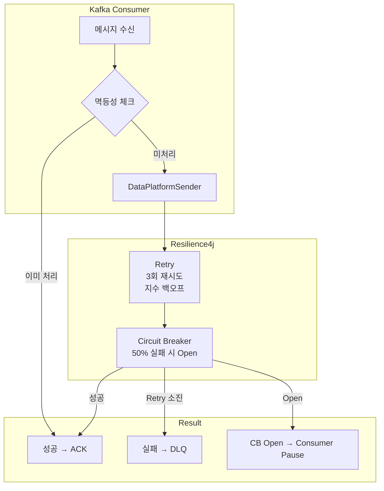

#### Retry + Circuit Breaker 동작 방식

| 단계 | 상황 | 동작 |
|------|------|------|
| 1 | 일시적 실패 | Retry (1s → 2s → 4s 지수 백오프) |
| 2 | Retry 3회 소진 | Circuit Breaker 실패 카운트 |
| 3 | 실패율 50% 초과 | Circuit Breaker OPEN |
| 4 | CB Open 상태 | Kafka Consumer **일시 중지** |
| 5 | 30초 후 | Half-Open → Consumer **재개** |

#### 구현 코드

**DataPlatformSender.kt** (Retry + Circuit Breaker 적용):

```kotlin
@Service
class DataPlatformSender(private val dataPlatformClient: DataPlatformClient) {

    @Retry(name = "dataPlatform", fallbackMethod = "sendFallback")
    @CircuitBreaker(name = "dataPlatform", fallbackMethod = "sendFallback")
    fun send(payload: OrderInfoPayload): DataPlatformResponse {
        val response = dataPlatformClient.sendOrderInfo(payload)
        if (!response.success) {
            throw DataPlatformException("전송 실패: ${response.message}")
        }
        return response
    }
}
```

**CircuitBreakerEventListener.kt** (Consumer pause/resume):

```kotlin
@PostConstruct
fun registerEventListener() {
    circuitBreaker.eventPublisher.onStateTransition { event ->
        when (event.stateTransition.toState) {
            OPEN, FORCED_OPEN -> kafkaContainer.pause()
            HALF_OPEN, CLOSED -> kafkaContainer.resume()
        }
    }
}
```

**application.yml** 설정:

```yaml
resilience4j:
  retry:
    instances:
      dataPlatform:
        maxAttempts: 3
        waitDuration: 1s
        exponentialBackoffMultiplier: 2
  circuitbreaker:
    instances:
      dataPlatform:
        failureRateThreshold: 50
        slidingWindowSize: 10
        waitDurationInOpenState: 30s
```

#### 실패 시 Redis 키 처리

| 상황 | Redis 키 | 이유 |
|------|----------|------|
| **성공** | 유지 | 중복 처리 방지 |
| **CB Open** | 삭제 | 재시도 가능하게 |
| **최종 실패 (DLQ)** | 유지 | 중복 DLQ 방지 |

### 5.2 중복 이벤트 처리 (멱등성)

**문제:** At-least-once 특성으로 동일 이벤트 2회 이상 도착 가능

**해결:** 2단계 멱등성 체크 (Producer + Consumer) + **원자적 SETNX**

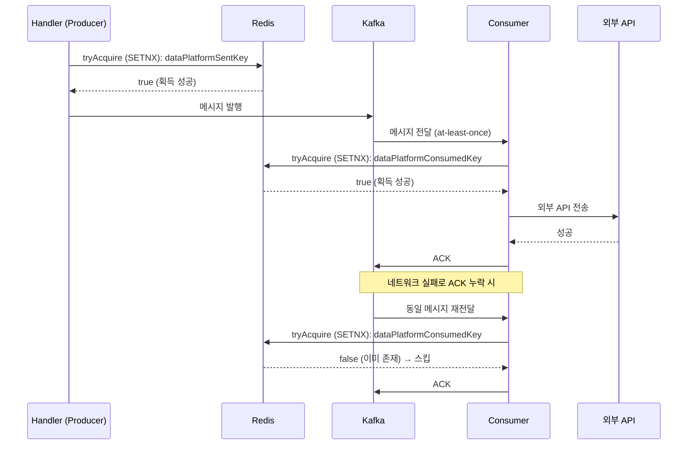

**구현 내용:**

| 단계 | 위치 | 목적 | 키 패턴 |
|------|------|------|---------|
| 1차 | OrderDataPlatformHandler | Kafka 중복 발행 방지 | `ecom:ord:dp:sent:{orderId}:{status}` |
| 2차 | DataPlatformConsumer | 외부 API 중복 전송 방지 | `ecom:ord:dp:consumed:{orderId}:{status}` |

#### 왜 SETNX (원자적 체크)가 필요한가?

**기존 방식의 문제점 (isProcessed + markAsProcessed):**

```kotlin
// ❌ 경쟁 조건에 취약한 기존 방식
if (!idempotencyService.isProcessed(key)) {   // 1. 체크
    // ← 여기서 다른 스레드도 false를 받을 수 있음!
    messagePublisher.publish(...)              // 2. 발행 (중복!)
    idempotencyService.markAsProcessed(key)    // 3. 마킹
}
```

**테스트 결과 (동시 10개 스레드):**
```
기존 방식: 10번 모두 중복 처리됨 ⚠️
SETNX 방식: 정확히 1번만 처리됨 ✅
```

**개선된 방식 (tryAcquire = SETNX):**

```kotlin
// ✅ 원자적으로 체크하고 마킹하는 방식
if (idempotencyService.tryAcquire(key, TTL_7_DAYS)) {
    // SETNX 성공 = 처음 요청 = 처리 권한 획득
    messagePublisher.publish(...)
}
```

**IdempotencyService 인터페이스:**

```kotlin
interface IdempotencyService {
    /**
     * 원자적으로 멱등성 키 획득 시도 (SETNX 기반)
     * - true: 처리 권한 획득 (처음 요청)
     * - false: 이미 처리 중이거나 완료
     */
    fun tryAcquire(key: String, ttl: Duration = Duration.ofDays(7)): Boolean
}
```

**RedisIdempotencyService 구현:**

```kotlin
override fun tryAcquire(key: String, ttl: Duration): Boolean {
    return redisTemplate.opsForValue().setIfAbsent(key, "1", ttl) == true
}
```

#### SETNX 방식의 장점

| 항목 | 설명 |
|------|------|
| **원자성** | Redis 단일 연산으로 경쟁 조건 완전 방지 |
| **성능** | 네트워크 RTT 1회 (기존 hasKey + set 2회보다 빠름) |
| **블로킹 없음** | 분산 락처럼 대기하지 않고 즉시 true/false 반환 |
| **업계 표준** | Kafka 멱등성 처리에 널리 사용되는 패턴 |

#### 왜 2단계가 필요한가?

1. **Kafka at-least-once 특성**: Consumer가 메시지를 처리하고 ACK 전송 중 네트워크 실패 시, Kafka는 동일 메시지를 재전달함
2. **Producer 레벨 멱등성만으로 부족**: Producer는 Kafka 발행까지만 책임지고, Consumer가 실제 외부 API를 호출하므로 Consumer 레벨에서도 별도 체크 필요
3. **TTL 7일**: 충분한 기간 동안 중복 방지, 이후 자동 만료

#### 업계 사례

| 기업/도구 | 접근법 |
|-----------|--------|
| **Confluent (Kafka 개발사)** | "외부 API 호출은 반드시 자체 멱등성 체크 필요" |
| **Turkcell** | Redis SETNX로 Consumer 레벨 멱등성 처리 |
| **Lydtech Consulting** | Transactional Outbox + Idempotent Consumer 조합 권장 |

### 5.3 이벤트 순서 역전

**문제:** 취소 이벤트가 생성 이벤트보다 먼저 도착할 수 있음

**해결 방향:** 이벤트 버전 관리 또는 상태 기반 검증 필요

---

## 6. 현재 구현 상태

### 6.1 구현 현황

| 항목 | 상태 | 비고 |
|------|:----:|------|
| Transactional Outbox | ✅ | 원자적 이벤트 발행 |
| Saga (Choreography) | ✅ | 이벤트 기반 흐름 제어 |
| 보상 트랜잭션 | ✅ | ORDER_CANCELLED → 재고 복구, 포인트 환불 |
| DLQ 처리 | ✅ | 실패 이벤트 격리 |
| Kafka 연동 | ✅ | MessagePublisher 추상화 |
| 외부 API 분리 | ✅ | DataPlatformConsumer |
| 멱등성 처리 | ✅ | 2단계 멱등성 + **원자적 SETNX** (경쟁 조건 방지) |
| Retry | ✅ | Resilience4j - 3회 재시도, 지수 백오프 |
| Circuit Breaker | ✅ | Resilience4j - 50% 실패 시 Open, Consumer pause/resume |

### 6.2 추가 개선 가능 사항

**1. 분산 추적 강화**

현재 `traceId`를 MDC로 전파 중. OpenTelemetry 도입으로 전체 흐름 가시화 가능.

**2. DLQ 재처리 자동화**

현재 DLQ 메시지는 수동 처리. 자동 재처리 스케줄러 도입 가능.

---

## 7. 결론

### 7.1 선택 근거

**Saga (Choreography) + Transactional Outbox** 조합을 선택한 이유:

1. **모놀리식 환경**에서 이벤트 기반 아키텍처 적용 가능
2. DB 저장과 이벤트 발행의 **원자성 보장**
3. 각 핸들러가 **독립적으로 이벤트 구독** (느슨한 결합)
4. **MSA 전환 시** 핸들러를 독립 서비스로 점진적 분리 가능

### 7.2 데이터 일관성 전략

```
Eventual Consistency (최종 일관성)
├── 즉각적 강한 일관성 대신 시간차 일관성
├── 재시도 + DLQ로 실패 복구
└── 2단계 멱등성 처리로 중복 방지
    ├── Producer: OrderDataPlatformHandler (tryAcquire)
    ├── Consumer: DataPlatformConsumer (tryAcquire)
    └── 원자적 SETNX로 경쟁 조건 완전 방지
```

---

## 8. 파일 구조

```
src/main/kotlin/io/hhplus/ecommerce/
├── common/
│   ├── cache/
│   │   └── RedisKeyNames.kt             # Redis 키 패턴 정의 (멱등성 키 포함)
│   ├── client/
│   │   ├── DataPlatformClient.kt
│   │   └── MockDataPlatformClient.kt
│   ├── consumer/
│   │   ├── DataPlatformConsumer.kt      # Kafka Consumer (멱등성 + 에러 처리)
│   │   ├── DataPlatformSender.kt        # Retry + Circuit Breaker 적용
│   │   └── CircuitBreakerEventListener.kt  # CB 상태에 따른 Consumer pause/resume
│   ├── idempotency/
│   │   ├── IdempotencyService.kt        # 멱등성 서비스 인터페이스 (tryAcquire)
│   │   └── RedisIdempotencyService.kt   # Redis SETNX 기반 원자적 멱등성 구현
│   ├── messaging/
│   │   ├── MessagePublisher.kt
│   │   ├── InMemoryMessagePublisher.kt
│   │   └── KafkaMessagePublisher.kt
│   └── outbox/
│       ├── EventHandler.kt              # 핸들러 인터페이스
│       ├── OutboxEvent.kt               # Entity
│       ├── OutboxEventRepository.kt     # Repository 인터페이스
│       ├── OutboxEventService.kt        # Application Service
│       ├── payload/
│       │   └── OutboxEventPayloads.kt   # @Serializable 이벤트 페이로드 정의
│       ├── infra/
│       └── dlq/
├── config/
│   ├── event/
│   │   └── EventRegistry.kt             # 이벤트 타입/메타데이터 정의
│   ├── KafkaConfig.kt
│   └── KafkaTopicConfig.kt
└── order/
    └── application/
        ├── handler/
        │   └── OrderDataPlatformHandler.kt  # 1차 멱등성 체크 (Producer 레벨)
        └── mapper/
            └── OrderPayloadMapper.kt
```
