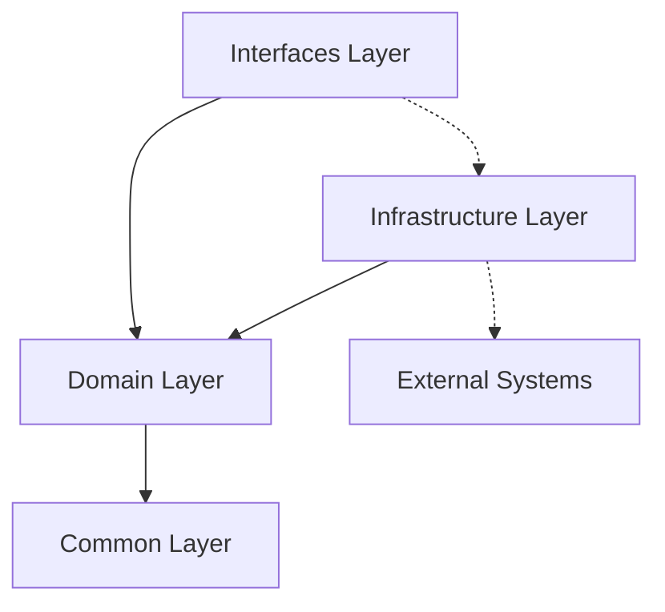

# 아키텍처 설계서

## 📋 프로젝트 개요

본 프로젝트는 **도메인 중심 실용적 아키텍처(Domain-Centric Pragmatic Architecture)**를 기반으로 설계된 이커머스 서비스입니다. 사용자가 원하는 차를 커스텀 배합하여 박스 형태로 주문할 수 있는 서비스를 제공합니다.

### 핵심 기능
- 🍵 **커스텀 차 박스 구성**: 사용자 취향에 맞는 차 배합
- 🛒 **장바구니 관리**: 배합 비율 검증 및 재고 확인
- 📦 **주문 처리**: 복합 트랜잭션 기반 주문 생성
- 💰 **포인트 결제**: 포인트와 PG 혼합 결제
- 🎫 **선착순 쿠폰**: Redis 기반 동시성 제어
- 📊 **재고 관리**: 실시간 재고 추적 및 복구

## 📁 프로젝트 구조 (도메인별 수직분할)

### 실제 폴더 구조
```
src/main/kotlin/io/hhplus/ecommerce/
├── common/                          # 공통 기능
│   ├── response/                    # 표준 응답 형식
│   ├── exception/                   # 전역 예외 처리
│   ├── baseentity/                  # 공통 엔티티
│   ├── util/                        # 공통 유틸리티
│   └── outbox/                      # 아웃박스 패턴
├── config/                          # 스프링 설정
│   ├── JpaConfig.kt                 # (추후 고려)
│   ├── RedisConfig.kt               # (추후 고려)
│   └── SecurityConfig.kt            # (추후 고려)
│
├── order/                           # ✅ Order 도메인
│   ├── controller/                  # OrderController.kt
│   ├── dto/                         # OrderDto.kt (Request/Response)
│   ├── usecase/                     # CreateOrderUseCase.kt 등 4개
│   ├── application/                 # OrderService.kt
│   ├── domain/                      # Order.kt, OrderItem.kt
│   │   ├── entity/                  # 엔티티 클래스들
│   │   ├── repository/              # Repository 인터페이스
│   │   ├── constant/                # 상수 및 Enum
│   │   └── vo/                      # OrderAmount.kt
│   └── infra/                       # JpaOrderRepository.kt
│
├── cart/                            # ✅ Cart 도메인
│   ├── controller/                  # CartController.kt
│   ├── dto/                         # CartDto.kt
│   ├── usecase/                     # 5개 UseCase (Add, Remove, Update, Get, Clear)
│   ├── application/                 # CartService.kt
│   ├── domain/                      # Cart.kt, CartItem.kt
│   │   ├── entity/                  # 엔티티 클래스들
│   │   ├── repository/              # Repository 인터페이스
│   │   └── vo/                      # Quantity.kt
│   └── infra/                       # InMemoryCartRepository.kt
│
├── coupon/                          # ✅ Coupon 도메인
│   ├── controller/                  # CouponController.kt
│   ├── dto/                         # CouponDto.kt
│   ├── usecase/                     # 4개 UseCase (Issue, Apply, Get, Validate)
│   ├── application/                 # CouponService.kt
│   ├── domain/                      # Coupon.kt, UserCoupon.kt
│   │   ├── entity/                  # 엔티티 클래스들
│   │   ├── repository/              # Repository 인터페이스
│   │   └── vo/                      # CouponCode.kt
│   └── infra/                       # InMemoryCouponRepository.kt
│
├── payment/                         # ✅ Payment 도메인
│   ├── controller/                  # PaymentController.kt
│   ├── dto/                         # PaymentDto.kt
│   ├── usecase/                     # 2개 UseCase (Process, Get)
│   ├── application/                 # PaymentService.kt
│   ├── domain/                      # Payment.kt (결제 엔티티가 곧 결제 이력)
│   │   ├── entity/                  # Payment 엔티티
│   │   ├── repository/              # PaymentRepository 인터페이스
│   │   └── constant/                # PaymentMethod, PaymentStatus
│   └── infra/                       # InMemoryPaymentRepository.kt
│
├── point/                           # ✅ Point 도메인 (Payment와 분리)
│   ├── controller/                  # PointController.kt
│   ├── dto/                         # PointDto.kt
│   ├── usecase/                     # 3개 UseCase (Charge, Deduct, Get)
│   ├── application/                 # PointService.kt
│   ├── domain/                      # PointHistory.kt
│   │   ├── entity/                  # 엔티티 클래스들
│   │   ├── repository/              # Repository 인터페이스
│   │   └── vo/                      # PointAmount.kt
│   └── infra/                       # InMemoryPointRepository.kt
│
├── product/                         # ✅ Product 도메인
│   ├── controller/                  # ProductController.kt
│   ├── dto/                         # ProductDto.kt
│   ├── usecase/                     # 5개 UseCase (Create, Get, GetPopular, Update, IncrementView)
│   ├── application/                 # ProductService.kt
│   ├── domain/                      # Product.kt, Category.kt, BoxType.kt
│   │   ├── entity/                  # 엔티티 클래스들
│   │   ├── repository/              # Repository 인터페이스 (Product, Category, BoxType, ProductStatistics)
│   │   ├── constant/                # 상수 및 Enum
│   │   └── vo/                      # ProductPrice.kt
│   └── infra/                       # JpaProductRepository.kt
│
├── inventory/                       # ✅ Inventory 도메인 (Product와 분리)
│   ├── controller/                  # InventoryController.kt
│   ├── usecase/                     # 4개 UseCase (Reserve, Confirm, Cancel, GetReservations)
│   ├── application/                 # InventoryService.kt
│   ├── domain/                      # Inventory.kt
│   │   ├── entity/                  # 엔티티 클래스들
│   │   ├── repository/              # Repository 인터페이스
│   │   └── vo/                      # Stock.kt
│   └── infra/                       # InMemoryInventoryRepository.kt
│
└── user/                            # ✅ User 도메인
    ├── controller/                  # UserController.kt
    ├── dto/                         # UserDto.kt
    ├── usecase/                     # 5개 UseCase (Create, Get, Update, Activate, Deactivate)
    ├── application/                 # UserService.kt, UserBalanceService.kt
    ├── domain/                      # User.kt, UserBalance.kt
    │   ├── entity/                  # 엔티티 클래스들
    │   ├── repository/              # Repository 인터페이스
    │   └── vo/                      # Balance.kt
    └── infra/                       # InMemoryUserRepository.kt

# ✅ 전체 도메인 구조 통합 완료 (2024-11-07)
# - 8개 도메인 모두 동일한 계층 구조로 정리 (Order, Cart, Coupon, Payment, Point, Product, Inventory, User)
# - 총 31개 UseCase 구현 (API 명세와 1:1 대응)
# - 8개 Value Object 도입 (@JvmInline value class)
# - 인메모리 레포지토리 구현 완료
```
## 🔄 계층별 책임과 분리 이유

### 📁 폴더 구조와 계층 설명

현재 아키텍처는 **application 폴더에 Service 클래스가 위치하고, usecase 폴더가 별도로 존재하는 구조**입니다. 이는 다음과 같은 이유로 설계되었습니다:

| 계층 | 폴더명 | 실제 클래스 | 책임 | 예시 |
|-----|--------|------------|-----|------|
| **Controller** | `controller/` | `*Controller` | HTTP 요청/응답, 라우팅 | 복잡한 플로우 → UseCase, 단순 CRUD → Service |
| **UseCase** | `usecase/` | `*UseCase` | 여러 도메인 조합, 복합 트랜잭션 | CreateOrderUseCase (재고+쿠폰+주문+결제) |
| **Application** | `application/` | `*Service` | 단일 도메인 로직, 트랜잭션 경계 | OrderService.createOrder() |
| **Domain** | `domain/` | Entity, Repository Interface | 핵심 비즈니스 규칙, 도메인 모델 | Order.cancel(), OrderRepository |
| **Infra** | `infra/` | Repository 구현체 | 외부 시스템 연동, 데이터 접근 | JpaOrderRepository |

### ⚠️ 폴더명 설명

**`application/` = Service 계층**
- 폴더명은 `application`이지만 실제로는 **Application Service**를 의미합니다
- 단일 도메인 내에서의 비즈니스 로직을 처리하는 Service 클래스들이 위치
- Repository와 Domain Entity를 조합하여 애플리케이션 로직 구현

**`usecase/` = 복잡한 비즈니스 플로우**
- 여러 Application Service를 조합하여 복잡한 비즈니스 유스케이스 구현
- API 명세와 1:1 대응되는 복잡한 기능들
- 도메인 간 경계를 넘나드는 트랜잭션 처리

### 1. Controller 계층 (`{domain}/controller/`)
**책임**: HTTP 요청/응답 처리, UseCase 또는 Application Service 호출

> **⚠️ userId 처리 방법**
>
> **현재**: 요청 파라미터로 userId를 받아서 처리 (`@RequestParam userId: Long`)
>
> **향후 계획**: Spring Security Context에서 인증된 사용자 정보를 자동으로 추출하여 사용
> - SecurityContextHolder를 통해 현재 로그인 사용자의 ID를 자동 주입
> - Controller에서 userId 파라미터는 AOP를 사용해 주입해 사용 예정 or `@AuthenticationPrincipal` 어노테이션 이나 Service 레이어에서 자동 주입 방식 채택 고려중


### 2. UseCase 계층 (`{domain}/usecase/`) - 복잡한 도메인만
**책임**: 여러 도메인 서비스 조합, 복잡한 비즈니스 플로우 오케스트레이션

```kotlin
@Component
@Transactional
class CreateOrderUseCase(
    private val orderService: OrderService,        // 같은 도메인
    private val inventoryService: InventoryService, // 다른 도메인
    private val couponService: CouponService,       // 다른 도메인
    private val paymentService: PaymentService      // 다른 도메인
) {
    fun execute(request: CreateOrderRequest): Order {
        // 1. 재고 예약 (Product 도메인)
        inventoryService.reserveStock(request.cartItemIds)

        // 2. 쿠폰 적용 (Coupon 도메인)
        val discount = request.couponCode?.let { couponService.applyCoupon(it, request.userId) } ?: 0L

        // 3. 주문 생성 (Order 도메인)
        val order = orderService.createOrder(...)

        // 4. 결제 처리 (Payment 도메인)
        paymentService.processPayment(...)

        return order
    }
}
```

### 3. Application 계층 (`{domain}/application/`)
**책임**: 단일 도메인 비즈니스 로직, Repository와 Domain 연결

```kotlin
@Service
class OrderService(
    private val orderRepository: OrderRepository,
    private val snowflakeGenerator: SnowflakeGenerator
) {
    fun createOrder(userId: Long, cartItemIds: List<Long>, discount: Long, createdBy: Long): Order {
        val orderNumber = snowflakeGenerator.generateOrderNumber()
        val totalAmount = calculateTotalAmount(cartItemIds)

        val order = Order.create(
            orderNumber = orderNumber,
            userId = userId,
            totalAmount = totalAmount,
            discountAmount = discount,
            createdBy = createdBy
        )

        return orderRepository.save(order)
    }

    fun getOrder(orderId: Long): Order? = orderRepository.findById(orderId)
}
```

### 4. Domain 계층 (`{domain}/domain/`)
**책임**: 핵심 비즈니스 규칙, Entity, Repository 인터페이스

```kotlin
@Entity  // 실용적 DIP - JPA 어노테이션 직접 사용
@Table(name = "orders")
class Order(
    @Id @GeneratedValue(strategy = GenerationType.IDENTITY)
    val id: Long = 0,
    // ...
) {
    fun confirm(confirmedBy: Long) {
        validateStatusTransition(OrderStatus.CONFIRMED)
        this.status = OrderStatus.CONFIRMED
        this.updatedBy = confirmedBy
    }

    fun cancel(cancelledBy: Long) {
        if (!canBeCancelled()) {
            throw OrderException.OrderCancellationNotAllowed(orderNumber, status)
        }
        this.status = OrderStatus.CANCELLED
    }
}

interface OrderRepository {  // 인터페이스만
    fun save(order: Order): Order
    fun findById(id: Long): Order?
}
```

### 5. Infra 계층 (`{domain}/infra/`)
**책임**: Repository 구현체, 외부 시스템 연동, 인메모리 구현체

```kotlin
@Repository
class JpaOrderRepository(
    private val springDataRepository: SpringDataOrderRepository
) : OrderRepository {
    override fun save(order: Order): Order = springDataRepository.save(order)
}

@Repository
class InMemoryOrderRepository : OrderRepository {
    private val orders = ConcurrentHashMap<Long, Order>()
    override fun save(order: Order): Order { /* 인메모리 구현 */ }
}
```

**DB 다변화 지원**:
- **JPA 구현체**: 추후 실제 데이터베이스 구현예정
- **InMemory 구현체**: 테스트 환경용(3주차 과제용)

### 6. Common Layer (공통 계층)
**위치**: `common/`
**책임**: 전역적으로 사용되는 공통 기능

```kotlin
// common/response/ApiResponse.kt
data class ApiResponse<T>(
    val success: Boolean,
    val data: T? = null,
    val error: ErrorInfo? = null
) {
    companion object {
        fun <T> success(data: T): ApiResponse<T> = ApiResponse(true, data)
        fun <T> error(error: ErrorInfo): ApiResponse<T> = ApiResponse(false, error = error)
    }
}

// common/lock/LockManager.kt
@Component
class LockManager {
    fun <T> withLock(key: String, timeout: Duration = Duration.ofSeconds(3), action: () -> T): T {
        // 분산 락 구현
    }
}
```

**분리 이유**:
- 횡단 관심사의 중앙화
- 코드 중복 제거
- 표준화된 응답 형식 보장

## 🔗 의존성 규칙 및 플로우

### 의존성 방향


### 핵심 규칙
1. **상위 계층은 하위 계층에 의존 가능**
2. **하위 계층은 상위 계층에 의존 불가**
3. **도메인 계층은 인프라스트럭처를 직접 의존하지 않음**
4. **인터페이스를 통한 의존성 역전 적용**

### 실행 플로우
```
HTTP Request → Controller → UseCase → Domain Service → Repository Interface
                                                     ↓
                                           Infrastructure Repository → Database
```


## 🏗️ 아키텍처 설계 원칙

### 1. 실용적 DIP 적용 (Pragmatic Dependency Inversion)
**기존 1주차 멘토님 피드백**: *"구현의 편리함은 DIP가 주는 다른 장점(변경의 유연함, 테스트가 쉬움)만큼 중요하기 때문에 DIP의 장점을 해치지 않는 범위에서 응용 영역과 도메인 영역에서 구현 기술에 대한 의존을 가져가는 것이 나쁘지 않다."*

- **JPA 어노테이션을 도메인 엔티티에 직접 사용**: 변경이 거의 없는 JPA 기술에 대해서는 실용성을 택함 (but 요구사항에 DB사용이 없어 우선 주석처리)
- **테스트 가능성 유지**: 인메모리 없이도 도메인 모델의 단위 테스트는 문제없음
- **합리적 타협**: 복잡도를 높이지 않으면서 기술 제약이 낮은 경우 실용적 선택을 고려

### 2. 도메인별 수직 분할 (Domain-Centric Vertical Slicing)
**선택 이유**: 향후 CQRS 패턴 확장과 MSA 분리에 유리한 도메인별 구조로 판단됨
- **order**: controller → facade(usecase) → application → domain → infra
- **product**: controller → application → domain → infra

### 3. API 명세를 UseCase로 구현
복잡한 비즈니스 플로우는 Facade(UseCase)에서, 단순한 도메인 로직은 Service에서 처리해 책임을 분리

### 4. DTO 계층별 분리
- **Controller DTO**: API 스펙 전용 (Request/Response)
- **Domain**: Entity, Repository Interface

## 🛡️ 검증(Validation) 전략

### 도메인 중심 검증 원칙

**1주차 TDD 시 멘토님 피드백**: *"검증로직들이 분산되지 않도록 도메인에 비즈니스 로직을 구현, 도메인 코드가 길어지거나 로직이 복잡하면 별도 validation 클래스를 정의해서 응집도를 높이는 방법 고려"*

### 실용적 검증 패턴 차용

#### 1. Entity 중심 검증 (우선순위)
**목적**: 도메인 엔티티에서 직접 비즈니스 규칙 검증
**사용 기준**:
- 엔티티 상태 기반 검증
- 단순한 비즈니스 규칙
- 도메인 로직의 응집성 확보

```kotlin
@Entity
class Cart(
    // ...
) {
    fun addItem(productId: Long, boxTypeId: Long, quantity: Int, addedBy: Long): CartItem {
        require(_items.size < MAX_CART_ITEMS) { "장바구니 최대 아이템 수($MAX_CART_ITEMS)를 초과할 수 없습니다" }
        require(_items.none { it.boxTypeId == boxTypeId }) { "이미 동일한 박스 타입이 장바구니에 있습니다" }
        require(quantity > 0) { "수량은 0보다 커야 합니다" }

        // 비즈니스 로직 실행
        val cartItem = CartItem.create(cart = this, productId, boxTypeId, quantity, addedBy)
        _items.add(cartItem)
        return cartItem
    }

    companion object {
        private const val MAX_CART_ITEMS = 50
    }
}
```

#### 2. Validator 클래스 (복잡한 경우만)
**목적**: 도메인 엔티티 코드가 복잡해질 때 응집도를 높이기 위한 분리
**사용 기준**:
- 여러 값을 조합한 복잡한 검증
- 도메인 엔티티 코드가 길어져서 가독성이 떨어질 때
- 재사용 가능한 검증 로직

```kotlin
object OrderValidator {
    /**
     * 주문 상태 전이 가능 여부 검증
     * 복잡한 상태 전이 규칙으로 인해 별도 클래스로 분리
     */
    fun validateStatusTransition(currentStatus: OrderStatus, newStatus: OrderStatus, orderNumber: String) {
        val validTransitions = when (currentStatus) {
            OrderStatus.PENDING -> listOf(OrderStatus.CONFIRMED, OrderStatus.CANCELLED, OrderStatus.FAILED)
            OrderStatus.CONFIRMED -> listOf(OrderStatus.COMPLETED, OrderStatus.CANCELLED)
            OrderStatus.COMPLETED -> emptyList()
            OrderStatus.CANCELLED -> emptyList()
            OrderStatus.FAILED -> emptyList()
        }

        if (newStatus !in validTransitions) {
            throw OrderException.InvalidOrderStatus(orderNumber, currentStatus, newStatus)
        }
    }
}

// Entity에서 사용
class Order {
    fun confirm(confirmedBy: Long) {
        OrderValidator.validateStatusTransition(this.status, OrderStatus.CONFIRMED, this.orderNumber)
        this.status = OrderStatus.CONFIRMED
        // ...
    }
}
```

#### 3. Exception Classes - 도메인별 예외 처리
**목적**: 각 검증 단계에서 발생하는 예외를 타입 안전하게 처리

```kotlin
sealed class PaymentException(
    errorCode: PaymentErrorCode,
    message: String = errorCode.message,
    logLevel: Level = Level.WARN,
    data: Map<String, Any> = emptyMap()
) : BusinessException(errorCode, message, logLevel, data) {

    class InsufficientBalance(currentBalance: Long, paymentAmount: Long) : PaymentException(
        errorCode = PaymentErrorCode.INSUFFICIENT_BALANCE,
        data = mapOf("currentBalance" to currentBalance, "paymentAmount" to paymentAmount)
    )
}
```

### 검증 실행 시점
1. **Controller 진입 시**: 기본적인 데이터 형식 검증 (Spring Validation)
2. **Entity 비즈니스 로직 실행 시**: 도메인 규칙 검증 (Entity 내부 require)
3. **복잡한 검증 필요 시**: Validator 클래스 활용

## 💎 Value Object (VO) 구현 전략

### @JvmInline value class 채택
**구현 원칙**: 타입 안전성과 성능을 동시에 확보하는 실용적 VO 구현(but 너무 많이 활용하여 비즈니스 로직이 분산되지 않도록 유의해 사용함)

#### 장점
- **타입 안전성**: 원시 타입 대신 도메인 특화 타입 사용으로 컴파일 타임 오류 방지가 필요한 경우에 사용
- **성능 최적화**: `@JvmInline`으로 런타임 오버헤드 최소화 (boxing/unboxing 없음)
- **비즈니스 규칙 내장**: 생성 시점에 도메인 규칙 검증으로 무결성 보장
- **표현력 향상**: 도메인 언어를 코드에 직접 반영

#### 구현 예시

```kotlin
// Order 도메인 - 금액 관련 VO
@JvmInline
value class TotalAmount private constructor(val value: Long) {
    init {
        require(value >= 0) { "총 금액은 0 이상이어야 합니다: $value" }
    }

    companion object {
        fun of(value: Long): TotalAmount = TotalAmount(value)
    }
}

@JvmInline
value class DiscountAmount private constructor(val value: Long) {
    init {
        require(value >= 0) { "할인 금액은 0 이상이어야 합니다: $value" }
    }

    companion object {
        fun of(value: Long): DiscountAmount = DiscountAmount(value)
        fun zero(): DiscountAmount = DiscountAmount(0)
    }
}

// 복합 VO - 여러 inline value class 조합
data class OrderAmount(
    val totalAmount: TotalAmount,
    val discountAmount: DiscountAmount,
    val finalAmount: FinalAmount
) {
    fun hasDiscount(): Boolean = discountAmount.value > 0

    companion object {
        fun of(totalAmount: Long, discountAmount: Long = 0): OrderAmount {
            val total = TotalAmount.of(totalAmount)
            val discount = DiscountAmount.of(discountAmount)
            val final = FinalAmount.calculate(total, discount)
            return OrderAmount(total, discount, final)
        }
    }
}
```

```kotlin
// Payment 도메인 - 충전 금액 VO
@JvmInline
value class ChargeAmount private constructor(val value: Long) {
    companion object {
        private const val MIN = 1000L
        private const val MAX = 100000L
        private const val UNIT = 100L

        operator fun invoke(amount: Long): ChargeAmount {
            require(amount >= MIN) { "최소 충전 금액: ${MIN}원" }
            require(amount <= MAX) { "최대 충전 금액: ${MAX}원" }
            require(amount % UNIT == 0L) { "충전 단위: ${UNIT}원" }
            return ChargeAmount(amount)
        }
    }
}
```

```kotlin
// User 도메인 - 잔액 VO
@JvmInline
value class Balance private constructor(val value: Long) {
    operator fun plus(amount: Long): Balance = Balance(value + amount)
    operator fun minus(amount: Long): Balance = Balance(value - amount)

    fun canAfford(amount: Long): Boolean = value >= amount
    fun getFormattedBalance(): String = "${String.format("%,d", value)}원"

    companion object {
        private const val MAX_BALANCE = 10_000_000L

        fun of(value: Long): Balance = Balance(value)
        fun zero(): Balance = Balance(0)
    }
}
```

#### 도메인별 VO 사용 현황 (실제 구현 기준)

| 도메인 | Value Object | 파일 위치 | 비즈니스 의미 |
|--------|-------------|-----------|---------------|
| **Order** | `OrderAmount` | `order/domain/vo/` | 주문 금액 복합 VO |
| **Point** | `Balance` | `point/domain/vo/` | 포인트 잔액 (0~10,000,000원) |
| **Point** | `PointAmount` | `point/domain/vo/` | 포인트 거래 금액 |
| **Product** | `ProductPrice` | `product/domain/vo/` | 상품 가격 |
| **Inventory** | `Stock` | `inventory/domain/vo/` | 재고 수량 |
| **Cart** | `Quantity` | `cart/domain/vo/` | 장바구니 수량 |
| **Coupon** | `CouponCode` | `coupon/domain/vo/` | 쿠폰 코드 |

**총 7개 VO** - 각 도메인별로 비즈니스 규칙을 캡슐화한 타입 안전 Value Object

### 변경 이력 (2025-01-07)
- **Balance**: `user/domain/vo/` → `point/domain/vo/`로 이동 (포인트 잔액은 point 도메인 관심사)
- **ChargeAmount 삭제**: 포인트는 충전이 아닌 구매 시 자동 적립 시스템

#### 사용 패턴

```kotlin
// Entity에서 VO 활용
@Entity
class Order {
    fun updateAmount(totalAmount: Long, discountAmount: Long) {
        val orderAmount = OrderAmount.of(totalAmount, discountAmount) // 생성 시 검증
        this.totalAmount = orderAmount.totalAmount.value
        this.discountAmount = orderAmount.discountAmount.value
        this.finalAmount = orderAmount.finalAmount.value
    }
}

// Service에서 VO 활용
@Service
class PaymentService {
    fun chargeBalance(userId: Long, amount: Long): UserBalance {
        val chargeAmount = ChargeAmount(amount) // 충전 정책 검증
        return userBalanceService.charge(userId, chargeAmount.value)
    }
}
```

### VO vs 원시 타입 선택 기준

#### VO 사용 케이스
- **비즈니스 규칙이 있는 값**: 금액, 수량, 코드 등
- **도메인 의미가 중요한 값**: 주문번호, 쿠폰코드 등
- **타입 혼동 위험이 있는 값**: `userId`와 `productId` 구분

#### 원시 타입 사용 케이스
- **단순한 식별자**: 단순 증가 ID
- **기술적 값**: 타임스탬프, 플래그
- **임시 계산 값**: 중간 계산 결과

### 추후 다국어 지원 시 고려사항
- 현재 `require` 메시지는 개발용
- 프로덕션에서는 ErrorCode 기반 MessageSource 사용
- ErrorCode enum에 다국어 키 정의 후 locale별 메시지 로드

## 🔢 Snowflake ID 사용

### 라이브러리 선택
**cn.ipokerface:snowflake-id-generator:2.5.0**

### 특징
- **64bit 구조**: 1bit(미사용) + 41bit(timestamp) + 5bit(datacenterId) + 5bit(workerId) + 12bit(sequence)
- **성능**: 초당 최대 4,096,000개 ID 생성 가능
- **수명**: 약 69년간 사용 가능 (2020-10-01 기준)
- **분산 안전**: workerId(0-31) + datacenterId(0-31)로 충돌 방지

### 사용 예시
```kotlin
@Service
class OrderService(private val snowflakeGenerator: SnowflakeGenerator) {

    fun createOrder(userId: Long, totalAmount: Long, createdBy: Long): Order {
        // Service에서 Snowflake ID 생성
        val orderNumber = snowflakeGenerator.generateOrderNumber() // "ORDABC123DEF456"

        // Entity에 미리 생성된 번호 전달
        return Order.create(
            orderNumber = orderNumber,
            userId = userId,
            totalAmount = totalAmount,
            createdBy = createdBy
        )
    }
}
```

### 아키텍처 구현
- ✅ **Service 계층에서 ID 생성**: Entity에서 직접 생성하지 않음
- ✅ **의존성 주입**: `@Component` SnowflakeGenerator를 Service에 주입
- ✅ **환경설정**: `MACHINE_ID` 환경변수로 서버별 고유 ID 설정 (0-1023)
- ✅ **분산 안전**: 여러 서버에서도 유니크 보장


## 🧪 테스트 전략

### 계층별 테스트 접근법

#### 1. Unit Test (단위 테스트)
```kotlin
@Test
class CreateOrderUseCaseTest {
    private val orderRepository = mockk<OrderRepository>()
    private val reserveStockUseCase = mockk<ReserveStockUseCase>()
    private val createOrderUseCase = CreateOrderUseCase(orderRepository, reserveStockUseCase)

    @Test
    fun `재고 부족 시 주문 생성 실패`() {
        // given
        every { reserveStockUseCase.execute(any()) } throws InsufficientStockException()

        // when & then
        shouldThrow<InsufficientStockException> {
            createOrderUseCase.execute(createOrderCommand())
        }
    }
}
```

#### 2. 테스트 커버리지(2024-11-07)


## 📊 요약

### ✅ 완료된 구현 (2024-11-07)

#### 🏗️ 아키텍처 구조
- **도메인별 수직 분할**: 6개 도메인 모두 동일한 계층 구조로 통합
- **계층별 책임 분리**: Controller → (UseCase) → Application → Domain → Infra
- **DTO 분리**: 각 도메인별 전용 DTO 패키지 구성
- **Value Object**: `@JvmInline value class` 기반 타입 안전성 확보

#### 🎯 도메인별 구현 상태

| 도메인 | Controller | Service | Repository | DTO | VO | UseCase | 상태 |
|--------|-----------|---------|------------|-----|----|---------| -----|
| **Order** | ✅ | ✅ | ✅ | ✅ | ✅ | ✅ | 완료 |
| **Cart** | ✅ | ✅ | ✅ | ✅ | ✅ | - | 완료 |
| **Coupon** | ✅ | ✅ | ✅ | ✅ | ✅ | - | 완료 |
| **Payment** | ✅ | ✅ | ✅ | ✅ | ✅ | - | 완료 |
| **Product** | ✅ | ✅ | ✅ | ✅ | ✅ | - | 완료 |
| **User** | ✅ | ✅ | ✅ | ✅ | ✅ | - | 완료 |

#### 🔧 기술적 구현

**API 엔드포인트**
- ✅ **Order API**: 주문 생성/조회/상태 변경
- ✅ **Cart API**: 장바구니 CRUD
- ✅ **Coupon API**: 쿠폰 발급/사용/검증
- ✅ **Payment API**: 결제 처리/잔액 충전/거래 내역
- ✅ **Product API**: 상품 조회/재고 관리
- ✅ **User API**: 사용자 관리/잔액 관리


## 📖 관련 문서

### 📋 API 명세서 (도메인별)

- **[API 명세서 총괄](api-specification.md)** - 전체 API 개요 및 공통 사양
- **[Order API](sequences/order/order-api.md)** - 주문 생성, 조회, 상태 변경
- **[Product API](sequences/product/product-api.md)** - 상품 조회, 생성, 수정, 인기상품
- **[Cart API](sequences/cart/cart-api.md)** - 장바구니 관리 (추가/수정/삭제)
- **[User API](sequences/user/user-api.md)** - 사용자 관리 및 계정 운영
- **[Point API](sequences/point/point-api.md)** - 포인트 충전, 차감, 내역 조회
- **[Coupon API](sequences/coupon/coupon-api.md)** - 쿠폰 발급, 사용, 검증
- **[Payment API](sequences/payment/process-payment.md)** - 결제 처리 및 결제 내역

### 📚 설계 문서

- **[데이터 모델 설계](data-models.md)** - Entity 관계 및 테이블 구조
- **[비즈니스 정책](business-policies.md)** - 핵심 비즈니스 규칙 및 제약사항
- **[사용자 스토리](user-stories.md)** - 기능별 사용자 스토리
- **[요구사항 명세](requirements.md)** - 상세 요구사항 정의
