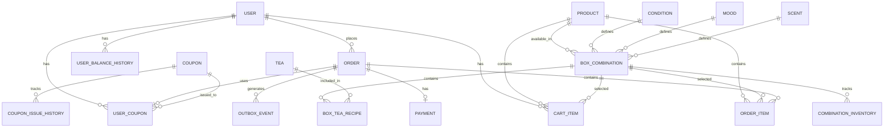
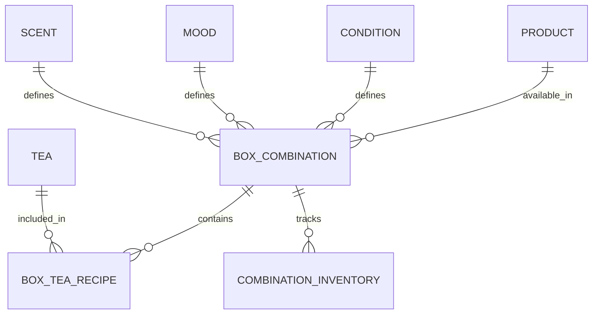
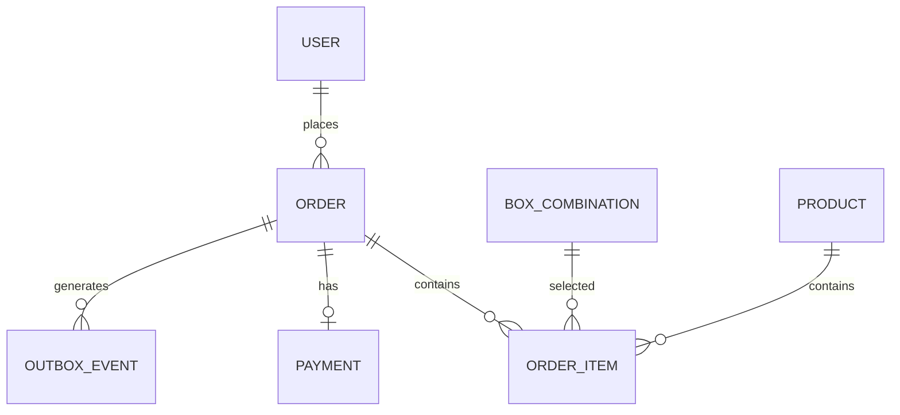
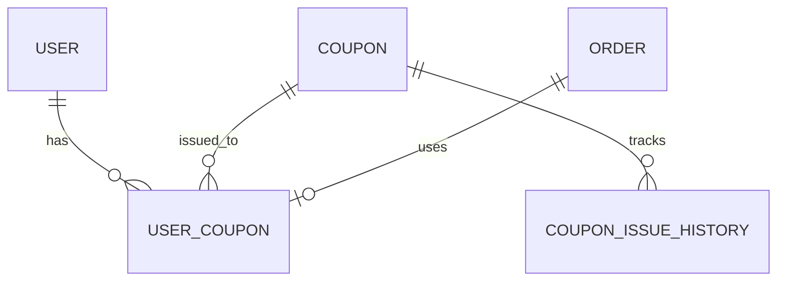

# 데이터 모델 설계 (PostgreSQL)

## 목차
1. [ERD (Entity Relationship Diagram)](#1-erd-entity-relationship-diagram)
2. [엔티티 상세 명세](#2-엔티티-상세-명세)
3. [비즈니스 규칙 반영](#3-비즈니스-규칙-반영)
4. [인덱스 전략](#4-인덱스-전략)
5. [데이터 제약조건](#5-데이터-제약조건)

---

## 1. ERD (Entity Relationship Diagram)

### 1.1 전체 ERD

#### 간단 ERD


#### 상세 ERD

```mermaid
erDiagram
    USER ||--o{ ORDER : places
    USER ||--o{ USER_COUPON : has
    USER ||--o{ USER_BALANCE_HISTORY : has
    USER ||--o{ CART_ITEM : has
    
    PRODUCT ||--o{ CART_ITEM : contains
    PRODUCT ||--o{ ORDER_ITEM : contains
    PRODUCT ||--o{ BOX_COMBINATION : available_in
    
    CONDITION ||--o{ BOX_COMBINATION : defines
    MOOD ||--o{ BOX_COMBINATION : defines
    SCENT ||--o{ BOX_COMBINATION : defines
    
    BOX_COMBINATION ||--o{ CART_ITEM : selected
    BOX_COMBINATION ||--o{ ORDER_ITEM : selected
    BOX_COMBINATION ||--o{ COMBINATION_INVENTORY : tracks
    BOX_COMBINATION ||--o{ BOX_TEA_RECIPE : contains
    
    TEA ||--o{ BOX_TEA_RECIPE : included_in
    
    ORDER ||--o{ ORDER_ITEM : contains
    ORDER ||--o| PAYMENT : has
    ORDER ||--o| USER_COUPON : uses
    ORDER ||--o{ OUTBOX_EVENT : generates
    
    COUPON ||--o{ USER_COUPON : issued_to
    COUPON ||--o{ COUPON_ISSUE_HISTORY : tracks
    
    USER {
        bigint id PK "사용자 ID"
        string email UK "이메일 (고유)"
        string password "비밀번호"
        string name "사용자 이름"
        string phone "전화번호"
        bigint balance "잔액"
        datetime created_at "생성일시"
        datetime updated_at "수정일시"
    }
    
    PRODUCT {
        bigint id PK "상품 ID"
        string name "상품명"
        string description "상품 설명"
        int price "가격"
        string type "상품 유형"
        int daily_production_limit "일일 생산 한도"
        boolean is_active "활성화 여부"
        datetime created_at "생성일시"
        datetime updated_at "수정일시"
    }
    
    CONDITION {
        bigint id PK "컨디션 ID"
        string name UK "컨디션 코드 (고유)"
        string description "설명"
        string display_name "화면 표시명"
        int sort_order "정렬 순서"
    }
    
    MOOD {
        bigint id PK "무드 ID"
        string name UK "무드 코드 (고유)"
        string description "설명"
        string display_name "화면 표시명"
        int sort_order "정렬 순서"
    }
    
    SCENT {
        bigint id PK "향 ID"
        string name UK "향 코드 (고유)"
        string description "설명"
        string display_name "화면 표시명"
        int sort_order "정렬 순서"
    }
    
    BOX_COMBINATION {
        bigint id PK "박스 조합 ID"
        bigint product_id FK "상품 ID"
        bigint condition_id FK "컨디션 ID"
        bigint mood_id FK "무드 ID"
        bigint scent_id FK "향 ID"
        string combination_code UK "조합 코드 (고유)"
        datetime created_at "생성일시"
    }
    
    COMBINATION_INVENTORY {
        bigint id PK "조합 재고 ID"
        bigint combination_id FK "박스 조합 ID (고유)"
        int stock "재고 수량"
        int version "낙관적 락 버전"
        datetime updated_at "수정일시"
    }
    
    TEA {
        bigint id PK "차 ID"
        string name "차 이름"
        string description "설명"
        string main_ingredients "주요 원료"
        string expected_effects "기대 효과"
        datetime created_at "생성일시"
    }
    
    BOX_TEA_RECIPE {
        bigint id PK "박스 차 레시피 ID"
        bigint combination_id FK "박스 조합 ID"
        bigint tea_id FK "차 ID"
        int day_number "일차"
        string brewing_guide "우리기 가이드"
    }
    
    CART_ITEM {
        bigint id PK "장바구니 항목 ID"
        bigint user_id FK "사용자 ID"
        bigint product_id FK "상품 ID"
        bigint combination_id FK "박스 조합 ID"
        int quantity "수량"
        datetime created_at "생성일시"
    }
    
    ORDER {
        bigint id PK "주문 ID"
        string order_number UK "주문번호 (고유)"
        bigint user_id FK "사용자 ID"
        bigint coupon_id FK "쿠폰 ID (nullable)"
        int total_amount "총 금액"
        int discount_amount "할인 금액"
        int final_amount "최종 결제 금액"
        string status "주문 상태"
        string delivery_address "배송 주소"
        datetime ordered_at "주문일시"
        datetime created_at "생성일시"
        datetime updated_at "수정일시"
    }
    
    ORDER_ITEM {
        bigint id PK "주문 항목 ID"
        bigint order_id FK "주문 ID"
        bigint product_id FK "상품 ID"
        bigint combination_id FK "박스 조합 ID"
        int quantity "수량"
        int unit_price "단가"
        int total_price "총 가격"
    }
    
    PAYMENT {
        bigint id PK "결제 ID"
        bigint order_id FK "주문 ID (고유)"
        bigint user_id FK "사용자 ID"
        int amount "결제 금액"
        string payment_method "결제 수단"
        string status "결제 상태"
        datetime paid_at "결제일시"
        datetime created_at "생성일시"
    }
    
    USER_BALANCE_HISTORY {
        bigint id PK "잔액 이력 ID"
        bigint user_id FK "사용자 ID"
        string transaction_type "거래 유형"
        int amount "금액"
        int balance_after "거래 후 잔액"
        string description "설명"
        datetime created_at "생성일시"
    }
    
    COUPON {
        bigint id PK "쿠폰 ID"
        string name "쿠폰명"
        string code UK "쿠폰 코드 (고유)"
        string discount_type "할인 유형"
        int discount_value "할인 값"
        int min_order_amount "최소 주문 금액"
        int max_issue_count "최대 발행 수량"
        int issued_count "발행된 수량"
        datetime issue_start_at "발행 시작일시"
        datetime issue_end_at "발행 종료일시"
        int valid_days "유효 기간(일)"
        boolean is_active "활성화 여부"
        datetime created_at "생성일시"
    }
    
    USER_COUPON {
        bigint id PK "사용자 쿠폰 ID"
        bigint user_id FK "사용자 ID"
        bigint coupon_id FK "쿠폰 ID"
        string status "쿠폰 상태"
        datetime issued_at "발급일시"
        datetime used_at "사용일시"
        datetime expired_at "만료일시"
    }
    
    COUPON_ISSUE_HISTORY {
        bigint id PK "쿠폰 발급 이력 ID"
        bigint coupon_id FK "쿠폰 ID"
        bigint user_id FK "사용자 ID"
        string status "발급 상태"
        string failure_reason "실패 사유 (nullable)"
        datetime created_at "생성일시"
    }
    
    OUTBOX_EVENT {
        bigint id PK "아웃박스 이벤트 ID"
        string aggregate_type "집합체 타입"
        bigint aggregate_id "집합체 ID"
        string event_type "이벤트 타입"
        text payload "페이로드"
        string status "이벤트 상태"
        int retry_count "재시도 횟수"
        text last_error "마지막 오류 (nullable)"
        datetime sent_at "발송일시 (nullable)"
        datetime created_at "생성일시"
        datetime updated_at "수정일시"
    }
```


### 1.2 도메인별 ERD

#### 상품 도메인


#### 주문 도메인


#### 쿠폰 도메인


---

## 2. 엔티티 상세 명세

### 2.1 사용자 관련

#### USER (사용자)
사용자 계정 정보를 관리하는 엔티티

| 컬럼명 | 타입 | 제약조건 | 설명 | 비즈니스 규칙 |
|--------|------|----------|------|---------------|
| id | BIGSERIAL | PK | 사용자 ID | - |
| email | VARCHAR(100) | NOT NULL, UNIQUE | 이메일 (로그인 ID) | 이메일 형식 검증 |
| password | VARCHAR(255) | NOT NULL | 암호화된 비밀번호 | BCrypt 해시 |
| name | VARCHAR(50) | NOT NULL | 사용자 이름 | 2-50자 |
| phone | VARCHAR(20) | NOT NULL | 전화번호 | 010-XXXX-XXXX 형식 |
| balance | BIGINT | NOT NULL, DEFAULT 0 | 포인트 잔액 (원) | 음수 불가 (CHECK >= 0) |
| created_at | TIMESTAMP WITH TIME ZONE | NOT NULL, DEFAULT CURRENT_TIMESTAMP | 생성일시 | - |
| updated_at | TIMESTAMP WITH TIME ZONE | NOT NULL, DEFAULT CURRENT_TIMESTAMP | 수정일시 | - |

**비즈니스 규칙**:
- BR-020: 포인트는 음수가 될 수 없음
- BR-021: 포인트 사용 단위는 100원

**DDL**:
```sql
CREATE TABLE "user" (
    id BIGSERIAL PRIMARY KEY,
    email VARCHAR(100) NOT NULL UNIQUE,
    password VARCHAR(255) NOT NULL,
    name VARCHAR(50) NOT NULL,
    phone VARCHAR(20) NOT NULL,
    balance BIGINT NOT NULL DEFAULT 0 CHECK (balance >= 0),
    created_at TIMESTAMP WITH TIME ZONE NOT NULL DEFAULT CURRENT_TIMESTAMP,
    updated_at TIMESTAMP WITH TIME ZONE NOT NULL DEFAULT CURRENT_TIMESTAMP
);

CREATE INDEX idx_user_email ON "user"(email);
```

---

#### USER_BALANCE_HISTORY (포인트 이력)
포인트 충전/사용/환불 이력을 추적하는 엔티티

| 컬럼명 | 타입 | 제약조건 | 설명 | 비즈니스 규칙 |
|--------|------|----------|------|---------------|
| id | BIGSERIAL | PK | 이력 ID | - |
| user_id | BIGINT | NOT NULL, FK → USER(id) | 사용자 ID | - |
| transaction_type | VARCHAR(20) | NOT NULL | 거래 유형 | CHARGE, USE, REFUND |
| amount | BIGINT | NOT NULL | 거래 금액 (원) | 충전(+), 사용(-), 환불(+) |
| balance_after | BIGINT | NOT NULL | 거래 후 잔액 (원) | - |
| description | VARCHAR(255) | NOT NULL | 거래 설명 | 예: "주문 결제 (ORD-20251030-001)" |
| created_at | TIMESTAMP WITH TIME ZONE | NOT NULL, DEFAULT CURRENT_TIMESTAMP | 생성일시 | - |

**비즈니스 규칙**:
- 모든 포인트 변동은 이력으로 기록
- Append-Only (수정/삭제 불가)

**DDL**:
```sql
CREATE TABLE user_balance_history (
    id BIGSERIAL PRIMARY KEY,
    user_id BIGINT NOT NULL REFERENCES "user"(id),
    transaction_type VARCHAR(20) NOT NULL,
    amount BIGINT NOT NULL,
    balance_after BIGINT NOT NULL,
    description VARCHAR(255) NOT NULL,
    created_at TIMESTAMP WITH TIME ZONE NOT NULL DEFAULT CURRENT_TIMESTAMP
);

CREATE INDEX idx_user_balance_history_user_created 
ON user_balance_history(user_id, created_at DESC);
```

---

### 2.2 상품 관련

#### PRODUCT (상품)
박스 상품 정보를 관리하는 엔티티

| 컬럼명 | 타입 | 제약조건 | 설명 | 비즈니스 규칙 |
|--------|------|----------|------|---------------|
| id | BIGSERIAL | PK | 상품 ID | - |
| name | VARCHAR(100) | NOT NULL | 상품명 | 예: "기본 7일 박스" |
| description | TEXT | NOT NULL | 상품 설명 | - |
| price | INTEGER | NOT NULL | 가격 (원) | 양수만 가능 |
| type | VARCHAR(20) | NOT NULL | 상품 타입 | BASIC, PREMIUM |
| daily_production_limit | INTEGER | NOT NULL | 일일 생산 한도 | 예: 30 |
| is_active | BOOLEAN | NOT NULL, DEFAULT TRUE | 활성화 여부 | - |
| created_at | TIMESTAMP WITH TIME ZONE | NOT NULL, DEFAULT CURRENT_TIMESTAMP | 생성일시 | - |
| updated_at | TIMESTAMP WITH TIME ZONE | NOT NULL, DEFAULT CURRENT_TIMESTAMP | 수정일시 | - |

**비즈니스 규칙**:
- BR-001: 기본(29,000원), 프리미엄(49,000원) 2종류
- BR-005: 일일 생산 한도 관리

**DDL**:
```sql
CREATE TABLE product (
    id BIGSERIAL PRIMARY KEY,
    name VARCHAR(100) NOT NULL,
    description TEXT NOT NULL,
    price INTEGER NOT NULL CHECK (price > 0),
    type VARCHAR(20) NOT NULL,
    daily_production_limit INTEGER NOT NULL,
    is_active BOOLEAN NOT NULL DEFAULT TRUE,
    created_at TIMESTAMP WITH TIME ZONE NOT NULL DEFAULT CURRENT_TIMESTAMP,
    updated_at TIMESTAMP WITH TIME ZONE NOT NULL DEFAULT CURRENT_TIMESTAMP
);

CREATE INDEX idx_product_active_type ON product(is_active, type);
```

---

#### CONDITION (컨디션)
사용자의 현재 컨디션 옵션을 정의하는 엔티티

| 컬럼명 | 타입 | 제약조건 | 설명 | 비즈니스 규칙 |
|--------|------|----------|------|---------------|
| id | BIGSERIAL | PK | 컨디션 ID | - |
| name | VARCHAR(50) | NOT NULL, UNIQUE | 컨디션 코드 | FATIGUE, STRESS, DIGESTION |
| display_name | VARCHAR(50) | NOT NULL | 표시명 | 피로, 스트레스, 소화불편 |
| description | VARCHAR(255) | NOT NULL | 설명 | "몸이 무겁고 쉽게 지쳐요" |
| sort_order | INTEGER | NOT NULL | 정렬 순서 | 1, 2, 3 |

**DDL**:
```sql
CREATE TABLE condition (
    id BIGSERIAL PRIMARY KEY,
    name VARCHAR(50) NOT NULL UNIQUE,
    display_name VARCHAR(50) NOT NULL,
    description VARCHAR(255) NOT NULL,
    sort_order INTEGER NOT NULL
);

CREATE INDEX idx_condition_sort_order ON condition(sort_order);
```

---

#### MOOD (기분)
사용자가 원하는 기분 옵션을 정의하는 엔티티

| 컬럼명 | 타입 | 제약조건 | 설명 | 비즈니스 규칙 |
|--------|------|----------|------|---------------|
| id | BIGSERIAL | PK | 기분 ID | - |
| name | VARCHAR(50) | NOT NULL, UNIQUE | 기분 코드 | ENERGETIC, CALM, FOCUS |
| display_name | VARCHAR(50) | NOT NULL | 표시명 | 활력, 평온, 집중 |
| description | VARCHAR(255) | NOT NULL | 설명 | "에너지와 활기가 필요해요" |
| sort_order | INTEGER | NOT NULL | 정렬 순서 | 1, 2, 3 |

**DDL**:
```sql
CREATE TABLE mood (
    id BIGSERIAL PRIMARY KEY,
    name VARCHAR(50) NOT NULL UNIQUE,
    display_name VARCHAR(50) NOT NULL,
    description VARCHAR(255) NOT NULL,
    sort_order INTEGER NOT NULL
);

CREATE INDEX idx_mood_sort_order ON mood(sort_order);
```

---

#### SCENT (향)
사용자가 선호하는 향 옵션을 정의하는 엔티티

| 컬럼명 | 타입 | 제약조건 | 설명 | 비즈니스 규칙 |
|--------|------|----------|------|---------------|
| id | BIGSERIAL | PK | 향 ID | - |
| name | VARCHAR(50) | NOT NULL, UNIQUE | 향 코드 | FLORAL, CITRUS, HERBAL |
| display_name | VARCHAR(50) | NOT NULL | 표시명 | 플로럴, 시트러스, 허브 |
| description | VARCHAR(255) | NOT NULL | 설명 | "꽃향기가 나는 부드러운 향" |
| sort_order | INTEGER | NOT NULL | 정렬 순서 | 1, 2, 3 |

**DDL**:
```sql
CREATE TABLE scent (
    id BIGSERIAL PRIMARY KEY,
    name VARCHAR(50) NOT NULL UNIQUE,
    display_name VARCHAR(50) NOT NULL,
    description VARCHAR(255) NOT NULL,
    sort_order INTEGER NOT NULL
);

CREATE INDEX idx_scent_sort_order ON scent(sort_order);
```

---

#### BOX_COMBINATION (박스 조합)
상품의 컨디션/기분/향 조합을 정의하는 엔티티

| 컬럼명 | 타입 | 제약조건 | 설명 | 비즈니스 규칙 |
|--------|------|----------|------|---------------|
| id | BIGSERIAL | PK | 조합 ID | - |
| product_id | BIGINT | NOT NULL, FK → PRODUCT(id) | 상품 ID | - |
| condition_id | BIGINT | NOT NULL, FK → CONDITION(id) | 컨디션 ID | - |
| mood_id | BIGINT | NOT NULL, FK → MOOD(id) | 기분 ID | - |
| scent_id | BIGINT | NOT NULL, FK → SCENT(id) | 향 ID | - |
| combination_code | VARCHAR(50) | NOT NULL, UNIQUE | 조합 코드 | "BASIC_FATIGUE_ENERGETIC_CITRUS" |
| created_at | TIMESTAMP WITH TIME ZONE | NOT NULL, DEFAULT CURRENT_TIMESTAMP | 생성일시 | - |

**DDL**:
```sql
CREATE TABLE box_combination (
    id BIGSERIAL PRIMARY KEY,
    product_id BIGINT NOT NULL REFERENCES product(id),
    condition_id BIGINT NOT NULL REFERENCES condition(id),
    mood_id BIGINT NOT NULL REFERENCES mood(id),
    scent_id BIGINT NOT NULL REFERENCES scent(id),
    combination_code VARCHAR(50) NOT NULL UNIQUE,
    created_at TIMESTAMP WITH TIME ZONE NOT NULL DEFAULT CURRENT_TIMESTAMP,
    UNIQUE(product_id, condition_id, mood_id, scent_id)
);

CREATE INDEX idx_box_combination_product ON box_combination(product_id);
```

---

#### COMBINATION_INVENTORY (조합별 재고)
각 조합의 재고 수량을 관리하는 엔티티 (동시성 제어 핵심)

| 컬럼명 | 타입 | 제약조건 | 설명 | 비즈니스 규칙 |
|--------|------|----------|------|---------------|
| id | BIGSERIAL | PK | 재고 ID | - |
| combination_id | BIGINT | NOT NULL, UNIQUE, FK → BOX_COMBINATION(id) | 조합 ID | - |
| stock | INTEGER | NOT NULL, DEFAULT 0 | 재고 수량 | 음수 불가 (CHECK >= 0) |
| version | INTEGER | NOT NULL, DEFAULT 0 | 버전 (낙관적 락) | 업데이트 시마다 증가 |
| updated_at | TIMESTAMP WITH TIME ZONE | NOT NULL, DEFAULT CURRENT_TIMESTAMP | 수정일시 | - |

**비즈니스 규칙**:
- BR-006: 재고 차감 시점은 주문 생성 시
- BR-009: 재고는 음수가 될 수 없음
- 동시성 제어: 비관적 락 (FOR UPDATE) + 버전 관리

**DDL**:
```sql
CREATE TABLE combination_inventory (
    id BIGSERIAL PRIMARY KEY,
    combination_id BIGINT NOT NULL UNIQUE REFERENCES box_combination(id),
    stock INTEGER NOT NULL DEFAULT 0 CHECK (stock >= 0),
    version INTEGER NOT NULL DEFAULT 0,
    updated_at TIMESTAMP WITH TIME ZONE NOT NULL DEFAULT CURRENT_TIMESTAMP
);

CREATE INDEX idx_combination_inventory_combination ON combination_inventory(combination_id);
```

---

#### TEA (티)
개별 티 정보를 관리하는 엔티티

| 컬럼명 | 타입 | 제약조건 | 설명 | 비즈니스 규칙 |
|--------|------|----------|------|---------------|
| id | BIGSERIAL | PK | 티 ID | - |
| name | VARCHAR(100) | NOT NULL | 티 이름 | "레몬그라스 진저 티" |
| description | TEXT | NULL | 설명 | - |
| main_ingredients | VARCHAR(255) | NOT NULL | 주요 재료 | "레몬그라스, 생강, 레몬밤" |
| expected_effects | VARCHAR(255) | NULL | 기대 효과 | "활력 증진, 기분 전환" |
| created_at | TIMESTAMP WITH TIME ZONE | NOT NULL, DEFAULT CURRENT_TIMESTAMP | 생성일시 | - |

**DDL**:
```sql
CREATE TABLE tea (
    id BIGSERIAL PRIMARY KEY,
    name VARCHAR(100) NOT NULL,
    description TEXT,
    main_ingredients VARCHAR(255) NOT NULL,
    expected_effects VARCHAR(255),
    created_at TIMESTAMP WITH TIME ZONE NOT NULL DEFAULT CURRENT_TIMESTAMP
);

CREATE INDEX idx_tea_name ON tea(name);
```

---

#### BOX_TEA_RECIPE (박스 티 레시피)
각 조합의 7일 구성을 정의하는 엔티티

| 컬럼명 | 타입 | 제약조건 | 설명 | 비즈니스 규칙 |
|--------|------|----------|------|---------------|
| id | BIGSERIAL | PK | 레시피 ID | - |
| combination_id | BIGINT | NOT NULL, FK → BOX_COMBINATION(id) | 조합 ID | - |
| tea_id | BIGINT | NOT NULL, FK → TEA(id) | 티 ID | - |
| day_number | INTEGER | NOT NULL | 요일 번호 | 1(월) ~ 7(일) |
| brewing_guide | VARCHAR(255) | NULL | 우려내는 법 | "80도 물 200ml에 3분" |

**DDL**:
```sql
CREATE TABLE box_tea_recipe (
    id BIGSERIAL PRIMARY KEY,
    combination_id BIGINT NOT NULL REFERENCES box_combination(id),
    tea_id BIGINT NOT NULL REFERENCES tea(id),
    day_number INTEGER NOT NULL CHECK (day_number BETWEEN 1 AND 7),
    brewing_guide VARCHAR(255),
    UNIQUE(combination_id, day_number)
);

CREATE INDEX idx_box_tea_recipe_combination ON box_tea_recipe(combination_id);
```

---

### 2.3 장바구니 관련

#### CART_ITEM (장바구니 항목)
사용자별 장바구니를 관리하는 엔티티

| 컬럼명 | 타입 | 제약조건 | 설명 | 비즈니스 규칙 |
|--------|------|----------|------|---------------|
| id | BIGSERIAL | PK | 장바구니 항목 ID | - |
| user_id | BIGINT | NOT NULL, FK → USER(id) | 사용자 ID | - |
| product_id | BIGINT | NOT NULL, FK → PRODUCT(id) | 상품 ID | - |
| combination_id | BIGINT | NOT NULL, FK → BOX_COMBINATION(id) | 조합 ID | - |
| quantity | INTEGER | NOT NULL, DEFAULT 1 | 수량 | 현재는 항상 1 |
| created_at | TIMESTAMP WITH TIME ZONE | NOT NULL, DEFAULT CURRENT_TIMESTAMP | 생성일시 | - |

**DDL**:
```sql
CREATE TABLE cart_item (
    id BIGSERIAL PRIMARY KEY,
    user_id BIGINT NOT NULL REFERENCES "user"(id),
    product_id BIGINT NOT NULL REFERENCES product(id),
    combination_id BIGINT NOT NULL REFERENCES box_combination(id),
    quantity INTEGER NOT NULL DEFAULT 1,
    created_at TIMESTAMP WITH TIME ZONE NOT NULL DEFAULT CURRENT_TIMESTAMP,
    UNIQUE(user_id, combination_id)
);

CREATE INDEX idx_cart_item_user ON cart_item(user_id);
```

---

### 2.4 주문 관련

#### ORDER (주문)
주문 정보를 관리하는 엔티티

| 컬럼명 | 타입 | 제약조건 | 설명 | 비즈니스 규칙 |
|--------|------|----------|------|---------------|
| id | BIGSERIAL | PK | 주문 ID | - |
| order_number | VARCHAR(50) | NOT NULL, UNIQUE | 주문 번호 | "ORD-YYYYMMDD-XXX" |
| user_id | BIGINT | NOT NULL, FK → USER(id) | 사용자 ID | - |
| coupon_id | BIGINT | NULL, FK → USER_COUPON(id) | 사용한 쿠폰 ID | Nullable |
| total_amount | INTEGER | NOT NULL | 총 상품 금액 (원) | - |
| discount_amount | INTEGER | NOT NULL, DEFAULT 0 | 할인 금액 (원) | 쿠폰 할인 |
| final_amount | INTEGER | NOT NULL | 최종 결제 금액 (원) | total - discount |
| status | VARCHAR(20) | NOT NULL | 주문 상태 | PENDING, PAID, PREPARING, SHIPPED, DELIVERED, CANCELLED |
| delivery_address | JSONB | NOT NULL | 배송지 정보 (JSON) | 수령인, 전화번호, 주소 |
| ordered_at | TIMESTAMP WITH TIME ZONE | NOT NULL, DEFAULT CURRENT_TIMESTAMP | 주문일시 | - |
| created_at | TIMESTAMP WITH TIME ZONE | NOT NULL, DEFAULT CURRENT_TIMESTAMP | 생성일시 | - |
| updated_at | TIMESTAMP WITH TIME ZONE | NOT NULL, DEFAULT CURRENT_TIMESTAMP | 수정일시 | - |

**DDL**:
```sql
CREATE TABLE "order" (
    id BIGSERIAL PRIMARY KEY,
    order_number VARCHAR(50) NOT NULL UNIQUE,
    user_id BIGINT NOT NULL REFERENCES "user"(id),
    coupon_id BIGINT REFERENCES user_coupon(id),
    total_amount INTEGER NOT NULL,
    discount_amount INTEGER NOT NULL DEFAULT 0,
    final_amount INTEGER NOT NULL,
    status VARCHAR(20) NOT NULL,
    delivery_address JSONB NOT NULL,
    ordered_at TIMESTAMP WITH TIME ZONE NOT NULL DEFAULT CURRENT_TIMESTAMP,
    created_at TIMESTAMP WITH TIME ZONE NOT NULL DEFAULT CURRENT_TIMESTAMP,
    updated_at TIMESTAMP WITH TIME ZONE NOT NULL DEFAULT CURRENT_TIMESTAMP,
    CHECK (final_amount = total_amount - discount_amount)
);

CREATE INDEX idx_order_user_created ON "order"(user_id, created_at DESC);
CREATE INDEX idx_order_status ON "order"(status);
CREATE INDEX idx_order_ordered_at ON "order"(ordered_at);
```

---

#### ORDER_ITEM (주문 항목)
주문의 상세 항목을 관리하는 엔티티

| 컬럼명 | 타입 | 제약조건 | 설명 | 비즈니스 규칙 |
|--------|------|----------|------|---------------|
| id | BIGSERIAL | PK | 주문 항목 ID | - |
| order_id | BIGINT | NOT NULL, FK → ORDER(id) | 주문 ID | - |
| product_id | BIGINT | NOT NULL, FK → PRODUCT(id) | 상품 ID | - |
| combination_id | BIGINT | NOT NULL, FK → BOX_COMBINATION(id) | 조합 ID | - |
| quantity | INTEGER | NOT NULL | 수량 | 현재는 항상 1 |
| unit_price | INTEGER | NOT NULL | 단가 (원) | 주문 시점 가격 스냅샷 |
| total_price | INTEGER | NOT NULL | 총액 (원) | unit_price × quantity |

**DDL**:
```sql
CREATE TABLE order_item (
    id BIGSERIAL PRIMARY KEY,
    order_id BIGINT NOT NULL REFERENCES "order"(id),
    product_id BIGINT NOT NULL REFERENCES product(id),
    combination_id BIGINT NOT NULL REFERENCES box_combination(id),
    quantity INTEGER NOT NULL CHECK (quantity > 0),
    unit_price INTEGER NOT NULL,
    total_price INTEGER NOT NULL
);

CREATE INDEX idx_order_item_order ON order_item(order_id);
CREATE INDEX idx_order_item_combination ON order_item(combination_id);
```

---

#### PAYMENT (결제)
결제 정보를 관리하는 엔티티

| 컬럼명 | 타입 | 제약조건 | 설명 | 비즈니스 규칙 |
|--------|------|----------|------|---------------|
| id | BIGSERIAL | PK | 결제 ID | - |
| order_id | BIGINT | NOT NULL, UNIQUE, FK → ORDER(id) | 주문 ID | 1:1 관계 |
| user_id | BIGINT | NOT NULL, FK → USER(id) | 사용자 ID | - |
| amount | INTEGER | NOT NULL | 결제 금액 (원) | - |
| payment_method | VARCHAR(20) | NOT NULL | 결제 수단 | BALANCE (포인트) |
| status | VARCHAR(20) | NOT NULL | 결제 상태 | PENDING, SUCCESS, FAILED |
| paid_at | TIMESTAMP WITH TIME ZONE | NULL | 결제 완료 일시 | - |
| created_at | TIMESTAMP WITH TIME ZONE | NOT NULL, DEFAULT CURRENT_TIMESTAMP | 생성일시 | - |

**DDL**:
```sql
CREATE TABLE payment (
    id BIGSERIAL PRIMARY KEY,
    order_id BIGINT NOT NULL UNIQUE REFERENCES "order"(id),
    user_id BIGINT NOT NULL REFERENCES "user"(id),
    amount INTEGER NOT NULL,
    payment_method VARCHAR(20) NOT NULL,
    status VARCHAR(20) NOT NULL,
    paid_at TIMESTAMP WITH TIME ZONE,
    created_at TIMESTAMP WITH TIME ZONE NOT NULL DEFAULT CURRENT_TIMESTAMP
);

CREATE INDEX idx_payment_user ON payment(user_id);
```

---

### 2.5 쿠폰 관련

#### COUPON (쿠폰)
쿠폰 마스터 정보를 관리하는 엔티티

| 컬럼명 | 타입 | 제약조건 | 설명 | 비즈니스 규칙 |
|--------|------|----------|------|---------------|
| id | BIGSERIAL | PK | 쿠폰 ID | - |
| name | VARCHAR(100) | NOT NULL | 쿠폰명 | "첫구매 50% 할인" |
| code | VARCHAR(50) | NOT NULL, UNIQUE | 쿠폰 코드 | "FIRST50" |
| discount_type | VARCHAR(20) | NOT NULL | 할인 타입 | PERCENTAGE, FIXED |
| discount_value | INTEGER | NOT NULL | 할인값 | PERCENTAGE: 50 (50%), FIXED: 10000 (10,000원) |
| min_order_amount | INTEGER | NOT NULL, DEFAULT 0 | 최소 주문 금액 (원) | 예: 20000 |
| max_issue_count | INTEGER | NOT NULL | 최대 발급 수량 | 예: 100 |
| issued_count | INTEGER | NOT NULL, DEFAULT 0 | 현재 발급 수량 | Redis와 동기화 |
| issue_start_at | TIMESTAMP WITH TIME ZONE | NOT NULL | 발급 시작 일시 | - |
| issue_end_at | TIMESTAMP WITH TIME ZONE | NOT NULL | 발급 종료 일시 | - |
| valid_days | INTEGER | NOT NULL | 유효 기간 (일) | 발급일로부터 N일 |
| is_active | BOOLEAN | NOT NULL, DEFAULT TRUE | 활성화 여부 | - |
| created_at | TIMESTAMP WITH TIME ZONE | NOT NULL, DEFAULT CURRENT_TIMESTAMP | 생성일시 | - |

**DDL**:
```sql
CREATE TABLE coupon (
    id BIGSERIAL PRIMARY KEY,
    name VARCHAR(100) NOT NULL,
    code VARCHAR(50) NOT NULL UNIQUE,
    discount_type VARCHAR(20) NOT NULL,
    discount_value INTEGER NOT NULL,
    min_order_amount INTEGER NOT NULL DEFAULT 0,
    max_issue_count INTEGER NOT NULL,
    issued_count INTEGER NOT NULL DEFAULT 0,
    issue_start_at TIMESTAMP WITH TIME ZONE NOT NULL,
    issue_end_at TIMESTAMP WITH TIME ZONE NOT NULL,
    valid_days INTEGER NOT NULL,
    is_active BOOLEAN NOT NULL DEFAULT TRUE,
    created_at TIMESTAMP WITH TIME ZONE NOT NULL DEFAULT CURRENT_TIMESTAMP,
    CHECK (issued_count <= max_issue_count)
);

CREATE INDEX idx_coupon_active_issue_period 
ON coupon(is_active, issue_start_at, issue_end_at);
```

---

#### USER_COUPON (사용자 쿠폰)
사용자별 발급된 쿠폰을 관리하는 엔티티

| 컬럼명 | 타입 | 제약조건 | 설명 | 비즈니스 규칙 |
|--------|------|----------|------|---------------|
| id | BIGSERIAL | PK | 사용자 쿠폰 ID | - |
| user_id | BIGINT | NOT NULL, FK → USER(id) | 사용자 ID | - |
| coupon_id | BIGINT | NOT NULL, FK → COUPON(id) | 쿠폰 ID | - |
| status | VARCHAR(20) | NOT NULL | 상태 | AVAILABLE, USED, EXPIRED |
| issued_at | TIMESTAMP WITH TIME ZONE | NOT NULL, DEFAULT CURRENT_TIMESTAMP | 발급일시 | - |
| used_at | TIMESTAMP WITH TIME ZONE | NULL | 사용일시 | - |
| expired_at | TIMESTAMP WITH TIME ZONE | NOT NULL | 만료일시 | issued_at + valid_days |

**DDL**:
```sql
CREATE TABLE user_coupon (
    id BIGSERIAL PRIMARY KEY,
    user_id BIGINT NOT NULL REFERENCES "user"(id),
    coupon_id BIGINT NOT NULL REFERENCES coupon(id),
    status VARCHAR(20) NOT NULL,
    issued_at TIMESTAMP WITH TIME ZONE NOT NULL DEFAULT CURRENT_TIMESTAMP,
    used_at TIMESTAMP WITH TIME ZONE,
    expired_at TIMESTAMP WITH TIME ZONE NOT NULL,
    UNIQUE(user_id, coupon_id)
);

CREATE INDEX idx_user_coupon_user_status ON user_coupon(user_id, status);
CREATE INDEX idx_user_coupon_expired_at ON user_coupon(expired_at) 
WHERE status = 'AVAILABLE';
```

---

#### COUPON_ISSUE_HISTORY (쿠폰 발급 이력)
쿠폰 발급 시도 이력을 추적하는 엔티티 (감사용)

| 컬럼명 | 타입 | 제약조건 | 설명 | 비즈니스 규칙 |
|--------|------|----------|------|---------------|
| id | BIGSERIAL | PK | 이력 ID | - |
| coupon_id | BIGINT | NOT NULL, FK → COUPON(id) | 쿠폰 ID | - |
| user_id | BIGINT | NOT NULL, FK → USER(id) | 사용자 ID | - |
| status | VARCHAR(20) | NOT NULL | 발급 상태 | SUCCESS, SOLD_OUT, ALREADY_ISSUED, FAILED |
| failure_reason | TEXT | NULL | 실패 사유 | - |
| created_at | TIMESTAMP WITH TIME ZONE | NOT NULL, DEFAULT CURRENT_TIMESTAMP | 생성일시 | - |

**DDL**:
```sql
CREATE TABLE coupon_issue_history (
    id BIGSERIAL PRIMARY KEY,
    coupon_id BIGINT NOT NULL REFERENCES coupon(id),
    user_id BIGINT NOT NULL REFERENCES "user"(id),
    status VARCHAR(20) NOT NULL,
    failure_reason TEXT,
    created_at TIMESTAMP WITH TIME ZONE NOT NULL DEFAULT CURRENT_TIMESTAMP
);

CREATE INDEX idx_coupon_issue_history_coupon_created 
ON coupon_issue_history(coupon_id, created_at DESC);
CREATE INDEX idx_coupon_issue_history_user ON coupon_issue_history(user_id);
```

---

### 2.6 외부 연동 관련

#### OUTBOX_EVENT (Outbox 이벤트)
외부 시스템 연동을 위한 이벤트를 관리하는 엔티티 (Outbox Pattern)

| 컬럼명 | 타입 | 제약조건 | 설명 | 비즈니스 규칙 |
|--------|------|----------|------|---------------|
| id | BIGSERIAL | PK | 이벤트 ID | - |
| aggregate_type | VARCHAR(50) | NOT NULL | 집합 타입 | "ORDER" |
| aggregate_id | BIGINT | NOT NULL | 집합 ID | 주문 ID |
| event_type | VARCHAR(50) | NOT NULL | 이벤트 타입 | "ORDER_CREATED" |
| payload | JSONB | NOT NULL | 이벤트 데이터 (JSON) | 주문 정보 전체 |
| status | VARCHAR(20) | NOT NULL | 상태 | PENDING, PROCESSING, SENT, FAILED |
| retry_count | INTEGER | NOT NULL, DEFAULT 0 | 재시도 횟수 | 최대 3회 |
| last_error | TEXT | NULL | 마지막 에러 메시지 | - |
| sent_at | TIMESTAMP WITH TIME ZONE | NULL | 전송 완료 일시 | - |
| created_at | TIMESTAMP WITH TIME ZONE | NOT NULL, DEFAULT CURRENT_TIMESTAMP | 생성일시 | - |
| updated_at | TIMESTAMP WITH TIME ZONE | NOT NULL, DEFAULT CURRENT_TIMESTAMP | 수정일시 | - |

**DDL**:
```sql
CREATE TABLE outbox_event (
    id BIGSERIAL PRIMARY KEY,
    aggregate_type VARCHAR(50) NOT NULL,
    aggregate_id BIGINT NOT NULL,
    event_type VARCHAR(50) NOT NULL,
    payload JSONB NOT NULL,
    status VARCHAR(20) NOT NULL,
    retry_count INTEGER NOT NULL DEFAULT 0,
    last_error TEXT,
    sent_at TIMESTAMP WITH TIME ZONE,
    created_at TIMESTAMP WITH TIME ZONE NOT NULL DEFAULT CURRENT_TIMESTAMP,
    updated_at TIMESTAMP WITH TIME ZONE NOT NULL DEFAULT CURRENT_TIMESTAMP
);

CREATE INDEX idx_outbox_event_status_created 
ON outbox_event(status, created_at) 
WHERE status IN ('PENDING', 'PROCESSING');

CREATE INDEX idx_outbox_event_aggregate 
ON outbox_event(aggregate_type, aggregate_id);
```

---

## 3. 비즈니스 규칙 반영

### 3.1 재고 관리 규칙

#### 재고 차감 시점 (BR-006)
```sql
-- 주문 생성 시 재고 차감 (트랜잭션 내)
BEGIN;

-- 1. 재고 확인 및 락 획득 (비관적 락)
SELECT stock 
FROM combination_inventory 
WHERE combination_id = $1
FOR UPDATE;

-- 2. 재고 차감
UPDATE combination_inventory
SET stock = stock - $2,
    version = version + 1,
    updated_at = CURRENT_TIMESTAMP
WHERE combination_id = $1
  AND stock >= $2;  -- 재고 부족 시 업데이트 실패

-- 3. 주문 생성
INSERT INTO "order" (...) VALUES (...);

COMMIT;
```

#### 재고 음수 방지 (BR-009)
```sql
-- 이미 테이블 생성 시 CHECK 제약조건 포함됨
ALTER TABLE combination_inventory
ADD CONSTRAINT chk_stock_non_negative
CHECK (stock >= 0);
```

#### 일일 생산 한도 (BR-005)
```redis
# Redis 카운터로 일일 생산 한도 체크
INCR daily:production:2025-10-30
# 결과가 30 초과 시 주문 불가
# 자정 자동 초기화 (TTL)
EXPIRE daily:production:2025-10-30 86400
```

---

### 3.2 쿠폰 관리 규칙

#### 1인 1매 제한 (BR-015)
```sql
-- 이미 테이블 생성 시 UNIQUE 제약조건 포함됨
ALTER TABLE user_coupon
ADD CONSTRAINT uk_user_coupon_unique
UNIQUE (user_id, coupon_id);
```

#### 선착순 발급 (FR-020, FR-021)
```lua
-- Redis Lua Script (원자적 연산)
local key = KEYS[1]  -- coupon:{couponId}:count
local maxIssue = tonumber(ARGV[1])
local current = tonumber(redis.call('GET', key) or 0)

if current < maxIssue then
    redis.call('INCR', key)
    return 1
else
    return 0
end
```

#### 쿠폰 복원 (BR-018)
```sql
-- 주문 취소 시 쿠폰 복원 (만료 전에만)
UPDATE user_coupon
SET status = 'AVAILABLE',
    used_at = NULL
WHERE id = $1
  AND status = 'USED'
  AND expired_at > CURRENT_TIMESTAMP;
```

---

### 3.3 주문 관리 규칙

#### 주문 번호 생성 (BR-012)
```kotlin
fun generateOrderNumber(): String {
    val date = LocalDate.now().format(DateTimeFormatter.ofPattern("yyyyMMdd"))
    val sequence = getNextSequence(date) // Redis INCR
    return "ORD-$date-${sequence.toString().padStart(3, '0')}"
}
// 예: ORD-20251030-001
```

#### 결제 금액 계산 (BR-023)
```sql
-- CHECK 제약조건으로 보장됨
-- 주문 생성 시 계산
INSERT INTO "order" (
    total_amount,
    discount_amount,
    final_amount,
    ...
) VALUES (
    $1,  -- 총 상품 금액
    $2,  -- 쿠폰 할인
    $1 - $2,  -- 최종 금액 = 총액 - 할인
    ...
);
```

#### 주문 상태 전이 (BR-014)
```kotlin
// 취소 가능 여부 확인
fun canCancel(order: Order): Boolean {
    return order.status in listOf(
        OrderStatus.PENDING,
        OrderStatus.PAID
    )
}
```

---

### 3.4 포인트 관리 규칙

#### 포인트 음수 방지 (BR-020)
```sql
-- 이미 테이블 생성 시 CHECK 제약조건 포함됨
ALTER TABLE "user"
ADD CONSTRAINT chk_balance_non_negative
CHECK (balance >= 0);
```

#### 포인트 이력 기록
```sql
-- 모든 포인트 변동 시 이력 생성
INSERT INTO user_balance_history (
    user_id,
    transaction_type,
    amount,
    balance_after,
    description
) VALUES (
    $1,
    'USE',  -- or 'CHARGE', 'REFUND'
    -29000,
    21000,  -- 거래 후 잔액
    '주문 결제 (ORD-20251030-001)'
);
```

---

### 3.5 Trigger를 활용한 updated_at 자동 업데이트

PostgreSQL에서는 updated_at 자동 업데이트를 위해 Trigger 함수를 생성해야 합니다.
```sql
-- Trigger 함수 생성
CREATE OR REPLACE FUNCTION update_updated_at_column()
RETURNS TRIGGER AS $$
BEGIN
    NEW.updated_at = CURRENT_TIMESTAMP;
    RETURN NEW;
END;
$$ language 'plpgsql';

-- 각 테이블에 Trigger 적용
CREATE TRIGGER update_user_updated_at BEFORE UPDATE ON "user"
FOR EACH ROW EXECUTE FUNCTION update_updated_at_column();

CREATE TRIGGER update_product_updated_at BEFORE UPDATE ON product
FOR EACH ROW EXECUTE FUNCTION update_updated_at_column();

CREATE TRIGGER update_combination_inventory_updated_at BEFORE UPDATE ON combination_inventory
FOR EACH ROW EXECUTE FUNCTION update_updated_at_column();

CREATE TRIGGER update_order_updated_at BEFORE UPDATE ON "order"
FOR EACH ROW EXECUTE FUNCTION update_updated_at_column();

CREATE TRIGGER update_outbox_event_updated_at BEFORE UPDATE ON outbox_event
FOR EACH ROW EXECUTE FUNCTION update_updated_at_column();
```

---

## 4. 인덱스 전략

### 4.1 복합 인덱스 활용 예시

#### 인기 조합 통계 쿼리
```sql
-- 최근 3일 인기 조합 TOP 5
SELECT 
    oi.combination_id,
    COUNT(*) as order_count
FROM order_item oi
JOIN "order" o ON oi.order_id = o.id
WHERE o.created_at >= CURRENT_TIMESTAMP - INTERVAL '3 days'
  AND o.status NOT IN ('CANCELLED')
GROUP BY oi.combination_id
ORDER BY order_count DESC
LIMIT 5;

-- 활용 인덱스:
-- 1. idx_order_ordered_at: 날짜 필터링
-- 2. idx_order_item_combination: 그룹핑
```

#### 사용자별 주문 조회
```sql
-- 특정 사용자의 최근 주문 10건
SELECT *
FROM "order"
WHERE user_id = $1
ORDER BY created_at DESC
LIMIT 10;

-- 활용 인덱스:
-- idx_order_user_created (user_id, created_at DESC)
```

---

## 5. 데이터 제약조건

모든 제약조건은 이미 각 테이블의 DDL에 포함되어 있습니다.

---

## 6. 데이터 마이그레이션 전략

### 6.1 초기 데이터 삽입 (Seed Data)

#### 컨디션 데이터
```sql
INSERT INTO condition (name, display_name, description, sort_order) VALUES
('FATIGUE', '피로', '몸이 무겁고 쉽게 지쳐요', 1),
('STRESS', '스트레스', '마음이 답답하고 긴장돼요', 2),
('DIGESTION', '소화불편', '속이 더부룩하고 소화가 안돼요', 3);
```

#### 기분 데이터
```sql
INSERT INTO mood (name, display_name, description, sort_order) VALUES
('ENERGETIC', '활력', '에너지와 활기가 필요해요', 1),
('CALM', '평온', '편안하고 차분한 기분이 좋아요', 2),
('FOCUS', '집중', '집중력과 명료함이 필요해요', 3);
```

#### 향 데이터
```sql
INSERT INTO scent (name, display_name, description, sort_order) VALUES
('FLORAL', '플로럴', '꽃향기가 나는 부드러운 향', 1),
('CITRUS', '시트러스', '상큼하고 청량한 과일 향', 2),
('HERBAL', '허브', '허브의 깊고 진한 향', 3);
```

#### 상품 데이터
```sql
INSERT INTO product (name, description, price, type, daily_production_limit, is_active) VALUES
('기본 7일 박스', '나를 위한 티 큐레이션 7일', 29000, 'BASIC', 30, TRUE),
('프리미엄 7일 박스', '프리미엄 블렌딩 티로 구성된 7일 큐레이션', 49000, 'PREMIUM', 20, TRUE);
```

---

### 6.2 조합 및 재고 초기화
```sql
-- 27가지 조합 생성 (3x3x3)
INSERT INTO box_combination (product_id, condition_id, mood_id, scent_id, combination_code)
SELECT 
    p.id,
    c.id,
    m.id,
    s.id,
    CONCAT(p.type, '_', c.name, '_', m.name, '_', s.name)
FROM product p
CROSS JOIN condition c
CROSS JOIN mood m
CROSS JOIN scent s;

-- 각 조합에 대한 초기 재고 설정
INSERT INTO combination_inventory (combination_id, stock, version)
SELECT 
    id,
    20,  -- 초기 재고 20개
    0    -- 버전 0
FROM box_combination;
```

---

## 7. 성능 최적화 고려사항

### 7.1 읽기 최적화

#### 상품 정보 캐싱 (Redis)
```
Key: "products:all"
TTL: 3600 (1시간)
Value: JSON 직렬화된 상품 목록
```

#### 인기 통계 캐싱
```
Key: "popular:combinations:3days"
TTL: 3600 (1시간)
Value: JSON 직렬화된 TOP 5 조합
```

#### 선택 옵션 캐싱
```
Key: "options:all"
TTL: 86400 (24시간)
Value: JSON 직렬화된 옵션 목록
```

---

### 7.2 쓰기 최적화

#### 배치 INSERT 활용
```sql
-- 주문 항목 여러 개 한 번에 삽입
INSERT INTO order_item (order_id, product_id, combination_id, quantity, unit_price, total_price)
VALUES 
    ($1, $2, $3, $4, $5, $6),
    ($7, $8, $9, $10, $11, $12),
    ($13, $14, $15, $16, $17, $18);
```

---

### 7.3 파티셔닝 전략 (추후 고도화)
```sql
-- 주문 테이블 월별 파티셔닝 (PostgreSQL 10+)
CREATE TABLE "order" (
    id BIGSERIAL,
    order_number VARCHAR(50) NOT NULL,
    user_id BIGINT NOT NULL,
    -- ... 기타 컬럼들
    created_at TIMESTAMP WITH TIME ZONE NOT NULL DEFAULT CURRENT_TIMESTAMP
) PARTITION BY RANGE (created_at);

-- 월별 파티션 생성
CREATE TABLE order_2025_10 PARTITION OF "order"
FOR VALUES FROM ('2025-10-01') TO ('2025-11-01');

CREATE TABLE order_2025_11 PARTITION OF "order"
FOR VALUES FROM ('2025-11-01') TO ('2025-12-01');

CREATE TABLE order_2025_12 PARTITION OF "order"
FOR VALUES FROM ('2025-12-01') TO ('2026-01-01');
```

---

## 8. PostgreSQL 특화 기능 활용

### 8.1 JSONB 타입 활용
```sql
-- delivery_address JSONB 예제 데이터
INSERT INTO "order" (delivery_address, ...) VALUES (
    '{"recipient": "김민지", "phone": "010-1234-5678", "zipCode": "06234", "address": "서울시 강남구", "addressDetail": "456호"}'::jsonb,
    ...
);

-- JSONB 필드 조회
SELECT 
    order_number,
    delivery_address->>'recipient' as recipient,
    delivery_address->>'phone' as phone
FROM "order"
WHERE delivery_address->>'zipCode' = '06234';

-- JSONB 인덱스 (필요시)
CREATE INDEX idx_order_delivery_address_recipient 
ON "order" ((delivery_address->>'recipient'));
```

---

### 8.2 부분 인덱스 (Partial Index)
```sql
-- 사용 가능한 쿠폰만 인덱싱
CREATE INDEX idx_user_coupon_expired_at 
ON user_coupon(expired_at) 
WHERE status = 'AVAILABLE';

-- PENDING, PROCESSING 상태의 Outbox만 인덱싱
CREATE INDEX idx_outbox_event_status_created 
ON outbox_event(status, created_at) 
WHERE status IN ('PENDING', 'PROCESSING');
```

---

### 8.3 EXPLAIN ANALYZE 활용
```sql
-- 쿼리 실행 계획 확인
EXPLAIN ANALYZE
SELECT 
    oi.combination_id,
    COUNT(*) as order_count
FROM order_item oi
JOIN "order" o ON oi.order_id = o.id
WHERE o.created_at >= CURRENT_TIMESTAMP - INTERVAL '3 days'
  AND o.status NOT IN ('CANCELLED')
GROUP BY oi.combination_id
ORDER BY order_count DESC
LIMIT 5;
```

---

## 변경 이력
| 버전 | 날짜 | 변경 내용 | 작성자 |
|-----|------|----------|-----|
| 1.0 | 2025-10-31 | 초안 작성 | jay |