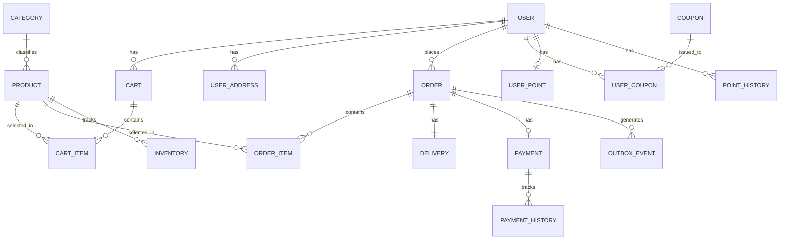
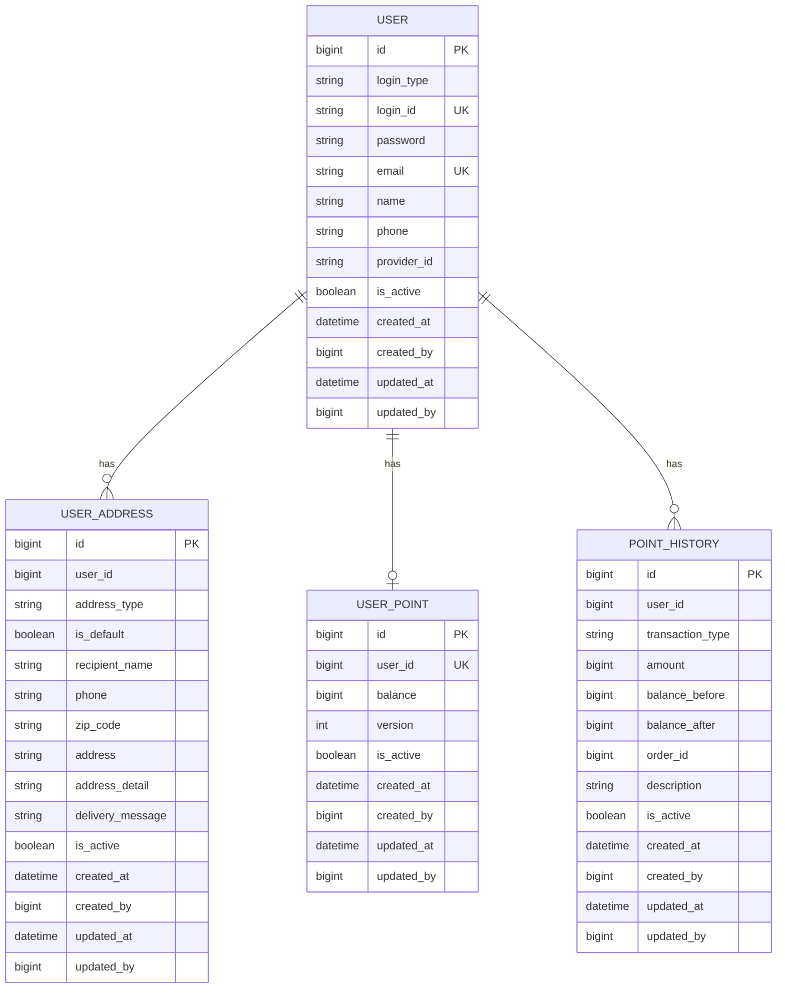
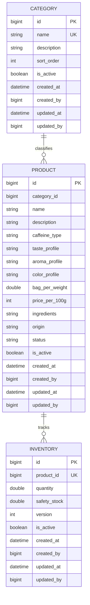
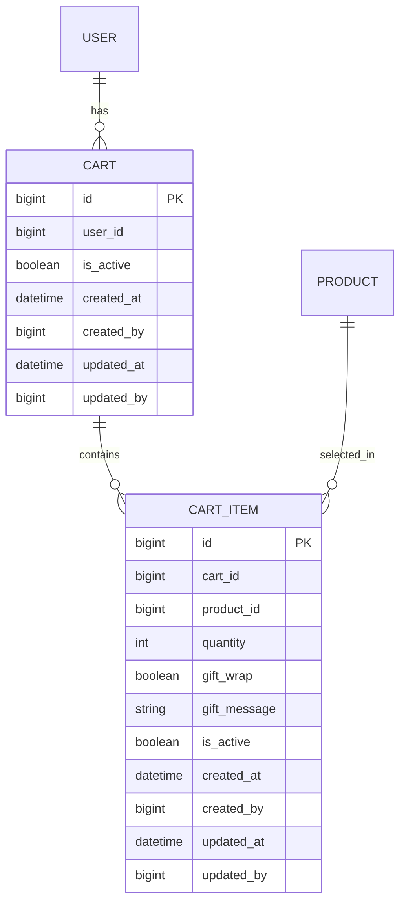
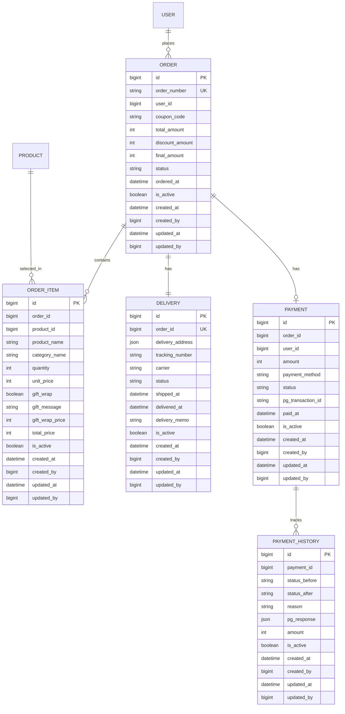
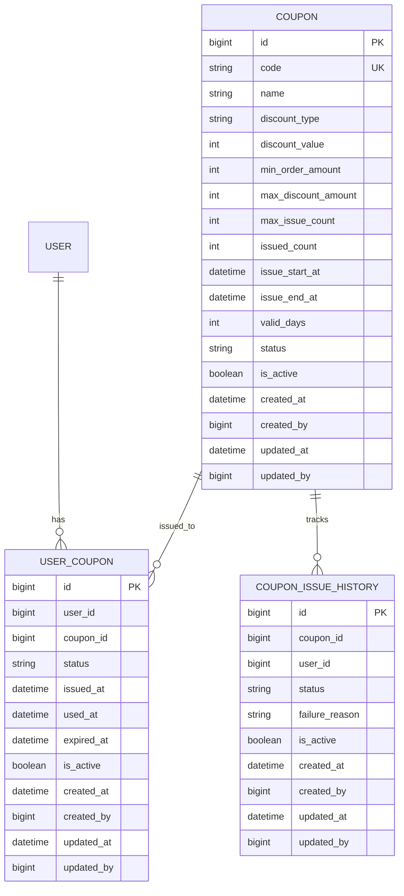
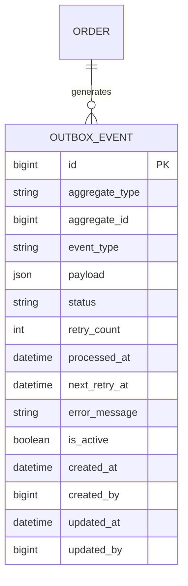

# 데이터 모델 설계 (mySQL)

- FK 제약조건 없음: 모든 외래키는 애플리케이션 레벨에서 관리

## 목차
1. [ERD (Entity Relationship Diagram)](#1-erd-entity-relationship-diagram)
   - 1.1 [전체 ERD](#11-전체-erd)
   - 1.2 [도메인별 ERD](#12-도메인별-erd)
2. [엔티티 상세 명세](#2-엔티티-상세-명세)
   - 2.1 [사용자 관련](#21-사용자-관련)
   - 2.2 [상품 관련](#22-상품-관련)
   - 2.3 [장바구니 관련](#23-장바구니-관련)
   - 2.4 [주문 관련](#24-주문-관련)
   - 2.5 [쿠폰 관련](#25-쿠폰-관련)
   - 2.6 [이벤트 관련](#26-이벤트-관련)
3. [비즈니스 규칙 반영](#3-비즈니스-규칙-반영)
   - 3.1 [재고 관리 규칙](#31-재고-관리-규칙)
   - 3.2 [쿠폰 관리 규칙](#32-쿠폰-관리-규칙)
   - 3.3 [주문 관리 규칙](#33-주문-관리-규칙)
   - 3.4 [포인트 관리 규칙](#34-포인트-관리-규칙)
   - 3.5 [결제 관리 규칙](#35-결제-관리-규칙)
   - 3.6 [배송 관리 규칙](#36-배송-관리-규칙)
4. [인덱스 전략](#4-인덱스-전략)
   - 4.1 [인덱스 설계 원칙](#41-인덱스-설계-원칙)
   - 4.2 [주요 인덱스 목록](#42-주요-인덱스-목록)
   - 4.3 [복합 인덱스 활용 쿼리 예시](#43-복합-인덱스-활용-쿼리-예시)
   - 4.4 [인덱스 모니터링](#44-인덱스-모니터링)
5. [성능 최적화 고려사항](#5-성능-최적화-고려사항)
   - 5.1 [읽기 최적화](#51-읽기-최적화)
   - 5.2 [쓰기 최적화](#52-쓰기-최적화)
   - 5.3 [Connection Pool 최적화](#53-connection-pool-최적화)
   - 5.4 [파티셔닝 (추후 고도화)](#54-파티셔닝-추후-고도화)
6. [MySQL 특화 기능 활용](#6-mysql-특화-기능-활용)
   - 6.1 [JSON 타입 활용](#61-json-타입-활용)
   - 6.2 [Generated Column (가상 컬럼)](#62-generated-column-가상-컬럼)
   - 6.3 [Full-Text Search (전문 검색)](#63-full-text-search-전문-검색)
   - 6.4 [EXPLAIN을 활용한 쿼리 분석](#64-explain을-활용한-쿼리-분석)
   - 6.5 [Stored Procedure (선택 사항)](#65-stored-procedure-선택-사항)
7. [버전 관리 (Liquibase)](#7-버전-관리-liquibase)
   - 7.1 [Liquibase 개요](#71-liquibase-개요)
   - 7.2 [Liquibase 설정](#72-liquibase-설정)
   - 7.3 [디렉토리 구조](#73-디렉토리-구조)
   - 7.4 [마스터 ChangeLog 작성](#74-마스터-changelog-작성)
   - 7.5 [Liquibase 명령어](#75-liquibase-명령어)
   - 7.6 [마이그레이션 이력 테이블](#76-마이그레이션-이력-테이블)
   - 7.7 [태그를 활용한 버전 관리](#77-태그를-활용한-버전-관리)
   - 7.8 [환경별 실행 (Contexts)](#78-환경별-실행-contexts)
   - 7.9 [조건부 실행 (Preconditions)](#79-조건부-실행-preconditions)
   - 7.10 [SQL 포맷 ChangeSet](#710-sql-포맷-changeset)
   - 7.11 [Best Practices](#711-best-practices)
8. [모니터링 및 유지보수](#8-모니터링-및-유지보수)
   - 8.1 [슬로우 쿼리 로그 설정](#81-슬로우-쿼리-로그-설정)
   - 8.2 [Performance Schema 활용](#82-performance-schema-활용)
   - 8.3 [정기 점검 항목](#83-정기-점검-항목)

---

## 1. ERD (Entity Relationship Diagram)

### 1.1 전체 ERD

#### 간단 ERD


#### 상세 ERD

```mermaid
erDiagram
    USER ||--o{ CART : "has"
    USER ||--o{ USER_ADDRESS : "has"
    USER ||--o{ ORDER : "places"
    USER ||--o{ USER_COUPON : "has"
    USER ||--o| USER_POINT : "has"
    USER ||--o{ POINT_HISTORY : "has"

    CATEGORY ||--o{ PRODUCT : "classifies"

    PRODUCT ||--o{ CART_ITEM : "selected_in"
    PRODUCT ||--o{ ORDER_ITEM : "selected_in"
    PRODUCT ||--o{ INVENTORY : "tracks"

    CART ||--o{ CART_ITEM : "contains"

    ORDER ||--o{ ORDER_ITEM : "contains"
    ORDER ||--|| DELIVERY : "has"
    ORDER ||--o| PAYMENT : "has"
    PAYMENT ||--o{ PAYMENT_HISTORY : "tracks"
    ORDER ||--o{ OUTBOX_EVENT : "generates"

    COUPON ||--o{ USER_COUPON : "issued_to"

    USER {
        bigint id PK "사용자 ID"
        string login_type "로그인타입(LOCAL/KAKAO/NAVER/GOOGLE)"
        string login_id UK "로그인ID(provider_type_id)"
        string password "비밀번호(nullable)"
        string email UK "이메일(중복방지)"
        string name "이름"
        string phone "전화번호"
        string provider_id "SNS제공자ID(nullable)"
        boolean is_active "활성화 여부"
        datetime created_at "생성일시"
        bigint created_by "생성자"
        datetime updated_at "수정일시"
        bigint updated_by "수정자"
    }

    USER_ADDRESS {
        bigint id PK "사용자 주소 ID"
        bigint user_id "사용자ID"
        string address_type "주소타입(HOME/OFFICE/CUSTOM)"
        boolean is_default "기본배송지여부"
        string recipient_name "수령인명"
        string phone "연락처"
        string zip_code "우편번호"
        string address "주소"
        string address_detail "상세주소"
        string delivery_message "배송메시지"
        boolean is_active "활성화 여부"
        datetime created_at "생성일시"
        bigint created_by "생성자"
        datetime updated_at "수정일시"
        bigint updated_by "수정자"
    }

    USER_POINT {
        bigint id PK "잔액 ID"
        bigint user_id UK "사용자 ID"
        bigint balance "포인트 잔액"
        int version "낙관적락"
        boolean is_active "활성화 여부"
        datetime created_at "생성일시"
        bigint created_by "생성자"
        datetime updated_at "수정일시"
        bigint updated_by "수정자"
    }

    POINT_HISTORY {
        bigint id PK "이력 ID"
        bigint user_id "사용자 ID"
        string transaction_type "거래타입(EARN/USE/EXPIRE)"
        bigint amount "변동금액"
        bigint balance_before "거래전잔액"
        bigint balance_after "거래후잔액"
        bigint order_id "주문 ID (nullable)"
        string description "설명"
        boolean is_active "활성화 여부"
        datetime created_at "생성일시"
        bigint created_by "생성자"
        datetime updated_at "수정일시"
        bigint updated_by "수정자"
    }
    
    CATEGORY {
        bigint id PK "카테고리 ID"
        string name UK "카테고리명"
        string description "설명"
        int sort_order "정렬순서"
        boolean is_active "활성화 여부"
        datetime created_at "생성일시"
        bigint created_by "생성자"
        datetime updated_at "수정일시"
        bigint updated_by "수정자"
    }
    
    PRODUCT {
        bigint id PK "상품 ID"
        bigint category_id "카테고리 ID"
        string name "상품명"
        string description "상세설명"
        string caffeine_type "카페인타입"
        string taste_profile "맛프로필"
        string aroma_profile "향프로필"
        string color_profile "수색프로필"
        double bag_per_weight "티백당 용량(g)"
        int price_per_100g "100g당 가격"
        string ingredients "주요원료"
        string origin "원산지"
        string status "상태(ACTIVE/OUT_OF_STOCK/DISCONTINUED/HIDDEN)"
        boolean is_active "활성화 여부"
        datetime created_at "생성일시"
        bigint created_by "생성자"
        datetime updated_at "수정일시"
        bigint updated_by "수정자"
    }
    
    INVENTORY {
        bigint id PK "재고 ID"
        bigint product_id UK "상품 ID"
        double quantity "재고수량(g)"
        double safety_stock "안전재고(g)"
        int version "낙관적락"
        boolean is_active "활성화여부"
        datetime created_at "생성일시"
        bigint created_by "생성자"
        datetime updated_at "수정일시"
        bigint updated_by "수정자"
    }
    
    
    CART {
        bigint id PK "장바구니 ID"
        bigint user_id "사용자 ID"
        boolean is_active "활성화 여부"
        datetime created_at "생성일시"
        bigint created_by "생성자"
        datetime updated_at "수정일시"
        bigint updated_by "수정자"
    }
    
    CART_ITEM {
        bigint id PK "장바구니상품 ID"
        bigint cart_id "장바구니 ID"
        bigint product_id "상품 ID"
        int quantity "수량"
        boolean gift_wrap "선물포장여부"
        string gift_message "선물메시지"
        boolean is_active "활성화 여부"
        datetime created_at "생성일시"
        bigint created_by "생성자"
        datetime updated_at "수정일시"
        bigint updated_by "수정자"
    }
    
    ORDER {
        bigint id PK "주문 ID"
        string order_number UK "주문번호"
        bigint user_id "사용자 ID"
        string coupon_code "쿠폰코드"
        int total_amount "총금액"
        int discount_amount "할인금액"
        int final_amount "최종금액"
        string status "주문상태(PENDING/PAID/PREPARING/CANCELLED)"
        datetime ordered_at "주문일시"
        boolean is_active "활성화 여부"
        datetime created_at "생성일시"
        bigint created_by "생성자"
        datetime updated_at "수정일시"
        bigint updated_by "수정자"
    }
    
    ORDER_ITEM {
        bigint id PK "주문상품 ID"
        bigint order_id "주문 ID"
        bigint product_id "상품 ID"
        string product_name "상품명(스냅샷)"
        string category_name "카테고리명(스냅샷)"
        int quantity "주문수량"
        int unit_price "단가(스냅샷)"
        boolean gift_wrap "선물포장"
        string gift_message "선물메시지"
        int gift_wrap_price "선물포장가격(추가옵션)"
        int total_price "총가격"
        boolean is_active "활성화 여부"
        datetime created_at "생성일시"
        bigint created_by "생성자"
        datetime updated_at "수정일시"
        bigint updated_by "수정자"
    }

    DELIVERY {
        bigint id PK "배송ID"
        bigint order_id UK "주문ID(1:1관계)"
        json delivery_address "배송지정보(스냅샷)"
        string tracking_number "운송장번호"
        string carrier "택배사(CJ대한통운/우체국/로젠)"
        string status "배송상태(PENDING/PREPARING/SHIPPED/DELIVERED/FAILED)"
        datetime shipped_at "발송일시"
        datetime delivered_at "배송완료일시"
        string delivery_memo "배송메모"
        boolean is_active "활성화 여부"
        datetime created_at "생성일시"
        bigint created_by "생성자"
        datetime updated_at "수정일시"
        bigint updated_by "수정자"
    }
    
    PAYMENT {
        bigint id PK "결제 ID"
        bigint order_id "주문 ID"
        bigint user_id "사용자 ID"
        int amount "결제금액"
        string payment_method "결제수단"
        string status "결제상태"
        string pg_transaction_id "PG거래ID"
        datetime paid_at "결제일시"
        boolean is_active "활성화 여부"
        datetime created_at "생성일시"
        bigint created_by "생성자"
        datetime updated_at "수정일시"
        bigint updated_by "수정자"
    }

    PAYMENT_HISTORY {
        bigint id PK "결제 내역 ID"
        bigint payment_id "결제ID"
        string status_before "변경전상태"
        string status_after "변경후상태"
        string reason "변경사유"
        json pg_response "PG응답(JSON)"
        int amount "결제금액(스냅샷)"
        boolean is_active "활성화 여부"
        datetime created_at "생성일시"
        bigint created_by "생성자"
        datetime updated_at "수정일시"
        bigint updated_by "수정자"
    }
    
    COUPON {
        bigint id PK "쿠폰 ID"
        string code UK "쿠폰코드"
        string name "쿠폰명"
        string discount_type "할인유형(PERCENTAGE/FIXED)"
        int discount_value "할인값(% 또는 원)"
        int min_order_amount "최소주문금액"
        int max_discount_amount "최대할인금액"
        int max_issue_count "최대발행수"
        int issued_count "현재발행수(집계)"
        datetime issue_start_at "발행시작일"
        datetime issue_end_at "발행종료일"
        int valid_days "유효기간(일)"
        string status "상태(ACTIVE/PAUSED/ENDED)"
        boolean is_active "활성화 여부"
        datetime created_at "생성일시"
        bigint created_by "생성자"
        datetime updated_at "수정일시"
        bigint updated_by "수정자"
    }
    
    USER_COUPON {
        bigint id PK "사용자쿠폰 ID"
        bigint user_id "사용자 ID"
        bigint coupon_id "쿠폰 ID"
        string status "쿠폰상태(AVAILABLE/USED/EXPIRED)"
        datetime issued_at "발급일시"
        datetime used_at "사용일시"
        datetime expired_at "만료일시"
        boolean is_active "활성화 여부"
        datetime created_at "생성일시"
        bigint created_by "생성자"
        datetime updated_at "수정일시"
        bigint updated_by "수정자"
    }

    COUPON_ISSUE_HISTORY {
        bigint id PK
        bigint coupon_id "쿠폰ID"
        bigint user_id "사용자ID"
        string status "상태(SUCCESS/SOLD_OUT/ALREADY_ISSUED/FAILED)"
        string failure_reason "실패사유"
        boolean is_active "활성화 여부"
        datetime created_at "생성일시"
        bigint created_by "생성자"
        datetime updated_at "수정일시"
        bigint updated_by "수정자"
    }
    
    OUTBOX_EVENT {
        bigint id PK "이벤트 ID"
        string aggregate_type "집합체타입(ORDER/USER/CART 등)"
        bigint aggregate_id "집합체 ID"
        string event_type "이벤트타입"
        json payload "페이로드(이벤트 데이터)"
        string status "상태(PENDING/PROCESSING/SENT/FAILED)"
        int retry_count "재시도횟수(기본0)"
        datetime processed_at "처리완료일시"
        datetime next_retry_at "다음재시도일시"
        string error_message "에러메시지"
        boolean is_active "활성화 여부"
        datetime created_at "생성일시"
        bigint created_by "생성자"
        datetime updated_at "수정일시"
        bigint updated_by "수정자"
    }
```


### 1.2 도메인별 ERD

#### 1.2.1 사용자 도메인


#### 1.2.2 상품 도메인


#### 1.2.3 장바구니 도메인


#### 1.2.4 주문 도메인


#### 1.2.5 쿠폰 도메인


#### 1.2.6 이벤트 도메인


---

## 2. 엔티티 상세 명세

### 2.1 사용자 관련

#### USER (사용자)
사용자 계정 정보를 관리하는 엔티티

| 컬럼명 | 타입 | Null | 제약조건 | 설명 |
|--------|------|------|---------|------|
| id | BIGINT | NO | PK, AUTO_INCREMENT | 사용자 ID |
| login_type | VARCHAR(20) | NO | - | 로그인 타입 (LOCAL/KAKAO/NAVER/GOOGLE) |
| login_id | VARCHAR(100) | NO | UNIQUE | 로그인 ID (provider_type_id 조합) |
| password | VARCHAR(255) | YES | - | 비밀번호 (소셜 로그인 시 NULL) |
| email | VARCHAR(100) | NO | UNIQUE | 이메일 (중복 방지) |
| name | VARCHAR(50) | NO | - | 사용자 이름 |
| phone | VARCHAR(20) | NO | - | 전화번호 |
| provider_id | VARCHAR(100) | YES | - | SNS 제공자 ID (소셜 로그인) |
| is_active | BOOLEAN | NO | DEFAULT TRUE | 활성화 여부 |
| created_at | TIMESTAMP | NO | DEFAULT CURRENT_TIMESTAMP | 생성 일시 |
| created_by | BIGINT | NO | - | 생성자 ID |
| updated_at | TIMESTAMP | NO | DEFAULT CURRENT_TIMESTAMP | 수정 일시 |
| updated_by | BIGINT | NO | - | 수정자 ID |

**비즈니스 규칙**
- 로컬 로그인 시 password 필수
- 소셜 로그인 시 provider_id 필수
- email 중복 불가
- login_id는 "{login_type}_{실제ID}" 형식으로 생성

**인덱스**
- `idx_user_email` (email)
- `idx_user_login_id` (login_id)
- `idx_user_phone` (phone)

---

#### USER_ADDRESS (사용자 배송지)
사용자별 배송지 정보를 관리하는 엔티티

| 컬럼명 | 타입 | Null | 제약조건 | 설명 |
|--------|------|------|---------|------|
| id | BIGINT | NO | PK, AUTO_INCREMENT | 배송지 ID |
| user_id | BIGINT | NO | - | 사용자 ID |
| address_type | VARCHAR(20) | NO | - | 주소 타입 (HOME/OFFICE/CUSTOM) |
| is_default | BOOLEAN | NO | DEFAULT FALSE | 기본 배송지 여부 |
| recipient_name | VARCHAR(50) | NO | - | 수령인 이름 |
| phone | VARCHAR(20) | NO | - | 연락처 |
| zip_code | VARCHAR(10) | NO | - | 우편번호 |
| address | VARCHAR(200) | NO | - | 기본 주소 |
| address_detail | VARCHAR(200) | YES | - | 상세 주소 |
| delivery_message | VARCHAR(200) | YES | - | 배송 메시지 |
| is_active | BOOLEAN | NO | DEFAULT TRUE | 활성화 여부 |
| created_at | TIMESTAMP | NO | DEFAULT CURRENT_TIMESTAMP | 생성 일시 |
| created_by | BIGINT | NO | - | 생성자 ID |
| updated_at | TIMESTAMP | NO | DEFAULT CURRENT_TIMESTAMP | 수정 일시 |
| updated_by | BIGINT | NO | - | 수정자 ID |

**비즈니스 규칙**
- 사용자당 기본 배송지는 1개만 가능
- 기본 배송지 변경 시 기존 기본 배송지는 자동으로 해제

**인덱스**
- `idx_user_address_user` (user_id, is_default DESC)

---

#### USER_POINT (사용자 포인트)
사용자별 포인트 잔액을 관리하는 엔티티

| 컬럼명 | 타입 | Null | 제약조건 | 설명 |
|--------|------|------|---------|------|
| id | BIGINT | NO | PK, AUTO_INCREMENT | 포인트 ID |
| user_id | BIGINT | NO | UNIQUE | 사용자 ID |
| balance | BIGINT | NO | CHECK (balance >= 0) | 포인트 잔액 |
| version | INT | NO | DEFAULT 0 | 낙관적 락 버전 |
| is_active | BOOLEAN | NO | DEFAULT TRUE | 활성화 여부 |
| created_at | TIMESTAMP | NO | DEFAULT CURRENT_TIMESTAMP | 생성 일시 |
| created_by | BIGINT | NO | - | 생성자 ID |
| updated_at | TIMESTAMP | NO | DEFAULT CURRENT_TIMESTAMP | 수정 일시 |
| updated_by | BIGINT | NO | - | 수정자 ID |

**비즈니스 규칙**
- 잔액은 0 이상이어야 함 (음수 불가)
- 사용자당 1개의 포인트 잔액만 존재
- 낙관적 락으로 동시성 제어

**인덱스**
- `uk_user_point_user` (user_id UNIQUE)

---

#### POINT_HISTORY (포인트 이력)
포인트 충전/사용/적립/환불 이력을 관리하는 엔티티

| 컬럼명 | 타입 | Null | 제약조건 | 설명 |
|--------|------|------|---------|------|
| id | BIGINT | NO | PK, AUTO_INCREMENT | 이력 ID |
| user_id | BIGINT | NO | - | 사용자 ID |
| transaction_type | VARCHAR(20) | NO | - | 거래 타입 (EARN/USE/EXPIRE/REFUND) |
| amount | BIGINT | NO | - | 변동 금액 (USE는 음수) |
| balance_before | BIGINT | NO | - | 거래 전 잔액 |
| balance_after | BIGINT | NO | - | 거래 후 잔액 |
| order_id | BIGINT | YES | - | 주문 ID (주문 관련 거래 시) |
| description | VARCHAR(500) | NO | - | 거래 설명 |
| is_active | BOOLEAN | NO | DEFAULT TRUE | 활성화 여부 |
| created_at | TIMESTAMP | NO | DEFAULT CURRENT_TIMESTAMP | 생성 일시 |
| created_by | BIGINT | NO | - | 생성자 ID |
| updated_at | TIMESTAMP | NO | DEFAULT CURRENT_TIMESTAMP | 수정 일시 |
| updated_by | BIGINT | NO | - | 수정자 ID |

**비즈니스 규칙**
- 모든 포인트 변동은 이력으로 기록
- 거래 전/후 잔액 스냅샷 저장
- 주문 관련 거래는 order_id 필수

**인덱스**
- `idx_point_history_user_created` (user_id, created_at DESC)
- `idx_point_history_order` (order_id)

---

### 2.2 상품 관련

#### CATEGORY (카테고리)
차 상품의 카테고리를 관리하는 엔티티

| 컬럼명 | 타입 | Null | 제약조건 | 설명 |
|--------|------|------|---------|------|
| id | BIGINT | NO | PK, AUTO_INCREMENT | 카테고리 ID |
| name | VARCHAR(50) | NO | UNIQUE | 카테고리명 |
| description | VARCHAR(500) | YES | - | 카테고리 설명 |
| sort_order | INT | NO | DEFAULT 0 | 정렬 순서 |
| is_active | BOOLEAN | NO | DEFAULT TRUE | 활성화 여부 |
| created_at | TIMESTAMP | NO | DEFAULT CURRENT_TIMESTAMP | 생성 일시 |
| created_by | BIGINT | NO | - | 생성자 ID |
| updated_at | TIMESTAMP | NO | DEFAULT CURRENT_TIMESTAMP | 수정 일시 |
| updated_by | BIGINT | NO | - | 수정자 ID |

**비즈니스 규칙**
- 카테고리명 중복 불가
- 정렬 순서대로 화면에 표시

**인덱스**
- `uk_category_name` (name UNIQUE)
- `idx_category_sort` (sort_order, is_active)

---

#### PRODUCT (상품)
개별 차 상품 정보를 관리하는 엔티티

| 컬럼명 | 타입 | Null | 제약조건 | 설명 |
|--------|------|------|---------|------|
| id | BIGINT | NO | PK, AUTO_INCREMENT | 상품 ID |
| category_id | BIGINT | NO | - | 카테고리 ID |
| name | VARCHAR(100) | NO | - | 상품명 |
| description | TEXT | YES | - | 상세 설명 |
| caffeine_type | VARCHAR(20) | NO | - | 카페인 타입 |
| taste_profile | VARCHAR(100) | YES | - | 맛 프로필 |
| aroma_profile | VARCHAR(100) | YES | - | 향 프로필 |
| color_profile | VARCHAR(100) | YES | - | 수색 프로필 |
| bag_per_weight | DOUBLE | NO | - | 티백당 용량 (g) |
| price_per_100g | INT | NO | - | 100g당 가격 |
| ingredients | VARCHAR(500) | YES | - | 주요 원료 |
| origin | VARCHAR(100) | YES | - | 원산지 |
| status | VARCHAR(20) | NO | DEFAULT 'ACTIVE' | 상태 (ACTIVE/OUT_OF_STOCK/DISCONTINUED/HIDDEN) |
| is_active | BOOLEAN | NO | DEFAULT TRUE | 활성화 여부 |
| created_at | TIMESTAMP | NO | DEFAULT CURRENT_TIMESTAMP | 생성 일시 |
| created_by | BIGINT | NO | - | 생성자 ID |
| updated_at | TIMESTAMP | NO | DEFAULT CURRENT_TIMESTAMP | 수정 일시 |
| updated_by | BIGINT | NO | - | 수정자 ID |

**비즈니스 규칙**
- 가격은 100g 기준으로 관리
- 재고 소진 시 status를 OUT_OF_STOCK으로 변경
- HIDDEN 상태는 관리자만 볼 수 있음

**인덱스**
- `idx_product_category` (category_id, status, is_active)
- `idx_product_status` (status, is_active)

---

#### INVENTORY (재고)
상품별 재고 수량을 관리하는 엔티티

| 컬럼명 | 타입 | Null | 제약조건 | 설명 |
|--------|------|------|---------|------|
| id | BIGINT | NO | PK, AUTO_INCREMENT | 재고 ID |
| product_id | BIGINT | NO | UNIQUE | 상품 ID |
| quantity | DOUBLE | NO | CHECK (quantity >= 0) | 재고 수량 (g) |
| safety_stock | DOUBLE | NO | DEFAULT 0 | 안전 재고 (g) |
| version | INT | NO | DEFAULT 0 | 낙관적 락 버전 |
| is_active | BOOLEAN | NO | DEFAULT TRUE | 활성화 여부 |
| created_at | TIMESTAMP | NO | DEFAULT CURRENT_TIMESTAMP | 생성 일시 |
| created_by | BIGINT | NO | - | 생성자 ID |
| updated_at | TIMESTAMP | NO | DEFAULT CURRENT_TIMESTAMP | 수정 일시 |
| updated_by | BIGINT | NO | - | 수정자 ID |

**비즈니스 규칙**
- 재고는 그램(g) 단위로 관리
- 재고는 음수가 될 수 없음
- 안전 재고 이하로 떨어지면 알림
- 낙관적 락으로 동시성 제어

**인덱스**
- `uk_inventory_product` (product_id UNIQUE)

---


### 2.3 장바구니 관련

#### CART (장바구니)
사용자별 장바구니를 관리하는 엔티티

| 컬럼명 | 타입 | Null | 제약조건 | 설명 |
|--------|------|------|---------|------|
| id | BIGINT | NO | PK, AUTO_INCREMENT | 장바구니 ID |
| user_id | BIGINT | NO | - | 사용자 ID |
| is_active | BOOLEAN | NO | DEFAULT TRUE | 활성화 여부 |
| created_at | TIMESTAMP | NO | DEFAULT CURRENT_TIMESTAMP | 생성 일시 |
| created_by | BIGINT | NO | - | 생성자 ID |
| updated_at | TIMESTAMP | NO | DEFAULT CURRENT_TIMESTAMP | 수정 일시 |
| updated_by | BIGINT | NO | - | 수정자 ID |

**비즈니스 규칙**
- 사용자당 1개의 장바구니 존재
- 비회원도 세션 기반 임시 장바구니 사용 가능

**인덱스**
- `idx_cart_user` (user_id, is_active)

---

#### CART_ITEM (장바구니 아이템)
장바구니의 개별 상품을 관리하는 엔티티

| 컬럼명 | 타입 | Null | 제약조건 | 설명 |
|--------|------|------|---------|------|
| id | BIGINT | NO | PK, AUTO_INCREMENT | 장바구니 상품 ID |
| cart_id | BIGINT | NO | - | 장바구니 ID |
| product_id | BIGINT | NO | - | 상품 ID |
| quantity | INT | NO | CHECK (quantity > 0) | 수량 |
| gift_wrap | BOOLEAN | NO | DEFAULT FALSE | 선물 포장 여부 |
| gift_message | VARCHAR(500) | YES | - | 선물 메시지 |
| is_active | BOOLEAN | NO | DEFAULT TRUE | 활성화 여부 |
| created_at | TIMESTAMP | NO | DEFAULT CURRENT_TIMESTAMP | 생성 일시 |
| created_by | BIGINT | NO | - | 생성자 ID |
| updated_at | TIMESTAMP | NO | DEFAULT CURRENT_TIMESTAMP | 수정 일시 |
| updated_by | BIGINT | NO | - | 수정자 ID |

**비즈니스 규칙**
- 수량은 양수여야 함
- 선물 포장 시 gift_message 입력 가능
- 같은 상품을 중복 추가할 경우 수량만 증가

**인덱스**
- `idx_cart_item_cart` (cart_id, is_active)
- `idx_cart_item_product` (cart_id, product_id)

---


### 2.4 주문 관련

#### ORDER (주문)
주문 정보를 관리하는 엔티티

| 컬럼명 | 타입 | Null | 제약조건 | 설명 |
|--------|------|------|---------|------|
| id | BIGINT | NO | PK, AUTO_INCREMENT | 주문 ID |
| order_number | VARCHAR(50) | NO | UNIQUE | 주문 번호 (ORD-YYYYMMDD-XXX) |
| user_id | BIGINT | NO | - | 사용자 ID |
| coupon_code | VARCHAR(50) | YES | - | 쿠폰 코드 |
| total_amount | INT | NO | - | 총 금액 |
| discount_amount | INT | NO | DEFAULT 0 | 할인 금액 |
| final_amount | INT | NO | CHECK (final_amount = total_amount - discount_amount) | 최종 금액 |
| status | VARCHAR(20) | NO | DEFAULT 'PENDING' | 주문 상태 (PENDING/PAID/PREPARING/CANCELLED) |
| ordered_at | TIMESTAMP | NO | DEFAULT CURRENT_TIMESTAMP | 주문 일시 |
| is_active | BOOLEAN | NO | DEFAULT TRUE | 활성화 여부 |
| created_at | TIMESTAMP | NO | DEFAULT CURRENT_TIMESTAMP | 생성 일시 |
| created_by | BIGINT | NO | - | 생성자 ID |
| updated_at | TIMESTAMP | NO | DEFAULT CURRENT_TIMESTAMP | 수정 일시 |
| updated_by | BIGINT | NO | - | 수정자 ID |

**비즈니스 규칙**
- 주문 번호는 날짜별로 순차 생성
- 최종 금액 = 총 금액 - 할인 금액
- PENDING, PAID 상태에서만 취소 가능

**인덱스**
- `uk_order_number` (order_number UNIQUE)
- `idx_order_user_created` (user_id, created_at DESC)
- `idx_order_status` (status, created_at DESC)

---

#### ORDER_ITEM (주문 아이템)
주문의 상세 항목을 관리하는 엔티티

| 컬럼명 | 타입 | Null | 제약조건 | 설명 |
|--------|------|------|---------|------|
| id | BIGINT | NO | PK, AUTO_INCREMENT | 주문 상품 ID |
| order_id | BIGINT | NO | - | 주문 ID |
| product_id | BIGINT | NO | - | 상품 ID |
| quantity | INT | NO | CHECK (quantity > 0) | 주문 수량 |
| unit_price | INT | NO | - | 단가 (스냅샷) |
| product_name | VARCHAR(100) | NO | - | 상품명 (스냅샷) |
| category_name | VARCHAR(50) | NO | - | 카테고리명 (스냅샷) |
| gift_wrap | BOOLEAN | NO | DEFAULT FALSE | 선물 포장 여부 |
| gift_message | VARCHAR(500) | YES | - | 선물 메시지 |
| gift_wrap_price | INT | NO | DEFAULT 0 | 선물 포장 가격 |
| total_price | INT | NO | - | 총 가격 |
| is_active | BOOLEAN | NO | DEFAULT TRUE | 활성화 여부 |
| created_at | TIMESTAMP | NO | DEFAULT CURRENT_TIMESTAMP | 생성 일시 |
| created_by | BIGINT | NO | - | 생성자 ID |
| updated_at | TIMESTAMP | NO | DEFAULT CURRENT_TIMESTAMP | 수정 일시 |
| updated_by | BIGINT | NO | - | 수정자 ID |

**비즈니스 규칙**
- 총 가격 = (단가 + 선물 포장 가격) × 수량
- 주문 시점의 상품 정보와 가격을 스냅샷으로 저장
- 수량은 양수여야 함

**인덱스**
- `idx_order_item_order` (order_id)
- `idx_order_item_product` (product_id)

---


#### DELIVERY (배송)
배송 정보를 관리하는 엔티티

| 컬럼명 | 타입 | Null | 제약조건 | 설명 |
|--------|------|------|---------|------|
| id | BIGINT | NO | PK, AUTO_INCREMENT | 배송 ID |
| order_id | BIGINT | NO | UNIQUE | 주문 ID (1:1 관계) |
| delivery_address | JSON | NO | - | 배송지 정보 (스냅샷) |
| tracking_number | VARCHAR(50) | YES | - | 운송장 번호 |
| carrier | VARCHAR(50) | YES | - | 택배사 (CJ대한통운/우체국/로젠) |
| status | VARCHAR(20) | NO | DEFAULT 'PENDING' | 배송 상태 (PENDING/PREPARING/SHIPPED/DELIVERED/FAILED) |
| shipped_at | TIMESTAMP | YES | - | 발송 일시 |
| delivered_at | TIMESTAMP | YES | - | 배송 완료 일시 |
| delivery_memo | VARCHAR(500) | YES | - | 배송 메모 |
| is_active | BOOLEAN | NO | DEFAULT TRUE | 활성화 여부 |
| created_at | TIMESTAMP | NO | DEFAULT CURRENT_TIMESTAMP | 생성 일시 |
| created_by | BIGINT | NO | - | 생성자 ID |
| updated_at | TIMESTAMP | NO | DEFAULT CURRENT_TIMESTAMP | 수정 일시 |
| updated_by | BIGINT | NO | - | 수정자 ID |

**비즈니스 규칙**
- 주문 1건당 배송 1건 (1:1 관계)
- 배송지 정보는 JSON 형태로 스냅샷 저장
- 발송 시 tracking_number, carrier, shipped_at 필수

**인덱스**
- `uk_delivery_order` (order_id UNIQUE)
- `idx_delivery_tracking` (tracking_number)

---

#### PAYMENT (결제)
결제 정보를 관리하는 엔티티

| 컬럼명 | 타입 | Null | 제약조건 | 설명 |
|--------|------|------|---------|------|
| id | BIGINT | NO | PK, AUTO_INCREMENT | 결제 ID |
| order_id | BIGINT | NO | - | 주문 ID |
| user_id | BIGINT | NO | - | 사용자 ID |
| amount | INT | NO | - | 결제 금액 |
| payment_method | VARCHAR(50) | NO | - | 결제 수단 (CARD/BANK_TRANSFER/KAKAO_PAY 등) |
| status | VARCHAR(20) | NO | DEFAULT 'PENDING' | 결제 상태 (PENDING/COMPLETED/FAILED/CANCELLED) |
| pg_transaction_id | VARCHAR(100) | YES | - | PG사 거래 ID |
| paid_at | TIMESTAMP | YES | - | 결제 완료 일시 |
| is_active | BOOLEAN | NO | DEFAULT TRUE | 활성화 여부 |
| created_at | TIMESTAMP | NO | DEFAULT CURRENT_TIMESTAMP | 생성 일시 |
| created_by | BIGINT | NO | - | 생성자 ID |
| updated_at | TIMESTAMP | NO | DEFAULT CURRENT_TIMESTAMP | 수정 일시 |
| updated_by | BIGINT | NO | - | 수정자 ID |

**비즈니스 규칙**
- 결제 완료 시 paid_at, pg_transaction_id 필수
- 결제 실패/취소 시 이력 기록

**인덱스**
- `idx_payment_order` (order_id)
- `idx_payment_user` (user_id, created_at DESC)
- `idx_payment_pg_transaction` (pg_transaction_id)

---

#### PAYMENT_HISTORY (결제 이력)
결제 상태 변경 이력을 관리하는 엔티티

| 컬럼명 | 타입 | Null | 제약조건 | 설명 |
|--------|------|------|---------|------|
| id | BIGINT | NO | PK, AUTO_INCREMENT | 결제 이력 ID |
| payment_id | BIGINT | NO | - | 결제 ID |
| status_before | VARCHAR(20) | YES | - | 변경 전 상태 |
| status_after | VARCHAR(20) | NO | - | 변경 후 상태 |
| reason | VARCHAR(500) | YES | - | 변경 사유 |
| pg_response | JSON | YES | - | PG사 응답 (JSON) |
| amount | INT | NO | - | 결제 금액 (스냅샷) |
| is_active | BOOLEAN | NO | DEFAULT TRUE | 활성화 여부 |
| created_at | TIMESTAMP | NO | DEFAULT CURRENT_TIMESTAMP | 생성 일시 |
| created_by | BIGINT | NO | - | 생성자 ID |
| updated_at | TIMESTAMP | NO | DEFAULT CURRENT_TIMESTAMP | 수정 일시 |
| updated_by | BIGINT | NO | - | 수정자 ID |

**비즈니스 규칙**
- 모든 결제 상태 변경은 이력으로 기록
- PG사 응답은 JSON 형태로 저장

**인덱스**
- `idx_payment_history_payment` (payment_id, created_at DESC)

---

### 2.5 쿠폰 관련

#### COUPON (쿠폰)
쿠폰 마스터 정보를 관리하는 엔티티

| 컬럼명 | 타입 | Null | 제약조건 | 설명 |
|--------|------|------|---------|------|
| id | BIGINT | NO | PK, AUTO_INCREMENT | 쿠폰 ID |
| code | VARCHAR(50) | NO | UNIQUE | 쿠폰 코드 |
| name | VARCHAR(100) | NO | - | 쿠폰명 |
| discount_type | VARCHAR(20) | NO | - | 할인 유형 (PERCENTAGE/FIXED) |
| discount_value | INT | NO | - | 할인값 (% 또는 원) |
| min_order_amount | INT | NO | DEFAULT 0 | 최소 주문 금액 |
| max_discount_amount | INT | NO | DEFAULT 0 | 최대 할인 금액 |
| max_issue_count | INT | NO | - | 최대 발행 수 |
| issued_count | INT | NO | DEFAULT 0 | 현재 발행 수 (집계) |
| issue_start_at | TIMESTAMP | NO | - | 발행 시작 일시 |
| issue_end_at | TIMESTAMP | NO | - | 발행 종료 일시 |
| valid_days | INT | NO | - | 유효 기간 (일) |
| status | VARCHAR(20) | NO | DEFAULT 'ACTIVE' | 상태 (ACTIVE/PAUSED/ENDED) |
| is_active | BOOLEAN | NO | DEFAULT TRUE | 활성화 여부 |
| created_at | TIMESTAMP | NO | DEFAULT CURRENT_TIMESTAMP | 생성 일시 |
| created_by | BIGINT | NO | - | 생성자 ID |
| updated_at | TIMESTAMP | NO | DEFAULT CURRENT_TIMESTAMP | 수정 일시 |
| updated_by | BIGINT | NO | - | 수정자 ID |

**비즈니스 규칙**
- 정률 할인(PERCENTAGE)은 최대 할인 금액 적용
- 최대 발행 수 초과 시 발급 불가
- 발행 기간 외에는 발급 불가

**인덱스**
- `uk_coupon_code` (code UNIQUE)
- `idx_coupon_issue_period` (issue_start_at, issue_end_at, status)

---

#### USER_COUPON (사용자 쿠폰)
사용자별 발급된 쿠폰을 관리하는 엔티티

| 컬럼명 | 타입 | Null | 제약조건 | 설명 |
|--------|------|------|---------|------|
| id | BIGINT | NO | PK, AUTO_INCREMENT | 사용자 쿠폰 ID |
| user_id | BIGINT | NO | - | 사용자 ID |
| coupon_id | BIGINT | NO | - | 쿠폰 ID |
| status | VARCHAR(20) | NO | DEFAULT 'AVAILABLE' | 쿠폰 상태 (AVAILABLE/USED/EXPIRED) |
| issued_at | TIMESTAMP | NO | DEFAULT CURRENT_TIMESTAMP | 발급 일시 |
| used_at | TIMESTAMP | YES | - | 사용 일시 |
| expired_at | TIMESTAMP | NO | - | 만료 일시 |
| is_active | BOOLEAN | NO | DEFAULT TRUE | 활성화 여부 |
| created_at | TIMESTAMP | NO | DEFAULT CURRENT_TIMESTAMP | 생성 일시 |
| created_by | BIGINT | NO | - | 생성자 ID |
| updated_at | TIMESTAMP | NO | DEFAULT CURRENT_TIMESTAMP | 수정 일시 |
| updated_by | BIGINT | NO | - | 수정자 ID |

**비즈니스 규칙**
- 1인 1쿠폰 제한 (user_id, coupon_id 조합 unique)
- 만료 일시 = 발급 일시 + 유효 기간
- 주문 취소 시 만료 전이면 쿠폰 복원 가능

**인덱스**
- `uk_user_coupon_unique` (user_id, coupon_id UNIQUE)
- `idx_user_coupon_user_status` (user_id, status, expired_at)

---

#### COUPON_ISSUE_HISTORY (쿠폰 발급 이력)
쿠폰 발급 시도 이력을 추적하는 엔티티 (감사용)

| 컬럼명 | 타입 | Null | 제약조건 | 설명 |
|--------|------|------|---------|------|
| id | BIGINT | NO | PK, AUTO_INCREMENT | 이력 ID |
| coupon_id | BIGINT | NO | - | 쿠폰 ID |
| user_id | BIGINT | NO | - | 사용자 ID |
| status | VARCHAR(20) | NO | - | 상태 (SUCCESS/SOLD_OUT/ALREADY_ISSUED/FAILED) |
| failure_reason | VARCHAR(500) | YES | - | 실패 사유 |
| is_active | BOOLEAN | NO | DEFAULT TRUE | 활성화 여부 |
| created_at | TIMESTAMP | NO | DEFAULT CURRENT_TIMESTAMP | 생성 일시 |
| created_by | BIGINT | NO | - | 생성자 ID |
| updated_at | TIMESTAMP | NO | DEFAULT CURRENT_TIMESTAMP | 수정 일시 |
| updated_by | BIGINT | NO | - | 수정자 ID |

**비즈니스 규칙**
- 발급 성공/실패 모두 기록
- 실패 사유 분석에 활용

**인덱스**
- `idx_coupon_issue_history_coupon` (coupon_id, created_at DESC)
- `idx_coupon_issue_history_user` (user_id, created_at DESC)

---

### 2.6 이벤트 관련

#### OUTBOX_EVENT (아웃박스 이벤트)
외부 시스템 연동을 위한 이벤트를 관리하는 엔티티

| 컬럼명 | 타입 | Null | 제약조건 | 설명 |
|--------|------|------|---------|------|
| id | BIGINT | NO | PK, AUTO_INCREMENT | 이벤트 ID |
| aggregate_type | VARCHAR(50) | NO | - | 집합체 타입 (ORDER/USER/CART 등) |
| aggregate_id | BIGINT | NO | - | 집합체 ID |
| event_type | VARCHAR(100) | NO | - | 이벤트 타입 |
| payload | JSON | NO | - | 페이로드 (이벤트 데이터) |
| status | VARCHAR(20) | NO | DEFAULT 'PENDING' | 상태 (PENDING/PROCESSING/SENT/FAILED) |
| retry_count | INT | NO | DEFAULT 0 | 재시도 횟수 |
| processed_at | TIMESTAMP | YES | - | 처리 완료 일시 |
| next_retry_at | TIMESTAMP | YES | - | 다음 재시도 일시 |
| error_message | TEXT | YES | - | 에러 메시지 |
| is_active | BOOLEAN | NO | DEFAULT TRUE | 활성화 여부 |
| created_at | TIMESTAMP | NO | DEFAULT CURRENT_TIMESTAMP | 생성 일시 |
| created_by | BIGINT | NO | - | 생성자 ID |
| updated_at | TIMESTAMP | NO | DEFAULT CURRENT_TIMESTAMP | 수정 일시 |
| updated_by | BIGINT | NO | - | 수정자 ID |

**비즈니스 규칙**
- 트랜잭션 내에서 이벤트 생성 (Transactional Outbox Pattern)
- 재시도는 최대 5회까지
- 실패 시 지수 백오프 전략 적용

**인덱스**
- `idx_outbox_event_status_created` (status, created_at) WHERE status IN ('PENDING', 'PROCESSING')
- `idx_outbox_event_aggregate` (aggregate_type, aggregate_id)
- `idx_outbox_event_next_retry` (next_retry_at) WHERE status = 'FAILED'

---

## 3. 비즈니스 규칙 반영

### 3.1 재고 관리 규칙

#### 차 재고 차감 (주문 시)
재고 차감은 비관적 락(Pessimistic Lock)을 사용하여 동시성 문제를 해결합니다.

```sql
-- 주문 생성 시 차 재고 차감 트랜잭션
START TRANSACTION;

-- 1. 재고 확인 및 락 획득 (비관적 락)
SELECT id, quantity, version
FROM inventory
WHERE product_id = ?
FOR UPDATE;

-- 2. 재고 차감 (재고 부족 시 에러)
UPDATE inventory
SET quantity = quantity - ?,
    version = version + 1,
    updated_at = NOW()
WHERE product_id = ?
  AND quantity >= ?;  -- 재고 부족 시 UPDATE 실패 (affected rows = 0)

-- 3. 재고 부족 체크 (affected rows 검증)
-- Application Level에서 affected rows = 0이면 재고 부족 예외 발생

-- 4. 주문 생성
INSERT INTO `order` (order_number, user_id, total_amount, ...)
VALUES (?, ?, ?, ...);

COMMIT;
```

**핵심 포인트**
- `FOR UPDATE`로 행 락 획득 (다른 트랜잭션은 대기)
- `quantity >= ?` 조건으로 재고 부족 시 UPDATE 실패
- affected rows 확인으로 재고 부족 감지

---

#### 재고 음수 방지

```sql
-- CHECK 제약조건 (MySQL 8.0.16+)
ALTER TABLE inventory
ADD CONSTRAINT chk_inventory_quantity_non_negative
CHECK (quantity >= 0);

-- safety_stock도 음수 방지
ALTER TABLE inventory
ADD CONSTRAINT chk_inventory_safety_stock_non_negative
CHECK (safety_stock >= 0);
```

---

#### 안전 재고 알림

안전 재고 이하로 떨어지면 알림을 발송합니다.

```sql
-- 안전 재고 이하 상품 조회
SELECT
    p.id,
    p.name,
    i.quantity,
    i.safety_stock,
    i.quantity - i.safety_stock AS shortage
FROM inventory i
INNER JOIN product p ON i.product_id = p.id
WHERE i.quantity <= i.safety_stock
  AND i.is_active = TRUE
  AND p.is_active = TRUE
ORDER BY shortage ASC;
```

**자동화 방안**
- 배치 작업으로 매일 1회 실행
- Slack/이메일로 알림 발송
- 임계값 도달 시 상품 상태를 `OUT_OF_STOCK`으로 변경

---

### 3.2 쿠폰 관리 규칙

#### 1인 1매 제한

```sql
-- UNIQUE 제약조건으로 1인 1쿠폰 보장
ALTER TABLE user_coupon
ADD CONSTRAINT uk_user_coupon_user_coupon
UNIQUE (user_id, coupon_id);
```

**발급 프로세스**
1. Redis에서 선착순 검증
2. DB에 INSERT 시도
3. UNIQUE 제약 위반 시 이미 발급됨으로 처리

---

#### 선착순 발급 (Redis + Lua Script)

```lua
-- Redis Lua Script로 원자적 발급 수량 체크
-- KEYS[1]: coupon:{couponId}:issued_count
-- ARGV[1]: max_issue_count
local current = tonumber(redis.call('GET', KEYS[1]) or 0)
local maxIssue = tonumber(ARGV[1])

if current < maxIssue then
    redis.call('INCR', KEYS[1])
    return 1  -- 발급 가능
else
    return 0  -- 품절
end
```

**발급 플로우**
```kotlin
// 1. Redis에서 선착순 검증
val available = redisTemplate.execute(luaScript,
    listOf("coupon:${couponId}:issued_count"),
    coupon.maxIssueCount
)

if (available == 0L) {
    throw CouponSoldOutException()
}

// 2. DB에 사용자 쿠폰 생성 (트랜잭션)
try {
    userCouponRepository.save(userCoupon)
    coupon.incrementIssuedCount()  // DB issued_count 증가
} catch (e: DataIntegrityViolationException) {
    // UNIQUE 제약 위반 (이미 발급됨)
    redisTemplate.execute("DECR", "coupon:${couponId}:issued_count")
    throw CouponAlreadyIssuedException()
}
```

---

#### 쿠폰 복원 (주문 취소 시)

```sql
-- 주문 취소 시 쿠폰 상태를 AVAILABLE로 복원
UPDATE user_coupon
SET status = 'AVAILABLE',
    used_at = NULL,
    updated_at = NOW(),
    updated_by = ?
WHERE id = ?
  AND status = 'USED'
  AND expired_at > NOW();  -- 만료되지 않은 쿠폰만
```

---

### 3.3 주문 관리 규칙

#### 주문 번호 생성

주문 번호는 날짜별 순차번호로 생성합니다.
형식: `ORD-YYYYMMDD-XXX` (예: ORD-20251112-001)

```kotlin
// Redis INCR로 날짜별 순차번호 생성
fun generateOrderNumber(): String {
    val date = LocalDate.now().format(DateTimeFormatter.ofPattern("yyyyMMdd"))
    val key = "order:sequence:$date"
    val sequence = redisTemplate.opsForValue().increment(key) ?: 1L

    // 자정에 자동 리셋 (TTL 설정)
    redisTemplate.expire(key, Duration.ofDays(1))

    return "ORD-$date-${sequence.toString().padStart(3, '0')}"
}
```

---

#### 주문 금액 계산

```sql
-- 주문 생성 시 금액 계산 로직
-- total_amount: 모든 상품 금액의 합
-- discount_amount: 쿠폰 할인 금액
-- final_amount: 총액 - 할인 (실제 결제 금액)

INSERT INTO `order` (
    order_number,
    user_id,
    coupon_code,
    total_amount,
    discount_amount,
    final_amount,
    status,
    ordered_at,
    created_by
) VALUES (
    ?,                              -- order_number
    ?,                              -- user_id
    ?,                              -- coupon_code
    ?,                              -- total_amount (상품 총액)
    ?,                              -- discount_amount (쿠폰 할인)
    ? - ?,                          -- final_amount (총액 - 할인)
    'PENDING',
    NOW(),
    ?
);
```

**Application Level 검증**
```kotlin
// 최종 금액 검증
require(order.finalAmount == order.totalAmount - order.discountAmount) {
    "최종 금액이 올바르지 않습니다"
}

require(order.finalAmount >= 0) {
    "최종 금액은 0 이상이어야 합니다"
}
```

---

#### 주문 상태 전이

주문 상태는 정해진 흐름대로만 변경됩니다.

**상태 전이도**
```
PENDING (대기)
  ↓ 결제 완료
PAID (결제완료)
  ↓ 배송 준비
PREPARING (배송준비)
  ↓ 발송 완료
SHIPPED (발송완료)
  ↓ 배송 완료
DELIVERED (배송완료)

PENDING/PAID → CANCELLED (취소)
```

**취소 가능 여부 검증**
```kotlin
fun canCancelOrder(order: Order): Boolean {
    return order.status in listOf(
        OrderStatus.PENDING,
        OrderStatus.PAID
    )
}
```

**상태 변경 이력 저장**
```sql
-- 주문 상태 변경 시 이력 테이블에 기록 (필요 시)
INSERT INTO order_status_history (
    order_id,
    status_before,
    status_after,
    changed_at,
    changed_by
) VALUES (?, ?, ?, NOW(), ?);
```

---

### 3.4 포인트 관리 규칙

#### 포인트 충전

낙관적 락(Optimistic Lock)으로 동시성 제어

```sql
START TRANSACTION;

-- 1. 현재 잔액 조회 (낙관적 락)
SELECT id, balance, version
FROM user_point
WHERE user_id = ?;

-- 2. 잔액 업데이트 (version 체크)
UPDATE user_point
SET balance = balance + ?,
    version = version + 1,
    updated_at = NOW(),
    updated_by = ?
WHERE user_id = ?
  AND version = ?;  -- 낙관적 락: version이 다르면 UPDATE 실패

-- 3. affected rows = 0이면 재시도 (OptimisticLockingException)

-- 4. 이력 생성
INSERT INTO point_history (
    user_id,
    transaction_type,
    amount,
    balance_before,
    balance_after,
    description,
    created_by
) VALUES (
    ?,
    'EARN',
    ?,
    ?,
    ? + ?,
    '포인트 충전',
    ?
);

COMMIT;
```

---

#### 포인트 사용

비관적 락(Pessimistic Lock)으로 잔액 부족 방지

```sql
START TRANSACTION;

-- 1. 잔액 확인 및 락 획득 (비관적 락)
SELECT id, balance, version
FROM user_point
WHERE user_id = ?
FOR UPDATE;

-- 2. 잔액 부족 검증 (Application Level)
-- if (balance < amount) throw InsufficientPointException()

-- 3. 잔액 차감
UPDATE user_point
SET balance = balance - ?,
    version = version + 1,
    updated_at = NOW(),
    updated_by = ?
WHERE user_id = ?;

-- 4. 이력 생성
INSERT INTO point_history (
    user_id,
    transaction_type,
    amount,
    balance_before,
    balance_after,
    order_id,
    description,
    created_by
) VALUES (
    ?,
    'USE',
    -?,  -- 음수로 저장
    ?,
    ? - ?,
    ?,
    CONCAT('주문 결제 (', ?, ')'),
    ?
);

COMMIT;
```

---

#### 포인트 환불 (주문 취소 시)

```sql
START TRANSACTION;

-- 1. 사용 이력 조회
SELECT amount, balance_before
FROM point_history
WHERE order_id = ?
  AND transaction_type = 'USE'
  AND is_active = TRUE
LIMIT 1;

-- 2. 포인트 환불 (비관적 락)
SELECT id, balance
FROM user_point
WHERE user_id = ?
FOR UPDATE;

UPDATE user_point
SET balance = balance + ABS(?),  -- 사용한 금액을 더함
    version = version + 1,
    updated_at = NOW(),
    updated_by = ?
WHERE user_id = ?;

-- 3. 환불 이력 생성
INSERT INTO point_history (
    user_id,
    transaction_type,
    amount,
    balance_before,
    balance_after,
    order_id,
    description,
    created_by
) VALUES (
    ?,
    'REFUND',
    ABS(?),  -- 양수로 저장
    ?,
    ? + ABS(?),
    ?,
    CONCAT('주문 취소 환불 (', ?, ')'),
    ?
);

COMMIT;
```

---

#### 포인트 음수 방지

```sql
-- CHECK 제약조건 (MySQL 8.0.16+)
ALTER TABLE user_point
ADD CONSTRAINT chk_user_point_balance_non_negative
CHECK (balance >= 0);
```

---

### 3.5 결제 관리 규칙

#### 결제 상태 이력 관리

모든 결제 상태 변경은 `payment_history`에 기록됩니다.

```sql
-- 결제 상태 변경 시 이력 생성
INSERT INTO payment_history (
    payment_id,
    status_before,
    status_after,
    reason,
    pg_response,
    amount,
    created_by
) VALUES (
    ?,
    ?,  -- 이전 상태
    ?,  -- 변경 후 상태
    ?,  -- 변경 사유
    ?,  -- PG사 응답 JSON
    ?,  -- 결제 금액 스냅샷
    ?
);
```

---

### 3.6 배송 관리 규칙

#### 배송지 정보 스냅샷

주문 시점의 배송지 정보를 JSON으로 저장합니다.

```kotlin
// 배송지 스냅샷 생성
data class DeliveryAddressSnapshot(
    val recipientName: String,
    val phone: String,
    val zipCode: String,
    val address: String,
    val addressDetail: String?,
    val deliveryMessage: String?
)

// JSON 직렬화 후 저장
val addressJson = objectMapper.writeValueAsString(snapshot)
```

```sql
-- 배송 정보 생성
INSERT INTO delivery (
    order_id,
    delivery_address,
    status,
    created_by
) VALUES (
    ?,
    ?,  -- JSON 형태의 배송지 스냅샷
    'PENDING',
    ?
);
```

---

## 4. 인덱스 전략

### 4.1 인덱스 설계 원칙

1. **카디널리티가 높은 컬럼 우선**: UNIQUE 값이 많은 컬럼
2. **WHERE 절에 자주 사용되는 컬럼**: 조회 조건
3. **복합 인덱스 컬럼 순서**: 등호(=) → 범위(>, <) → 정렬(ORDER BY)
4. **인덱스 크기 최소화**: 필요한 컬럼만 포함

---

### 4.2 주요 인덱스 목록

#### 사용자 도메인

```sql
-- user 테이블
CREATE UNIQUE INDEX uk_user_login_id ON `user` (login_id);
CREATE UNIQUE INDEX uk_user_email ON `user` (email);
CREATE INDEX idx_user_phone ON `user` (phone);
CREATE INDEX idx_user_active ON `user` (is_active, created_at);

-- user_address 테이블
CREATE INDEX idx_user_address_user ON user_address (user_id, is_default DESC, is_active);

-- user_point 테이블
CREATE UNIQUE INDEX uk_user_point_user ON user_point (user_id);

-- point_history 테이블
CREATE INDEX idx_point_history_user_created ON point_history (user_id, created_at DESC);
CREATE INDEX idx_point_history_order ON point_history (order_id) WHERE order_id IS NOT NULL;
CREATE INDEX idx_point_history_type ON point_history (transaction_type, created_at DESC);
```

---

#### 상품 도메인

```sql
-- category 테이블
CREATE UNIQUE INDEX uk_category_name ON category (name);
CREATE INDEX idx_category_sort ON category (sort_order, is_active);

-- product 테이블
CREATE INDEX idx_product_category_status ON product (category_id, status, is_active);
CREATE INDEX idx_product_status_created ON product (status, created_at DESC);
CREATE INDEX idx_product_name ON product (name);

-- inventory 테이블
CREATE UNIQUE INDEX uk_inventory_product ON inventory (product_id);
CREATE INDEX idx_inventory_low_stock ON inventory (product_id)
WHERE quantity <= safety_stock;

-- package_type 테이블
CREATE UNIQUE INDEX uk_package_type_code ON package_type (code);
```

---

#### 장바구니 도메인

```sql
-- cart 테이블
CREATE INDEX idx_cart_user_active ON cart (user_id, is_active);

-- cart_item 테이블
CREATE INDEX idx_cart_item_cart ON cart_item (cart_id, is_active);
CREATE INDEX idx_cart_item_product ON cart_item (cart_id, product_id);
```

---

#### 주문 도메인

```sql
-- order 테이블
CREATE UNIQUE INDEX uk_order_number ON `order` (order_number);
CREATE INDEX idx_order_user_created ON `order` (user_id, created_at DESC);
CREATE INDEX idx_order_status_created ON `order` (status, created_at DESC);
CREATE INDEX idx_order_ordered_at ON `order` (ordered_at DESC);

-- order_item 테이블
CREATE INDEX idx_order_item_order ON order_item (order_id);
CREATE INDEX idx_order_item_product ON order_item (product_id);

-- delivery 테이블
CREATE UNIQUE INDEX uk_delivery_order ON delivery (order_id);
CREATE INDEX idx_delivery_tracking ON delivery (tracking_number);
CREATE INDEX idx_delivery_status ON delivery (status, created_at DESC);

-- payment 테이블
CREATE INDEX idx_payment_order ON payment (order_id);
CREATE INDEX idx_payment_user_created ON payment (user_id, created_at DESC);
CREATE INDEX idx_payment_pg_transaction ON payment (pg_transaction_id);
CREATE INDEX idx_payment_status ON payment (status, created_at DESC);

-- payment_history 테이블
CREATE INDEX idx_payment_history_payment_created ON payment_history (payment_id, created_at DESC);
```

---

#### 쿠폰 도메인

```sql
-- coupon 테이블
CREATE UNIQUE INDEX uk_coupon_code ON coupon (code);
CREATE INDEX idx_coupon_issue_period_status ON coupon (issue_start_at, issue_end_at, status);
CREATE INDEX idx_coupon_status ON coupon (status, is_active);

-- user_coupon 테이블
CREATE UNIQUE INDEX uk_user_coupon_user_coupon ON user_coupon (user_id, coupon_id);
CREATE INDEX idx_user_coupon_user_status_expired ON user_coupon (user_id, status, expired_at);
CREATE INDEX idx_user_coupon_coupon_status ON user_coupon (coupon_id, status);

-- coupon_issue_history 테이블
CREATE INDEX idx_coupon_issue_history_coupon_created ON coupon_issue_history (coupon_id, created_at DESC);
CREATE INDEX idx_coupon_issue_history_user_created ON coupon_issue_history (user_id, created_at DESC);
CREATE INDEX idx_coupon_issue_history_status ON coupon_issue_history (status, created_at DESC);
```

---

#### 이벤트 도메인

```sql
-- outbox_event 테이블
CREATE INDEX idx_outbox_event_status_created ON outbox_event (status, created_at);
CREATE INDEX idx_outbox_event_aggregate ON outbox_event (aggregate_type, aggregate_id);
CREATE INDEX idx_outbox_event_retry ON outbox_event (next_retry_at)
WHERE status = 'FAILED';
```

---

### 4.3 복합 인덱스 활용 쿼리 예시

#### 사용자별 주문 조회

```sql
-- 특정 사용자의 최근 주문 10건
SELECT
    o.id,
    o.order_number,
    o.total_amount,
    o.status,
    o.ordered_at
FROM `order` o
WHERE o.user_id = ?
  AND o.is_active = TRUE
ORDER BY o.created_at DESC
LIMIT 10;

-- 활용 인덱스: idx_order_user_created (user_id, created_at DESC)
-- 커버링 인덱스 아님: SELECT 절에 인덱스 외 컬럼 포함
```

---

#### 주문 상태별 조회

```sql
-- 결제 대기 중인 주문 조회
SELECT
    o.id,
    o.order_number,
    o.user_id,
    o.final_amount,
    o.ordered_at
FROM `order` o
WHERE o.status = 'PENDING'
  AND o.created_at >= DATE_SUB(NOW(), INTERVAL 1 DAY)
ORDER BY o.created_at DESC;

-- 활용 인덱스: idx_order_status_created (status, created_at DESC)
```

---

#### 포인트 이력 조회

```sql
-- 사용자별 포인트 이력 (최근 30일)
SELECT
    ph.id,
    ph.transaction_type,
    ph.amount,
    ph.balance_after,
    ph.description,
    ph.created_at
FROM point_history ph
WHERE ph.user_id = ?
  AND ph.created_at >= DATE_SUB(NOW(), INTERVAL 30 DAY)
  AND ph.is_active = TRUE
ORDER BY ph.created_at DESC
LIMIT 20;

-- 활용 인덱스: idx_point_history_user_created (user_id, created_at DESC)
```

---

#### 인기 상품 집계 (최근 3일)

```sql
-- 최근 3일간 가장 많이 주문된 상품 TOP 5
SELECT
    oi.product_id,
    oi.product_name,
    SUM(oi.quantity) AS total_quantity,
    COUNT(DISTINCT oi.order_id) AS order_count
FROM order_item oi
INNER JOIN `order` o ON oi.order_id = o.id
WHERE o.created_at >= DATE_SUB(NOW(), INTERVAL 3 DAY)
  AND o.status NOT IN ('CANCELLED')
  AND o.is_active = TRUE
GROUP BY oi.product_id, oi.product_name
ORDER BY total_quantity DESC
LIMIT 5;

-- 활용 인덱스:
-- 1. idx_order_status_created (status, created_at DESC)
-- 2. idx_order_item_product (product_id)
```

**최적화 방안**
- 집계 결과를 Redis에 캐싱 (TTL: 1시간)
- 배치 작업으로 매시간 갱신

---

#### 사용 가능한 쿠폰 조회

```sql
-- 사용자의 사용 가능한 쿠폰 목록
SELECT
    uc.id,
    c.code,
    c.name,
    c.discount_type,
    c.discount_value,
    uc.expired_at
FROM user_coupon uc
INNER JOIN coupon c ON uc.coupon_id = c.id
WHERE uc.user_id = ?
  AND uc.status = 'AVAILABLE'
  AND uc.expired_at > NOW()
  AND uc.is_active = TRUE
ORDER BY uc.expired_at ASC;

-- 활용 인덱스: idx_user_coupon_user_status_expired (user_id, status, expired_at)
```

---

### 4.4 인덱스 모니터링

```sql
-- 인덱스 사용 통계 확인
SELECT
    TABLE_NAME,
    INDEX_NAME,
    CARDINALITY,
    SEQ_IN_INDEX,
    COLUMN_NAME
FROM information_schema.STATISTICS
WHERE TABLE_SCHEMA = 'ecommerce'
  AND TABLE_NAME = 'order'
ORDER BY TABLE_NAME, INDEX_NAME, SEQ_IN_INDEX;

-- 사용되지 않는 인덱스 찾기 (Performance Schema 활용)
SELECT
    object_schema,
    object_name,
    index_name
FROM performance_schema.table_io_waits_summary_by_index_usage
WHERE index_name IS NOT NULL
  AND count_star = 0
  AND object_schema = 'ecommerce'
ORDER BY object_schema, object_name;
```

---

## 5. 성능 최적화 고려사항

### 5.1 읽기 최적화

#### Redis 캐싱 전략

**상품 정보 캐싱**
```kotlin
// Key 패턴: product:{productId}
// TTL: 1시간
data class ProductCache(
    val id: Long,
    val name: String,
    val pricePer100g: Int,
    val status: String,
    val categoryName: String
)

// 캐시 조회 → Miss 시 DB 조회 → 캐싱
val product = redisTemplate.opsForValue().get("product:${productId}")
    ?: productRepository.findById(productId)?.also {
        redisTemplate.opsForValue().set(
            "product:${productId}",
            it,
            Duration.ofHours(1)
        )
    }
```

**상품 목록 캐싱**
```kotlin
// Key: products:active:all
// TTL: 10분
val products = redisTemplate.opsForValue().get("products:active:all")
    ?: productRepository.findAllActive().also {
        redisTemplate.opsForValue().set(
            "products:active:all",
            it,
            Duration.ofMinutes(10)
        )
    }
```

**인기 상품 캐싱**
```kotlin
// Key: popular:products:3days
// TTL: 1시간 (배치 작업으로 갱신)
redisTemplate.opsForValue().set(
    "popular:products:3days",
    popularProducts,
    Duration.ofHours(1)
)
```

**카테고리 캐싱**
```kotlin
// Key: categories:all
// TTL: 24시간 (카테고리는 자주 변경되지 않음)
redisTemplate.opsForValue().set(
    "categories:all",
    categories,
    Duration.ofDays(1)
)
```

---

#### 쿼리 최적화

**1. N+1 문제 해결**
```kotlin
// BAD: N+1 쿼리 발생
val orders = orderRepository.findAllByUserId(userId)
orders.forEach { order ->
    order.items.forEach { item ->  // 각 order마다 쿼리 실행
        println(item.product.name)
    }
}

// GOOD: Fetch Join 사용
@Query("""
    SELECT DISTINCT o
    FROM Order o
    LEFT JOIN FETCH o.items oi
    LEFT JOIN FETCH oi.teas oit
    LEFT JOIN FETCH oit.product
    WHERE o.userId = :userId
""")
fun findAllByUserIdWithItems(@Param("userId") userId: Long): List<Order>
```

**2. 페이징 최적화 (Offset 대신 Cursor 사용)**
```sql
-- BAD: OFFSET이 클수록 느림
SELECT * FROM `order`
WHERE user_id = ?
ORDER BY created_at DESC
LIMIT 20 OFFSET 10000;  -- 10,000개 스캔 후 20개 반환

-- GOOD: Cursor 기반 페이징
SELECT * FROM `order`
WHERE user_id = ?
  AND created_at < ?  -- 마지막 조회한 created_at
ORDER BY created_at DESC
LIMIT 20;
```

**3. COUNT 쿼리 최적화**
```sql
-- BAD: 전체 테이블 스캔
SELECT COUNT(*) FROM `order` WHERE user_id = ?;

-- GOOD: 커버링 인덱스 활용
SELECT COUNT(*) FROM `order` USE INDEX (idx_order_user_created)
WHERE user_id = ?;

-- BETTER: 대략적인 수로 충분하면 EXPLAIN 활용
EXPLAIN SELECT * FROM `order` WHERE user_id = ?;
-- rows 컬럼 값 사용
```

---

### 5.2 쓰기 최적화

#### Batch Insert

**단건 INSERT vs Batch INSERT**
```kotlin
// BAD: 100번의 INSERT 쿼리
orderItems.forEach { item ->
    orderItemRepository.save(item)  // 매번 쿼리 실행
}

// GOOD: 1번의 Batch INSERT
@Modifying
@Query("""
    INSERT INTO order_item
    (order_id, product_id, quantity, unit_price, total_price, created_by)
    VALUES (:#{#items})
""")
fun batchInsert(@Param("items") items: List<OrderItem>)
```

**Hibernate Batch Insert 설정**
```yaml
spring:
  jpa:
    properties:
      hibernate:
        jdbc:
          batch_size: 100  # 100개씩 배치 처리
        order_inserts: true
        order_updates: true
```

---

#### Bulk Update

```sql
-- 여러 상품 상태 일괄 변경
UPDATE product
SET status = 'OUT_OF_STOCK',
    updated_at = NOW()
WHERE id IN (?, ?, ?, ...);
```

---

### 5.3 Connection Pool 최적화

**HikariCP 설정 (application.yml)**
```yaml
spring:
  datasource:
    hikari:
      maximum-pool-size: 20  # 최대 커넥션 수
      minimum-idle: 10        # 최소 유휴 커넥션
      connection-timeout: 3000  # 커넥션 타임아웃 (3초)
      idle-timeout: 600000      # 유휴 커넥션 제거 시간 (10분)
      max-lifetime: 1800000     # 커넥션 최대 수명 (30분)
      validation-timeout: 1000  # 검증 타임아웃 (1초)
      leak-detection-threshold: 60000  # 커넥션 누수 감지 (60초)
```

**적정 Pool Size 계산**
```
connections = ((core_count * 2) + effective_spindle_count)

예: 4 core, SSD 사용
connections = (4 * 2) + 1 = 9
여유를 두어 10~20 설정
```

---

### 5.4 파티셔닝 (추후 고도화)

대용량 데이터 처리를 위한 테이블 파티셔닝

#### 주문 테이블 월별 파티셔닝

```sql
-- MySQL 파티셔닝 (RANGE)
CREATE TABLE `order` (
    id BIGINT NOT NULL AUTO_INCREMENT,
    order_number VARCHAR(50) NOT NULL,
    user_id BIGINT NOT NULL,
    total_amount INT NOT NULL,
    discount_amount INT NOT NULL DEFAULT 0,
    final_amount INT NOT NULL,
    status VARCHAR(20) NOT NULL DEFAULT 'PENDING',
    ordered_at DATETIME NOT NULL DEFAULT CURRENT_TIMESTAMP,
    is_active BOOLEAN NOT NULL DEFAULT TRUE,
    created_at DATETIME NOT NULL DEFAULT CURRENT_TIMESTAMP,
    created_by BIGINT NOT NULL,
    updated_at DATETIME NOT NULL DEFAULT CURRENT_TIMESTAMP ON UPDATE CURRENT_TIMESTAMP,
    updated_by BIGINT NOT NULL,
    PRIMARY KEY (id, ordered_at)  -- 파티션 키 포함 필수
) PARTITION BY RANGE (YEAR(ordered_at) * 100 + MONTH(ordered_at)) (
    PARTITION p202510 VALUES LESS THAN (202511),
    PARTITION p202511 VALUES LESS THAN (202512),
    PARTITION p202512 VALUES LESS THAN (202601),
    PARTITION p202601 VALUES LESS THAN (202602),
    PARTITION p_future VALUES LESS THAN MAXVALUE
);
```

**파티션 추가 (월별)**
```sql
-- 새로운 월 파티션 추가
ALTER TABLE `order`
REORGANIZE PARTITION p_future INTO (
    PARTITION p202602 VALUES LESS THAN (202603),
    PARTITION p_future VALUES LESS THAN MAXVALUE
);
```

**파티션 삭제 (과거 데이터)**
```sql
-- 1년 이상 지난 파티션 삭제
ALTER TABLE `order`
DROP PARTITION p202410;
```

---

#### 포인트 이력 파티셔닝

```sql
-- 월별 파티셔닝
CREATE TABLE point_history (
    id BIGINT NOT NULL AUTO_INCREMENT,
    user_id BIGINT NOT NULL,
    transaction_type VARCHAR(20) NOT NULL,
    amount BIGINT NOT NULL,
    balance_before BIGINT NOT NULL,
    balance_after BIGINT NOT NULL,
    order_id BIGINT,
    description VARCHAR(500) NOT NULL,
    is_active BOOLEAN NOT NULL DEFAULT TRUE,
    created_at DATETIME NOT NULL DEFAULT CURRENT_TIMESTAMP,
    created_by BIGINT NOT NULL,
    updated_at DATETIME NOT NULL DEFAULT CURRENT_TIMESTAMP ON UPDATE CURRENT_TIMESTAMP,
    updated_by BIGINT NOT NULL,
    PRIMARY KEY (id, created_at)
) PARTITION BY RANGE (YEAR(created_at) * 100 + MONTH(created_at)) (
    PARTITION p202510 VALUES LESS THAN (202511),
    PARTITION p202511 VALUES LESS THAN (202512),
    PARTITION p_future VALUES LESS THAN MAXVALUE
);
```

---

## 6. MySQL 특화 기능 활용

### 6.1 JSON 타입 활용

MySQL 5.7+부터 JSON 타입을 지원합니다.

#### 배송지 정보 저장 (JSON)

```sql
-- delivery 테이블의 delivery_address 컬럼 (JSON)
CREATE TABLE delivery (
    id BIGINT NOT NULL AUTO_INCREMENT PRIMARY KEY,
    order_id BIGINT NOT NULL,
    delivery_address JSON NOT NULL,  -- JSON 타입
    tracking_number VARCHAR(50),
    carrier VARCHAR(50),
    status VARCHAR(20) NOT NULL DEFAULT 'PENDING',
    -- ...
);

-- JSON 데이터 삽입
INSERT INTO delivery (order_id, delivery_address, status, created_by)
VALUES (
    1,
    JSON_OBJECT(
        'recipientName', '김철수',
        'phone', '010-1234-5678',
        'zipCode', '06234',
        'address', '서울시 강남구 테헤란로 123',
        'addressDetail', '456호',
        'deliveryMessage', '부재 시 문 앞에 놓아주세요'
    ),
    'PENDING',
    1
);

-- JSON 필드 조회
SELECT
    order_id,
    delivery_address->>'$.recipientName' AS recipient_name,
    delivery_address->>'$.phone' AS phone,
    delivery_address->>'$.address' AS address
FROM delivery
WHERE order_id = 1;

-- JSON 필드 검색
SELECT *
FROM delivery
WHERE delivery_address->>'$.zipCode' = '06234';

-- JSON 필드 인덱스 (Generated Column 활용)
ALTER TABLE delivery
ADD COLUMN recipient_name VARCHAR(50)
AS (delivery_address->>'$.recipientName') STORED;

CREATE INDEX idx_delivery_recipient_name ON delivery (recipient_name);
```

---

#### PG 응답 저장 (JSON)

```sql
-- payment_history 테이블의 pg_response 컬럼
INSERT INTO payment_history (
    payment_id,
    status_before,
    status_after,
    reason,
    pg_response,  -- JSON
    amount,
    created_by
) VALUES (
    1,
    'PENDING',
    'COMPLETED',
    '결제 승인',
    JSON_OBJECT(
        'pgProvider', 'TOSS',
        'transactionId', 'TXN-20251112-001',
        'approvedAt', '2025-11-12 14:30:00',
        'cardCompany', '신한카드',
        'installment', 0
    ),
    50000,
    1
);

-- JSON 필드 조회
SELECT
    payment_id,
    pg_response->>'$.pgProvider' AS pg_provider,
    pg_response->>'$.transactionId' AS transaction_id,
    pg_response->>'$.cardCompany' AS card_company
FROM payment_history
WHERE payment_id = 1;
```

---

### 6.2 Generated Column (가상 컬럼)

계산된 값을 컬럼으로 정의하여 쿼리 성능을 향상시킬 수 있습니다.

```sql
-- 예: 주문의 할인율 계산
ALTER TABLE `order`
ADD COLUMN discount_rate INT
AS (ROUND((discount_amount / total_amount) * 100)) STORED;

-- 인덱스 생성 가능
CREATE INDEX idx_order_discount_rate ON `order` (discount_rate);

-- 조회 시 계산 불필요
SELECT order_number, discount_rate
FROM `order`
WHERE discount_rate >= 10;
```

---

### 6.3 Full-Text Search (전문 검색)

상품명, 설명 등에서 텍스트 검색을 위해 Full-Text Index를 사용합니다.

```sql
-- product 테이블에 Full-Text Index 생성
ALTER TABLE product
ADD FULLTEXT INDEX ft_product_name_description (name, description);

-- 전문 검색 (BOOLEAN MODE)
SELECT
    id,
    name,
    description,
    MATCH(name, description) AGAINST('녹차 +허브' IN BOOLEAN MODE) AS score
FROM product
WHERE MATCH(name, description) AGAINST('녹차 +허브' IN BOOLEAN MODE)
ORDER BY score DESC;

-- 자연어 검색 (NATURAL LANGUAGE MODE)
SELECT *
FROM product
WHERE MATCH(name, description) AGAINST('편안한 잠을 위한 차');
```

---

### 6.4 EXPLAIN을 활용한 쿼리 분석

```sql
-- 실행 계획 확인
EXPLAIN SELECT
    o.order_number,
    o.final_amount,
    o.status
FROM `order` o
WHERE o.user_id = 1
  AND o.status = 'PENDING'
ORDER BY o.created_at DESC
LIMIT 10;

-- 실제 실행 통계 포함
EXPLAIN ANALYZE SELECT
    o.order_number,
    o.final_amount
FROM `order` o
WHERE o.user_id = 1
ORDER BY o.created_at DESC
LIMIT 10;
```

**EXPLAIN 결과 분석 포인트**
- `type`: ALL(전체 스캔) 피하기, ref/range 이상 권장
- `key`: 사용된 인덱스 확인
- `rows`: 예상 스캔 행 수 (적을수록 좋음)
- `Extra`: Using filesort, Using temporary 피하기

---

### 6.5 Stored Procedure (선택 사항)

복잡한 비즈니스 로직을 DB에서 처리

```sql
DELIMITER $$

-- 주문 취소 프로시저
CREATE PROCEDURE sp_cancel_order(
    IN p_order_id BIGINT,
    IN p_user_id BIGINT
)
BEGIN
    DECLARE v_order_status VARCHAR(20);
    DECLARE v_point_amount BIGINT;

    -- 트랜잭션 시작
    START TRANSACTION;

    -- 주문 상태 확인
    SELECT status INTO v_order_status
    FROM `order`
    WHERE id = p_order_id AND user_id = p_user_id
    FOR UPDATE;

    -- 취소 가능 여부 검증
    IF v_order_status NOT IN ('PENDING', 'PAID') THEN
        SIGNAL SQLSTATE '45000'
        SET MESSAGE_TEXT = '취소할 수 없는 주문 상태입니다';
    END IF;

    -- 주문 상태 변경
    UPDATE `order`
    SET status = 'CANCELLED',
        updated_at = NOW(),
        updated_by = p_user_id
    WHERE id = p_order_id;

    -- 포인트 환불
    SELECT amount INTO v_point_amount
    FROM point_history
    WHERE order_id = p_order_id
      AND transaction_type = 'USE'
    LIMIT 1;

    IF v_point_amount IS NOT NULL THEN
        UPDATE user_point
        SET balance = balance + ABS(v_point_amount),
            version = version + 1
        WHERE user_id = p_user_id;

        INSERT INTO point_history (
            user_id, transaction_type, amount,
            balance_before, balance_after, order_id,
            description, created_by
        ) VALUES (
            p_user_id, 'REFUND', ABS(v_point_amount),
            (SELECT balance - ABS(v_point_amount) FROM user_point WHERE user_id = p_user_id),
            (SELECT balance FROM user_point WHERE user_id = p_user_id),
            p_order_id,
            CONCAT('주문 취소 환불 (ORD-', p_order_id, ')'),
            p_user_id
        );
    END IF;

    COMMIT;
END$$

DELIMITER ;

-- 프로시저 호출
CALL sp_cancel_order(1, 100);
```

---

## 7. 버전 관리 (Liquibase)

### 7.1 Liquibase 개요

Liquibase는 데이터베이스 스키마 변경을 추적, 관리하는 오픈소스 도구입니다.

**핵심 개념**
- **ChangeSet**: 개별 변경 단위 (버전 관리의 최소 단위)
- **ChangeLog**: ChangeSet의 모음 (변경 이력 파일)
- **DatabaseChangeLog 테이블**: 실행 이력 저장
- **무료 롤백**: Flyway와 달리 무료 버전에서도 롤백 지원

**Liquibase 장점**
- ✅ **무료 롤백** 지원
- ✅ 다양한 포맷 (XML, YAML, JSON, SQL)
- ✅ 조건부 실행 (환경별, DB별 분기)
- ✅ 체크섬 검증으로 무결성 보장
- ✅ Spring Boot 공식 지원

---

### 7.2 Liquibase 설정

#### Gradle 의존성 추가

```kotlin
// build.gradle.kts
dependencies {
    implementation("org.liquibase:liquibase-core")
}
```

#### application.yml 설정

```yaml
spring:
  liquibase:
    enabled: true
    change-log: classpath:db/changelog/db.changelog-master.yaml
    default-schema: ecommerce
    drop-first: false  # 운영에서는 반드시 false
    contexts: dev  # 환경별 실행 (dev, staging, prod)
```

---

### 7.3 디렉토리 구조

```
src/main/resources/db/changelog/
├── db.changelog-master.yaml        # 메인 changelog
├── changes/
│   ├── v1.0/
│   │   ├── 001-create-user-tables.yaml
│   │   ├── 002-create-product-tables.yaml
│   │   ├── 003-create-order-tables.yaml
│   │   └── 004-create-indexes.yaml
│   ├── v1.1/
│   │   ├── 005-add-user-point.yaml
│   │   └── 006-add-coupon-tables.yaml
│   └── v1.2/
│       └── 007-add-fulltext-index.yaml
└── data/
    ├── dev/
    │   └── seed-data-dev.yaml
    └── prod/
        └── seed-data-prod.yaml
```

---

### 7.4 마스터 ChangeLog 작성

#### db.changelog-master.yaml

```yaml
databaseChangeLog:
  # v1.0 - 초기 스키마
  - include:
      file: classpath:db/changelog/changes/v1.0/001-create-user-tables.yaml
  - include:
      file: classpath:db/changelog/changes/v1.0/002-create-product-tables.yaml
  - include:
      file: classpath:db/changelog/changes/v1.0/003-create-order-tables.yaml
  - include:
      file: classpath:db/changelog/changes/v1.0/004-create-indexes.yaml

  # v1.1 - 포인트 및 쿠폰
  - include:
      file: classpath:db/changelog/changes/v1.1/005-add-user-point.yaml
  - include:
      file: classpath:db/changelog/changes/v1.1/006-add-coupon-tables.yaml

  # v1.2 - 성능 개선
  - include:
      file: classpath:db/changelog/changes/v1.2/007-add-fulltext-index.yaml

  # 개발 환경 시드 데이터
  - include:
      file: classpath:db/changelog/data/dev/seed-data-dev.yaml
      context: dev

  # 운영 환경 시드 데이터
  - include:
      file: classpath:db/changelog/data/prod/seed-data-prod.yaml
      context: prod
```
---

### 7.5 Liquibase 명령어

**마이그레이션 실행**
```bash
# Spring Boot 애플리케이션 시작 시 자동 실행
./gradlew bootRun

# Gradle Task로 직접 실행
./gradlew update

# 특정 환경(context)으로 실행
./gradlew update -Pcontexts=dev
```

**마이그레이션 정보 확인**
```bash
# 실행 상태 확인
./gradlew status

# 마이그레이션 이력 조회
SELECT * FROM DATABASECHANGELOG ORDER BY DATEEXECUTED DESC;
```

**마이그레이션 검증**
```bash
# 체크섬 검증
./gradlew validate
```

**롤백**
```bash
# 마지막 1개 changeSet 롤백
./gradlew rollbackCount -PliquibaseCommandValue=1

# 특정 태그로 롤백
./gradlew rollback -PliquibaseCommandValue=v1.0

# 특정 날짜로 롤백
./gradlew rollbackToDate -PliquibaseCommandValue=2025-01-01
```

**SQL 미리보기 (실행하지 않고 확인)**
```bash
# 실행될 SQL 미리보기
./gradlew updateSQL

# 롤백될 SQL 미리보기
./gradlew rollbackCountSQL -PliquibaseCommandValue=1
```

---

### 7.6 마이그레이션 이력 테이블

Liquibase는 `DATABASECHANGELOG` 테이블에 실행 이력을 저장합니다.

```sql
SELECT * FROM DATABASECHANGELOG ORDER BY DATEEXECUTED DESC;
```

**테이블 구조**
- `ID`: ChangeSet ID
- `AUTHOR`: 작성자
- `FILENAME`: ChangeLog 파일명
- `DATEEXECUTED`: 실행 일시
- `ORDEREXECUTED`: 실행 순서
- `EXECTYPE`: 실행 타입 (EXECUTED, RERAN, ROLLBACK 등)
- `MD5SUM`: 체크섬
- `DESCRIPTION`: 변경 설명
- `COMMENTS`: 주석
- `TAG`: 태그 (버전 관리용)
- `LIQUIBASE`: Liquibase 버전

**DATABASECHANGELOGLOCK 테이블**
- 동시 실행 방지를 위한 락 테이블
- `LOCKED`: 현재 락 상태
- `LOCKGRANTED`: 락 획득 시각
- `LOCKEDBY`: 락 소유자

---

### 7.7 태그를 활용한 버전 관리

특정 시점에 태그를 지정하여 롤백 지점으로 사용할 수 있습니다.

```yaml
databaseChangeLog:
  # v1.0 변경사항들...
  - include:
      file: classpath:db/changelog/changes/v1.0/001-create-user-tables.yaml

  # v1.0 태그
  - changeSet:
      id: tag-v1.0
      author: jay
      changes:
        - tagDatabase:
            tag: v1.0

  # v1.1 변경사항들...
  - include:
      file: classpath:db/changelog/changes/v1.1/005-add-user-point.yaml

  # v1.1 태그
  - changeSet:
      id: tag-v1.1
      author: jay
      changes:
        - tagDatabase:
            tag: v1.1
```

**태그로 롤백**
```bash
# v1.0 태그로 롤백
./gradlew rollback -PliquibaseCommandValue=v1.0
```

---

### 7.8 환경별 실행 (Contexts)

개발/스테이징/운영 환경별로 다른 변경사항을 적용할 수 있습니다.

```yaml
databaseChangeLog:
  # 모든 환경에서 실행
  - changeSet:
      id: 001-create-user-table
      author: jay
      changes:
        - createTable:
            tableName: user
            # ...

  # 개발 환경에서만 실행
  - changeSet:
      id: seed-dev-data
      author: jay
      context: dev
      changes:
        - insert:
            tableName: user
            columns:
              - column:
                  name: email
                  value: "test@example.com"

  # 운영 환경에서만 실행
  - changeSet:
      id: prod-performance-index
      author: jay
      context: prod
      changes:
        - createIndex:
            indexName: idx_performance
            tableName: order
```

**환경별 실행**
```yaml
# application-dev.yml
spring:
  liquibase:
    contexts: dev

# application-prod.yml
spring:
  liquibase:
    contexts: prod
```

---

### 7.9 조건부 실행 (Preconditions)

특정 조건에서만 ChangeSet을 실행할 수 있습니다.

```yaml
databaseChangeLog:
  - changeSet:
      id: 010-add-column-if-not-exists
      author: jay
      preConditions:
        onFail: MARK_RAN  # 실패 시 실행한 것으로 표시
        - not:
            - columnExists:
                tableName: user
                columnName: nickname
      changes:
        - addColumn:
            tableName: user
            columns:
              - column:
                  name: nickname
                  type: VARCHAR(50)

  - changeSet:
      id: 011-create-index-if-table-exists
      author: jay
      preConditions:
        - tableExists:
            tableName: product
      changes:
        - createIndex:
            indexName: idx_product_name
            tableName: product
            columns:
              - column:
                  name: name
```

---

### 7.10 SQL 포맷 ChangeSet

복잡한 쿼리는 SQL 포맷으로 작성할 수 있습니다.

```yaml
databaseChangeLog:
  - changeSet:
      id: 012-complex-migration
      author: jay
      comment: 복잡한 데이터 마이그레이션
      changes:
        - sql:
            dbms: mysql
            sql: |
              UPDATE product p
              INNER JOIN category c ON p.category_id = c.id
              SET p.status = 'ACTIVE'
              WHERE c.name = '녹차'
                AND p.is_active = TRUE;

      rollback:
        - sql:
            sql: |
              -- 롤백 로직
              UPDATE product
              SET status = 'PENDING'
              WHERE category_id IN (SELECT id FROM category WHERE name = '녹차');
```

---

### 7.11 Best Practices

**1. ChangeSet은 작게 유지**
```yaml
# GOOD: 테이블 생성과 인덱스 생성을 분리
- changeSet:
    id: 001-create-user-table
    changes:
      - createTable: ...

- changeSet:
    id: 002-create-user-indexes
    changes:
      - createIndex: ...

# BAD: 너무 많은 변경을 한 ChangeSet에
- changeSet:
    id: 001-create-all-tables
    changes:
      - createTable: user
      - createTable: product
      - createTable: order
      # ... 너무 많음
```

**2. ID는 고유하고 의미있게**
```yaml
# GOOD
id: 001-create-user-table
id: 002-add-user-email-index

# BAD
id: 1
id: fix
```

**3. 항상 롤백 정의**
```yaml
- changeSet:
    id: 003-add-column
    changes:
      - addColumn: ...
    rollback:
      - dropColumn: ...
```

**4. Context 활용**
```yaml
# 테스트 데이터는 dev/test 환경에서만
- changeSet:
    id: seed-test-data
    context: dev,test
    changes:
      - insert: ...
```

**5. 체크섬 변경 금지**
- 이미 실행된 ChangeSet은 절대 수정하지 않기
- 수정이 필요하면 새로운 ChangeSet 추가

---

## 8. 모니터링 및 유지보수

### 8.1 슬로우 쿼리 로그 설정

```sql
-- 슬로우 쿼리 로그 활성화
SET GLOBAL slow_query_log = 'ON';
SET GLOBAL long_query_time = 1;  -- 1초 이상 쿼리 기록
SET GLOBAL slow_query_log_file = '/var/log/mysql/slow-query.log';

-- 인덱스를 사용하지 않는 쿼리도 기록
SET GLOBAL log_queries_not_using_indexes = 'ON';
```

**슬로우 쿼리 분석**
```bash
# mysqldumpslow로 분석
mysqldumpslow -s t -t 10 /var/log/mysql/slow-query.log

# 옵션:
# -s t: 실행 시간 기준 정렬
# -s c: 실행 횟수 기준 정렬
# -t 10: 상위 10개 출력
```

---

### 8.2 Performance Schema 활용

```sql
-- Performance Schema 활성화 확인
SHOW VARIABLES LIKE 'performance_schema';

-- 테이블 I/O 통계 확인
SELECT
    object_schema,
    object_name,
    count_read,
    count_write,
    sum_timer_read,
    sum_timer_write
FROM performance_schema.table_io_waits_summary_by_table
WHERE object_schema = 'ecommerce'
ORDER BY sum_timer_read + sum_timer_write DESC
LIMIT 10;

-- 사용되지 않는 인덱스 확인
SELECT
    object_schema,
    object_name,
    index_name
FROM performance_schema.table_io_waits_summary_by_index_usage
WHERE index_name IS NOT NULL
  AND count_star = 0
  AND object_schema = 'ecommerce'
ORDER BY object_schema, object_name;
```

---

### 8.3 정기 점검 항목

**매일**
- 슬로우 쿼리 로그 확인
- Connection Pool 사용률 확인
- Redis 캐시 Hit Rate 확인

**매주**
- 테이블 통계 업데이트 (`ANALYZE TABLE`)
- 인덱스 단편화 확인
- 디스크 용량 확인

**매월**
- 불필요한 인덱스 제거
- 파티션 추가/삭제
- 오래된 데이터 아카이빙