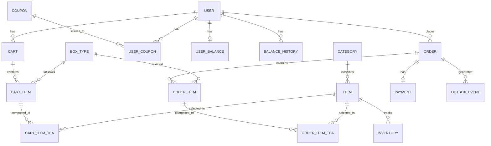
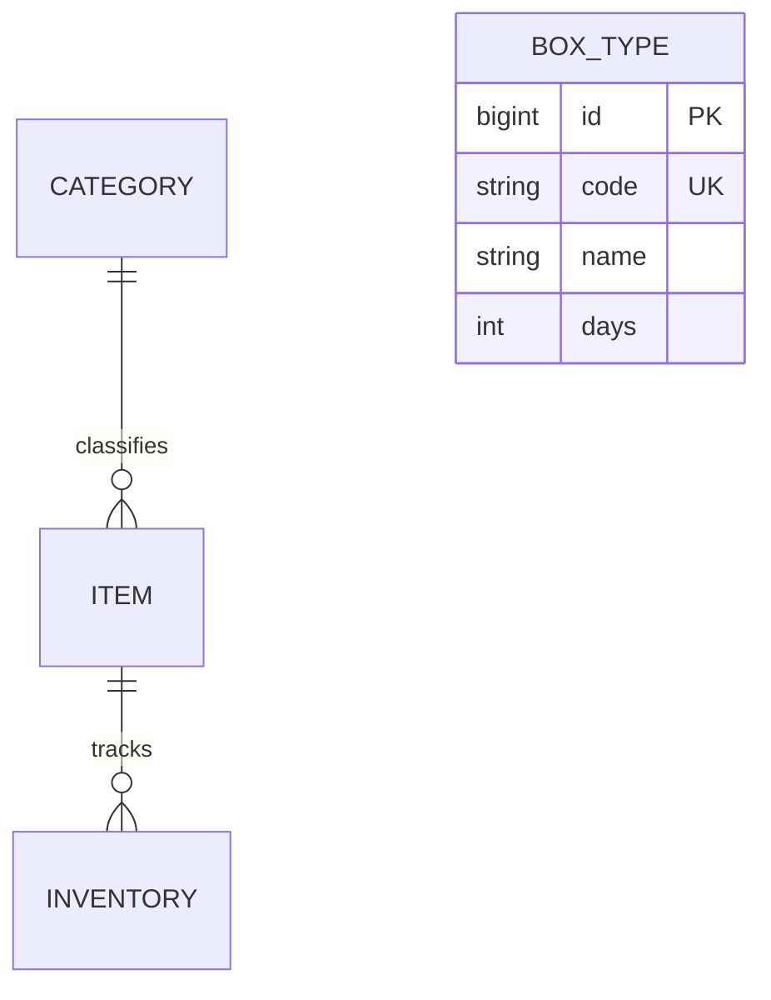
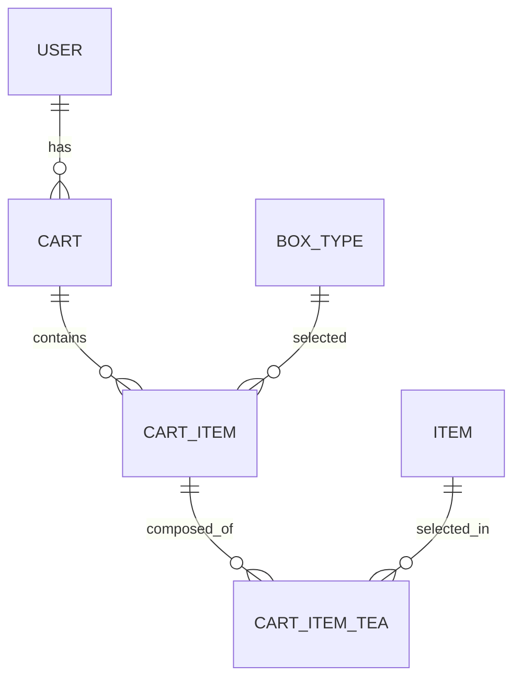
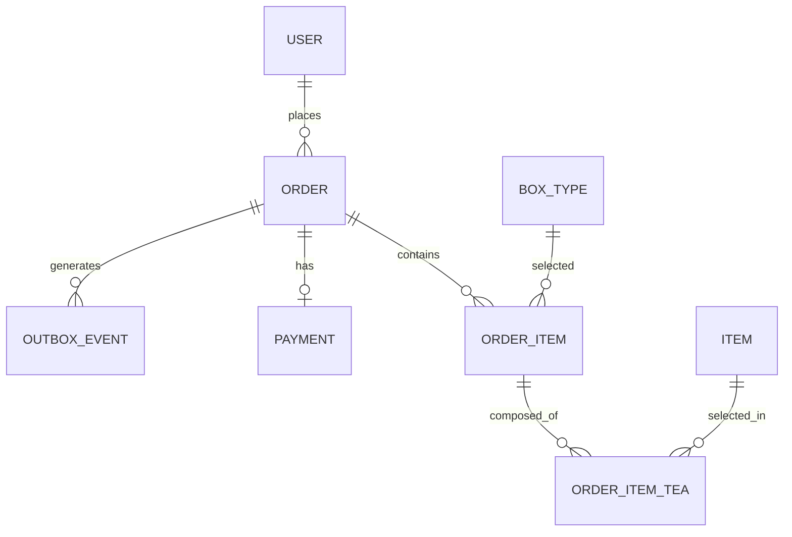
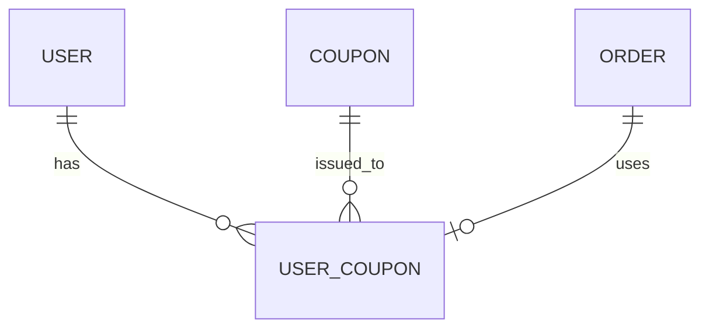
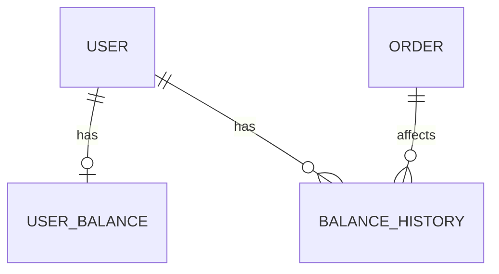

# 데이터 모델 설계 (PostgreSQL)

## 목차
1. [ERD (Entity Relationship Diagram)](#1-erd-entity-relationship-diagram)
2. [엔티티 상세 명세](#2-엔티티-상세-명세)
3. [비즈니스 규칙 반영](#3-비즈니스-규칙-반영)
4. [인덱스 전략](#4-인덱스-전략)
5. [데이터 제약조건](#5-데이터-제약조건)

---

## 1. ERD (Entity Relationship Diagram)

### 1.1 전체 ERD

#### 간단 ERD


#### 상세 ERD

```mermaid
erDiagram
    USER ||--o{ CART : has
    USER ||--o{ ORDER : places
    USER ||--o{ USER_COUPON : has
    USER ||--o| USER_BALANCE : has
    USER ||--o{ BALANCE_HISTORY : has
    
    CATEGORY ||--o{ ITEM : classifies
    
    ITEM ||--o{ CART_ITEM_TEA : selected_in
    ITEM ||--o{ ORDER_ITEM_TEA : selected_in
    ITEM ||--o{ INVENTORY : tracks
    
    BOX_TYPE ||--o{ CART_ITEM : selected
    BOX_TYPE ||--o{ ORDER_ITEM : selected
    
    CART ||--o{ CART_ITEM : contains
    CART_ITEM ||--o{ CART_ITEM_TEA : composed_of
    
    ORDER ||--o{ ORDER_ITEM : contains
    ORDER_ITEM ||--o{ ORDER_ITEM_TEA : composed_of
    ORDER ||--o| PAYMENT : has
    ORDER ||--o{ OUTBOX_EVENT : generates
    
    COUPON ||--o{ USER_COUPON : issued_to
    
      USER {
        bigint id PK "사용자 ID"
        string login_type "로그인타입(LOCAL/KAKAO/NAVER/GOOGLE)"
        string login_id UK "로그인ID(provider_type_id)"
        string password "비밀번호(nullable-SNS는NULL)"
        string email UK "이메일(중복방지)"
        string name "이름"
        string phone "전화번호"
        string provider_id "SNS제공자ID(nullable)"
        boolean is_active "활성화 여부"
        datetime created_at "생성일시"
        bigint created_by "생성자"
        datetime updated_at "수정일시"
        bigint updated_by "수정자"
    }

    USER_BALANCE {
        bigint id PK "잔액 ID"
        bigint user_id FK "사용자 ID"
        bigint balance "포인트 잔액"
        int version "낙관적락"
        boolean is_active "활성화 여부"
        datetime created_at "생성일시"
        bigint created_by "생성자"
        datetime updated_at "수정일시"
        bigint updated_by "수정자"
    }

    BALANCE_HISTORY {
        bigint id PK "이력 ID"
        bigint user_id FK "사용자 ID"
        string transaction_type "거래타입(CHARGE/USE/REFUND)"
        bigint amount "변동금액"
        bigint balance_before "거래전잔액"
        bigint balance_after "거래후잔액"
        bigint order_id FK "주문 ID(nullable)"
        string description "설명"
        boolean is_active "활성화 여부"
        datetime created_at "생성일시"
        bigint created_by "생성자"
    }
    
    CATEGORY {
        bigint id PK "카테고리 ID"
        string name UK "카테고리명"
        string description "설명"
        int sort_order "정렬순서"
        boolean is_active "활성화 여부"
        datetime created_at "생성일시"
        bigint created_by "생성자"
        datetime updated_at "수정일시"
        bigint updated_by "수정자"
    }
    
    ITEM {
        bigint id PK "상품 ID"
        bigint category_id FK "카테고리 ID"
        string name "상품명"
        string description "상세설명"
        string caffeine_type "카페인타입"
        string taste_profile "맛프로필"
        string aroma_profile "향프로필"
        string color_profile "수색프로필"
        int bag_per_weight "티백당 용량(g)"
        int price_per_100g "100g당 가격"
        string ingredients "주요원료"
        string origin "원산지"
        string status "상태(ACTIVE/OUT_OF_STOCK/DISCONTINUED/HIDDEN)"
        boolean is_active "활성화 여부"
        datetime created_at "생성일시"
        bigint created_by "생성자"
        datetime updated_at "수정일시"
        bigint updated_by "수정자"
    }
    
    INVENTORY {
        bigint id PK "재고 ID"
        bigint item_id FK "상품 ID"
        int quantity "재고수량(g)"
        int safety_stock "안전재고(g)"
        int version "낙관적락"
        boolean is_active "활성화여부"
        datetime created_at "생성일시"
        bigint created_by "생성자"
        datetime updated_at "수정일시"
        bigint updated_by "수정자"
    }
    
    BOX_TYPE {
    bigint id PK "박스타입 ID"
    string code UK "코드(THREE_DAYS/SEVEN_DAYS/FOURTEEN_DAYS)"
    string name "박스명"
    int days "일수"
    string description "설명"
    boolean is_active "활성화여부"
    datetime created_at "생성일시"
    bigint created_by "생성자"
    datetime updated_at "수정일시"
    bigint updated_by "수정자"
    }
    
    CART {
        bigint id PK "장바구니 ID"
        bigint user_id "사용자 ID"
        boolean is_active "활성화 여부"
        datetime created_at "생성일시"
        bigint created_by "생성자"
        datetime updated_at "수정일시"
        bigint updated_by "수정자"
    }
    
    CART_ITEM {
        bigint id PK "장바구니상품 ID"
        bigint cart_id FK "장바구니 ID"
        bigint box_type_id "박스타입 ID"
        int daily_serving "하루섭취량(1/2/3)"
        int quantity "수량"
        boolean gift_wrap "선물포장여부"
        string gift_message "선물메시지"
        boolean is_active "활성화 여부"
        datetime created_at "생성일시"
        bigint created_by "생성자"
        datetime updated_at "수정일시"
        bigint updated_by "수정자"
    }
    
    CART_ITEM_TEA {
        bigint id PK "장바구니차구성 ID"
        bigint cart_item_id FK "장바구니상품 ID"
        bigint item_id "차 ID"
        int selection_order "선택순서"
        int ratio_percent "배합비율"
        boolean is_active "활성화 여부"
        datetime created_at "생성일시"
        bigint created_by "생성자"
        datetime updated_at "수정일시"
        bigint updated_by "수정자"
    }
    
    ORDER {
        bigint id PK "주문 ID"
        string order_number UK "주문번호"
        bigint user_id "사용자 ID"
        string coupon_code "쿠폰코드"
        int total_amount "총금액"
        int discount_amount "할인금액"
        int final_amount "최종금액"
        string status "주문상태(PENDING/PAID/PREPARING/SHIPPED/DELIVERED/CANCELLED)"
        datetime ordered_at "주문일시"
        bigint delivery_id FK "배송 ID"
        boolean is_active "활성화 여부"
        datetime created_at "생성일시"
        bigint created_by "생성자"
        datetime updated_at "수정일시"
        bigint updated_by "수정자"
    }
    
    ORDER_ITEM {
        bigint id PK "주문상품 ID"
        bigint order_id FK "주문 ID"
        bigint box_type_id "박스타입 ID"
        string box_type_name "박스타입명"
        int daily_serving "하루섭취량(1/2/3)"
        int tea_bag_count "티백개수"
        boolean gift_wrap "선물포장"
        string gift_message "선물메시지"
        int quantity "수량"
        int container_price "용기가격(기본포장포함)"
        int tea_price "차가격(그램기준)"
        int gift_wrap_price "선물포장가격(추가옵션)"
        int total_price "총가격"
        boolean is_active "활성화 여부"
        datetime created_at "생성일시"
        bigint created_by "생성자"
        datetime updated_at "수정일시"
        bigint updated_by "수정자"
    }
    
    ORDER_ITEM_TEA {
        bigint id PK "주문차구성 ID"
        bigint order_item_id FK "주문상품 ID"
        bigint item_id "차 ID"
        string item_name "차명"
        string category_name "카테고리"
        int selection_order "선택순서"
        int ratio_percent "배합비율"
        int unit_price "100g당가격(스냅샷)"
        boolean is_active "활성화 여부"
        datetime created_at "생성일시"
        bigint created_by "생성자"
        datetime updated_at "수정일시"
        bigint updated_by "수정자"
    }
    
    PAYMENT {
        bigint id PK "결제 ID"
        bigint order_id FK "주문 ID"
        bigint user_id "사용자 ID"
        int amount "결제금액"
        string payment_method "결제수단"
        string status "결제상태"
        string pg_transaction_id "PG거래ID"
        datetime paid_at "결제일시"
        boolean is_active "활성화 여부"
        datetime created_at "생성일시"
        bigint created_by "생성자"
        datetime updated_at "수정일시"
        bigint updated_by "수정자"
    }
    
    COUPON {
        bigint id PK "쿠폰 ID"
        string code UK "쿠폰코드"
        string name "쿠폰명"
        string discount_type "할인유형(RATE/AMOUNT)"
        int discount_value "할인값(% 또는 원)"
        int min_order_amount "최소주문금액"
        int max_discount_amount "최대할인금액"
        int max_issue_count "최대발행수"
        int issued_count "현재발행수(집계)"
        datetime issue_start_at "발행시작일"
        datetime issue_end_at "발행종료일"
        int valid_days "유효기간(일)"
        string status "상태(ACTIVE/PAUSED/ENDED)"
        boolean is_active "활성화 여부"
        datetime created_at "생성일시"
        bigint created_by "생성자"
        datetime updated_at "수정일시"
        bigint updated_by "수정자"
    }
    
    USER_COUPON {
        bigint id PK "사용자쿠폰 ID"
        bigint user_id "사용자 ID"
        bigint coupon_id FK "쿠폰 ID"
        string status "쿠폰상태(ISSUED/USED/EXPIRED)"
        datetime issued_at "발급일시"
        datetime used_at "사용일시"
        datetime expired_at "만료일시"
        boolean is_active "활성화 여부"
        datetime created_at "생성일시"
        bigint created_by "생성자"
        datetime updated_at "수정일시"
        bigint updated_by "수정자"
    }
    
    OUTBOX_EVENT {
        bigint id PK "이벤트 ID"
        string aggregate_type "집합체타입(ORDER/USER/CART 등)"
        bigint aggregate_id "집합체 ID"
        string event_type "이벤트타입"
        json payload "페이로드(이벤트 데이터)"
        string status "상태(PENDING/PROCESSING/SENT/FAILED)"
        int retry_count "재시도횟수(기본0)"
        datetime processed_at "처리완료일시"
        datetime next_retry_at "다음재시도일시"
        string error_message "에러메시지"
        boolean is_active "활성화 여부"
        datetime created_at "생성일시"
        bigint created_by "생성자"
        datetime updated_at "수정일시"
        bigint updated_by "수정자"
    }
```


### 1.2 도메인별 ERD

#### 상품 도메인


#### 장바구니 도메인


#### 주문 도메인


#### 쿠폰 도메인


#### 포인트 도메인


---

## 2. 엔티티 상세 명세

### 2.1 사용자 관련

#### USER (사용자)
사용자 계정 정보를 관리하는 엔티티

| 컬럼명 | 타입 | 제약조건 | 설명 | 비즈니스 규칙 |
|--------|------|----------|------|---------------|
| id | BIGSERIAL | PK | 사용자 ID | - |
| login_type | VARCHAR(20) | NOT NULL | 로그인타입 | LOCAL/KAKAO/NAVER/GOOGLE |
| login_id | VARCHAR(100) | NOT NULL, UNIQUE | 로그인ID | provider_type_id |
| password | VARCHAR(255) | NULL | 비밀번호 | BCrypt 해시 (SNS는 NULL) |
| email | VARCHAR(100) | NOT NULL, UNIQUE | 이메일 | 중복방지 |
| name | VARCHAR(50) | NOT NULL | 이름 | - |
| phone | VARCHAR(20) | NOT NULL | 전화번호 | - |
| provider_id | VARCHAR(100) | NULL | SNS제공자ID | nullable |
| is_active | BOOLEAN | NOT NULL, DEFAULT TRUE | 활성화 여부 | - |
| created_at | TIMESTAMP WITH TIME ZONE | NOT NULL, DEFAULT CURRENT_TIMESTAMP | 생성일시 | - |
| created_by | BIGINT | NOT NULL | 생성자 | - |
| updated_at | TIMESTAMP WITH TIME ZONE | NOT NULL, DEFAULT CURRENT_TIMESTAMP | 수정일시 | - |
| updated_by | BIGINT | NOT NULL | 수정자 | - |

**DDL**:
```sql
CREATE TABLE "user" (
    id BIGSERIAL PRIMARY KEY,
    login_type VARCHAR(20) NOT NULL,
    login_id VARCHAR(100) NOT NULL UNIQUE,
    password VARCHAR(255),
    email VARCHAR(100) NOT NULL UNIQUE,
    name VARCHAR(50) NOT NULL,
    phone VARCHAR(20) NOT NULL,
    provider_id VARCHAR(100),
    is_active BOOLEAN NOT NULL DEFAULT TRUE,
    created_at TIMESTAMP WITH TIME ZONE NOT NULL DEFAULT CURRENT_TIMESTAMP,
    created_by BIGINT NOT NULL,
    updated_at TIMESTAMP WITH TIME ZONE NOT NULL DEFAULT CURRENT_TIMESTAMP,
    updated_by BIGINT NOT NULL
);

CREATE INDEX idx_user_login_id ON "user"(login_id);
CREATE INDEX idx_user_email ON "user"(email);
```

---

### 2.2 상품 관련

#### CATEGORY (카테고리)
상품 카테고리를 관리하는 엔티티

| 컬럼명 | 타입 | 제약조건 | 설명 | 비즈니스 규칙 |
|--------|------|----------|------|---------------|
| id | BIGSERIAL | PK | 카테고리 ID | - |
| name | VARCHAR(50) | NOT NULL, UNIQUE | 카테고리명 | - |
| description | VARCHAR(255) | NOT NULL | 설명 | - |
| sort_order | INTEGER | NOT NULL | 정렬순서 | - |
| is_active | BOOLEAN | NOT NULL, DEFAULT TRUE | 활성화 여부 | - |
| created_at | TIMESTAMP WITH TIME ZONE | NOT NULL, DEFAULT CURRENT_TIMESTAMP | 생성일시 | - |
| created_by | BIGINT | NOT NULL | 생성자 | - |
| updated_at | TIMESTAMP WITH TIME ZONE | NOT NULL, DEFAULT CURRENT_TIMESTAMP | 수정일시 | - |
| updated_by | BIGINT | NOT NULL | 수정자 | - |

**DDL**:
```sql
CREATE TABLE category (
    id BIGSERIAL PRIMARY KEY,
    name VARCHAR(50) NOT NULL UNIQUE,
    description VARCHAR(255) NOT NULL,
    sort_order INTEGER NOT NULL,
    is_active BOOLEAN NOT NULL DEFAULT TRUE,
    created_at TIMESTAMP WITH TIME ZONE NOT NULL DEFAULT CURRENT_TIMESTAMP,
    created_by BIGINT NOT NULL,
    updated_at TIMESTAMP WITH TIME ZONE NOT NULL DEFAULT CURRENT_TIMESTAMP,
    updated_by BIGINT NOT NULL
);

CREATE INDEX idx_category_sort_order ON category(sort_order);
```

---

#### ITEM (상품)
개별 상품 정보를 관리하는 엔티티

| 컬럼명 | 타입 | 제약조건 | 설명 | 비즈니스 규칙 |
|--------|------|----------|------|---------------|
| id | BIGSERIAL | PK | 상품 ID | - |
| category_id | BIGINT | NOT NULL, FK → CATEGORY(id) | 카테고리 ID | - |
| name | VARCHAR(100) | NOT NULL | 상품명 | - |
| description | TEXT | NOT NULL | 상세설명 | - |
| caffeine_type | VARCHAR(20) | NOT NULL | 카페인타입 | - |
| taste_profile | VARCHAR(100) | NOT NULL | 맛프로필 | - |
| aroma_profile | VARCHAR(100) | NOT NULL | 향프로필 | - |
| color_profile | VARCHAR(100) | NOT NULL | 수색프로필 | - |
| bag_per_weight | INTEGER | NOT NULL | 티백당 용량(g) | - |
| price_per_100g | INTEGER | NOT NULL | 100g당 가격 | - |
| ingredients | TEXT | NOT NULL | 주요원료 | - |
| origin | VARCHAR(100) | NOT NULL | 원산지 | - |
| status | VARCHAR(20) | NOT NULL | 상태 | ACTIVE/OUT_OF_STOCK/DISCONTINUED/HIDDEN |
| is_active | BOOLEAN | NOT NULL, DEFAULT TRUE | 활성화 여부 | - |
| created_at | TIMESTAMP WITH TIME ZONE | NOT NULL, DEFAULT CURRENT_TIMESTAMP | 생성일시 | - |
| created_by | BIGINT | NOT NULL | 생성자 | - |
| updated_at | TIMESTAMP WITH TIME ZONE | NOT NULL, DEFAULT CURRENT_TIMESTAMP | 수정일시 | - |
| updated_by | BIGINT | NOT NULL | 수정자 | - |

**DDL**:
```sql
CREATE TABLE item (
    id BIGSERIAL PRIMARY KEY,
    category_id BIGINT NOT NULL REFERENCES category(id),
    name VARCHAR(100) NOT NULL,
    description TEXT NOT NULL,
    caffeine_type VARCHAR(20) NOT NULL,
    taste_profile VARCHAR(100) NOT NULL,
    aroma_profile VARCHAR(100) NOT NULL,
    color_profile VARCHAR(100) NOT NULL,
    bag_per_weight INTEGER NOT NULL,
    price_per_100g INTEGER NOT NULL,
    ingredients TEXT NOT NULL,
    origin VARCHAR(100) NOT NULL,
    status VARCHAR(20) NOT NULL,
    is_active BOOLEAN NOT NULL DEFAULT TRUE,
    created_at TIMESTAMP WITH TIME ZONE NOT NULL DEFAULT CURRENT_TIMESTAMP,
    created_by BIGINT NOT NULL,
    updated_at TIMESTAMP WITH TIME ZONE NOT NULL DEFAULT CURRENT_TIMESTAMP,
    updated_by BIGINT NOT NULL
);

CREATE INDEX idx_item_category ON item(category_id);
CREATE INDEX idx_item_status ON item(status);
```

---

#### INVENTORY (재고)
상품별 재고 수량을 관리하는 엔티티

| 컬럼명 | 타입 | 제약조건 | 설명 | 비즈니스 규칙 |
|--------|------|----------|------|---------------|
| id | BIGSERIAL | PK | 재고 ID | - |
| item_id | BIGINT | NOT NULL, FK → ITEM(id) | 상품 ID | - |
| quantity | INTEGER | NOT NULL | 재고수량(g) | - |
| safety_stock | INTEGER | NOT NULL | 안전재고(g) | - |
| version | INTEGER | NOT NULL, DEFAULT 0 | 낙관적락 | - |
| is_active | BOOLEAN | NOT NULL, DEFAULT TRUE | 활성화여부 | - |
| created_at | TIMESTAMP WITH TIME ZONE | NOT NULL, DEFAULT CURRENT_TIMESTAMP | 생성일시 | - |
| created_by | BIGINT | NOT NULL | 생성자 | - |
| updated_at | TIMESTAMP WITH TIME ZONE | NOT NULL, DEFAULT CURRENT_TIMESTAMP | 수정일시 | - |
| updated_by | BIGINT | NOT NULL | 수정자 | - |

**DDL**:
```sql
CREATE TABLE inventory (
    id BIGSERIAL PRIMARY KEY,
    item_id BIGINT NOT NULL REFERENCES item(id),
    quantity INTEGER NOT NULL,
    safety_stock INTEGER NOT NULL,
    version INTEGER NOT NULL DEFAULT 0,
    is_active BOOLEAN NOT NULL DEFAULT TRUE,
    created_at TIMESTAMP WITH TIME ZONE NOT NULL DEFAULT CURRENT_TIMESTAMP,
    created_by BIGINT NOT NULL,
    updated_at TIMESTAMP WITH TIME ZONE NOT NULL DEFAULT CURRENT_TIMESTAMP,
    updated_by BIGINT NOT NULL
);

CREATE INDEX idx_inventory_item ON inventory(item_id);
```

---

#### BOX_TYPE (박스타입)
박스의 종류를 정의하는 엔티티

| 컬럼명 | 타입 | 제약조건 | 설명 | 비즈니스 규칙 |
|--------|------|----------|------|---------------|
| id | BIGSERIAL | PK | 박스타입 ID | - |
| code | VARCHAR(50) | NOT NULL, UNIQUE | 코드 | THREE_DAYS/SEVEN_DAYS/FOURTEEN_DAYS |
| name | VARCHAR(50) | NOT NULL | 박스명 | - |
| days | INTEGER | NOT NULL | 일수 | - |
| description | VARCHAR(255) | NOT NULL | 설명 | - |
| is_active | BOOLEAN | NOT NULL, DEFAULT TRUE | 활성화여부 | - |
| created_at | TIMESTAMP WITH TIME ZONE | NOT NULL, DEFAULT CURRENT_TIMESTAMP | 생성일시 | - |
| created_by | BIGINT | NOT NULL | 생성자 | - |
| updated_at | TIMESTAMP WITH TIME ZONE | NOT NULL, DEFAULT CURRENT_TIMESTAMP | 수정일시 | - |
| updated_by | BIGINT | NOT NULL | 수정자 | - |

**DDL**:
```sql
CREATE TABLE box_type (
    id BIGSERIAL PRIMARY KEY,
    code VARCHAR(50) NOT NULL UNIQUE,
    name VARCHAR(50) NOT NULL,
    days INTEGER NOT NULL,
    description VARCHAR(255) NOT NULL,
    is_active BOOLEAN NOT NULL DEFAULT TRUE,
    created_at TIMESTAMP WITH TIME ZONE NOT NULL DEFAULT CURRENT_TIMESTAMP,
    created_by BIGINT NOT NULL,
    updated_at TIMESTAMP WITH TIME ZONE NOT NULL DEFAULT CURRENT_TIMESTAMP,
    updated_by BIGINT NOT NULL
);

CREATE INDEX idx_box_type_code ON box_type(code);
```

---

### 2.3 장바구니 관련

#### CART (장바구니)
사용자별 장바구니를 관리하는 엔티티

| 컬럼명 | 타입 | 제약조건 | 설명 | 비즈니스 규칙 |
|--------|------|----------|------|---------------|
| id | BIGSERIAL | PK | 장바구니 ID | - |
| user_id | BIGINT | NOT NULL | 사용자 ID | - |
| is_active | BOOLEAN | NOT NULL, DEFAULT TRUE | 활성화 여부 | - |
| created_at | TIMESTAMP WITH TIME ZONE | NOT NULL, DEFAULT CURRENT_TIMESTAMP | 생성일시 | - |
| created_by | BIGINT | NOT NULL | 생성자 | - |
| updated_at | TIMESTAMP WITH TIME ZONE | NOT NULL, DEFAULT CURRENT_TIMESTAMP | 수정일시 | - |
| updated_by | BIGINT | NOT NULL | 수정자 | - |

**DDL**:
```sql
CREATE TABLE cart (
    id BIGSERIAL PRIMARY KEY,
    user_id BIGINT NOT NULL,
    is_active BOOLEAN NOT NULL DEFAULT TRUE,
    created_at TIMESTAMP WITH TIME ZONE NOT NULL DEFAULT CURRENT_TIMESTAMP,
    created_by BIGINT NOT NULL,
    updated_at TIMESTAMP WITH TIME ZONE NOT NULL DEFAULT CURRENT_TIMESTAMP,
    updated_by BIGINT NOT NULL
);

CREATE INDEX idx_cart_user ON cart(user_id);
```

---

#### CART_ITEM (장바구니상품)
장바구니의 개별 상품을 관리하는 엔티티

| 컬럼명 | 타입 | 제약조건 | 설명 | 비즈니스 규칙 |
|--------|------|----------|------|---------------|
| id | BIGSERIAL | PK | 장바구니상품 ID | - |
| cart_id | BIGINT | NOT NULL, FK → CART(id) | 장바구니 ID | - |
| box_type_id | BIGINT | NOT NULL | 박스타입 ID | - |
| daily_serving | INTEGER | NOT NULL | 하루섭취량(1/2/3) | - |
| quantity | INTEGER | NOT NULL | 수량 | - |
| gift_wrap | BOOLEAN | NOT NULL, DEFAULT FALSE | 선물포장여부 | - |
| gift_message | TEXT | NULL | 선물메시지 | - |
| is_active | BOOLEAN | NOT NULL, DEFAULT TRUE | 활성화 여부 | - |
| created_at | TIMESTAMP WITH TIME ZONE | NOT NULL, DEFAULT CURRENT_TIMESTAMP | 생성일시 | - |
| created_by | BIGINT | NOT NULL | 생성자 | - |
| updated_at | TIMESTAMP WITH TIME ZONE | NOT NULL, DEFAULT CURRENT_TIMESTAMP | 수정일시 | - |
| updated_by | BIGINT | NOT NULL | 수정자 | - |

**DDL**:
```sql
CREATE TABLE cart_item (
    id BIGSERIAL PRIMARY KEY,
    cart_id BIGINT NOT NULL REFERENCES cart(id),
    box_type_id BIGINT NOT NULL,
    daily_serving INTEGER NOT NULL,
    quantity INTEGER NOT NULL,
    gift_wrap BOOLEAN NOT NULL DEFAULT FALSE,
    gift_message TEXT,
    is_active BOOLEAN NOT NULL DEFAULT TRUE,
    created_at TIMESTAMP WITH TIME ZONE NOT NULL DEFAULT CURRENT_TIMESTAMP,
    created_by BIGINT NOT NULL,
    updated_at TIMESTAMP WITH TIME ZONE NOT NULL DEFAULT CURRENT_TIMESTAMP,
    updated_by BIGINT NOT NULL
);

CREATE INDEX idx_cart_item_cart ON cart_item(cart_id);
```

---

#### CART_ITEM_TEA (장바구니차구성)
장바구니 상품의 차 구성을 관리하는 엔티티

| 컬럼명 | 타입 | 제약조건 | 설명 | 비즈니스 규칙 |
|--------|------|----------|------|---------------|
| id | BIGSERIAL | PK | 장바구니차구성 ID | - |
| cart_item_id | BIGINT | NOT NULL, FK → CART_ITEM(id) | 장바구니상품 ID | - |
| item_id | BIGINT | NOT NULL | 차 ID | - |
| selection_order | INTEGER | NOT NULL | 선택순서 | - |
| ratio_percent | INTEGER | NOT NULL | 배합비율 | - |
| is_active | BOOLEAN | NOT NULL, DEFAULT TRUE | 활성화 여부 | - |
| created_at | TIMESTAMP WITH TIME ZONE | NOT NULL, DEFAULT CURRENT_TIMESTAMP | 생성일시 | - |
| created_by | BIGINT | NOT NULL | 생성자 | - |
| updated_at | TIMESTAMP WITH TIME ZONE | NOT NULL, DEFAULT CURRENT_TIMESTAMP | 수정일시 | - |
| updated_by | BIGINT | NOT NULL | 수정자 | - |

**DDL**:
```sql
CREATE TABLE cart_item_tea (
    id BIGSERIAL PRIMARY KEY,
    cart_item_id BIGINT NOT NULL REFERENCES cart_item(id),
    item_id BIGINT NOT NULL,
    selection_order INTEGER NOT NULL,
    ratio_percent INTEGER NOT NULL,
    is_active BOOLEAN NOT NULL DEFAULT TRUE,
    created_at TIMESTAMP WITH TIME ZONE NOT NULL DEFAULT CURRENT_TIMESTAMP,
    created_by BIGINT NOT NULL,
    updated_at TIMESTAMP WITH TIME ZONE NOT NULL DEFAULT CURRENT_TIMESTAMP,
    updated_by BIGINT NOT NULL
);

CREATE INDEX idx_cart_item_tea_cart_item ON cart_item_tea(cart_item_id);
```

---

#### ORDER (주문)
주문 정보를 관리하는 엔티티

| 컬럼명 | 타입 | 제약조건 | 설명 | 비즈니스 규칙 |
|--------|------|----------|------|---------------|
| id | BIGSERIAL | PK | 주문 ID | - |
| order_number | VARCHAR(50) | NOT NULL, UNIQUE | 주문번호 | - |
| user_id | BIGINT | NOT NULL | 사용자 ID | - |
| coupon_code | VARCHAR(50) | NULL | 쿠폰코드 | - |
| total_amount | INTEGER | NOT NULL | 총금액 | - |
| discount_amount | INTEGER | NOT NULL | 할인금액 | - |
| final_amount | INTEGER | NOT NULL | 최종금액 | - |
| status | VARCHAR(30) | NOT NULL | 주문상태 | PENDING/PAID/PREPARING/SHIPPED/DELIVERED/CANCELLED |
| ordered_at | TIMESTAMP WITH TIME ZONE | NOT NULL, DEFAULT CURRENT_TIMESTAMP | 주문일시 | - |
| delivery_id | BIGINT | NULL | 배송 ID | - |
| is_active | BOOLEAN | NOT NULL, DEFAULT TRUE | 활성화 여부 | - |
| created_at | TIMESTAMP WITH TIME ZONE | NOT NULL, DEFAULT CURRENT_TIMESTAMP | 생성일시 | - |
| created_by | BIGINT | NOT NULL | 생성자 | - |
| updated_at | TIMESTAMP WITH TIME ZONE | NOT NULL, DEFAULT CURRENT_TIMESTAMP | 수정일시 | - |
| updated_by | BIGINT | NOT NULL | 수정자 | - |

**DDL**:
```sql
CREATE TABLE "order" (
    id BIGSERIAL PRIMARY KEY,
    order_number VARCHAR(50) NOT NULL UNIQUE,
    user_id BIGINT NOT NULL,
    coupon_code VARCHAR(50),
    total_amount INTEGER NOT NULL,
    discount_amount INTEGER NOT NULL,
    final_amount INTEGER NOT NULL,
    status VARCHAR(30) NOT NULL,
    ordered_at TIMESTAMP WITH TIME ZONE NOT NULL DEFAULT CURRENT_TIMESTAMP,
    delivery_id BIGINT,
    is_active BOOLEAN NOT NULL DEFAULT TRUE,
    created_at TIMESTAMP WITH TIME ZONE NOT NULL DEFAULT CURRENT_TIMESTAMP,
    created_by BIGINT NOT NULL,
    updated_at TIMESTAMP WITH TIME ZONE NOT NULL DEFAULT CURRENT_TIMESTAMP,
    updated_by BIGINT NOT NULL
);

CREATE INDEX idx_order_user_created ON "order"(user_id, created_at DESC);
CREATE INDEX idx_order_status ON "order"(status);
```

---

#### ORDER_ITEM (주문상품)
주문의 상세 항목을 관리하는 엔티티

| 컬럼명 | 타입 | 제약조건 | 설명 | 비즈니스 규칙 |
|--------|------|----------|------|---------------|
| id | BIGSERIAL | PK | 주문상품 ID | - |
| order_id | BIGINT | NOT NULL, FK → ORDER(id) | 주문 ID | - |
| box_type_id | BIGINT | NOT NULL | 박스타입 ID | - |
| box_type_name | VARCHAR(50) | NOT NULL | 박스타입명 | - |
| daily_serving | INTEGER | NOT NULL | 하루섭취량(1/2/3) | - |
| tea_bag_count | INTEGER | NOT NULL | 티백개수 | - |
| gift_wrap | BOOLEAN | NOT NULL, DEFAULT FALSE | 선물포장 | - |
| gift_message | TEXT | NULL | 선물메시지 | - |
| quantity | INTEGER | NOT NULL | 수량 | - |
| container_price | INTEGER | NOT NULL | 용기가격(기본포장포함) | - |
| tea_price | INTEGER | NOT NULL | 차가격(그램기준) | - |
| gift_wrap_price | INTEGER | NOT NULL | 선물포장가격(추가옵션) | - |
| total_price | INTEGER | NOT NULL | 총가격 | - |
| is_active | BOOLEAN | NOT NULL, DEFAULT TRUE | 활성화 여부 | - |
| created_at | TIMESTAMP WITH TIME ZONE | NOT NULL, DEFAULT CURRENT_TIMESTAMP | 생성일시 | - |
| created_by | BIGINT | NOT NULL | 생성자 | - |
| updated_at | TIMESTAMP WITH TIME ZONE | NOT NULL, DEFAULT CURRENT_TIMESTAMP | 수정일시 | - |
| updated_by | BIGINT | NOT NULL | 수정자 | - |

**DDL**:
```sql
CREATE TABLE order_item (
    id BIGSERIAL PRIMARY KEY,
    order_id BIGINT NOT NULL REFERENCES "order"(id),
    box_type_id BIGINT NOT NULL,
    box_type_name VARCHAR(50) NOT NULL,
    daily_serving INTEGER NOT NULL,
    tea_bag_count INTEGER NOT NULL,
    gift_wrap BOOLEAN NOT NULL DEFAULT FALSE,
    gift_message TEXT,
    quantity INTEGER NOT NULL,
    container_price INTEGER NOT NULL,
    tea_price INTEGER NOT NULL,
    gift_wrap_price INTEGER NOT NULL,
    total_price INTEGER NOT NULL,
    is_active BOOLEAN NOT NULL DEFAULT TRUE,
    created_at TIMESTAMP WITH TIME ZONE NOT NULL DEFAULT CURRENT_TIMESTAMP,
    created_by BIGINT NOT NULL,
    updated_at TIMESTAMP WITH TIME ZONE NOT NULL DEFAULT CURRENT_TIMESTAMP,
    updated_by BIGINT NOT NULL
);

CREATE INDEX idx_order_item_order ON order_item(order_id);
```

---

#### ORDER_ITEM_TEA (주문차구성)
주문 상품의 차 구성을 관리하는 엔티티

| 컬럼명 | 타입 | 제약조건 | 설명 | 비즈니스 규칙 |
|--------|------|----------|------|---------------|
| id | BIGSERIAL | PK | 주문차구성 ID | - |
| order_item_id | BIGINT | NOT NULL, FK → ORDER_ITEM(id) | 주문상품 ID | - |
| item_id | BIGINT | NOT NULL | 차 ID | - |
| item_name | VARCHAR(100) | NOT NULL | 차명 | - |
| category_name | VARCHAR(50) | NOT NULL | 카테고리 | - |
| selection_order | INTEGER | NOT NULL | 선택순서 | - |
| ratio_percent | INTEGER | NOT NULL | 배합비율 | - |
| unit_price | INTEGER | NOT NULL | 100g당가격(스냅샷) | - |
| is_active | BOOLEAN | NOT NULL, DEFAULT TRUE | 활성화 여부 | - |
| created_at | TIMESTAMP WITH TIME ZONE | NOT NULL, DEFAULT CURRENT_TIMESTAMP | 생성일시 | - |
| created_by | BIGINT | NOT NULL | 생성자 | - |
| updated_at | TIMESTAMP WITH TIME ZONE | NOT NULL, DEFAULT CURRENT_TIMESTAMP | 수정일시 | - |
| updated_by | BIGINT | NOT NULL | 수정자 | - |

**DDL**:
```sql
CREATE TABLE order_item_tea (
    id BIGSERIAL PRIMARY KEY,
    order_item_id BIGINT NOT NULL REFERENCES order_item(id),
    item_id BIGINT NOT NULL,
    item_name VARCHAR(100) NOT NULL,
    category_name VARCHAR(50) NOT NULL,
    selection_order INTEGER NOT NULL,
    ratio_percent INTEGER NOT NULL,
    unit_price INTEGER NOT NULL,
    is_active BOOLEAN NOT NULL DEFAULT TRUE,
    created_at TIMESTAMP WITH TIME ZONE NOT NULL DEFAULT CURRENT_TIMESTAMP,
    created_by BIGINT NOT NULL,
    updated_at TIMESTAMP WITH TIME ZONE NOT NULL DEFAULT CURRENT_TIMESTAMP,
    updated_by BIGINT NOT NULL
);

CREATE INDEX idx_order_item_tea_order_item ON order_item_tea(order_item_id);
```

---

#### PAYMENT (결제)
결제 정보를 관리하는 엔티티

| 컬럼명 | 타입 | 제약조건 | 설명 | 비즈니스 규칙 |
|--------|------|----------|------|---------------|
| id | BIGSERIAL | PK | 결제 ID | - |
| order_id | BIGINT | NOT NULL, FK → ORDER(id) | 주문 ID | - |
| user_id | BIGINT | NOT NULL | 사용자 ID | - |
| amount | INTEGER | NOT NULL | 결제금액 | - |
| payment_method | VARCHAR(20) | NOT NULL | 결제수단 | - |
| status | VARCHAR(20) | NOT NULL | 결제상태 | - |
| pg_transaction_id | VARCHAR(100) | NULL | PG거래ID | - |
| paid_at | TIMESTAMP WITH TIME ZONE | NULL | 결제일시 | - |
| is_active | BOOLEAN | NOT NULL, DEFAULT TRUE | 활성화 여부 | - |
| created_at | TIMESTAMP WITH TIME ZONE | NOT NULL, DEFAULT CURRENT_TIMESTAMP | 생성일시 | - |
| created_by | BIGINT | NOT NULL | 생성자 | - |
| updated_at | TIMESTAMP WITH TIME ZONE | NOT NULL, DEFAULT CURRENT_TIMESTAMP | 수정일시 | - |
| updated_by | BIGINT | NOT NULL | 수정자 | - |

**DDL**:
```sql
CREATE TABLE payment (
    id BIGSERIAL PRIMARY KEY,
    order_id BIGINT NOT NULL REFERENCES "order"(id),
    user_id BIGINT NOT NULL,
    amount INTEGER NOT NULL,
    payment_method VARCHAR(20) NOT NULL,
    status VARCHAR(20) NOT NULL,
    pg_transaction_id VARCHAR(100),
    paid_at TIMESTAMP WITH TIME ZONE,
    is_active BOOLEAN NOT NULL DEFAULT TRUE,
    created_at TIMESTAMP WITH TIME ZONE NOT NULL DEFAULT CURRENT_TIMESTAMP,
    created_by BIGINT NOT NULL,
    updated_at TIMESTAMP WITH TIME ZONE NOT NULL DEFAULT CURRENT_TIMESTAMP,
    updated_by BIGINT NOT NULL
);

CREATE INDEX idx_payment_user ON payment(user_id);
```

---

### 2.5 포인트 관련

#### USER_BALANCE (사용자 포인트 잔액)
사용자별 포인트 잔액을 관리하는 엔티티

| 컬럼명 | 타입 | 제약조건 | 설명 | 비즈니스 규칙 |
|--------|------|----------|------|---------------|
| id | BIGSERIAL | PK | 잔액 ID | - |
| user_id | BIGINT | NOT NULL, FK → USER(id), UNIQUE | 사용자 ID | 1:1 관계 |
| balance | BIGINT | NOT NULL, DEFAULT 0 | 포인트 잔액 | 음수 불가 |
| version | INTEGER | NOT NULL, DEFAULT 0 | 낙관적락 | 동시성 제어용 |
| is_active | BOOLEAN | NOT NULL, DEFAULT TRUE | 활성화 여부 | - |
| created_at | TIMESTAMP WITH TIME ZONE | NOT NULL, DEFAULT CURRENT_TIMESTAMP | 생성일시 | - |
| created_by | BIGINT | NOT NULL | 생성자 | - |
| updated_at | TIMESTAMP WITH TIME ZONE | NOT NULL, DEFAULT CURRENT_TIMESTAMP | 수정일시 | - |
| updated_by | BIGINT | NOT NULL | 수정자 | - |

**DDL**:
```sql
CREATE TABLE user_balance (
    id BIGSERIAL PRIMARY KEY,
    user_id BIGINT NOT NULL REFERENCES "user"(id) UNIQUE,
    balance BIGINT NOT NULL DEFAULT 0,
    version INTEGER NOT NULL DEFAULT 0,
    is_active BOOLEAN NOT NULL DEFAULT TRUE,
    created_at TIMESTAMP WITH TIME ZONE NOT NULL DEFAULT CURRENT_TIMESTAMP,
    created_by BIGINT NOT NULL,
    updated_at TIMESTAMP WITH TIME ZONE NOT NULL DEFAULT CURRENT_TIMESTAMP,
    updated_by BIGINT NOT NULL,
    CONSTRAINT chk_balance_non_negative CHECK (balance >= 0)
);

CREATE UNIQUE INDEX idx_user_balance_user ON user_balance(user_id);
```

---

#### BALANCE_HISTORY (포인트 변동 이력)
포인트 충전/사용/환불 이력을 관리하는 엔티티

| 컬럼명 | 타입 | 제약조건 | 설명 | 비즈니스 규칙 |
|--------|------|----------|------|---------------|
| id | BIGSERIAL | PK | 이력 ID | - |
| user_id | BIGINT | NOT NULL, FK → USER(id) | 사용자 ID | - |
| transaction_type | VARCHAR(20) | NOT NULL | 거래타입 | CHARGE/USE/REFUND |
| amount | BIGINT | NOT NULL | 변동금액 | 충전(+), 사용(-), 환불(+) |
| balance_before | BIGINT | NOT NULL | 거래전잔액 | - |
| balance_after | BIGINT | NOT NULL | 거래후잔액 | - |
| order_id | BIGINT | NULL, FK → ORDER(id) | 주문 ID | 주문 관련 거래시만 |
| description | VARCHAR(255) | NOT NULL | 설명 | "주문 결제", "포인트 충전" 등 |
| is_active | BOOLEAN | NOT NULL, DEFAULT TRUE | 활성화 여부 | - |
| created_at | TIMESTAMP WITH TIME ZONE | NOT NULL, DEFAULT CURRENT_TIMESTAMP | 생성일시 | - |
| created_by | BIGINT | NOT NULL | 생성자 | - |

**DDL**:
```sql
CREATE TABLE balance_history (
    id BIGSERIAL PRIMARY KEY,
    user_id BIGINT NOT NULL REFERENCES "user"(id),
    transaction_type VARCHAR(20) NOT NULL,
    amount BIGINT NOT NULL,
    balance_before BIGINT NOT NULL,
    balance_after BIGINT NOT NULL,
    order_id BIGINT REFERENCES "order"(id),
    description VARCHAR(255) NOT NULL,
    is_active BOOLEAN NOT NULL DEFAULT TRUE,
    created_at TIMESTAMP WITH TIME ZONE NOT NULL DEFAULT CURRENT_TIMESTAMP,
    created_by BIGINT NOT NULL,
    CONSTRAINT chk_transaction_type CHECK (transaction_type IN ('CHARGE', 'USE', 'REFUND')),
    CONSTRAINT chk_balance_calculation CHECK (balance_after = balance_before + amount)
);

CREATE INDEX idx_balance_history_user_created ON balance_history(user_id, created_at DESC);
CREATE INDEX idx_balance_history_order ON balance_history(order_id) WHERE order_id IS NOT NULL;
```

---

### 2.6 쿠폰 관련

#### COUPON (쿠폰)
쿠폰 마스터 정보를 관리하는 엔티티

| 컬럼명 | 타입 | 제약조건 | 설명 | 비즈니스 규칙 |
|--------|------|----------|------|---------------|
| id | BIGSERIAL | PK | 쿠폰 ID | - |
| name | VARCHAR(100) | NOT NULL | 쿠폰명 | "첫구매 50% 할인" |
| code | VARCHAR(50) | NOT NULL, UNIQUE | 쿠폰 코드 | "FIRST50" |
| discount_type | VARCHAR(20) | NOT NULL | 할인 타입 | PERCENTAGE, FIXED |
| discount_value | INTEGER | NOT NULL | 할인값 | PERCENTAGE: 50 (50%), FIXED: 10000 (10,000원) |
| min_order_amount | INTEGER | NOT NULL, DEFAULT 0 | 최소 주문 금액 (원) | 예: 20000 |
| max_issue_count | INTEGER | NOT NULL | 최대 발급 수량 | 예: 100 |
| issued_count | INTEGER | NOT NULL, DEFAULT 0 | 현재 발급 수량 | Redis와 동기화 |
| issue_start_at | TIMESTAMP WITH TIME ZONE | NOT NULL | 발급 시작 일시 | - |
| issue_end_at | TIMESTAMP WITH TIME ZONE | NOT NULL | 발급 종료 일시 | - |
| valid_days | INTEGER | NOT NULL | 유효 기간 (일) | 발급일로부터 N일 |
| is_active | BOOLEAN | NOT NULL, DEFAULT TRUE | 활성화 여부 | - |
| created_at | TIMESTAMP WITH TIME ZONE | NOT NULL, DEFAULT CURRENT_TIMESTAMP | 생성일시 | - |

**DDL**:
```sql
CREATE TABLE coupon (
    id BIGSERIAL PRIMARY KEY,
    name VARCHAR(100) NOT NULL,
    code VARCHAR(50) NOT NULL UNIQUE,
    discount_type VARCHAR(20) NOT NULL,
    discount_value INTEGER NOT NULL,
    min_order_amount INTEGER NOT NULL DEFAULT 0,
    max_issue_count INTEGER NOT NULL,
    issued_count INTEGER NOT NULL DEFAULT 0,
    issue_start_at TIMESTAMP WITH TIME ZONE NOT NULL,
    issue_end_at TIMESTAMP WITH TIME ZONE NOT NULL,
    valid_days INTEGER NOT NULL,
    is_active BOOLEAN NOT NULL DEFAULT TRUE,
    created_at TIMESTAMP WITH TIME ZONE NOT NULL DEFAULT CURRENT_TIMESTAMP,
    CHECK (issued_count <= max_issue_count)
);

CREATE INDEX idx_coupon_active_issue_period 
ON coupon(is_active, issue_start_at, issue_end_at);
```

---

#### USER_COUPON (사용자 쿠폰)
사용자별 발급된 쿠폰을 관리하는 엔티티

| 컬럼명 | 타입 | 제약조건 | 설명 | 비즈니스 규칙 |
|--------|------|----------|------|---------------|
| id | BIGSERIAL | PK | 사용자 쿠폰 ID | - |
| user_id | BIGINT | NOT NULL, FK → USER(id) | 사용자 ID | - |
| coupon_id | BIGINT | NOT NULL, FK → COUPON(id) | 쿠폰 ID | - |
| status | VARCHAR(20) | NOT NULL | 상태 | AVAILABLE, USED, EXPIRED |
| issued_at | TIMESTAMP WITH TIME ZONE | NOT NULL, DEFAULT CURRENT_TIMESTAMP | 발급일시 | - |
| used_at | TIMESTAMP WITH TIME ZONE | NULL | 사용일시 | - |
| expired_at | TIMESTAMP WITH TIME ZONE | NOT NULL | 만료일시 | issued_at + valid_days |

**DDL**:
```sql
CREATE TABLE user_coupon (
    id BIGSERIAL PRIMARY KEY,
    user_id BIGINT NOT NULL REFERENCES "user"(id),
    coupon_id BIGINT NOT NULL REFERENCES coupon(id),
    status VARCHAR(20) NOT NULL,
    issued_at TIMESTAMP WITH TIME ZONE NOT NULL DEFAULT CURRENT_TIMESTAMP,
    used_at TIMESTAMP WITH TIME ZONE,
    expired_at TIMESTAMP WITH TIME ZONE NOT NULL,
    UNIQUE(user_id, coupon_id)
);

CREATE INDEX idx_user_coupon_user_status ON user_coupon(user_id, status);
CREATE INDEX idx_user_coupon_expired_at ON user_coupon(expired_at) 
WHERE status = 'AVAILABLE';
```

---

#### COUPON_ISSUE_HISTORY (쿠폰 발급 이력)
쿠폰 발급 시도 이력을 추적하는 엔티티 (감사용)

| 컬럼명 | 타입 | 제약조건 | 설명 | 비즈니스 규칙 |
|--------|------|----------|------|---------------|
| id | BIGSERIAL | PK | 이력 ID | - |
| coupon_id | BIGINT | NOT NULL, FK → COUPON(id) | 쿠폰 ID | - |
| user_id | BIGINT | NOT NULL, FK → USER(id) | 사용자 ID | - |
| status | VARCHAR(20) | NOT NULL | 발급 상태 | SUCCESS, SOLD_OUT, ALREADY_ISSUED, FAILED |
| failure_reason | TEXT | NULL | 실패 사유 | - |
| created_at | TIMESTAMP WITH TIME ZONE | NOT NULL, DEFAULT CURRENT_TIMESTAMP | 생성일시 | - |

**DDL**:
```sql
CREATE TABLE coupon_issue_history (
    id BIGSERIAL PRIMARY KEY,
    coupon_id BIGINT NOT NULL REFERENCES coupon(id),
    user_id BIGINT NOT NULL REFERENCES "user"(id),
    status VARCHAR(20) NOT NULL,
    failure_reason TEXT,
    created_at TIMESTAMP WITH TIME ZONE NOT NULL DEFAULT CURRENT_TIMESTAMP
);

CREATE INDEX idx_coupon_issue_history_coupon_created 
ON coupon_issue_history(coupon_id, created_at DESC);
CREATE INDEX idx_coupon_issue_history_user ON coupon_issue_history(user_id);
```

---

### 2.6 외부 연동 관련

#### OUTBOX_EVENT (Outbox 이벤트)
외부 시스템 연동을 위한 이벤트를 관리하는 엔티티 (Outbox Pattern)

| 컬럼명 | 타입 | 제약조건 | 설명 | 비즈니스 규칙 |
|--------|------|----------|------|---------------|
| id | BIGSERIAL | PK | 이벤트 ID | - |
| aggregate_type | VARCHAR(50) | NOT NULL | 집합 타입 | "ORDER" |
| aggregate_id | BIGINT | NOT NULL | 집합 ID | 주문 ID |
| event_type | VARCHAR(50) | NOT NULL | 이벤트 타입 | "ORDER_CREATED" |
| payload | JSONB | NOT NULL | 이벤트 데이터 (JSON) | 주문 정보 전체 |
| status | VARCHAR(20) | NOT NULL | 상태 | PENDING, PROCESSING, SENT, FAILED |
| retry_count | INTEGER | NOT NULL, DEFAULT 0 | 재시도 횟수 | 최대 3회 |
| last_error | TEXT | NULL | 마지막 에러 메시지 | - |
| sent_at | TIMESTAMP WITH TIME ZONE | NULL | 전송 완료 일시 | - |
| created_at | TIMESTAMP WITH TIME ZONE | NOT NULL, DEFAULT CURRENT_TIMESTAMP | 생성일시 | - |
| updated_at | TIMESTAMP WITH TIME ZONE | NOT NULL, DEFAULT CURRENT_TIMESTAMP | 수정일시 | - |

**DDL**:
```sql
CREATE TABLE outbox_event (
    id BIGSERIAL PRIMARY KEY,
    aggregate_type VARCHAR(50) NOT NULL,
    aggregate_id BIGINT NOT NULL,
    event_type VARCHAR(50) NOT NULL,
    payload JSONB NOT NULL,
    status VARCHAR(20) NOT NULL,
    retry_count INTEGER NOT NULL DEFAULT 0,
    last_error TEXT,
    sent_at TIMESTAMP WITH TIME ZONE,
    created_at TIMESTAMP WITH TIME ZONE NOT NULL DEFAULT CURRENT_TIMESTAMP,
    updated_at TIMESTAMP WITH TIME ZONE NOT NULL DEFAULT CURRENT_TIMESTAMP
);

CREATE INDEX idx_outbox_event_status_created 
ON outbox_event(status, created_at) 
WHERE status IN ('PENDING', 'PROCESSING');

CREATE INDEX idx_outbox_event_aggregate 
ON outbox_event(aggregate_type, aggregate_id);
```

---

## 3. 비즈니스 규칙 반영

### 3.1 상품 관리 규칙

#### 차 재고 관리 (BR-006)
```sql
-- 주문 생성 시 차 재고 차감 (트랜잭션 내)
BEGIN;

-- 1. 재고 확인 및 락 획득 (비관적 락)
SELECT quantity
FROM inventory
WHERE item_id = $1
FOR UPDATE;

-- 2. 재고 차감
UPDATE inventory
SET quantity = quantity - $2,
    version = version + 1,
    updated_at = CURRENT_TIMESTAMP
WHERE item_id = $1
  AND quantity >= $2;  -- 재고 부족 시 업데이트 실패

-- 3. 주문 생성
INSERT INTO "order" (...) VALUES (...);

COMMIT;
```

#### 재고 음수 방지 (BR-009)
```sql
-- 이미 테이블 생성 시 CHECK 제약조건 포함됨
ALTER TABLE inventory
ADD CONSTRAINT chk_quantity_non_negative
CHECK (quantity >= 0);
```

#### 박스 타입별 일일 생산 한도 (BR-005)
```redis
# Redis 카운터로 일일 생산 한도 체크
INCR daily:production:box_type:SEVEN_DAYS:2025-10-30
# 결과가 30 초과 시 주문 불가
# 자정 자동 초기화 (TTL)
EXPIRE daily:production:2025-10-30 86400
```

---

### 3.2 쿠폰 관리 규칙

#### 1인 1매 제한 (BR-015)
```sql
-- 이미 테이블 생성 시 UNIQUE 제약조건 포함됨
ALTER TABLE user_coupon
ADD CONSTRAINT uk_user_coupon_unique
UNIQUE (user_id, coupon_id);
```

#### 선착순 발급 (FR-020, FR-021)
```lua
-- Redis Lua Script (원자적 연산)
local key = KEYS[1]  -- coupon:{couponId}:count
local maxIssue = tonumber(ARGV[1])
local current = tonumber(redis.call('GET', key) or 0)

if current < maxIssue then
    redis.call('INCR', key)
    return 1
else
    return 0
end
```

#### 쿠폰 복원 (BR-018)
```sql
-- 주문 취소 시 쿠폰 복원 (만료 전에만)
UPDATE user_coupon
SET status = 'AVAILABLE',
    used_at = NULL
WHERE id = $1
  AND status = 'USED'
  AND expired_at > CURRENT_TIMESTAMP;
```

---

### 3.3 주문 관리 규칙

#### 주문 번호 생성 (BR-012)
```kotlin
fun generateOrderNumber(): String {
    val date = LocalDate.now().format(DateTimeFormatter.ofPattern("yyyyMMdd"))
    val sequence = getNextSequence(date) // Redis INCR
    return "ORD-$date-${sequence.toString().padStart(3, '0')}"
}
// 예: ORD-20251030-001
```

#### 결제 금액 계산 (BR-023)
```sql
-- CHECK 제약조건으로 보장됨
-- 주문 생성 시 계산
INSERT INTO "order" (
    total_amount,
    discount_amount,
    final_amount,
    ...
) VALUES (
    $1,  -- 총 상품 금액
    $2,  -- 쿠폰 할인
    $1 - $2,  -- 최종 금액 = 총액 - 할인
    ...
);
```

#### 주문 상태 전이 (BR-014)
```kotlin
// 취소 가능 여부 확인
fun canCancel(order: Order): Boolean {
    return order.status in listOf(
        OrderStatus.PENDING,
        OrderStatus.PAID
    )
}
```

---

### 3.4 포인트 관리 규칙

#### 포인트 음수 방지 (BR-020)
```sql
-- 이미 테이블 생성 시 CHECK 제약조건 포함됨
-- user_balance 테이블에 적용됨
CONSTRAINT chk_balance_non_negative CHECK (balance >= 0);
```

#### 포인트 충전 (BR-021)
```sql
-- 포인트 충전 트랜잭션
BEGIN;

-- 1. 현재 잔액 조회 (낙관적 락)
SELECT balance, version
FROM user_balance
WHERE user_id = $1;

-- 2. 잔액 업데이트
UPDATE user_balance
SET balance = balance + $2,
    version = version + 1,
    updated_at = CURRENT_TIMESTAMP
WHERE user_id = $1
  AND version = $3;  -- 낙관적 락 검사

-- 3. 이력 생성
INSERT INTO balance_history (
    user_id, transaction_type, amount,
    balance_before, balance_after, description, created_by
) VALUES (
    $1, 'CHARGE', $2,
    $4, $4 + $2, '포인트 충전', $5
);

COMMIT;
```

#### 포인트 사용 (BR-022)
```sql
-- 주문 결제 시 포인트 사용
BEGIN;

-- 1. 잔액 확인 및 락 획득
SELECT balance, version
FROM user_balance
WHERE user_id = $1
FOR UPDATE;

-- 2. 잔액 부족 검사
IF balance < $2 THEN
    RAISE EXCEPTION 'Insufficient balance: current=%, required=%', balance, $2;
END IF;

-- 3. 잔액 차감
UPDATE user_balance
SET balance = balance - $2,
    version = version + 1,
    updated_at = CURRENT_TIMESTAMP
WHERE user_id = $1;

-- 4. 이력 생성
INSERT INTO balance_history (
    user_id, transaction_type, amount,
    balance_before, balance_after, order_id, description, created_by
) VALUES (
    $1, 'USE', -$2,
    $3, $3 - $2, $4, '주문 결제 (ORD-'||$5||')', $6
);

COMMIT;
```

#### 포인트 환불 (BR-023)
```sql
-- 주문 취소 시 포인트 환불
BEGIN;

-- 1. 사용 이력 조회
SELECT amount, balance_before
FROM balance_history
WHERE order_id = $1
  AND transaction_type = 'USE'
  AND is_active = TRUE;

-- 2. 포인트 환불
UPDATE user_balance
SET balance = balance + ABS($2),
    version = version + 1,
    updated_at = CURRENT_TIMESTAMP
WHERE user_id = $3;

-- 3. 환불 이력 생성
INSERT INTO balance_history (
    user_id, transaction_type, amount,
    balance_before, balance_after, order_id, description, created_by
) VALUES (
    $3, 'REFUND', ABS($2),
    $4, $4 + ABS($2), $1, '주문 취소 환불 (ORD-'||$5||')', $6
);

COMMIT;
```

---

### 3.5 Trigger를 활용한 updated_at 자동 업데이트

PostgreSQL에서는 updated_at 자동 업데이트를 위해 Trigger 함수를 생성해야 합니다.
```sql
-- Trigger 함수 생성
CREATE OR REPLACE FUNCTION update_updated_at_column()
RETURNS TRIGGER AS $$
BEGIN
    NEW.updated_at = CURRENT_TIMESTAMP;
    RETURN NEW;
END;
$$ language 'plpgsql';

-- 각 테이블에 Trigger 적용
CREATE TRIGGER update_user_updated_at BEFORE UPDATE ON "user"
FOR EACH ROW EXECUTE FUNCTION update_updated_at_column();

CREATE TRIGGER update_product_updated_at BEFORE UPDATE ON product
FOR EACH ROW EXECUTE FUNCTION update_updated_at_column();

CREATE TRIGGER update_combination_inventory_updated_at BEFORE UPDATE ON combination_inventory
FOR EACH ROW EXECUTE FUNCTION update_updated_at_column();

CREATE TRIGGER update_order_updated_at BEFORE UPDATE ON "order"
FOR EACH ROW EXECUTE FUNCTION update_updated_at_column();

CREATE TRIGGER update_outbox_event_updated_at BEFORE UPDATE ON outbox_event
FOR EACH ROW EXECUTE FUNCTION update_updated_at_column();

CREATE TRIGGER update_user_balance_updated_at BEFORE UPDATE ON user_balance
FOR EACH ROW EXECUTE FUNCTION update_updated_at_column();
```

---

## 4. 인덱스 전략

### 4.1 복합 인덱스 활용 예시

#### 포인트 잔액 조회
```sql
-- 사용자 포인트 잔액 조회
SELECT balance
FROM user_balance
WHERE user_id = $1
  AND is_active = TRUE;

-- 활용 인덱스:
-- idx_user_balance_user (user_id UNIQUE)
```

#### 포인트 이력 조회
```sql
-- 사용자별 포인트 이력 조회 (최근 30일)
SELECT
    transaction_type,
    amount,
    balance_after,
    description,
    created_at
FROM balance_history
WHERE user_id = $1
  AND created_at >= CURRENT_TIMESTAMP - INTERVAL '30 days'
  AND is_active = TRUE
ORDER BY created_at DESC
LIMIT 20;

-- 활용 인덱스:
-- idx_balance_history_user_created (user_id, created_at DESC)
```

#### 인기 조합 통계 쿼리
```sql
-- 최근 3일 인기 조합 TOP 5
SELECT 
    oi.combination_id,
    COUNT(*) as order_count
FROM order_item oi
JOIN "order" o ON oi.order_id = o.id
WHERE o.created_at >= CURRENT_TIMESTAMP - INTERVAL '3 days'
  AND o.status NOT IN ('CANCELLED')
GROUP BY oi.combination_id
ORDER BY order_count DESC
LIMIT 5;

-- 활용 인덱스:
-- 1. idx_order_ordered_at: 날짜 필터링
-- 2. idx_order_item_combination: 그룹핑
```

#### 사용자별 주문 조회
```sql
-- 특정 사용자의 최근 주문 10건
SELECT *
FROM "order"
WHERE user_id = $1
ORDER BY created_at DESC
LIMIT 10;

-- 활용 인덱스:
-- idx_order_user_created (user_id, created_at DESC)
```

---

## 5. 데이터 제약조건

모든 제약조건은 이미 각 테이블의 DDL에 포함되어 있습니다.

---

## 6. 데이터 마이그레이션 전략

### 6.1 초기 데이터 삽입 (Seed Data)

#### 컨디션 데이터
```sql
INSERT INTO condition (name, display_name, description, sort_order) VALUES
('FATIGUE', '피로', '몸이 무겁고 쉽게 지쳐요', 1),
('STRESS', '스트레스', '마음이 답답하고 긴장돼요', 2),
('DIGESTION', '소화불편', '속이 더부룩하고 소화가 안돼요', 3);
```

#### 기분 데이터
```sql
INSERT INTO mood (name, display_name, description, sort_order) VALUES
('ENERGETIC', '활력', '에너지와 활기가 필요해요', 1),
('CALM', '평온', '편안하고 차분한 기분이 좋아요', 2),
('FOCUS', '집중', '집중력과 명료함이 필요해요', 3);
```

#### 향 데이터
```sql
INSERT INTO scent (name, display_name, description, sort_order) VALUES
('FLORAL', '플로럴', '꽃향기가 나는 부드러운 향', 1),
('CITRUS', '시트러스', '상큼하고 청량한 과일 향', 2),
('HERBAL', '허브', '허브의 깊고 진한 향', 3);
```

#### 상품 데이터
```sql
INSERT INTO product (name, description, price, type, daily_production_limit, is_active) VALUES
('기본 7일 박스', '나를 위한 티 큐레이션 7일', 29000, 'BASIC', 30, TRUE),
('프리미엄 7일 박스', '프리미엄 블렌딩 티로 구성된 7일 큐레이션', 49000, 'PREMIUM', 20, TRUE);
```

---

### 6.2 조합 및 재고 초기화
```sql
-- 27가지 조합 생성 (3x3x3)
INSERT INTO box_combination (product_id, condition_id, mood_id, scent_id, combination_code)
SELECT 
    p.id,
    c.id,
    m.id,
    s.id,
    CONCAT(p.type, '_', c.name, '_', m.name, '_', s.name)
FROM product p
CROSS JOIN condition c
CROSS JOIN mood m
CROSS JOIN scent s;

-- 각 조합에 대한 초기 재고 설정
INSERT INTO combination_inventory (combination_id, stock, version)
SELECT 
    id,
    20,  -- 초기 재고 20개
    0    -- 버전 0
FROM box_combination;
```

---

## 7. 성능 최적화 고려사항

### 7.1 읽기 최적화

#### 상품 정보 캐싱 (Redis)
```
Key: "products:all"
TTL: 3600 (1시간)
Value: JSON 직렬화된 상품 목록
```

#### 인기 통계 캐싱
```
Key: "popular:combinations:3days"
TTL: 3600 (1시간)
Value: JSON 직렬화된 TOP 5 조합
```

#### 선택 옵션 캐싱
```
Key: "options:all"
TTL: 86400 (24시간)
Value: JSON 직렬화된 옵션 목록
```

---

### 7.2 쓰기 최적화

#### 배치 INSERT 활용
```sql
-- 주문 항목 여러 개 한 번에 삽입
INSERT INTO order_item (order_id, product_id, combination_id, quantity, unit_price, total_price)
VALUES 
    ($1, $2, $3, $4, $5, $6),
    ($7, $8, $9, $10, $11, $12),
    ($13, $14, $15, $16, $17, $18);
```

---

### 7.3 파티셔닝 전략 (추후 고도화)
```sql
-- 주문 테이블 월별 파티셔닝 (PostgreSQL 10+)
CREATE TABLE "order" (
    id BIGSERIAL,
    order_number VARCHAR(50) NOT NULL,
    user_id BIGINT NOT NULL,
    -- ... 기타 컬럼들
    created_at TIMESTAMP WITH TIME ZONE NOT NULL DEFAULT CURRENT_TIMESTAMP
) PARTITION BY RANGE (created_at);

-- 월별 파티션 생성
CREATE TABLE order_2025_10 PARTITION OF "order"
FOR VALUES FROM ('2025-10-01') TO ('2025-11-01');

CREATE TABLE order_2025_11 PARTITION OF "order"
FOR VALUES FROM ('2025-11-01') TO ('2025-12-01');

CREATE TABLE order_2025_12 PARTITION OF "order"
FOR VALUES FROM ('2025-12-01') TO ('2026-01-01');
```

---

## 8. PostgreSQL 특화 기능 활용

### 8.1 JSONB 타입 활용
```sql
-- delivery_address JSONB 예제 데이터
INSERT INTO "order" (delivery_address, ...) VALUES (
    '{"recipient": "김민지", "phone": "010-1234-5678", "zipCode": "06234", "address": "서울시 강남구", "addressDetail": "456호"}'::jsonb,
    ...
);

-- JSONB 필드 조회
SELECT 
    order_number,
    delivery_address->>'recipient' as recipient,
    delivery_address->>'phone' as phone
FROM "order"
WHERE delivery_address->>'zipCode' = '06234';

-- JSONB 인덱스 (필요시)
CREATE INDEX idx_order_delivery_address_recipient 
ON "order" ((delivery_address->>'recipient'));
```

---

### 8.2 부분 인덱스 (Partial Index)
```sql
-- 사용 가능한 쿠폰만 인덱싱
CREATE INDEX idx_user_coupon_expired_at 
ON user_coupon(expired_at) 
WHERE status = 'AVAILABLE';

-- PENDING, PROCESSING 상태의 Outbox만 인덱싱
CREATE INDEX idx_outbox_event_status_created 
ON outbox_event(status, created_at) 
WHERE status IN ('PENDING', 'PROCESSING');
```

---

### 8.3 EXPLAIN ANALYZE 활용
```sql
-- 쿼리 실행 계획 확인
EXPLAIN ANALYZE
SELECT 
    oi.combination_id,
    COUNT(*) as order_count
FROM order_item oi
JOIN "order" o ON oi.order_id = o.id
WHERE o.created_at >= CURRENT_TIMESTAMP - INTERVAL '3 days'
  AND o.status NOT IN ('CANCELLED')
GROUP BY oi.combination_id
ORDER BY order_count DESC
LIMIT 5;
```

---

## 변경 이력
| 버전 | 날짜 | 변경 내용 | 작성자 |
|-----|------|----------|-----|
| 1.0 | 2025-10-31 | 초안 작성 | jay |