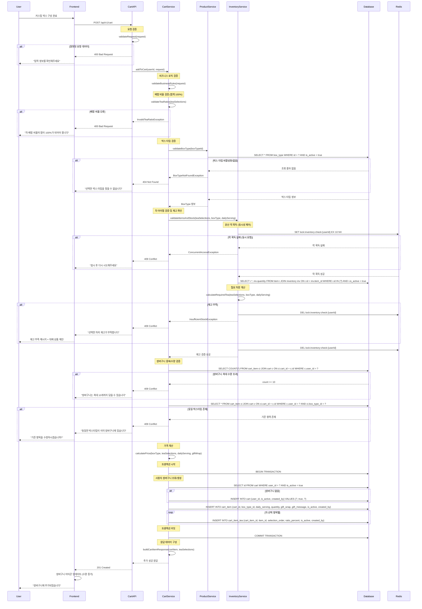

# 장바구니 추가 플로우

## 개요
- **목적**: 선택한 커스텀 박스를 장바구니에 추가
- **핵심 비즈니스 로직**: 재고 검증, 중복 방지, 수량 제한, 차 배합 비율 계산
- **주요 검증 사항**: 박스타입 유효성, 차 아이템 재고, 최대 수량, 배합 비율 합계

## API 엔드포인트

### Request
```http
POST /api/v1/cart
Authorization: Bearer {token}
Content-Type: application/json

{
  "boxTypeId": 2,
  "dailyServing": 2,
  "quantity": 1,
  "giftWrap": false,
  "giftMessage": null,
  "teaSelections": [
    {
      "itemId": 1,
      "selectionOrder": 1,
      "ratioPercent": 40
    },
    {
      "itemId": 3,
      "selectionOrder": 2,
      "ratioPercent": 35
    },
    {
      "itemId": 5,
      "selectionOrder": 3,
      "ratioPercent": 25
    }
  ]
}
```

### Response (성공)
```json
{
  "success": true,
  "data": {
    "cartItemId": 1,
    "boxType": {
      "id": 2,
      "name": "7일 박스",
      "days": 7
    },
    "dailyServing": 2,
    "quantity": 1,
    "totalTeaBags": 14,
    "estimatedPrice": 35000,
    "teaSelections": [
      {
        "item": {
          "id": 1,
          "name": "얼그레이",
          "category": "홍차"
        },
        "selectionOrder": 1,
        "ratioPercent": 40,
        "estimatedGrams": 168
      }
    ],
    "giftWrap": false,
    "message": "장바구니에 추가되었습니다"
  }
}
```

## 시퀀스 다이어그램



## 비즈니스 로직 상세

### 1. 차 배합 비율 검증
```kotlin
fun validateTeaRatios(teaSelections: List<TeaSelection>) {
    val totalRatio = teaSelections.sumOf { it.ratioPercent }
    if (totalRatio != 100) {
        throw InvalidTeaRatioException("차 배합 비율의 합이 100%가 되어야 합니다. 현재: ${totalRatio}%")
    }

    teaSelections.forEach { selection ->
        if (selection.ratioPercent < 5 || selection.ratioPercent > 80) {
            throw InvalidTeaRatioException("각 차의 배합 비율은 5% 이상 80% 이하여야 합니다")
        }
    }
}
```

### 2. 필요 차량 계산 로직
```kotlin
fun calculateRequiredTea(teaSelections: List<TeaSelection>, boxType: BoxType, dailyServing: Int): Map<Long, Int> {
    val totalTeaBags = boxType.days * dailyServing  // 예: 7일 * 2회 = 14개
    val avgBagWeight = 3  // 티백당 평균 3g
    val totalWeightNeeded = totalTeaBags * avgBagWeight  // 42g

    return teaSelections.associate { selection ->
        val weightForThisTea = (totalWeightNeeded * selection.ratioPercent / 100.0).toInt()
        selection.itemId to weightForThisTea  // 예: 얼그레이 40% = 16.8g ≈ 17g
    }
}
```

### 3. 가격 계산 로직
```kotlin
fun calculatePrice(boxType: BoxType, teaSelections: List<TeaSelection>, dailyServing: Int, giftWrap: Boolean): PriceBreakdown {
    val containerPrice = 5000  // 기본 용기 가격
    val teaPrice = calculateTeaPrice(teaSelections, boxType.days * dailyServing)
    val giftWrapPrice = if (giftWrap) 2000 else 0

    return PriceBreakdown(
        containerPrice = containerPrice,
        teaPrice = teaPrice,
        giftWrapPrice = giftWrapPrice,
        totalPrice = containerPrice + teaPrice + giftWrapPrice
    )
}

private fun calculateTeaPrice(teaSelections: List<TeaSelection>, totalBags: Int): Int {
    val totalWeightGrams = totalBags * 3  // 총 필요 차량 (g)

    return teaSelections.sumOf { selection ->
        val itemPrice = getItemPrice(selection.itemId)  // 100g당 가격
        val weightForThisItem = (totalWeightGrams * selection.ratioPercent / 100.0)
        val priceForThisItem = (itemPrice * weightForThisItem / 100.0).toInt()
        priceForThisItem
    }
}
```

## 비즈니스 정책 반영

### 장바구니 관리 정책 (BP-CART-001, BP-CART-002)
- **수량 제한**: 사용자당 최대 10개 항목
- **중복 방지**: 동일 박스타입의 커스텀 박스는 1개만 허용
- **유효 기간**: 장바구니 항목은 7일 후 자동 삭제 (배치 작업)

### 재고 관리 정책 (BP-INVENTORY-001, BP-INVENTORY-002)
- **실시간 재고 확인**: 장바구니 추가 시점에 실제 재고 검증
- **안전 재고 고려**: 필요량이 (현재재고 - 안전재고)를 초과하면 거부
- **동시성 제어**: Redis 분산 락으로 동시 재고 확인 방지

### 상품 구성 정책 (BP-PRODUCT-002, BP-PRODUCT-003)
- **배합 비율 제한**: 각 차는 5% 이상 80% 이하로 제한
- **최소/최대 차 종류**: 박스당 최소 2종, 최대 5종의 차 선택 가능

## 에러 처리

| 에러 코드 | HTTP 상태 | 시나리오 | 메시지 |
|----------|----------|----------|--------|
| CART001 | 400 | 잘못된 배합 비율 | "차 배합 비율의 합이 100%가 되어야 합니다" |
| CART002 | 400 | 배합 비율 범위 초과 | "각 차의 배합 비율은 5% 이상 80% 이하여야 합니다" |
| CART003 | 409 | 장바구니 최대 수량 초과 | "장바구니는 최대 10개까지 담을 수 있습니다" |
| CART004 | 409 | 동일 박스타입 중복 | "동일한 박스타입이 이미 장바구니에 있습니다" |
| INVENTORY001 | 409 | 재고 부족 | "선택한 차의 재고가 부족합니다" |
| PRODUCT001 | 404 | 박스타입 없음 | "선택한 박스 타입을 찾을 수 없습니다" |
| PRODUCT002 | 404 | 차 아이템 없음 | "선택한 차를 찾을 수 없습니다" |
| SYSTEM003 | 409 | 동시 요청 충돌 | "잠시 후 다시 시도해주세요" |

상세한 에러 코드는 [../api-specification.md#8-에러-코드](../api-specification.md#8-에러-코드) 참조

## 성능 고려사항

### 1. 데이터베이스 최적화
```sql
-- 장바구니 조회 최적화 인덱스
CREATE INDEX idx_cart_user_active ON cart(user_id, is_active);
CREATE INDEX idx_cart_item_cart_box ON cart_item(cart_id, box_type_id);

-- 재고 조회 최적화 인덱스
CREATE INDEX idx_inventory_item ON inventory(item_id);
```

### 2. 동시성 제어
- **Redis 분산 락**: 사용자별 재고 확인 시 10초 타임아웃
- **데이터베이스 트랜잭션**: 장바구니 항목 생성만 트랜잭션 처리
- **낙관적 락**: 재고 테이블의 version 컬럼 활용

### 3. 캐싱 전략
- **상품 정보**: 1시간 캐시 (변경 빈도 낮음)
- **재고 정보**: 실시간 조회 (정확성 중요)
- **사용자 장바구니**: 세션 기반 임시 캐시

## 테스트 시나리오

### 기능 테스트
1. **정상 케이스**
   - 올바른 배합 비율(100%)로 커스텀 박스 추가
   - 선물 포장 옵션 포함 추가
   - 다양한 하루 섭취량(1/2/3회) 설정

2. **예외 케이스**
   - 배합 비율 오류 (합계 ≠ 100%)
   - 재고 부족한 차 선택
   - 장바구니 최대 수량 초과
   - 동일 박스타입 중복 추가

### 성능 테스트
1. **동시성 테스트**: 동일 사용자의 동시 장바구니 추가 요청
2. **부하 테스트**: 1000명 동시 장바구니 추가
3. **트랜잭션 테스트**: 데이터베이스 락 및 롤백 확인

### 통합 테스트
1. **재고 연동 테스트**: 실제 재고 차감과 장바구니 추가 연계
2. **가격 계산 테스트**: 복잡한 배합 비율의 정확한 가격 산정
3. **에러 복구 테스트**: 중간 실패 시 데이터 정합성 확인