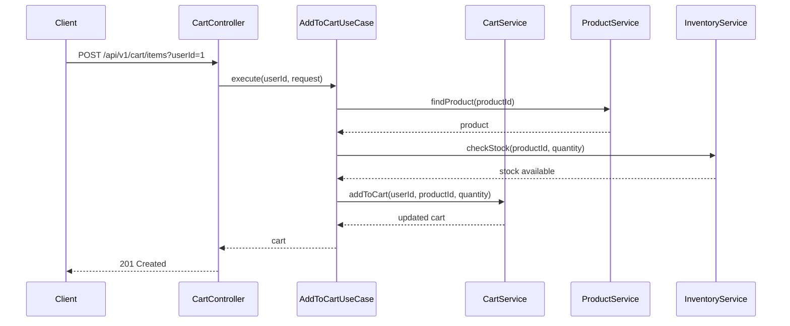
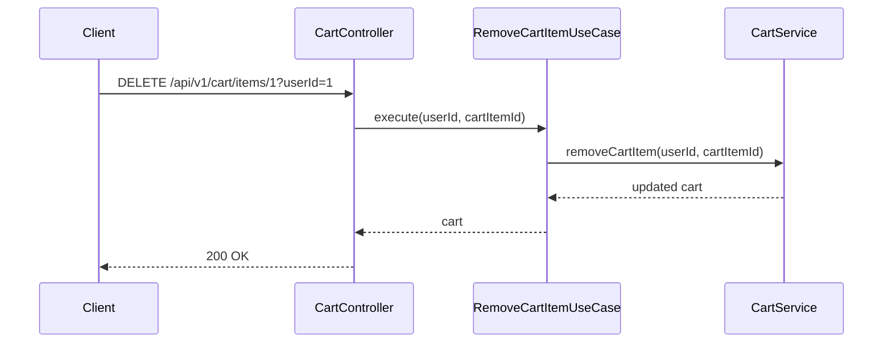

# 장바구니 API 명세서

## 개요
사용자의 장바구니 관리를 위한 REST API입니다. 간단한 상품ID + 수량 기반의 상품 추가, 수량 변경, 삭제 등의 기능을 제공합니다.

## 기본 정보
- **Base URL**: `/api/v1/cart`
- **Content-Type**: `application/json`
- **인증**: JWT 토큰 (Bearer 방식)

## API 엔드포인트

### 1. 장바구니 조회
**UseCase**: `GetCartUseCase`

```http
GET /api/v1/cart?userId={userId}
```

**Request Parameters**:
- `userId` (Long, required): 사용자 ID

> **💡 미래 변경 사항**:
> 현재는 `userId` 파라미터를 받지만, 향후 Spring Security Context에서 자동으로 추출 예정

**Response**:
```json
{
  "success": true,
  "data": {
    "id": 1,
    "userId": 1,
    "items": [
      {
        "id": 1,
        "productId": 1,
        "productName": "프리미엄 얼그레이 티백",
        "unitPrice": 25000,
        "quantity": 2,
        "totalPrice": 50000,
        "createdAt": "2024-11-07T10:00:00Z",
        "updatedAt": "2024-11-07T10:00:00Z"
      }
    ],
    "totalItems": 1,
    "createdAt": "2024-11-07T09:00:00Z",
    "updatedAt": "2024-11-07T10:00:00Z"
  }
}
```

### 2. 장바구니에 상품 추가
**UseCase**: `AddToCartUseCase`

```http
POST /api/v1/cart/items?userId={userId}
```

**Request Parameters**:
- `userId` (Long, required): 사용자 ID

**Request Body**:
```json
{
  "productId": 1,
  "quantity": 2,
  "addedBy": 1
}
```

**Request Fields**:
- `productId` (Long, required): 상품 ID
- `quantity` (Int, required): 수량 (1-999)
- `addedBy` (Long, required): 추가한 사용자 ID

**Response**:
```json
{
  "success": true,
  "data": {
    "id": 1,
    "userId": 1,
    "items": [
      {
        "id": 1,
        "productId": 1,
        "productName": "프리미엄 염그레이 티백",
        "unitPrice": 25000,
        "quantity": 2,
        "totalPrice": 50000,
        "createdAt": "2024-11-07T10:00:00Z",
        "updatedAt": "2024-11-07T10:00:00Z"
      }
    ]
  }
}
```

### 3. 장바구니 아이템 수량 변경
**UseCase**: `UpdateCartItemUseCase`

```http
PUT /api/v1/cart/items/{cartItemId}?userId={userId}&quantity={quantity}
```

**Path Parameters**:
- `cartItemId` (Long, required): 장바구니 아이템 ID

**Query Parameters**:
- `userId` (Long, required): 사용자 ID
- `quantity` (Int, required): 변경할 수량

**Response**:
```json
{
  "success": true,
  "data": {
    "id": 1,
    "userId": 1,
    "items": [
      {
        "id": 1,
        "productId": 1,
        "productName": "프리미엄 염그레이 티백",
        "unitPrice": 25000,
        "quantity": 5,
        "totalPrice": 125000,
        "updatedAt": "2024-11-07T10:30:00Z"
      }
    ]
  }
}
```

### 4. 장바구니 아이템 삭제
**UseCase**: `RemoveCartItemUseCase`

```http
DELETE /api/v1/cart/items/{cartItemId}?userId={userId}
```

**Path Parameters**:
- `cartItemId` (Long, required): 삭제할 장바구니 아이템 ID

**Query Parameters**:
- `userId` (Long, required): 사용자 ID

**Response**:
```json
{
  "success": true,
  "data": {
    "id": 1,
    "userId": 1,
    "items": [],
    "totalItems": 0
  }
}
```

### 5. 장바구니 전체 비우기
**UseCase**: `ClearCartUseCase`

```http
DELETE /api/v1/cart?userId={userId}
```

**Query Parameters**:
- `userId` (Long, required): 사용자 ID

**Response**:
```json
{
  "success": true,
  "data": {
    "id": 1,
    "userId": 1,
    "items": [],
    "totalItems": 0
  }
}
```

## 에러 코드

| 코드 | HTTP 상태 | 메시지 | 설명 |
|-----|----------|--------|------|
| CART001 | 404 | 장바구니 아이템을 찾을 수 없습니다 | 아이템 ID 무효 |
| CART002 | 403 | 장바구니 접근 권한이 없습니다 | 다른 사용자의 장바구니 |
| CART003 | 400 | 유효하지 않은 수량입니다 | 0 이하 또는 999 초과 |
| CART004 | 409 | 장바구니 최대 개수 초과 | 50개 제한 초과 |
| CART005 | 409 | 동일한 상품 중복 | 이미 장바구니에 있는 상품 |

## 시퀀스 다이어그램

### 1. 장바구니에 상품 추가 플로우


### 2. 장바구니 아이템 제거 플로우


## 비즈니스 정책

### 1. 장바구니 관리 정책

#### 1.1 최대 장바구니 항목 제한
- **정책**: 사용자당 최대 50개의 아이템까지만 장바구니에 담기 가능
- **검증 시점**: 장바구니 추가 요청 시
- **예외**: `CART004` - "장바구니 최대 개수 초과 (50개 제한)"

#### 1.2 동일 상품 중복 방지
- **정책**: 동일한 상품은 장바구니에 1개만 허용 (수량 변경으로 처리)
- **검증 시점**: 장바구니 추가 요청 시
- **예외**: `CART005` - "동일한 상품이 이미 장바구니에 있습니다. 수량을 변경해주세요."

#### 1.3 수량 제한
- **정책**: 아이템별 최대 수량 999개, 최소 1개
- **검증 시점**: 수량 변경 요청 시
- **예외**: `CART003` - "유효하지 않은 수량입니다 (1-999)"

### 2. 재고 연동 정책

#### 2.1 실시간 재고 확인
- **정책**: 장바구니 추가/수정 시 실시간 재고 확인 필요
- **검증 시점**: 상품 추가 및 수량 변경 시
- **예외**: `INSUFFICIENT_STOCK` - "재고 부족"

#### 2.2 품절 상품 처리
- **정책**: 재고가 0이 된 상품은 장바구니에서 표시하되 주문 불가
- **처리 방식**: 장바구니 조회 시 재고 상태 실시간 확인

### 3. 세션 관리 정책

#### 3.1 장바구니 유지 기간
- **비로그인 사용자**: 30일간 브라우저 저장소에 임시 저장
- **로그인 사용자**: 서버에 영구 저장 (90일 후 자동 삭제)

#### 3.2 동시성 제어
- **정책**: 같은 사용자의 장바구니 동시 수정 방지
- **구현**: 사용자별 Optimistic Locking 적용

### Value Object 사용
- `Quantity`: 수량 검증 (1-999 범위)
- 타입 안전성과 비즈니스 규칙 내장

## 관련 도메인
- **Product**: 상품 정보 및 가격 정보 참조
- **User**: 사용자 정보 참조
- **Order**: 주문 생성 시 장바구니 데이터 사용 (상품ID + 수량)