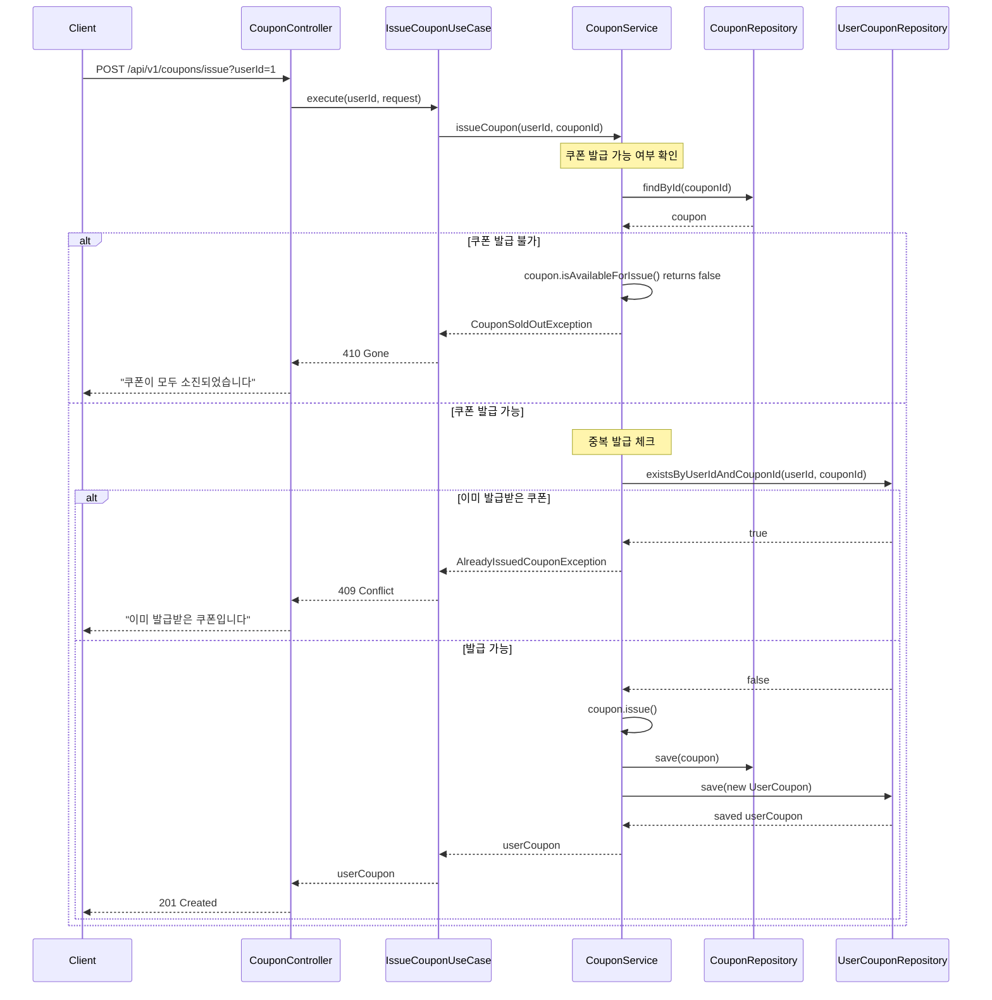
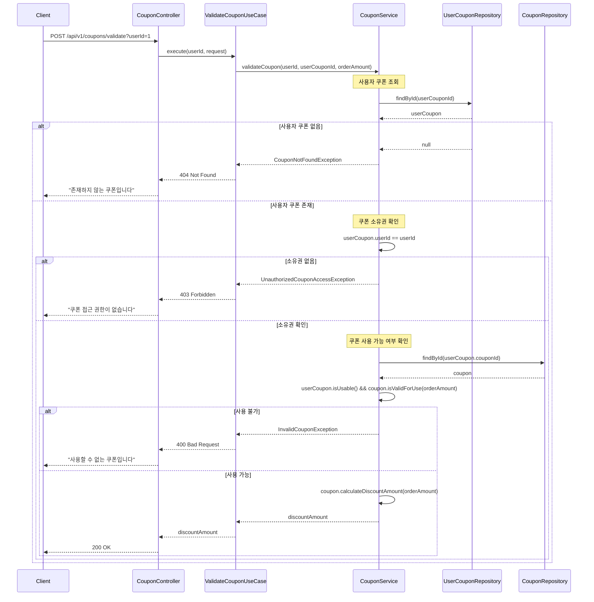
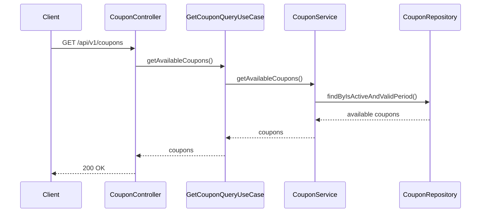
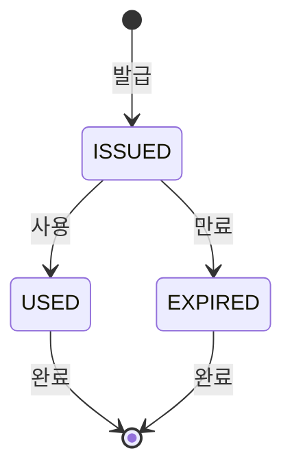

# 쿠폰 API 명세서

## 개요
쿠폰 발급, 사용, 검증을 위한 REST API입니다. 선착순 쿠폰 발급과 사용자별 쿠폰 관리 기능을 제공합니다.

## 기본 정보
- **Base URL**: `/api/v1/coupons`
- **Content-Type**: `application/json`
- **인증**: JWT 토큰 (Bearer 방식, 쿠폰 조회는 불필요)

## API 엔드포인트

### 1. 사용 가능한 쿠폰 목록 조회
**UseCase**: `GetCouponQueryUseCase.getAvailableCoupons()`

```http
GET /api/v1/coupons
```

**Response**:
```json
{
  "success": true,
  "data": [
    {
      "id": 1,
      "name": "신규 가입 50% 할인",
      "code": "WELCOME50",
      "discountType": "PERCENTAGE",
      "discountValue": 50,
      "minimumOrderAmount": 20000,
      "totalQuantity": 1000,
      "issuedQuantity": 756,
      "version": 0,
      "validFrom": "2024-11-01T00:00:00",
      "validTo": "2024-11-30T23:59:59",
      "isActive": true,
      "createdAt": "2024-11-01T00:00:00Z",
      "updatedAt": "2024-11-07T10:30:00Z"
    }
  ]
}
```

### 2. 쿠폰 발급
**UseCase**: `IssueCouponUseCase`

```http
POST /api/v1/coupons/issue?userId={userId}
```

**Query Parameters**:
- `userId` (Long, required): 쿠폰을 발급받을 사용자 ID

**Request Body**:
```json
{
  "couponId": 1
}
```

**Request Fields**:
- `couponId` (Long, required): 발급받을 쿠폰 ID

**Response**:
```json
{
  "success": true,
  "data": {
    "id": 1,
    "userId": 1,
    "couponId": 1,
    "issuedAt": "2024-11-07T10:00:00",
    "usedAt": null,
    "usedOrderId": null,
    "status": "ISSUED",
    "isActive": true,
    "createdAt": "2024-11-07T10:00:00Z",
    "updatedAt": "2024-11-07T10:00:00Z"
  }
}
```

### 3. 사용자의 모든 쿠폰 조회
**UseCase**: `GetCouponQueryUseCase.getUserCoupons()`

```http
GET /api/v1/coupons/users/{userId}
```

**Path Parameters**:
- `userId` (Long, required): 사용자 ID

**Response**:
```json
{
  "success": true,
  "data": [
    {
      "id": 1,
      "userId": 1,
      "couponId": 1,
      "issuedAt": "2024-11-07T10:00:00",
      "usedAt": null,
      "usedOrderId": null,
      "status": "ISSUED",
      "isActive": true,
      "createdAt": "2024-11-07T10:00:00Z",
      "updatedAt": "2024-11-07T10:00:00Z"
    }
  ]
}
```

### 4. 사용자의 사용 가능한 쿠폰 조회
**UseCase**: `GetCouponQueryUseCase.getAvailableUserCoupons()`

```http
GET /api/v1/coupons/users/{userId}/available
```

**Path Parameters**:
- `userId` (Long, required): 사용자 ID

**Response**:
```json
{
  "success": true,
  "data": [
    {
      "id": 1,
      "userId": 1,
      "couponId": 1,
      "issuedAt": "2024-11-07T10:00:00",
      "usedAt": null,
      "usedOrderId": null,
      "status": "ISSUED",
      "isActive": true,
      "createdAt": "2024-11-07T10:00:00Z",
      "updatedAt": "2024-11-07T10:00:00Z"
    }
  ]
}
```

### 5. 쿠폰 사용 유효성 검증
**UseCase**: `ValidateCouponUseCase`

```http
POST /api/v1/coupons/validate?userId={userId}
```

**Query Parameters**:
- `userId` (Long, required): 쿠폰을 사용할 사용자 ID

**Request Body**:
```json
{
  "userCouponId": 1,
  "orderAmount": 50000
}
```

**Request Fields**:
- `userCouponId` (Long, required): 사용자 쿠폰 ID
- `orderAmount` (Long, required): 주문 금액

**Response**:
```json
{
  "success": true,
  "data": 25000
}
```

## 시퀀스 다이어그램

### 1. 쿠폰 발급 플로우


### 2. 쿠폰 검증 플로우


### 3. 쿠폰 목록 조회 플로우


## 에러 코드

| 코드 | HTTP 상태 | 메시지 | 설명 |
|-----|----------|--------|------|
| COUPON001 | 410 | 쿠폰이 모두 소진되었습니다 | 선착순 수량 소진 |
| COUPON002 | 409 | 이미 발급받은 쿠폰입니다 | 1인 1매 제한 |
| COUPON003 | 400 | 만료된 쿠폰입니다 | 유효기간 만료 |
| COUPON004 | 404 | 존재하지 않는 쿠폰입니다 | 쿠폰 ID 무효 |
| COUPON005 | 400 | 사용할 수 없는 쿠폰입니다 | 비활성화된 쿠폰 |
| COUPON006 | 400 | 최소 주문 금액을 충족하지 못했습니다 | 최소 금액 미달 |
| COUPON007 | 400 | 이미 사용된 쿠폰입니다 | 사용 완료 쿠폰 |
| COUPON008 | 403 | 쿠폰 접근 권한이 없습니다 | 타인의 쿠폰 사용 시도 |

## 비즈니스 정책

### 1. 쿠폰 발급 정책

#### 1.1 선착순 쿠폰 수량 제한
- **정책**: 쿠폰별로 설정된 최대 발급 수량 초과 불가
- **검증 시점**: 쿠폰 발급 요청 시
- **예외**: `COUPON001` - "쿠폰이 모두 소진되었습니다"
- **동시성 제어**: Redis Lua Script 또는 DB 유니크 제약조건 활용

#### 1.2 중복 발급 방지
- **정책**: 동일 사용자에게 동일 쿠폰 중복 발급 불가 (1인 1매 제한)
- **검증 시점**: 쿠폰 발급 요청 시
- **예외**: `COUPON002` - "이미 발급받은 쿠폰입니다"

#### 1.3 발급 기간 제한
- **정책**: 쿠폰별로 설정된 발급 기간 내에서만 발급 가능
- **검증 시점**: 쿠폰 발급 요청 시
- **조건**: validFrom ≤ 현재시간 ≤ validTo

### 2. 쿠폰 사용 정책

#### 2.1 쿠폰 유효성 검증
- **정책**: 만료된 쿠폰 또는 사용된 쿠폰 사용 불가
- **검증 조건**:
  - 만료일 < 현재시간 → `COUPON003` - "만료된 쿠폰입니다"
  - 이미 사용된 쿠폰 → `COUPON007` - "이미 사용된 쿠폰입니다"
  - status ≠ ISSUED → `COUPON005` - "사용할 수 없는 쿠폰입니다"

#### 2.2 최소 주문 금액 검증
- **정책**: 쿠폰별로 설정된 최소 주문 금액 충족 필요
- **검증 시점**: 쿠폰 적용 요청 시
- **예외**: `COUPON006` - "최소 주문 금액을 충족하지 못했습니다"

#### 2.3 소유권 검증
- **정책**: 본인이 발급받은 쿠폰만 사용 가능
- **검증 시점**: 쿠폰 사용 요청 시
- **예외**: `COUPON008` - "쿠폰 접근 권한이 없습니다"

### 3. 할인 계산 정책

#### 3.1 할인 타입별 계산
```kotlin
// 퍼센트 할인
val discountAmount = (orderAmount * discountValue / 100)
    .coerceAtMost(orderAmount)

// 정액 할인
val discountAmount = minOf(discountValue, orderAmount)
```

#### 3.2 할인 한도 제한
- **퍼센트 할인**: 주문 금액의 100%를 초과할 수 없음
- **정액 할인**: 주문 금액을 초과할 수 없음
- **최종 금액**: 0원 미만이 될 수 없음

### 4. 동시성 제어 정책

#### 4.1 선착순 발급 정합성
- **정책**: 동시에 같은 쿠폰을 발급 요청할 때 정확한 수량 보장
- **구현**: Redis 분산락 또는 DB 비관적 락 사용
- **타임아웃**: 3초
- **예외**: `CONCURRENCY002` - "중복된 요청입니다. 잠시 후 다시 시도해주세요"

#### 4.2 버전 관리
- **정책**: Coupon 엔티티의 version 필드로 낙관적 락
- **적용 범위**: 쿠폰 수량 증가, 상태 변경

### 5. 쿠폰 상태 관리

#### 쿠폰 상태 전이


#### 할인 타입
- **PERCENTAGE**: 퍼센트 할인 (1-100%)
- **FIXED**: 정액 할인 (원 단위)

### Value Object 사용
- `CouponCode`: 쿠폰 코드 형식 및 길이 검증
- 타입 안전성과 비즈니스 규칙 내장

## 관련 도메인
- **User**: 사용자별 쿠폰 발급 관리
- **Order**: 주문 시 쿠폰 적용
- **Payment**: 할인 금액 반영한 결제