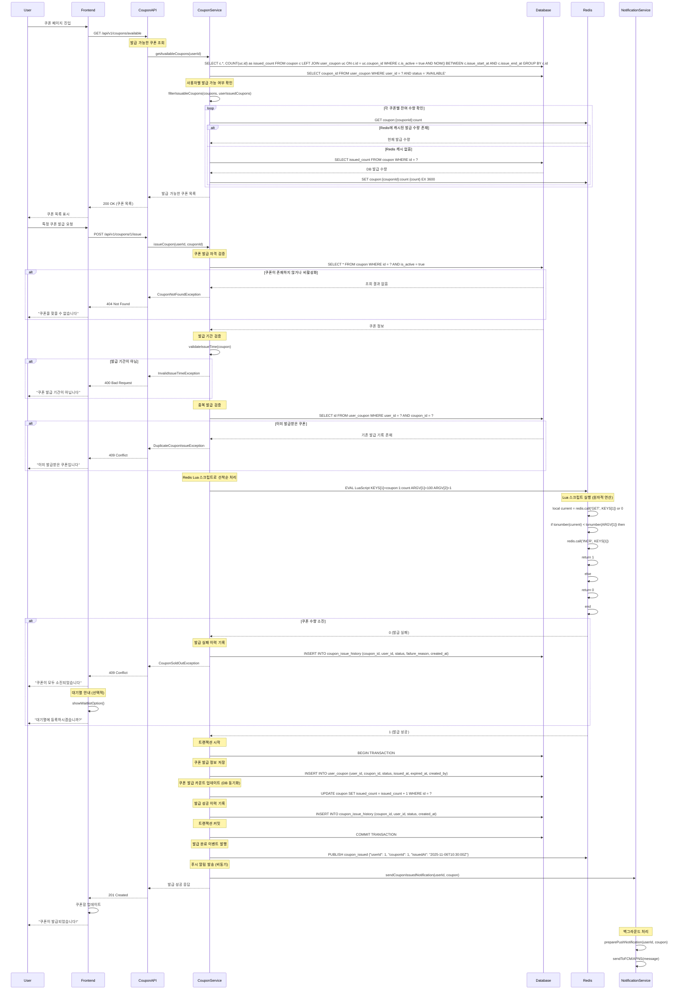

# 선착순 쿠폰 발급 플로우

## 개요
- **목적**: 한정 수량의 쿠폰을 선착순으로 사용자에게 발급
- **핵심 비즈니스 로직**: Redis 원자적 연산을 통한 선착순 처리, 중복 발급 방지, 발급 실패 시 대기열 관리
- **주요 검증 사항**: 쿠폰 발급 가능 여부, 사용자 중복 발급 확인, 발급 기간 유효성

## API 엔드포인트

### 1. 발급 가능한 쿠폰 목록 조회

#### Request
```http
GET /api/v1/coupons/available
Authorization: Bearer {token}
```

#### Response (성공)
```json
{
  "success": true,
  "data": [
    {
      "id": 1,
      "code": "FIRST50",
      "name": "첫구매 50% 할인",
      "discountType": "PERCENTAGE",
      "discountValue": 50,
      "minOrderAmount": 20000,
      "maxDiscountAmount": 30000,
      "maxIssueCount": 100,
      "remainingCount": 23,
      "issueStartAt": "2025-11-06T00:00:00Z",
      "issueEndAt": "2025-11-10T23:59:59Z",
      "validDays": 30,
      "issuable": true
    }
  ]
}
```

### 2. 쿠폰 발급 요청

#### Request
```http
POST /api/v1/coupons/{couponId}/issue
Authorization: Bearer {token}
```

#### Response (성공)
```json
{
  "success": true,
  "data": {
    "userCouponId": 1,
    "coupon": {
      "id": 1,
      "code": "FIRST50",
      "name": "첫구매 50% 할인",
      "discountType": "PERCENTAGE",
      "discountValue": 50,
      "minOrderAmount": 20000,
      "maxDiscountAmount": 30000
    },
    "status": "ISSUED",
    "issuedAt": "2025-11-06T10:30:00Z",
    "expiredAt": "2025-12-06T23:59:59Z",
    "message": "쿠폰이 성공적으로 발급되었습니다"
  }
}
```

#### Response (실패 - 품절)
```json
{
  "success": false,
  "error": {
    "code": "COUPON002",
    "message": "쿠폰이 모두 소진되었습니다",
    "details": {
      "couponName": "첫구매 50% 할인",
      "maxIssueCount": 100,
      "issuedCount": 100
    }
  }
}
```

## 시퀀스 다이어그램



## 비즈니스 로직 상세

### 1. Redis Lua 스크립트 (원자적 선착순 처리)
```lua
-- coupon_issue.lua
local key = KEYS[1]                    -- coupon:{couponId}:count
local maxIssue = tonumber(ARGV[1])     -- 최대 발급 수량
local increment = tonumber(ARGV[2])    -- 증가량 (보통 1)

local current = tonumber(redis.call('GET', key) or 0)

if current < maxIssue then
    local newCount = redis.call('INCR', key)
    -- 첫 번째 발급 시 TTL 설정 (발급 종료시간까지)
    if newCount == 1 then
        redis.call('EXPIREAT', key, ARGV[3])  -- ARGV[3] = 발급종료시간 unix timestamp
    end
    return newCount
else
    return 0  -- 발급 실패
end
```

### 2. 쿠폰 발급 서비스 로직
```kotlin
@Transactional
fun issueCoupon(userId: Long, couponId: Long): UserCoupon {
    // 1. 쿠폰 기본 정보 검증
    val coupon = couponRepository.findByIdAndIsActive(couponId, true)
        ?: throw CouponNotFoundException("쿠폰을 찾을 수 없습니다")

    // 2. 발급 기간 검증
    val now = LocalDateTime.now()
    if (now.isBefore(coupon.issueStartAt) || now.isAfter(coupon.issueEndAt)) {
        throw InvalidIssueTimeException("쿠폰 발급 기간이 아닙니다")
    }

    // 3. 중복 발급 검증
    val existingCoupon = userCouponRepository.findByUserIdAndCouponId(userId, couponId)
    if (existingCoupon != null) {
        throw DuplicateCouponIssueException("이미 발급받은 쿠폰입니다")
    }

    // 4. Redis Lua 스크립트로 선착순 처리
    val issueResult = redisTemplate.execute(
        couponIssueLuaScript,
        listOf("coupon:$couponId:count"),
        coupon.maxIssueCount.toString(),
        "1",
        coupon.issueEndAt.toEpochSecond().toString()
    ) as Long

    if (issueResult == 0L) {
        // 발급 실패 이력 기록
        couponIssueHistoryRepository.save(
            CouponIssueHistory(
                couponId = couponId,
                userId = userId,
                status = IssueStatus.SOLD_OUT,
                failureReason = "쿠폰 수량 소진"
            )
        )
        throw CouponSoldOutException("쿠폰이 모두 소진되었습니다")
    }

    // 5. 쿠폰 발급 정보 저장
    val expiredAt = LocalDateTime.now().plusDays(coupon.validDays.toLong())
    val userCoupon = UserCoupon(
        userId = userId,
        couponId = couponId,
        status = CouponStatus.AVAILABLE,
        issuedAt = LocalDateTime.now(),
        expiredAt = expiredAt
    )

    val savedUserCoupon = userCouponRepository.save(userCoupon)

    // 6. 쿠폰 마스터 테이블 발급 카운트 동기화
    couponRepository.incrementIssuedCount(couponId)

    // 7. 발급 성공 이력 기록
    couponIssueHistoryRepository.save(
        CouponIssueHistory(
            couponId = couponId,
            userId = userId,
            status = IssueStatus.SUCCESS
        )
    )

    // 8. 이벤트 발행 (비동기 처리용)
    applicationEventPublisher.publishEvent(
        CouponIssuedEvent(userId, couponId, savedUserCoupon.id)
    )

    return savedUserCoupon
}
```

### 3. 대기열 관리 로직 (선택적 기능)
```kotlin
fun registerToWaitlist(userId: Long, couponId: Long): WaitlistEntry {
    val waitlistKey = "coupon:$couponId:waitlist"
    val score = System.currentTimeMillis().toDouble()  // 타임스탬프 기반 순서

    // Redis Sorted Set을 이용한 대기열
    redisTemplate.opsForZSet().add(waitlistKey, userId.toString(), score)

    // 대기열 순서 조회
    val rank = redisTemplate.opsForZSet().rank(waitlistKey, userId.toString())?.plus(1) ?: 0

    return WaitlistEntry(
        userId = userId,
        couponId = couponId,
        position = rank,
        estimatedWaitTime = calculateEstimatedWaitTime(rank)
    )
}

// 쿠폰 추가 발급 시 대기열에서 자동 발급
@EventListener
fun handleCouponRestocked(event: CouponRestockedEvent) {
    val waitlistKey = "coupon:${event.couponId}:waitlist"
    val waitingUsers = redisTemplate.opsForZSet()
        .range(waitlistKey, 0, event.additionalQuantity - 1)

    waitingUsers?.forEach { userId ->
        try {
            issueCoupon(userId.toLong(), event.couponId)
            redisTemplate.opsForZSet().remove(waitlistKey, userId)

            // 자동 발급 알림
            notificationService.sendAutoCouponIssueNotification(userId.toLong(), event.couponId)
        } catch (e: Exception) {
            logger.warn("대기열 자동 발급 실패: userId=$userId, couponId=${event.couponId}", e)
        }
    }
}
```

## 비즈니스 정책 반영

### 쿠폰 발급 정책 (BP-COUPON-001, BP-COUPON-002, BP-COUPON-003)
- **1인 1매 제한**: 동일 쿠폰은 사용자당 1매만 발급 가능
- **선착순 발급**: Redis 원자적 연산으로 정확한 선착순 보장
- **발급 기간 제한**: 설정된 기간 내에만 발급 가능

### 동시성 제어 정책 (BP-CONCURRENCY-001)
- **Redis Lua 스크립트**: 멀티스레드 환경에서 원자적 연산 보장
- **데이터 정합성**: Redis 카운트와 DB 발급 수량 주기적 동기화
- **장애 복구**: Redis 장애 시 DB 기반 fallback 로직

### 사용자 경험 정책 (BP-UX-001)
- **실시간 업데이트**: WebSocket을 통한 실시간 잔여 수량 표시
- **대기열 시스템**: 품절 시 대기열 등록 옵션 제공
- **알림 서비스**: 발급 성공/실패 즉시 푸시 알림

## 에러 처리

| 에러 코드 | HTTP 상태 | 시나리오 | 메시지 |
|----------|----------|----------|--------|
| COUPON001 | 404 | 존재하지 않는 쿠폰 | "쿠폰을 찾을 수 없습니다" |
| COUPON002 | 409 | 쿠폰 수량 소진 | "쿠폰이 모두 소진되었습니다" |
| COUPON003 | 409 | 중복 발급 시도 | "이미 발급받은 쿠폰입니다" |
| COUPON004 | 400 | 발급 기간 외 | "쿠폰 발급 기간이 아닙니다" |
| COUPON005 | 429 | 과도한 요청 | "너무 많은 요청입니다. 잠시 후 시도해주세요" |
| SYSTEM001 | 500 | Redis 연결 실패 | "일시적인 오류가 발생했습니다" |
| SYSTEM002 | 503 | 서비스 점검 중 | "서비스 점검 중입니다" |

상세한 에러 코드는 [../api-specification.md#8-에러-코드](../api-specification.md#8-에러-코드) 참조

## 성능 고려사항

### 1. Redis 최적화
```lua
-- 배치 발급 지원 Lua 스크립트
local key = KEYS[1]
local maxIssue = tonumber(ARGV[1])
local requestCount = tonumber(ARGV[2])
local expireAt = tonumber(ARGV[3])

local current = tonumber(redis.call('GET', key) or 0)
local available = maxIssue - current

if available >= requestCount then
    local newCount = redis.call('INCRBY', key, requestCount)
    if current == 0 then
        redis.call('EXPIREAT', key, expireAt)
    end
    return newCount
else
    return -1 * available  -- 음수로 부족한 수량 반환
end
```

### 2. 데이터베이스 최적화
```sql
-- 쿠폰 발급 이력 조회 최적화
CREATE INDEX idx_coupon_issue_history_coupon_created ON coupon_issue_history(coupon_id, created_at DESC);

-- 사용자 쿠폰 조회 최적화
CREATE INDEX idx_user_coupon_user_status_expired ON user_coupon(user_id, status, expired_at);

-- 쿠폰 발급 수량 동기화를 위한 집계 인덱스
CREATE INDEX idx_user_coupon_coupon_created ON user_coupon(coupon_id, created_at);
```

### 3. 캐싱 전략
- **쿠폰 기본 정보**: 1시간 캐시 (변경 빈도 낮음)
- **발급 수량**: Redis 실시간 관리 + 10분마다 DB 동기화
- **사용자 발급 여부**: 5분 캐시 (중복 발급 방지)

## 모니터링 및 알림

### 1. 주요 메트릭
- **발급 성공률**: 90% 이상 목표 (시스템 안정성)
- **평균 발급 처리 시간**: 500ms 이하 목표
- **Redis-DB 동기화율**: 99.9% 이상 목표

### 2. 실시간 모니터링
```kotlin
@Component
class CouponMetricsCollector {

    @EventListener
    fun handleCouponIssued(event: CouponIssuedEvent) {
        meterRegistry.counter("coupon.issued", "couponId", event.couponId.toString()).increment()
    }

    @EventListener
    fun handleCouponIssueFailed(event: CouponIssueFailedEvent) {
        meterRegistry.counter("coupon.issue.failed",
            "couponId", event.couponId.toString(),
            "reason", event.reason
        ).increment()
    }

    @Scheduled(fixedRate = 30000) // 30초마다
    fun collectRemainingCoupons() {
        couponRepository.findAllActive().forEach { coupon ->
            val remaining = coupon.maxIssueCount - coupon.issuedCount
            meterRegistry.gauge("coupon.remaining", Tags.of("couponId", coupon.id.toString()), remaining)
        }
    }
}
```

### 3. 알림 설정
- **쿠폰 잔여 10% 이하**: 운영팀 알림
- **발급 실패율 5% 초과**: 개발팀 긴급 알림
- **Redis 장애**: 즉시 알림 및 fallback 모드 전환

## 테스트 시나리오

### 부하 테스트
1. **동시 발급 테스트**: 1000명이 동시에 같은 쿠폰 발급 요청
2. **Redis 성능 테스트**: 초당 1000건 Lua 스크립트 실행
3. **DB 동기화 테스트**: 대량 발급 후 정합성 확인

### 장애 시나리오 테스트
1. **Redis 장애**: Redis 다운 시 DB fallback 동작 확인
2. **DB 장애**: 쿠폰 발급 중 DB 연결 실패 시 롤백 확인
3. **네트워크 지연**: 외부 알림 서비스 지연 시 비동기 처리 확인

### 비즈니스 로직 테스트
1. **정확한 선착순**: 동시 요청 시 정확히 설정된 수량만큼만 발급
2. **중복 발급 방지**: 동일 사용자의 연속 요청 차단
3. **대기열 동작**: 품절 후 추가 발급 시 대기열 순서대로 자동 발급