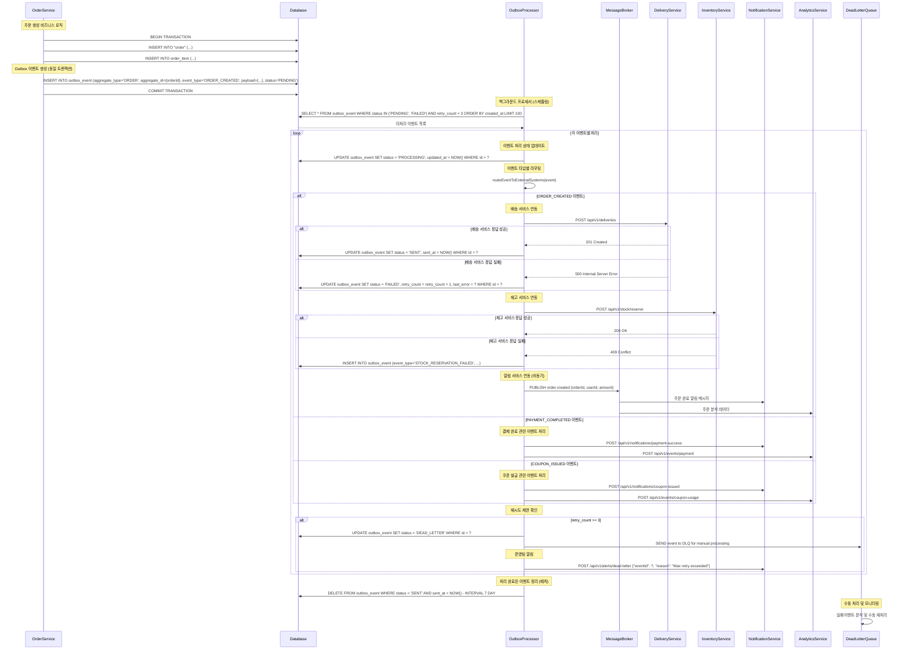

# 외부 시스템 연동 플로우 (Outbox Pattern)

## 개요
- **목적**: 트랜잭션 보장과 함께 외부 시스템(배송, 재고, 알림, 분석)에 안정적으로 이벤트 전달
- **핵심 비즈니스 로직**: 이벤트 저장과 비즈니스 로직을 동일 트랜잭션으로 처리, 재시도 메커니즘, 순서 보장
- **주요 검증 사항**: 이벤트 중복 방지, 전송 실패 시 재시도, Dead Letter Queue 처리

## 연동 대상 외부 시스템

### 1. 배송 관리 시스템 (Delivery Service)
- **목적**: 주문 생성 시 배송 정보 전달
- **이벤트**: ORDER_CREATED, ORDER_CANCELLED, ADDRESS_CHANGED

### 2. 재고 관리 시스템 (Inventory Service)
- **목적**: 실시간 재고 동기화
- **이벤트**: STOCK_RESERVED, STOCK_RELEASED, STOCK_ADJUSTED

### 3. 알림 서비스 (Notification Service)
- **목적**: 사용자 알림 및 마케팅 메시지
- **이벤트**: ORDER_COMPLETED, COUPON_ISSUED, PAYMENT_FAILED

### 4. 데이터 분석 시스템 (Analytics Service)
- **목적**: 사용자 행동 분석 및 비즈니스 인텔리전스
- **이벤트**: USER_ACTION, ORDER_ANALYTICS, PRODUCT_VIEW

## 시퀀스 다이어그램



## 비즈니스 로직 상세

### 1. Outbox 이벤트 생성 로직
```kotlin
@Transactional
fun createOrderWithOutboxEvent(orderRequest: OrderRequest): Order {
    // 1. 비즈니스 로직 실행
    val order = createOrder(orderRequest)

    // 2. 동일 트랜잭션 내에서 Outbox 이벤트 저장
    val outboxEvent = OutboxEvent(
        aggregateType = "ORDER",
        aggregateId = order.id,
        eventType = "ORDER_CREATED",
        payload = objectMapper.writeValueAsString(
            OrderCreatedEvent(
                orderId = order.id,
                userId = order.userId,
                orderNumber = order.orderNumber,
                totalAmount = order.finalAmount,
                items = order.items.map { it.toEventData() },
                deliveryAddress = order.deliveryAddress,
                orderedAt = order.orderedAt
            )
        ),
        status = OutboxStatus.PENDING,
        retryCount = 0
    )

    outboxEventRepository.save(outboxEvent)

    return order
}
```

### 2. Outbox 프로세서 로직
```kotlin
@Component
class OutboxEventProcessor {

    @Scheduled(fixedDelay = 5000) // 5초마다 실행
    @Transactional
    fun processOutboxEvents() {
        val pendingEvents = outboxEventRepository.findPendingEvents(100)

        pendingEvents.forEach { event ->
            try {
                processEvent(event)
            } catch (e: Exception) {
                handleEventProcessingFailure(event, e)
            }
        }

        // 오래된 성공 이벤트 정리
        cleanupOldSuccessfulEvents()
    }

    private fun processEvent(event: OutboxEvent) {
        // 처리 상태로 변경
        event.markAsProcessing()
        outboxEventRepository.save(event)

        try {
            when (event.eventType) {
                "ORDER_CREATED" -> handleOrderCreated(event)
                "PAYMENT_COMPLETED" -> handlePaymentCompleted(event)
                "COUPON_ISSUED" -> handleCouponIssued(event)
                "STOCK_RESERVED" -> handleStockReserved(event)
                else -> logger.warn("Unknown event type: ${event.eventType}")
            }

            // 성공 시 상태 업데이트
            event.markAsSent()
            outboxEventRepository.save(event)

        } catch (e: ExternalServiceException) {
            // 외부 서비스 에러 시 재시도
            event.markAsFailed(e.message)
            outboxEventRepository.save(event)

            if (event.retryCount >= MAX_RETRY_COUNT) {
                moveToDeadLetterQueue(event)
            }
        }
    }

    private fun handleOrderCreated(event: OutboxEvent) {
        val orderData = objectMapper.readValue(event.payload, OrderCreatedEvent::class.java)

        // 병렬로 외부 서비스 호출
        val futures = listOf(
            async { deliveryServiceClient.createDelivery(orderData.toDeliveryRequest()) },
            async { inventoryServiceClient.reserveStock(orderData.toStockReservation()) },
            async { notificationServiceClient.sendOrderConfirmation(orderData.toNotificationRequest()) },
            async { analyticsServiceClient.trackOrder(orderData.toAnalyticsEvent()) }
        )

        // 모든 호출 완료 대기 (타임아웃: 30초)
        runBlocking {
            withTimeout(30000) {
                futures.awaitAll()
            }
        }
    }
}
```

### 3. 외부 서비스 클라이언트 (Resilience4j 적용)
```kotlin
@Component
class DeliveryServiceClient {

    @Retryable(
        value = [HttpServerErrorException::class],
        maxAttempts = 3,
        backoff = Backoff(delay = 1000, multiplier = 2.0)
    )
    @CircuitBreaker(name = "delivery-service", fallbackMethod = "fallbackCreateDelivery")
    @TimeLimiter(name = "delivery-service")
    suspend fun createDelivery(request: DeliveryRequest): DeliveryResponse {
        return webClient
            .post()
            .uri("/api/v1/deliveries")
            .bodyValue(request)
            .retrieve()
            .awaitBody<DeliveryResponse>()
    }

    fun fallbackCreateDelivery(request: DeliveryRequest, ex: Exception): DeliveryResponse {
        logger.warn("Delivery service fallback triggered for order ${request.orderId}", ex)

        // 비동기로 재시도 큐에 추가
        retryQueueService.addToRetryQueue("delivery", request)

        return DeliveryResponse.fallback(request.orderId)
    }
}
```

### 4. Dead Letter Queue 처리 로직
```kotlin
@Component
class DeadLetterQueueProcessor {

    @RabbitListener(queues = ["outbox.dead-letter"])
    fun handleDeadLetterEvent(event: OutboxEvent) {
        logger.error("Dead letter event received: ${event.id}, type: ${event.eventType}")

        // 실패 이벤트 분석
        val failureAnalysis = analyzeFailure(event)

        // 운영팀에 알림
        alertService.sendDeadLetterAlert(
            eventId = event.id,
            eventType = event.eventType,
            aggregateId = event.aggregateId,
            lastError = event.lastError,
            analysis = failureAnalysis
        )

        // 데이터베이스에 Dead Letter 상태로 기록
        deadLetterEventRepository.save(
            DeadLetterEvent(
                originalEventId = event.id,
                eventType = event.eventType,
                payload = event.payload,
                failureReason = event.lastError,
                analysis = failureAnalysis,
                createdAt = LocalDateTime.now()
            )
        )
    }

    @Scheduled(cron = "0 0 9 * * MON") // 매주 월요일 9시
    fun generateDeadLetterReport() {
        val lastWeekDeadLetters = deadLetterEventRepository
            .findByCreatedAtBetween(
                LocalDateTime.now().minusWeeks(1),
                LocalDateTime.now()
            )

        val report = DeadLetterReport(
            totalCount = lastWeekDeadLetters.size,
            byEventType = lastWeekDeadLetters.groupBy { it.eventType },
            topFailureReasons = lastWeekDeadLetters
                .groupBy { it.failureReason }
                .mapValues { it.value.size }
                .toList()
                .sortedByDescending { it.second }
                .take(5)
        )

        reportService.sendWeeklyDeadLetterReport(report)
    }
}
```

## 비즈니스 정책 반영

### 이벤트 처리 정책 (BP-EVENT-001, BP-EVENT-002)
- **순서 보장**: 동일 집합체(Aggregate) 내 이벤트는 생성 순서대로 처리
- **중복 방지**: 이벤트 ID 기반 멱등성 보장
- **재시도 제한**: 최대 3회 재시도 후 Dead Letter Queue 이동

### 외부 연동 정책 (BP-INTEGRATION-001, BP-INTEGRATION-002)
- **타임아웃 설정**: 외부 API 호출 30초 타임아웃
- **서킷 브레이커**: 실패율 50% 초과 시 서킷 오픈
- **폴백 처리**: 중요 서비스 장애 시 폴백 로직 실행

### 데이터 보관 정책 (BP-DATA-001)
- **성공 이벤트**: 7일 후 자동 삭제
- **실패 이벤트**: 30일간 보관 후 아카이브
- **Dead Letter**: 수동 처리까지 무기한 보관

## 에러 처리 및 모니터링

### 1. 에러 분류 및 처리
```kotlin
enum class OutboxErrorType(val retryable: Boolean) {
    NETWORK_TIMEOUT(true),
    EXTERNAL_SERVICE_ERROR(true),
    AUTHENTICATION_ERROR(false),
    MALFORMED_PAYLOAD(false),
    CIRCUIT_BREAKER_OPEN(true),
    RATE_LIMIT_EXCEEDED(true)
}

class OutboxErrorHandler {
    fun handleError(event: OutboxEvent, error: Exception): ErrorAction {
        val errorType = classifyError(error)

        return when {
            !errorType.retryable -> ErrorAction.MOVE_TO_DLQ
            event.retryCount >= MAX_RETRY_COUNT -> ErrorAction.MOVE_TO_DLQ
            errorType == OutboxErrorType.RATE_LIMIT_EXCEEDED -> ErrorAction.DELAY_RETRY
            else -> ErrorAction.IMMEDIATE_RETRY
        }
    }
}
```

### 2. 모니터링 메트릭
```kotlin
@Component
class OutboxMetricsCollector {

    fun recordEventProcessed(eventType: String, success: Boolean) {
        meterRegistry.counter("outbox.events.processed",
            "type", eventType,
            "success", success.toString()
        ).increment()
    }

    fun recordProcessingLatency(eventType: String, duration: Duration) {
        meterRegistry.timer("outbox.processing.latency",
            "type", eventType
        ).record(duration)
    }

    @Scheduled(fixedRate = 60000) // 1분마다
    fun collectQueueMetrics() {
        val pendingCount = outboxEventRepository.countByStatus(OutboxStatus.PENDING)
        val failedCount = outboxEventRepository.countByStatus(OutboxStatus.FAILED)
        val processingCount = outboxEventRepository.countByStatus(OutboxStatus.PROCESSING)

        meterRegistry.gauge("outbox.queue.pending", pendingCount)
        meterRegistry.gauge("outbox.queue.failed", failedCount)
        meterRegistry.gauge("outbox.queue.processing", processingCount)
    }
}
```

### 3. 알림 설정
- **처리 지연**: 10분 이상 미처리 이벤트 발생 시
- **실패율 증가**: 1시간 내 실패율 20% 초과 시
- **Dead Letter 발생**: 새로운 Dead Letter 이벤트 즉시
- **외부 서비스 장애**: 서킷 브레이커 오픈 시

## 성능 최적화

### 1. 배치 처리 최적화
```kotlin
@Scheduled(fixedDelay = 5000)
@Transactional
fun processBatchEvents() {
    val events = outboxEventRepository.findPendingEventsBatch(100)

    // 이벤트 타입별 그룹핑
    val eventsByType = events.groupBy { it.eventType }

    // 병렬 처리
    eventsByType.entries.parallelStream().forEach { (eventType, events) ->
        when (eventType) {
            "ORDER_CREATED" -> processBatchOrderEvents(events)
            "NOTIFICATION" -> processBatchNotificationEvents(events)
            else -> events.forEach { processEvent(it) }
        }
    }
}

private fun processBatchOrderEvents(events: List<OutboxEvent>) {
    val orderData = events.map {
        objectMapper.readValue(it.payload, OrderCreatedEvent::class.java)
    }

    // 배치 API 호출
    deliveryServiceClient.createBatchDeliveries(orderData)
    inventoryServiceClient.reserveBatchStock(orderData)

    // 성공 처리
    events.forEach { it.markAsSent() }
    outboxEventRepository.saveAll(events)
}
```

### 2. 데이터베이스 최적화
```sql
-- Outbox 이벤트 처리 최적화 인덱스
CREATE INDEX idx_outbox_status_created ON outbox_event(status, created_at)
WHERE status IN ('PENDING', 'FAILED');

-- 파티셔닝 (PostgreSQL 11+)
CREATE TABLE outbox_event_y2025m11 PARTITION OF outbox_event
FOR VALUES FROM ('2025-11-01') TO ('2025-12-01');

-- 정리 작업 최적화
CREATE INDEX idx_outbox_cleanup ON outbox_event(status, sent_at)
WHERE status = 'SENT';
```

### 3. 메모리 및 리소스 관리
```kotlin
@ConfigurationProperties(prefix = "outbox")
data class OutboxProperties(
    val batchSize: Int = 100,
    val processingIntervalMs: Long = 5000,
    val maxRetryCount: Int = 3,
    val deadLetterRetentionDays: Int = 30,
    val successEventRetentionDays: Int = 7,
    val externalServiceTimeoutMs: Long = 30000
)
```

## 테스트 시나리오

### 기능 테스트
1. **정상 플로우**: 이벤트 생성 → 처리 → 외부 서비스 전송 성공
2. **재시도 로직**: 외부 서비스 일시 장애 시 재시도 동작
3. **Dead Letter**: 최대 재시도 후 DLQ 이동
4. **순서 보장**: 동일 주문의 여러 이벤트 순서 처리

### 장애 시나리오 테스트
1. **외부 서비스 장애**: 배송/재고/알림 서비스 각각 장애 시
2. **네트워크 지연**: 응답 지연 시 타임아웃 처리
3. **데이터베이스 장애**: Outbox 테이블 접근 불가 시
4. **메시지 브로커 장애**: RabbitMQ/Kafka 연결 실패 시

### 성능 테스트
1. **대량 이벤트**: 10,000건 이벤트 동시 처리
2. **배치 처리**: 배치 크기별 처리 성능 비교
3. **메모리 사용량**: 장시간 운영 시 메모리 누수 확인
4. **데이터베이스 부하**: 대량 이벤트 처리 시 DB 성능