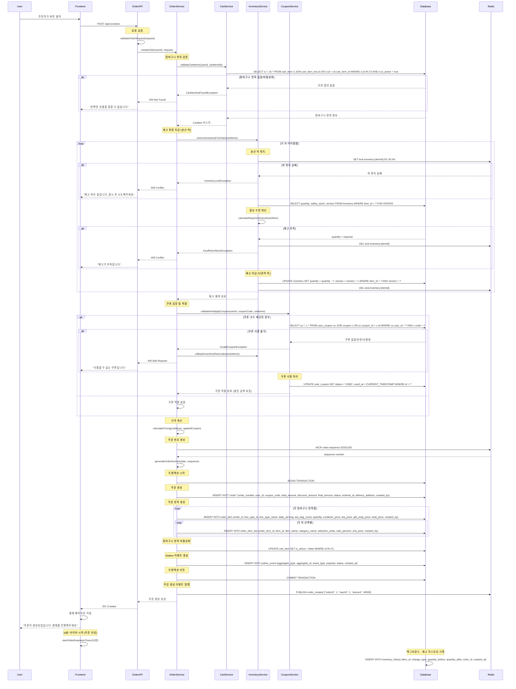

# 주문 생성 플로우

## 개요
- **목적**: 장바구니의 상품들을 기반으로 주문을 생성하고 결제 준비 단계로 진행
- **핵심 비즈니스 로직**: 재고 확정 차감, 쿠폰 적용, 가격 계산, 주문 번호 생성, 배송 정보 설정
- **주요 검증 사항**: 장바구니 유효성, 재고 충분성, 쿠폰 사용 가능성, 배송 주소 유효성

## API 엔드포인트

### Request
```http
POST /api/v1/orders
Authorization: Bearer {token}
Content-Type: application/json

{
  "cartItemIds": [1, 2, 3],
  "couponCode": "FIRST50",
  "deliveryAddress": {
    "recipient": "김민지",
    "phone": "010-1234-5678",
    "zipCode": "06234",
    "address": "서울시 강남구 테헤란로 123",
    "addressDetail": "456호",
    "deliveryRequest": "문앞에 놓아주세요"
  },
  "paymentMethod": "MIXED",
  "expectedPointAmount": 20000
}
```

### Response (성공)
```json
{
  "success": true,
  "data": {
    "orderId": 1,
    "orderNumber": "ORD-20251106-001",
    "status": "PENDING",
    "orderItems": [
      {
        "id": 1,
        "boxType": {
          "id": 2,
          "name": "7일 박스",
          "days": 7
        },
        "dailyServing": 2,
        "teaBagCount": 14,
        "quantity": 1,
        "containerPrice": 5000,
        "teaPrice": 24000,
        "giftWrapPrice": 2000,
        "totalPrice": 31000,
        "teaSelections": [
          {
            "item": {
              "id": 1,
              "name": "얼그레이",
              "category": "홍차"
            },
            "selectionOrder": 1,
            "ratioPercent": 40,
            "unitPrice": 8000
          }
        ]
      }
    ],
    "pricing": {
      "totalAmount": 93000,
      "discountAmount": 46500,
      "finalAmount": 46500,
      "appliedCoupon": {
        "code": "FIRST50",
        "name": "첫구매 50% 할인",
        "discountAmount": 46500
      }
    },
    "deliveryAddress": {
      "recipient": "김민지",
      "phone": "010-1234-5678",
      "zipCode": "06234",
      "address": "서울시 강남구 테헤란로 123",
      "addressDetail": "456호",
      "deliveryRequest": "문앞에 놓아주세요"
    },
    "orderedAt": "2025-11-06T10:30:00Z",
    "message": "주문이 성공적으로 생성되었습니다"
  }
}
```

## 시퀀스 다이어그램



## 비즈니스 로직 상세

### 1. 재고 예약 및 차감 로직
```kotlin
@Transactional
fun reserveInventoryForOrder(cartItems: List<CartItem>): List<InventoryReservation> {
    val reservations = mutableListOf<InventoryReservation>()

    try {
        cartItems.forEach { cartItem ->
            val requiredAmounts = calculateRequiredAmounts(cartItem)

            requiredAmounts.forEach { (itemId, requiredGrams) ->
                // 분산 락 획득
                val lockKey = "lock:inventory:$itemId"
                val lockAcquired = redisTemplate.opsForValue()
                    .setIfAbsent(lockKey, "locked", Duration.ofSeconds(30))

                if (!lockAcquired) {
                    throw InventoryLockException("재고 처리 중입니다. 잠시 후 시도해주세요")
                }

                try {
                    val inventory = inventoryRepository.findByItemIdForUpdate(itemId)
                        ?: throw InventoryNotFoundException("재고 정보를 찾을 수 없습니다")

                    if (inventory.quantity < requiredGrams) {
                        throw InsufficientStockException(
                            "재고가 부족합니다. 상품: ${itemId}, 필요: ${requiredGrams}g, 현재: ${inventory.quantity}g"
                        )
                    }

                    // 낙관적 락을 통한 재고 차감
                    val updatedRows = inventoryRepository.decreaseQuantity(
                        itemId = itemId,
                        amount = requiredGrams,
                        currentVersion = inventory.version
                    )

                    if (updatedRows == 0) {
                        throw OptimisticLockException("동시 수정으로 인해 재고 차감에 실패했습니다")
                    }

                    reservations.add(InventoryReservation(itemId, requiredGrams))

                } finally {
                    redisTemplate.delete(lockKey)
                }
            }
        }

        return reservations

    } catch (e: Exception) {
        // 실패 시 이미 차감된 재고 복원
        rollbackInventoryReservations(reservations)
        throw e
    }
}
```

### 2. 쿠폰 적용 로직
```kotlin
fun validateAndApplyCoupon(userId: Long, couponCode: String?, totalAmount: Long): CouponApplication? {
    if (couponCode.isNullOrBlank()) return null

    val userCoupon = userCouponRepository.findByUserIdAndCouponCode(userId, couponCode)
        ?: throw InvalidCouponException("사용할 수 없는 쿠폰입니다")

    // 쿠폰 상태 검증
    when {
        userCoupon.status != CouponStatus.AVAILABLE ->
            throw InvalidCouponException("이미 사용되었거나 만료된 쿠폰입니다")
        userCoupon.expiredAt.isBefore(LocalDateTime.now()) ->
            throw InvalidCouponException("만료된 쿠폰입니다")
        userCoupon.coupon.minOrderAmount > totalAmount ->
            throw InvalidCouponException("최소 주문 금액 ${userCoupon.coupon.minOrderAmount}원 이상부터 사용 가능합니다")
    }

    // 할인 금액 계산
    val discountAmount = calculateDiscountAmount(userCoupon.coupon, totalAmount)

    // 쿠폰 사용 처리
    userCoupon.use()
    userCouponRepository.save(userCoupon)

    return CouponApplication(userCoupon.coupon, discountAmount)
}

private fun calculateDiscountAmount(coupon: Coupon, totalAmount: Long): Long {
    return when (coupon.discountType) {
        DiscountType.PERCENTAGE -> {
            val discount = (totalAmount * coupon.discountValue / 100).toLong()
            minOf(discount, coupon.maxDiscountAmount ?: Long.MAX_VALUE)
        }
        DiscountType.FIXED -> {
            minOf(coupon.discountValue.toLong(), totalAmount)
        }
    }
}
```

### 3. 주문 번호 생성 로직
```kotlin
fun generateOrderNumber(): String {
    val today = LocalDate.now().format(DateTimeFormatter.ofPattern("yyyyMMdd"))
    val sequenceKey = "order:sequence:$today"

    val sequence = redisTemplate.opsForValue().increment(sequenceKey)

    // 자정에 자동 만료되도록 TTL 설정
    if (sequence == 1L) {
        val midnight = LocalDateTime.now().plusDays(1).withHour(0).withMinute(0).withSecond(0)
        val secondsUntilMidnight = Duration.between(LocalDateTime.now(), midnight).seconds
        redisTemplate.expire(sequenceKey, Duration.ofSeconds(secondsUntilMidnight))
    }

    return "ORD-$today-${sequence.toString().padStart(3, '0')}"
}
```

## 비즈니스 정책 반영

### 주문 관리 정책 (BP-ORDER-001, BP-ORDER-002)
- **주문 번호**: 날짜별 순차 번호 (ORD-YYYYMMDD-XXX)
- **주문 만료**: 생성 후 10분 내 미결제 시 자동 취소
- **재고 예약**: 주문 생성 시점에 재고 확정 차감

### 쿠폰 사용 정책 (BP-COUPON-001, BP-COUPON-002)
- **1회 사용**: 쿠폰은 주문당 1개만 사용 가능
- **최소 주문 금액**: 쿠폰별 설정된 최소 금액 이상에서만 사용
- **할인 상한**: 정률 할인 시 최대 할인 금액 제한

### 재고 관리 정책 (BP-INVENTORY-003, BP-INVENTORY-004)
- **안전 재고 보장**: 안전 재고량은 차감하지 않음
- **동시성 제어**: 분산 락으로 동시 주문 시 재고 보호
- **재고 히스토리**: 모든 재고 변동 이력 기록

## 에러 처리

| 에러 코드 | HTTP 상태 | 시나리오 | 메시지 |
|----------|----------|----------|--------|
| ORDER001 | 404 | 장바구니 항목 없음 | "선택한 상품을 찾을 수 없습니다" |
| ORDER002 | 400 | 잘못된 배송 정보 | "배송 주소 정보를 확인해주세요" |
| ORDER003 | 409 | 주문 생성 중 재고 부족 | "재고가 부족하여 주문할 수 없습니다" |
| INVENTORY001 | 409 | 재고 락 획득 실패 | "재고 처리 중입니다. 잠시 후 시도해주세요" |
| INVENTORY002 | 409 | 재고 부족 | "선택한 상품의 재고가 부족합니다" |
| COUPON001 | 400 | 잘못된 쿠폰 | "사용할 수 없는 쿠폰입니다" |
| COUPON002 | 400 | 쿠폰 이미 사용됨 | "이미 사용된 쿠폰입니다" |
| COUPON003 | 400 | 최소 주문 금액 미달 | "쿠폰 사용을 위한 최소 주문 금액에 미달합니다" |

상세한 에러 코드는 [../api-specification.md#8-에러-코드](../api-specification.md#8-에러-코드) 참조

## 성능 고려사항

### 1. 데이터베이스 최적화
```sql
-- 주문 조회 최적화
CREATE INDEX idx_order_user_created ON "order"(user_id, created_at DESC);
CREATE INDEX idx_order_status ON "order"(status);

-- 재고 처리 최적화
CREATE INDEX idx_inventory_item_version ON inventory(item_id, version);

-- 쿠폰 조회 최적화
CREATE INDEX idx_user_coupon_user_status ON user_coupon(user_id, status);
```

### 2. 동시성 제어
- **재고 락**: Redis 분산 락 (30초 타임아웃)
- **주문 번호**: Redis 원자적 INCR 연산
- **쿠폰 사용**: 데이터베이스 트랜잭션 내 처리

### 3. 트랜잭션 최적화
- **읽기 전용 검증**: 트랜잭션 외부에서 사전 검증
- **짧은 트랜잭션**: 필수 데이터 변경만 트랜잭션 내 처리
- **보상 트랜잭션**: 실패 시 재고 복원 로직

## 모니터링 및 알림

### 1. 주요 메트릭
- **주문 생성 성공률**: 95% 이상 목표
- **재고 부족으로 인한 실패율**: 5% 이하 목표
- **평균 주문 생성 시간**: 3초 이하 목표

### 2. 알림 설정
- **재고 부족**: 특정 상품 재고 부족 시 즉시 알림
- **주문 실패 급증**: 10분간 실패율 20% 초과 시 알림
- **성능 저하**: 응답 시간 5초 초과 시 알림

## 테스트 시나리오

### 기능 테스트
1. **정상 케이스**
   - 쿠폰 적용 주문 생성
   - 쿠폰 미적용 주문 생성
   - 다양한 배송지 정보로 주문 생성

2. **예외 케이스**
   - 재고 부족 상황에서 주문 시도
   - 만료된 쿠폰 사용 시도
   - 잘못된 장바구니 항목으로 주문 시도

### 성능 테스트
1. **동시성 테스트**: 동일 상품에 대한 동시 주문 (재고 정합성)
2. **부하 테스트**: 1000건 동시 주문 생성
3. **스트레스 테스트**: 재고 한계 상황에서의 시스템 안정성

### 통합 테스트
1. **전체 플로우 테스트**: 상품 선택 → 장바구니 → 주문 → 결제
2. **복구 테스트**: 주문 실패 시 재고 복원 확인
3. **데이터 정합성 테스트**: 트랜잭션 롤백 시나리오