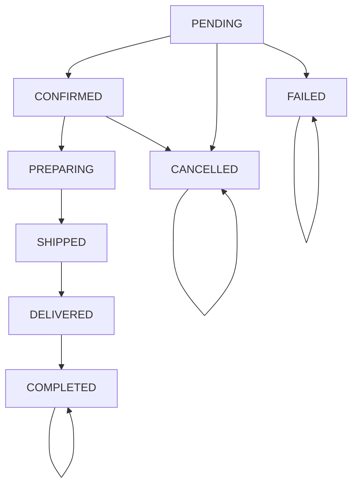
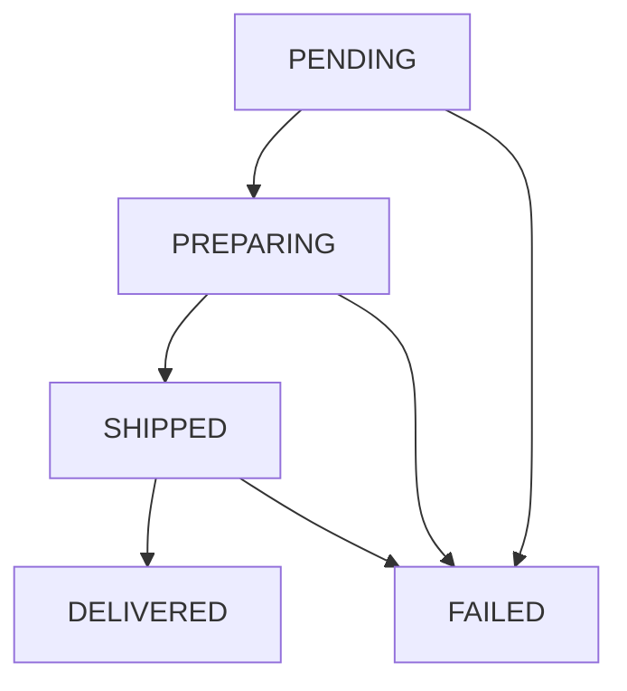
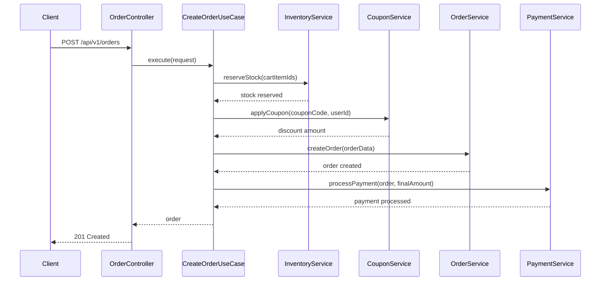
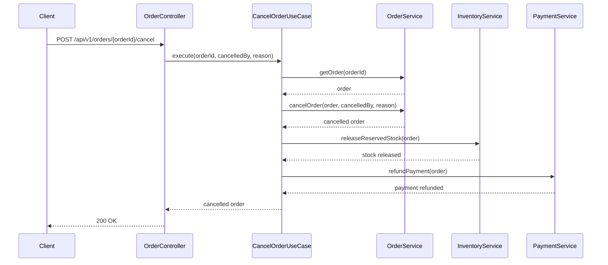

# 주문 API 명세서

## 개요
주문 생성, 조회, 상태 관리를 위한 REST API입니다. 복합 트랜잭션 기반의 주문 처리를 담당합니다.

## 기본 정보
- **Base URL**: `/api/v1/orders`
- **Content-Type**: `application/json`
- **인증**: JWT 토큰 (Bearer 방식)

## API 엔드포인트

### 1. 주문 생성
**UseCase**: `CreateOrderUseCase`

```http
POST /api/v1/orders
```

**Request Body**:
```json
{
  "userId": 1,
  "cartItemIds": [1, 2, 3],
  "couponCode": "WELCOME50",
  "paymentMethod": "POINT",
  "deliveryAddress": {
    "recipient": "김철수",
    "phone": "010-1234-5678",
    "zipCode": "06234",
    "address": "서울시 강남구 테헤란로 123",
    "addressDetail": "456호"
  },
  "createdBy": 1
}
```

**Request Fields**:
- `userId` (Long, required): 사용자 ID
- `cartItemIds` (List<Long>, required): 장바구니 아이템 ID 목록
- `couponCode` (String, optional): 사용할 쿠폰 코드
- `paymentMethod` (String, required): 결제 방법
- `deliveryAddress` (Object, required): 배송지 정보
- `createdBy` (Long, required): 주문 생성자 ID

> **💡 미래 변경 사항**:
> `userId`, `createdBy`는 Spring Security Context에서 자동 추출 예정

**Response**:
```json
{
  "success": true,
  "data": {
    "id": 1,
    "orderNumber": "ORD202411070001",
    "userId": 1,
    "status": "PENDING",
    "totalAmount": 50000,
    "discountAmount": 25000,
    "finalAmount": 25000,
    "items": [
      {
        "id": 1,
        "productId": 1,
        "boxTypeId": 1,
        "quantity": 2,
        "unitPrice": 15000,
        "totalPrice": 30000
      }
    ],
    "deliveryAddress": {
      "recipient": "김철수",
      "phone": "010-1234-5678",
      "address": "서울시 강남구 테헤란로 123 456호"
    },
    "createdAt": "2024-11-07T10:00:00Z",
    "updatedAt": "2024-11-07T10:00:00Z"
  }
}
```

### 2. 주문 단일 조회
**UseCase**: `GetOrderQueryUseCase.getOrder()`

```http
GET /api/v1/orders/{orderId}
```

**Path Parameters**:
- `orderId` (Long, required): 주문 ID

**Response**:
```json
{
  "success": true,
  "data": {
    "id": 1,
    "orderNumber": "ORD202411070001",
    "userId": 1,
    "status": "CONFIRMED",
    "totalAmount": 50000,
    "discountAmount": 25000,
    "finalAmount": 25000,
    "items": [
      {
        "id": 1,
        "productId": 1,
        "boxTypeId": 1,
        "quantity": 2,
        "unitPrice": 15000,
        "totalPrice": 30000
      }
    ],
    "deliveryAddress": {
      "recipient": "김철수",
      "phone": "010-1234-5678",
      "address": "서울시 강남구 테헤란로 123 456호"
    },
    "createdAt": "2024-11-07T10:00:00Z",
    "updatedAt": "2024-11-07T10:30:00Z"
  }
}
```

### 3. 사용자별 주문 목록 조회
**UseCase**: `GetOrderQueryUseCase.getOrdersByUser()`

```http
GET /api/v1/orders?userId={userId}
```

**Query Parameters**:
- `userId` (Long, required): 사용자 ID

**Response**:
```json
{
  "success": true,
  "data": [
    {
      "id": 1,
      "orderNumber": "ORD202411070001",
      "status": "CONFIRMED",
      "finalAmount": 25000,
      "createdAt": "2024-11-07T10:00:00Z"
    },
    {
      "id": 2,
      "orderNumber": "ORD202411060015",
      "status": "COMPLETED",
      "finalAmount": 40000,
      "createdAt": "2024-11-06T15:30:00Z"
    }
  ]
}
```

### 4. 주문 확정
**UseCase**: `ConfirmOrderUseCase`

```http
POST /api/v1/orders/{orderId}/confirm
```

**Path Parameters**:
- `orderId` (Long, required): 주문 ID

**Request Body**:
```json
{
  "confirmedBy": 1
}
```

**Response**:
```json
{
  "success": true,
  "data": {
    "id": 1,
    "orderNumber": "ORD202411070001",
    "status": "CONFIRMED",
    "confirmedAt": "2024-11-07T11:00:00Z",
    "updatedBy": 1,
    "updatedAt": "2024-11-07T11:00:00Z"
  }
}
```

### 5. 배송 정보 조회
**UseCase**: `GetDeliveryQueryUseCase`

```http
GET /api/v1/orders/{orderId}/delivery
```

**Path Parameters**:
- `orderId` (Long, required): 주문 ID

**Response**:
```json
{
  "success": true,
  "data": {
    "id": 1,
    "orderId": 1,
    "deliveryAddress": {
      "recipientName": "김철수",
      "phone": "010-1234-5678",
      "zipCode": "06234",
      "address": "서울시 강남구 테헤란로 123",
      "addressDetail": "456호",
      "deliveryMessage": "문 앞에 놓아주세요"
    },
    "trackingNumber": "123456789012",
    "carrier": "CJ대한통운",
    "status": "SHIPPED",
    "shippedAt": "2024-11-08T10:00:00Z",
    "deliveredAt": null,
    "deliveryMemo": null,
    "createdAt": "2024-11-07T10:00:00Z",
    "updatedAt": "2024-11-08T10:00:00Z"
  }
}
```

### 6. 주문 취소
**UseCase**: `CancelOrderUseCase`

```http
POST /api/v1/orders/{orderId}/cancel
```

**Path Parameters**:
- `orderId` (Long, required): 주문 ID

**Request Body**:
```json
{
  "cancelledBy": 1,
  "reason": "단순 변심"
}
```

**Response**:
```json
{
  "success": true,
  "data": {
    "id": 1,
    "orderNumber": "ORD202411070001",
    "status": "CANCELLED",
    "cancelReason": "단순 변심",
    "cancelledAt": "2024-11-07T12:00:00Z",
    "refundAmount": 25000,
    "updatedBy": 1,
    "updatedAt": "2024-11-07T12:00:00Z"
  }
}
```

## 주문 상태 전이



## 배송 상태 전이



## 에러 코드

| 코드 | HTTP 상태 | 메시지 | 설명 |
|-----|----------|--------|------|
| ORDER001 | 404 | 존재하지 않는 주문입니다 | 주문 ID 무효 |
| ORDER002 | 403 | 주문 접근 권한이 없습니다 | 다른 사용자의 주문 |
| ORDER003 | 400 | 취소할 수 없는 주문 상태입니다 | 이미 확정된 주문 |
| ORDER004 | 400 | 장바구니가 비어있습니다 | 빈 장바구니로 주문 시도 |
| ORDER005 | 400 | 유효하지 않은 주문 상태입니다 | 잘못된 상태 전이 |
| ORDER006 | 404 | 배송 정보를 찾을 수 없습니다 | 배송 정보 없음 |
| ORDER007 | 400 | 유효하지 않은 배송 상태입니다 | 잘못된 배송 상태 전이 |

## 시퀀스 다이어그램

### 1. 주문 생성 플로우


### 2. 주문 취소 플로우


## 비즈니스 정책

### 주문 생성 정책

#### 빈 장바구니 주문 방지
- **정책**: 장바구니가 비어있는 상태에서 주문 생성 불가
- **검증 시점**: 주문 생성 요청 시 (PreValidation)
- **예외 코드 및 메시지**:
  - `EmptyCart`: "장바구니가 비어있습니다. 상품을 추가한 후 주문해주세요."
- **구현 방식**: CreateOrderUseCase에서 cartItemIds 검증

#### 재고 부족 검증
- **정책**: 요청 수량이 가용 재고보다 많은 경우 주문 불가
- **검증 시점**: 주문 생성 중 재고 예약 시 (Business Logic Validation)
- **예외 코드 및 메시지**:
  - `InsufficientStock`: "재고가 부족합니다. 아이템: {itemName}, 가용재고: {availableStock}, 요청수량: {requestedQuantity}"
- **구현 방식**: InventoryService.reserveStock() 메서드에서 검증

#### 쿠폰 유효성 검증
- **정책**: 만료되거나 사용된 쿠폰, 최소 주문 금액 미달 시 사용 불가
- **검증 시점**: 주문 생성 중 쿠폰 적용 시 (Business Logic Validation)
- **예외 코드 및 메시지**:
  - `ExpiredCoupon`: "만료된 쿠폰입니다. 만료일: {expiredDate}"
  - `AlreadyUsedCoupon`: "이미 사용된 쿠폰입니다. 사용일: {usedDate}"
  - `MinimumOrderAmountNotMet`: "최소 주문 금액을 충족하지 못했습니다. 최소금액: {minAmount}, 주문금액: {orderAmount}"
- **구현 방식**: CouponService.applyCoupon() 메서드에서 검증

### 주문 취소 정책

#### 주문 취소 제한
- **정책**: 제조 시작 후에는 주문 취소 불가
- **검증 시점**: 주문 취소 요청 시 (Business Logic Validation)
- **예외 코드 및 메시지**:
  - `OrderCancellationNotAllowed`: "취소할 수 없는 주문 상태입니다. 현재상태: {currentStatus}"
- **구현 방식**: OrderService.cancelOrder() 메서드에서 상태 검증
- **취소 가능 상태**: PENDING, CONFIRMED
- **취소 불가능 상태**: PREPARING, SHIPPED, DELIVERED, COMPLETED

#### 주문 상태 전이 규칙
- **정책**: 올바른 순서로만 주문 상태 변경 가능
- **검증 시점**: 주문 상태 변경 시 (Business Logic Validation)
- **예외 코드 및 메시지**:
  - `InvalidOrderStatusTransition`: "유효하지 않은 주문 상태 변경입니다. 현재상태: {currentStatus}, 요청상태: {requestedStatus}"
- **구현 방식**: Order 엔티티 내부의 상태 전이 메서드에서 검증

### 동시성 제어 정책

#### 재고 차감 동시성 제어
- **정책**: 동시에 같은 아이템을 주문할 때 재고 정합성 보장
- **검증 시점**: 재고 예약 시 (Concurrency Control)
- **예외 코드 및 메시지**:
  - `StockConcurrencyException`: "재고 처리 중 오류가 발생했습니다. 잠시 후 다시 시도해주세요."
- **구현 방식**:
  - Redis 분산 락 또는 DB 비관적 락 사용
  - 락 타임아웃: 3초
  - 최대 3회 재시도

#### 결제 처리 동시성 제어
- **정책**: 주문 생성과 결제 처리가 원자적으로 수행되어야 함
- **검증 시점**: 주문 생성 트랜잭션 내 (Concurrency Control)
- **예외 코드 및 메시지**:
  - `OrderProcessingException`: "주문 처리 중 오류가 발생했습니다. 잠시 후 다시 시도해주세요."
- **구현 방식**:
  - @Transactional을 통한 전체 프로세스 원자성 보장
  - 포인트 차감 실패 시 전체 주문 롤백
  - 재고 예약 실패 시 전체 주문 롤백

#### 동시 주문 생성 제어
- **정책**: 같은 사용자의 동시 주문 생성을 제어
- **검증 시점**: 주문 생성 시작 시 (Concurrency Control)
- **예외 코드 및 메시지**:
  - `DuplicateOrderCreation`: "동시 주문 생성이 감지되었습니다. 잠시 후 다시 시도해주세요."
- **구현 방식**: 사용자별 주문 생성 락 적용

### 주문 번호 생성 정책

#### 주문 번호 형식
- **정책**: 주문 번호는 ORD-YYYYMMDD-XXX 형식으로 생성
- **검증 시점**: 주문 생성 시 (Business Logic)
- **구현 방식**:
  - ORD-{날짜}-{일련번호} 형식으로 자동 생성
  - 일련번호는 일별로 001부터 시작
  - Snowflake ID와 연동하여 유니크성 보장

## 복합 트랜잭션 처리

### CreateOrderUseCase 플로우
1. **재고 예약** (Product Domain)
   - 주문 아이템별 재고 확인 및 예약
   - 실패 시 전체 롤백

2. **쿠폰 적용** (Coupon Domain)
   - 쿠폰 코드 유효성 검증
   - 할인 금액 계산

3. **주문 생성** (Order Domain)
   - Snowflake ID 기반 주문번호 생성
   - 주문 엔티티 생성 및 저장

4. **결제 처리** (Payment Domain)
   - 포인트 잔액 확인
   - 결제 실행 및 내역 저장

### 롤백 전략
- **@Transactional** 기반 자동 롤백
- **예외 발생 시** 전체 프로세스 취소
- **재고 복원** 자동 처리

## Value Object 사용

### 주문 금액 관련
- `TotalAmount`: 총 주문 금액
- `DiscountAmount`: 할인 금액
- `FinalAmount`: 최종 결제 금액
- `OrderAmount`: 복합 VO (금액 체계 통합)

### 사용 예시
```kotlin
val orderAmount = OrderAmount.of(
    totalAmount = 50000L,
    discountAmount = 25000L
)
// 자동으로 finalAmount 계산됨
```

## 관련 도메인
- **Cart**: 장바구니 데이터 기반 주문 생성
- **Product**: 상품 정보 및 재고 관리
- **Coupon**: 할인 쿠폰 적용
- **Payment**: 결제 처리
- **User**: 사용자 정보 및 배송지