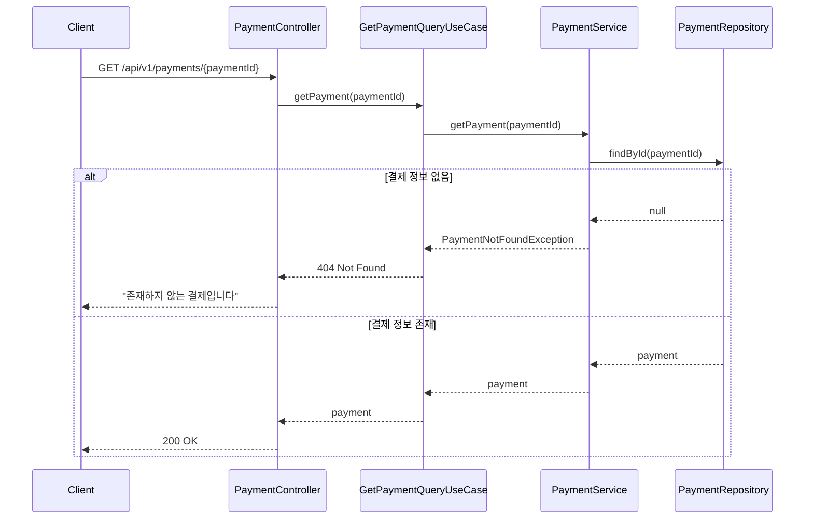
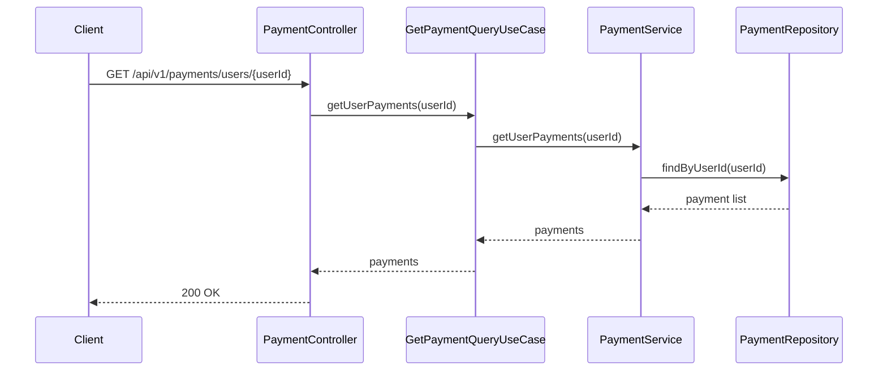
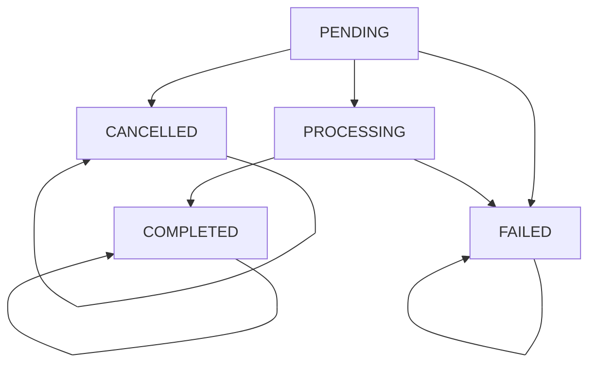

# 결제 API 명세서

## 개요
결제 처리 및 결제 내역 조회를 위한 REST API입니다. 포인트 결제 및 복합 결제 기능을 제공합니다.

## 기본 정보
- **Base URL**: `/api/v1/payments`
- **Content-Type**: `application/json`
- **인증**: JWT 토큰 (Bearer 방식)

## API 엔드포인트

### 1. 결제 처리
**UseCase**: `ProcessPaymentUseCase`

```http
POST /api/v1/payments/process
```

**Request Body**:
```json
{
  "userId": 1,
  "orderId": 123,
  "amount": 50000,
  "paymentMethod": "BALANCE"
}
```

**Request Fields**:
- `userId` (Long, required): 결제를 진행하는 사용자 ID
- `orderId` (Long, required): 관련 주문 ID
- `amount` (Long, required): 결제 금액
- `paymentMethod` (String, required): 결제 방법 (BALANCE, CARD, BANK_TRANSFER)

**Response**:
```json
{
  "success": true,
  "data": {
    "id": 1,
    "paymentNumber": "PAY202411070001",
    "orderId": 123,
    "userId": 1,
    "amount": 50000,
    "paymentMethod": "BALANCE",
    "status": "COMPLETED",
    "externalTransactionId": null,
    "failureReason": null,
    "isActive": true,
    "createdAt": "2024-11-07T10:00:00Z",
    "updatedAt": "2024-11-07T10:00:00Z"
  }
}
```

### 2. 결제 단일 조회
**UseCase**: `GetPaymentQueryUseCase.getPayment()`

```http
GET /api/v1/payments/{paymentId}
```

**Path Parameters**:
- `paymentId` (Long, required): 조회할 결제 ID

**Response**:
```json
{
  "success": true,
  "data": {
    "id": 1,
    "paymentNumber": "PAY202411070001",
    "orderId": 123,
    "userId": 1,
    "amount": 50000,
    "paymentMethod": "BALANCE",
    "status": "COMPLETED",
    "externalTransactionId": null,
    "failureReason": null,
    "isActive": true,
    "createdAt": "2024-11-07T10:00:00Z",
    "updatedAt": "2024-11-07T10:00:00Z"
  }
}
```

### 3. 결제 상태 변경 이력 조회
**UseCase**: `GetPaymentQueryUseCase.getPaymentHistory()`

```http
GET /api/v1/payments/{paymentId}/history
```

**Path Parameters**:
- `paymentId` (Long, required): 결제 ID

**Response**:
```json
{
  "success": true,
  "data": [
    {
      "id": 1,
      "paymentId": 1,
      "statusBefore": "PENDING",
      "statusAfter": "PROCESSING",
      "reason": "결제 처리 시작",
      "pgResponse": null,
      "amount": 50000,
      "createdAt": "2024-11-07T10:00:00Z"
    },
    {
      "id": 2,
      "paymentId": 1,
      "statusBefore": "PROCESSING",
      "statusAfter": "COMPLETED",
      "reason": "결제 완료",
      "pgResponse": {
        "transactionId": "pg_tx_12345",
        "approvalNumber": "12345678",
        "cardName": "신한카드",
        "cardNumber": "1234-****-****-5678"
      },
      "amount": 50000,
      "createdAt": "2024-11-07T10:00:05Z"
    }
  ]
}
```

### 4. 사용자별 결제 내역 조회
**UseCase**: `GetPaymentQueryUseCase.getUserPayments()`

```http
GET /api/v1/payments/users/{userId}
```

**Path Parameters**:
- `userId` (Long, required): 결제 내역을 조회할 사용자 ID

**Response**:
```json
{
  "success": true,
  "data": [
    {
      "id": 1,
      "paymentNumber": "PAY202411070001",
      "orderId": 123,
      "userId": 1,
      "amount": 50000,
      "paymentMethod": "BALANCE",
      "status": "COMPLETED",
      "externalTransactionId": null,
      "failureReason": null,
      "isActive": true,
      "createdAt": "2024-11-07T10:00:00Z",
      "updatedAt": "2024-11-07T10:00:00Z"
    },
    {
      "id": 2,
      "paymentNumber": "PAY202411060015",
      "orderId": 120,
      "userId": 1,
      "amount": 30000,
      "paymentMethod": "CARD",
      "status": "COMPLETED",
      "externalTransactionId": "card_tx_20241106_001",
      "failureReason": null,
      "isActive": true,
      "createdAt": "2024-11-06T15:30:00Z",
      "updatedAt": "2024-11-06T15:30:00Z"
    }
  ]
}
```

## 시퀀스 다이어그램

### 1. 포인트 결제 처리 플로우
```mermaid
sequenceDiagram
    participant Client
    participant PaymentController
    participant ProcessPaymentUseCase
    participant PaymentService
    parameter PointService
    participant OrderService
    participant PaymentRepository

    Client->>PaymentController: POST /api/v1/payments/process
    PaymentController->>ProcessPaymentUseCase: execute(request)

    ProcessPaymentUseCase->>PaymentService: processPayment(request)

    Note over PaymentService: 주문 상태 검증
    PaymentService->>OrderService: validateOrderForPayment(orderId)

    alt 주문 상태 불가
        OrderService-->>PaymentService: InvalidOrderStatusException
        PaymentService-->>ProcessPaymentUseCase: 409 Conflict
        ProcessPaymentUseCase-->>PaymentController: "이미 처리된 주문입니다"
        PaymentController-->>Client: 409 Conflict
    else 주문 상태 정상
        OrderService-->>PaymentService: order validated

        Note over PaymentService: 결제 방법에 따른 처리
        alt 포인트 결제 (BALANCE)
            PaymentService->>PointService: deductPoint(userId, amount, orderId)

            alt 포인트 잔액 부족
                PointService-->>PaymentService: InsufficientBalanceException
                PaymentService-->>ProcessPaymentUseCase: 400 Bad Request
                ProcessPaymentUseCase-->>PaymentController: "포인트 잔액이 부족합니다"
                PaymentController-->>Client: 400 Bad Request
            else 포인트 차감 성공
                PointService-->>PaymentService: deduction success

                Note over PaymentService: 결제 정보 저장
                PaymentService->>PaymentRepository: save(payment)
                PaymentRepository-->>PaymentService: saved payment

                PaymentService->>PaymentService: payment.complete()
                PaymentService->>PaymentRepository: save(payment)
                PaymentRepository-->>PaymentService: completed payment

                PaymentService-->>ProcessPaymentUseCase: payment
                ProcessPaymentUseCase-->>PaymentController: payment
                PaymentController-->>Client: 201 Created
            end

        else 외부 결제 (CARD, BANK_TRANSFER)
            PaymentService->>PaymentService: processExternalPayment(request)

            alt 외부 결제 실패
                PaymentService->>PaymentService: payment.fail(reason)
                PaymentService-->>ProcessPaymentUseCase: payment failed
                ProcessPaymentUseCase-->>PaymentController: 402 Payment Required
                PaymentController-->>Client: "카드 결제에 실패했습니다"
            else 외부 결제 성공
                PaymentService->>PaymentService: payment.complete(externalTxId)
                PaymentService->>PaymentRepository: save(payment)
                PaymentRepository-->>PaymentService: completed payment

                PaymentService-->>ProcessPaymentUseCase: payment
                ProcessPaymentUseCase-->>PaymentController: payment
                PaymentController-->>Client: 201 Created
            end
        end
    end
```

### 2. 결제 조회 플로우


### 3. 사용자별 결제 내역 조회 플로우


## 에러 코드

| 코드 | HTTP 상태 | 메시지 | 설명 |
|-----|----------|--------|------|
| PAYMENT001 | 400 | 잘못된 결제 금액입니다 | 금액이 0 이하 |
| PAYMENT002 | 400 | 포인트 잔액이 부족합니다 | 포인트 결제 시 잔액 부족 |
| PAYMENT003 | 402 | 카드 결제에 실패했습니다 | 외부 결제 서비스 오류 |
| PAYMENT004 | 409 | 이미 처리된 주문입니다 | 중복 결제 시도 |
| PAYMENT005 | 404 | 존재하지 않는 결제입니다 | 결제 ID 무효 |
| PAYMENT006 | 404 | 존재하지 않는 주문입니다 | 주문 ID 무효 |
| PAYMENT007 | 403 | 결제 권한이 없습니다 | 다른 사용자의 결제 조회 시도 |
| PAYMENT008 | 500 | 결제 처리 중 오류가 발생했습니다 | 내부 서버 오류 |

## 비즈니스 정책

### 포인트 결제 정책

#### 잔액 부족 검증
- **정책**: 현재 포인트 잔액보다 많은 금액 결제 불가
- **검증 시점**: 포인트 결제 처리 시 (Business Logic Validation)
- **예외 코드 및 메시지**:
  - `InsufficientBalance`: "잔액이 부족합니다. 현재잔액: {currentBalance}, 결제금액: {paymentAmount}"
- **구현 방식**: PaymentService에서 PointService.deductPoint() 호출 시 검증

### 결제 처리 정합성 정책

#### 결제 금액 검증
- **정책**: 결제 금액은 양수여야 하며, 주문 금액과 일치해야 함
- **검증 시점**: 결제 요청 접수 시 (PreValidation)
- **예외 코드 및 메시지**:
  - `InvalidPaymentAmount`: "잘못된 결제 금액입니다. 요청금액: {amount}"
  - `PaymentAmountMismatch`: "결제 금액이 주문 금액과 일치하지 않습니다. 주문금액: {orderAmount}, 결제금액: {paymentAmount}"
- **구현 방식**: PaymentAmount VO를 통한 검증

#### 주문 상태 검증
- **정책**: PENDING 상태의 주문만 결제 처리 가능
- **검증 시점**: 결제 처리 시작 전 (Business Logic Validation)
- **예외 코드 및 메시지**:
  - `OrderAlreadyProcessed`: "이미 처리된 주문입니다. 현재상태: {currentStatus}"
  - `InvalidOrderForPayment`: "결제할 수 없는 주문 상태입니다. 현재상태: {currentStatus}"
- **구현 방식**: OrderService.validateOrderForPayment() 메서드를 통한 검증

#### 중복 결제 방지
- **정책**: 동일 주문에 대한 중복 결제 시도 차단
- **검증 시점**: 결제 처리 시작 전 (Business Logic Validation)
- **예외 코드 및 메시지**:
  - `DuplicatePaymentAttempt`: "이미 결제가 진행 중이거나 완료된 주문입니다. 주문번호: {orderNumber}"
- **구현 방식**: 주문별 결제 상태 확인을 통한 중복 방지

### 동시성 제어 정책

#### 결제 처리 원자성 보장
- **정책**: 포인트 차감과 결제 생성이 원자적으로 처리되어야 함
- **검증 시점**: 결제 트랜잭션 시작 시
- **예외 코드 및 메시지**:
  - `PaymentProcessingException`: "결제 처리 중 오류가 발생했습니다. 잠시 후 다시 시도해주세요."
- **구현 방식**:
  - @Transactional을 통한 트랜잭션 보장
  - 포인트 차감 실패 시 결제 생성 롤백
  - 결제 생성 실패 시 포인트 차감 롤백

#### 동시 결제 요청 제어
- **정책**: 같은 주문에 대한 동시 결제 요청을 방지
- **검증 시점**: 결제 처리 시작 시
- **예외 코드 및 메시지**:
  - `ConcurrentPaymentException`: "동시 결제 요청이 감지되었습니다. 잠시 후 다시 시도해주세요."
- **구현 방식**: Redis 분산 락 또는 DB 비관적 락 사용

### 결제 처리 규칙
- **결제 번호**: Snowflake ID 기반 유니크 번호 생성
- **결제 상태 추적**: 모든 결제 상태 변화 추적
- **결제 이력 관리**:
  - 모든 결제 상태 변경은 `PAYMENT_HISTORY` 테이블에 자동 기록
  - 변경 전/후 상태, 변경 사유, PG사 응답 등을 포함
  - 결제 문제 발생 시 추적 및 디버깅에 활용

### 결제 방법
- **BALANCE**: 포인트 잔액 결제
- **CARD**: 카드 결제 (외부 PG 연동)
- **BANK_TRANSFER**: 계좌이체 (외부 연동)

### 결제 상태 전이


### 결제 상태
- **PENDING**: 결제 대기
- **PROCESSING**: 결제 진행 중
- **COMPLETED**: 결제 완료
- **CANCELLED**: 결제 취소
- **FAILED**: 결제 실패

### 동시성 제어
- **트랜잭션**: 포인트 차감과 결제 생성을 하나의 트랜잭션에서 처리
- **원자성**: 결제 실패 시 모든 변경사항 롤백
- **일관성**: 주문 상태와 결제 상태 동기화

### Value Object 사용
- **PaymentNumber**: 결제 번호 생성 및 검증
- **PaymentAmount**: 결제 금액 검증

## 외부 연동

### PG사 연동 (향후 구현 예정)
- **카드 결제**: 토스, 이니시스, KG이니시스
- **계좌이체**: 각 은행 API 연동
- **콜백 처리**: 결제 완료/실패 웹훅 수신

### 보안 고려사항
- **PCI DSS**: 카드 정보 보안 표준 준수
- **토큰화**: 카드 번호 등 민감정보 토큰화
- **암호화**: 결제 관련 로그 암호화 저장

## 관련 도메인
- **Order**: 주문 정보 연동 및 상태 업데이트
- **Point**: 포인트 결제 시 잔액 차감
- **User**: 결제자 정보 검증