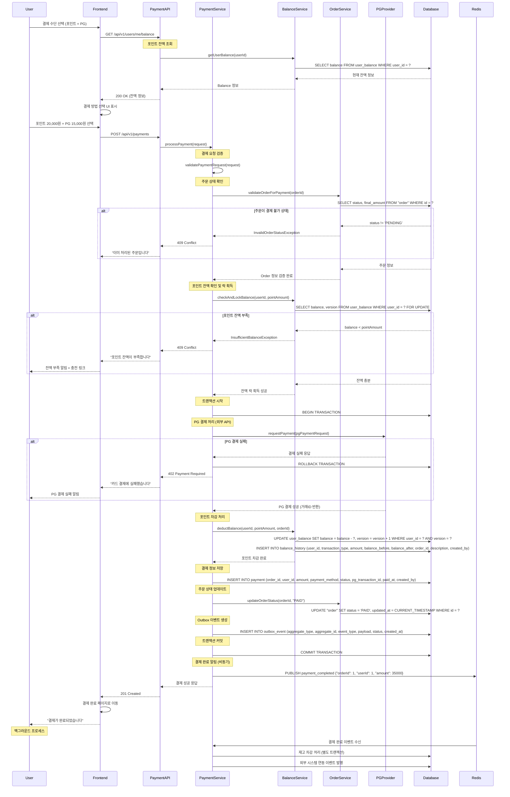

# 포인트 결제 처리 플로우

## 개요
- **목적**: 사용자 포인트를 이용한 주문 결제 처리 및 PG 연동 결제 지원
- **핵심 비즈니스 로직**: 포인트 잔액 검증, 혼합 결제, 결제 실패 시 롤백, 포인트 이력 관리
- **주요 검증 사항**: 포인트 잔액 충분성, 결제 수단 유효성, 주문 상태 확인

## API 엔드포인트

### 1. 포인트 잔액 조회

#### Request
```http
GET /api/v1/users/me/balance
Authorization: Bearer {token}
```

#### Response (성공)
```json
{
  "success": true,
  "data": {
    "userId": 1,
    "balance": 50000,
    "lastUpdated": "2025-11-06T10:30:00Z"
  }
}
```

### 2. 결제 처리

#### Request
```http
POST /api/v1/payments
Authorization: Bearer {token}
Content-Type: application/json

{
  "orderId": 1,
  "paymentMethod": "MIXED",
  "pointAmount": 20000,
  "pgAmount": 15000,
  "pgPaymentRequest": {
    "method": "CARD",
    "cardNumber": "****-****-****-1234",
    "pgProvider": "TOSS"
  }
}
```

#### Response (성공)
```json
{
  "success": true,
  "data": {
    "paymentId": 1,
    "orderId": 1,
    "totalAmount": 35000,
    "pointAmount": 20000,
    "pgAmount": 15000,
    "status": "COMPLETED",
    "paidAt": "2025-11-06T10:35:00Z",
    "pgTransactionId": "toss_20251106_123456",
    "balanceAfter": 30000,
    "message": "결제가 완료되었습니다"
  }
}
```

## 시퀀스 다이어그램



## 비즈니스 로직 상세

### 1. 포인트 잔액 검증 로직
```kotlin
@Transactional
fun checkAndLockBalance(userId: Long, requiredAmount: Long): UserBalance {
    val userBalance = userBalanceRepository.findByUserIdForUpdate(userId)
        ?: throw UserBalanceNotFoundException("사용자 포인트 정보를 찾을 수 없습니다")

    if (userBalance.balance < requiredAmount) {
        throw InsufficientBalanceException(
            "포인트 잔액이 부족합니다. 현재: ${userBalance.balance}원, 필요: ${requiredAmount}원"
        )
    }

    return userBalance
}
```

### 2. 혼합 결제 처리 로직
```kotlin
@Transactional
fun processPayment(request: PaymentRequest): PaymentResult {
    // 1. 주문 상태 검증
    val order = orderService.validateOrderForPayment(request.orderId)

    // 2. 금액 검증
    validatePaymentAmounts(order.finalAmount, request.pointAmount, request.pgAmount)

    // 3. PG 결제 처리 (포인트 차감 전)
    val pgResult = if (request.pgAmount > 0) {
        pgService.processPayment(request.pgPaymentRequest)
    } else null

    try {
        // 4. 포인트 차감
        val balanceResult = if (request.pointAmount > 0) {
            balanceService.deductBalance(order.userId, request.pointAmount, order.id)
        } else null

        // 5. 결제 정보 저장
        val payment = savePaymentInfo(order, request, pgResult, balanceResult)

        // 6. 주문 상태 업데이트
        orderService.updateOrderStatus(order.id, OrderStatus.PAID)

        // 7. 외부 연동 이벤트 발행
        publishPaymentCompletedEvent(payment)

        return PaymentResult.success(payment)

    } catch (e: Exception) {
        // PG 결제 취소 (보상 트랜잭션)
        pgResult?.let { pgService.cancelPayment(it.transactionId) }
        throw e
    }
}
```

### 3. 포인트 충전 로직
```kotlin
@Transactional
fun chargePoints(userId: Long, amount: Long, paymentMethod: String): ChargeResult {
    // 1. PG 결제 처리
    val pgResult = pgService.processPayment(
        PGPaymentRequest(
            amount = amount,
            method = paymentMethod,
            description = "포인트 충전"
        )
    )

    // 2. 포인트 충전
    val userBalance = userBalanceRepository.findByUserIdForUpdate(userId)
        ?: createUserBalance(userId)

    val balanceBefore = userBalance.balance
    userBalance.charge(amount)

    // 3. 충전 이력 저장
    balanceHistoryRepository.save(
        BalanceHistory(
            userId = userId,
            transactionType = TransactionType.CHARGE,
            amount = amount,
            balanceBefore = balanceBefore,
            balanceAfter = userBalance.balance,
            description = "포인트 충전 (${paymentMethod})",
            createdBy = userId
        )
    )

    return ChargeResult.success(userBalance.balance)
}
```

## 비즈니스 정책 반영

### 포인트 관리 정책 (BP-PAYMENT-001, BP-PAYMENT-002)
- **최소 충전 금액**: 1,000원 이상
- **최대 보유 한도**: 1,000,000원 (돈세탁 방지)
- **유효 기간**: 충전 후 5년 (법적 요구사항)

### 결제 처리 정책 (BP-PAYMENT-003, BP-PAYMENT-004)
- **혼합 결제**: 포인트 + PG 결제 동시 지원
- **결제 순서**: PG 결제 성공 후 포인트 차감 (실패 시 롤백)
- **재시도 정책**: PG 결제 실패 시 3회까지 자동 재시도

### 보안 정책 (BP-SECURITY-001)
- **거래 한도**: 1일 최대 500,000원 (이상 시 추가 인증)
- **의심 거래 탐지**: 단시간 대량 결제 시 일시 차단
- **로그 보관**: 모든 결제 시도 로그 3년간 보관

## 에러 처리

| 에러 코드 | HTTP 상태 | 시나리오 | 메시지 |
|----------|----------|----------|--------|
| PAYMENT001 | 400 | 잘못된 결제 금액 | "결제 금액이 주문 금액과 일치하지 않습니다" |
| PAYMENT002 | 409 | 포인트 잔액 부족 | "포인트 잔액이 부족합니다" |
| PAYMENT003 | 402 | PG 결제 실패 | "카드 결제에 실패했습니다" |
| PAYMENT004 | 409 | 이미 결제된 주문 | "이미 처리된 주문입니다" |
| PAYMENT005 | 429 | 거래 한도 초과 | "일일 거래 한도를 초과했습니다" |
| PAYMENT006 | 403 | 의심 거래 탐지 | "보안상 거래가 일시 제한되었습니다" |
| BALANCE001 | 404 | 포인트 정보 없음 | "포인트 정보를 찾을 수 없습니다" |
| ORDER001 | 404 | 주문 정보 없음 | "주문 정보를 찾을 수 없습니다" |

상세한 에러 코드는 [../api-specification.md#8-에러-코드](../api-specification.md#8-에러-코드) 참조

## 성능 고려사항

### 1. 데이터베이스 최적화
```sql
-- 포인트 이력 조회 최적화
CREATE INDEX idx_balance_history_user_created ON balance_history(user_id, created_at DESC);

-- 결제 정보 조회 최적화
CREATE INDEX idx_payment_order ON payment(order_id);
CREATE INDEX idx_payment_user_paid ON payment(user_id, paid_at DESC);
```

### 2. 동시성 제어
- **비관적 락**: 포인트 차감 시 `FOR UPDATE` 사용
- **분산 락**: Redis 기반 사용자별 결제 처리 락
- **PG 연동 타임아웃**: 30초 내 응답 없으면 실패 처리

### 3. 캐싱 전략
- **포인트 잔액**: 실시간 조회 (정확성 필수)
- **결제 이력**: 최근 10건 5분간 캐시
- **PG 설정**: 30분간 캐시 (변경 빈도 낮음)

## 보안 고려사항

### 1. 데이터 암호화
- **카드 정보**: PG사 토큰화 후 일회성 사용
- **결제 로그**: 민감 정보 마스킹 처리
- **API 통신**: TLS 1.3 이상 강제

### 2. 접근 제어
- **API 인증**: JWT 토큰 기반 인증
- **권한 검증**: 본인 포인트만 조회/사용 가능
- **IP 화이트리스트**: PG사 콜백 URL IP 제한

### 3. 이상 거래 탐지
```kotlin
fun detectSuspiciousTransaction(userId: Long, amount: Long): Boolean {
    val recentTransactions = paymentRepository.findRecentTransactions(userId, Duration.ofHours(1))
    val totalAmount = recentTransactions.sumOf { it.amount }

    return when {
        totalAmount + amount > 500000 -> true  // 1시간 내 50만원 초과
        recentTransactions.size > 10 -> true   // 1시간 내 10회 초과
        amount > 100000 -> true                // 단건 10만원 초과
        else -> false
    }
}
```

## 테스트 시나리오

### 기능 테스트
1. **정상 케이스**
   - 포인트 전액 결제
   - PG 전액 결제
   - 혼합 결제 (포인트 + PG)
   - 포인트 충전

2. **예외 케이스**
   - 포인트 잔액 부족
   - PG 결제 실패
   - 이미 결제된 주문
   - 잘못된 결제 금액

### 성능 테스트
1. **동시성 테스트**: 동일 사용자의 동시 결제 요청
2. **부하 테스트**: 1000건 동시 결제 처리
3. **PG 연동 테스트**: 외부 API 응답 지연 시나리오

### 보안 테스트
1. **권한 테스트**: 타인 포인트 사용 시도
2. **이상 거래 테스트**: 대량 거래 탐지 확인
3. **재시도 테스트**: 결제 실패 시 재시도 로직