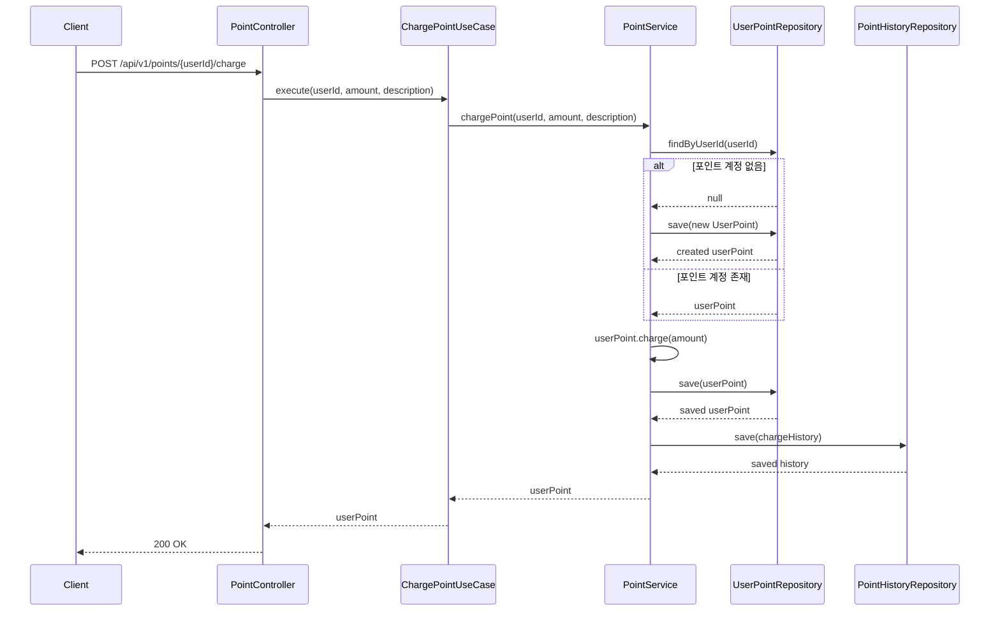
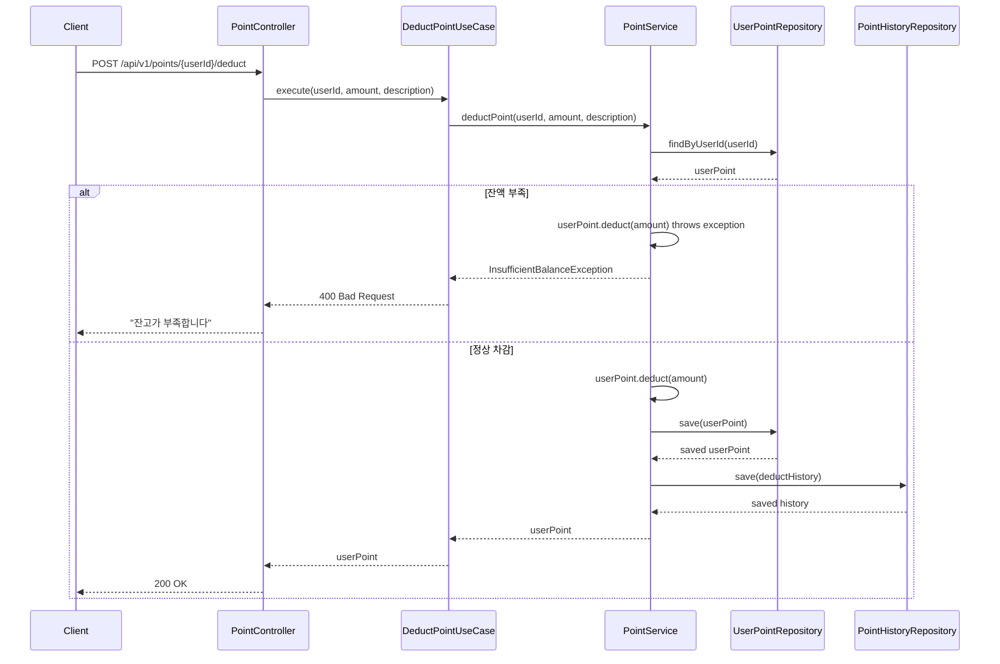
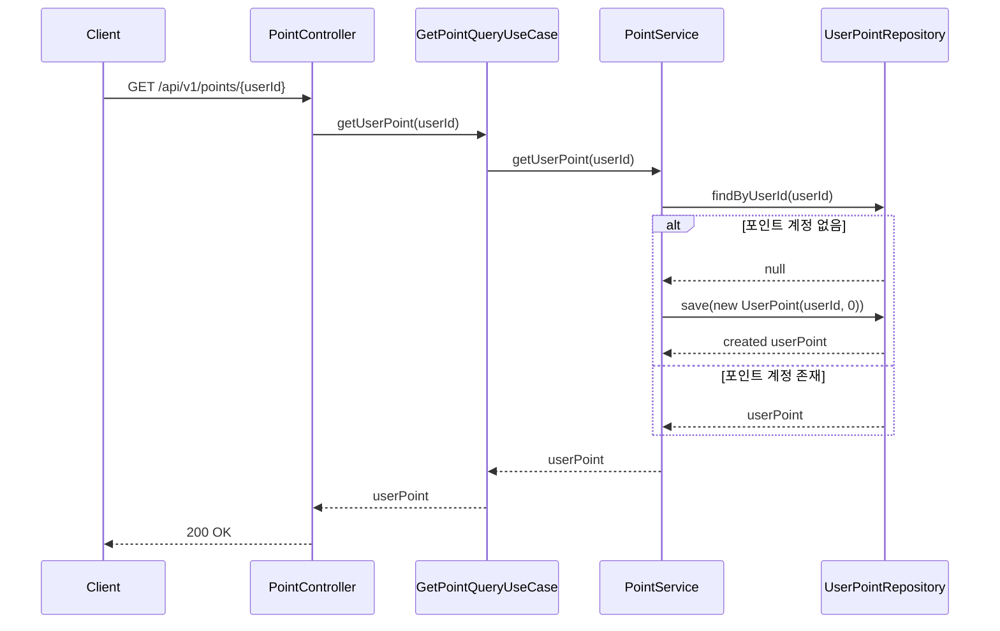

# 포인트 API 명세서

## 개요
사용자 포인트 충전, 차감, 잔액 조회 및 내역 조회를 위한 REST API입니다. 잔액 관리 및 거래 내역 추적을 제공합니다.

## 기본 정보
- **Base URL**: `/api/v1/points`
- **Content-Type**: `application/json`
- **인증**: JWT 토큰 (Bearer 방식)

## API 엔드포인트

### 1. 포인트 잔액 조회
**UseCase**: `GetPointQueryUseCase.getUserPoint()`

```http
GET /api/v1/points/{userId}
```

**Path Parameters**:
- `userId` (Long, required): 사용자 ID

**Response**:
```json
{
  "success": true,
  "data": {
    "id": 1,
    "userId": 1,
    "balance": 50000,
    "version": 3,
    "isActive": true,
    "createdAt": "2024-11-07T10:00:00Z",
    "updatedAt": "2024-11-07T10:30:00Z"
  }
}
```

### 2. 포인트 충전
**UseCase**: `ChargePointUseCase`

```http
POST /api/v1/points/{userId}/charge
```

**Path Parameters**:
- `userId` (Long, required): 포인트를 충전할 사용자 ID

**Request Body**:
```json
{
  "amount": 50000,
  "description": "포인트 충전"
}
```

**Request Fields**:
- `amount` (Long, required): 충전 금액 (최소 1원)
- `description` (String, optional): 충전 설명

**Response**:
```json
{
  "success": true,
  "data": {
    "id": 1,
    "userId": 1,
    "balance": 75000,
    "version": 2,
    "isActive": true,
    "createdAt": "2024-11-07T10:00:00Z",
    "updatedAt": "2024-11-07T11:00:00Z"
  }
}
```

### 3. 포인트 차감
**UseCase**: `DeductPointUseCase`

```http
POST /api/v1/points/{userId}/deduct
```

**Path Parameters**:
- `userId` (Long, required): 포인트를 차감할 사용자 ID

**Request Body**:
```json
{
  "amount": 25000,
  "description": "주문 결제"
}
```

**Request Fields**:
- `amount` (Long, required): 차감 금액 (양수)
- `description` (String, optional): 차감 설명

**Response**:
```json
{
  "success": true,
  "data": {
    "id": 1,
    "userId": 1,
    "balance": 50000,
    "version": 3,
    "isActive": true,
    "createdAt": "2024-11-07T10:00:00Z",
    "updatedAt": "2024-11-07T11:30:00Z"
  }
}
```

### 4. 포인트 내역 조회
**UseCase**: `GetPointQueryUseCase.getPointHistories()`

```http
GET /api/v1/points/{userId}/histories
```

**Path Parameters**:
- `userId` (Long, required): 내역을 조회할 사용자 ID

**Response**:
```json
{
  "success": true,
  "data": [
    {
      "id": 2,
      "userId": 1,
      "amount": -25000,
      "transactionType": "DEDUCT",
      "balanceBefore": 75000,
      "balanceAfter": 50000,
      "orderId": 123,
      "description": "주문 결제",
      "isActive": true,
      "createdAt": "2024-11-07T11:30:00Z",
      "updatedAt": "2024-11-07T11:30:00Z"
    },
    {
      "id": 1,
      "userId": 1,
      "amount": 50000,
      "transactionType": "CHARGE",
      "balanceBefore": 25000,
      "balanceAfter": 75000,
      "orderId": null,
      "description": "포인트 충전",
      "isActive": true,
      "createdAt": "2024-11-07T11:00:00Z",
      "updatedAt": "2024-11-07T11:00:00Z"
    }
  ]
}
```

## 시퀀스 다이어그램

### 1. 포인트 충전 플로우


### 2. 포인트 차감 플로우


### 3. 포인트 조회 플로우


## 에러 코드

| 코드 | HTTP 상태 | 메시지 | 설명 |
|-----|----------|--------|------|
| POINT001 | 400 | 잔고가 부족합니다 | 차감 금액 > 현재 잔액 |
| POINT002 | 400 | 차감 금액은 0보다 커야 합니다 | 0 이하 차감 시도 |
| POINT003 | 400 | 유효하지 않은 금액입니다 | 음수 금액 입력 |
| POINT004 | 404 | 존재하지 않는 사용자입니다 | 사용자 ID 무효 |
| POINT005 | 500 | 포인트 처리 중 오류가 발생했습니다 | 내부 서버 오류 |

## 비즈니스 정책

### 포인트 충전 정책

#### 충전 금액 제한
- **정책**: 포인트 충전은 1,000원 이상, 100,000원 이하, 100원 단위만 가능
- **검증 시점**: 포인트 충전 요청 시 (PreValidation)
- **예외 코드 및 메시지**:
  - `MinimumChargeAmount`: "최소 충전 금액은 1,000원입니다. 요청금액: {amount}"
  - `MaximumChargeAmount`: "최대 충전 금액은 100,000원입니다. 요청금액: {amount}"
  - `InvalidChargeUnit`: "포인트 충전은 100원 단위로만 가능합니다. 요청금액: {amount}"
- **구현 방식**: Domain Layer에서 PointAmount VO를 통한 검증

### 포인트 차감 정책

#### 잔액 부족 검증
- **정책**: 현재 포인트 잔액보다 많은 금액 결제 불가
- **검증 시점**: 포인트 차감 요청 시 (Business Logic Validation)
- **예외 코드 및 메시지**:
  - `InsufficientBalance`: "잔액이 부족합니다. 현재잔액: {currentBalance}, 결제금액: {paymentAmount}"
- **구현 방식**: UserPoint 엔티티 내부에서 deduct() 메서드 호출 시 검증

### 동시성 제어 정책

#### 포인트 변경 동시성 보장
- **정책**: 동시에 같은 사용자의 포인트를 변경할 때 정합성 보장
- **검증 시점**: 포인트 변경 트랜잭션 시작 시
- **예외 코드 및 메시지**:
  - `ConcurrencyException`: "포인트 처리 중 오류가 발생했습니다. 잠시 후 다시 시도해주세요."
- **구현 방식**:
  - UserPoint 엔티티의 version 필드를 통한 낙관적 락
  - 버전 충돌 시 자동 재시도 (최대 3회)

### 포인트 관리 규칙
- **초기 잔액**: 사용자 첫 조회 시 0원으로 자동 생성
- **거래 추적**: 모든 거래는 완전한 감사 추적
- **잔액 변화**: 거래 전후 잔액 기록
- **거래 타입**: CHARGE (충전), DEDUCT (차감)

### Value Object 사용
- **PointAmount**: 포인트 금액 검증 및 캡슐화
- **포인트 계산**: 잔액 변화량 추적

### 원자적 처리
- **트랜잭션 범위**: 잔액 업데이트와 히스토리 저장을 한 트랜잭션에서 처리
- **실패 시 롤백**: 히스토리 저장 실패 시 잔액 변경도 롤백

## 관련 도메인
- **User**: 사용자별 포인트 잔액 관리
- **Order**: 주문 결제 시 포인트 사용
- **Payment**: 복합 결제 시 포인트 연동