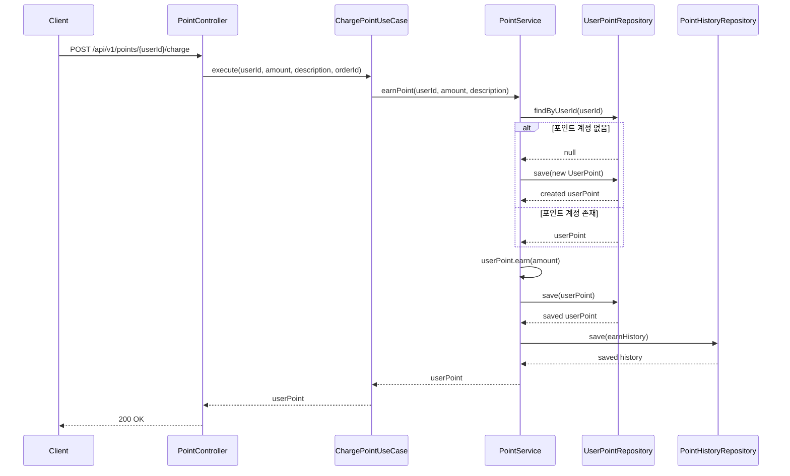
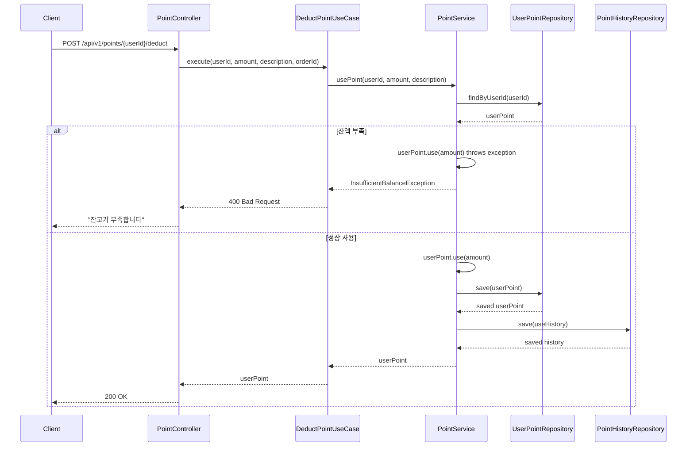
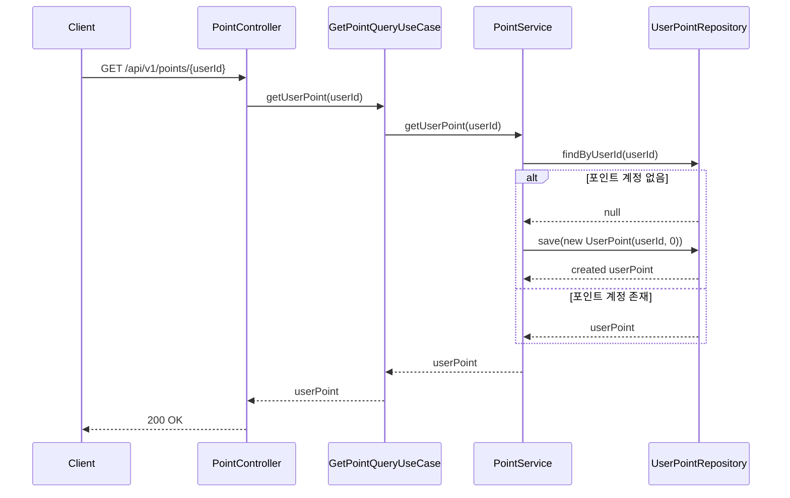

# 포인트 API 명세서

## 개요
사용자 포인트 적립, 사용, 소멸, 잔액 조회 및 내역 조회를 위한 REST API입니다.

**포인트는 할인 혜택 시스템입니다:**
- 상품 구매 시 일정 비율(기본 5%) 자동 적립
- 다음 구매 시 포인트로 할인 적용
- 적립일로부터 1년 후 자동 소멸 (EXPIRE)
- 주문 취소 시 포인트 환불 (REFUND)

## 기본 정보
- **Base URL**: `/api/v1/points`
- **Content-Type**: `application/json`
- **인증**: JWT 토큰 (Bearer 방식)

## API 엔드포인트

### 1. 포인트 잔액 조회
**UseCase**: `GetPointQueryUseCase.getUserPoint()`

```http
GET /api/v1/points/{userId}
```

**Path Parameters**:
- `userId` (Long, required): 사용자 ID

**Response**:
```json
{
  "success": true,
  "data": {
    "id": 1,
    "userId": 1,
    "balance": 50000,
    "version": 3,
    "isActive": true,
    "createdAt": "2024-11-07T10:00:00Z",
    "updatedAt": "2024-11-07T10:30:00Z"
  }
}
```

### 2. 포인트 적립
**UseCase**: `ChargePointUseCase` (내부적으로 earnPoint 사용)

> **💡 참고**: 실제 사용 시에는 주문 완료 시 자동으로 적립되며, 이 API는 관리자용이거나 특별한 경우에만 사용됩니다.

```http
POST /api/v1/points/{userId}/charge
```

**Path Parameters**:
- `userId` (Long, required): 포인트를 적립할 사용자 ID

**Request Body**:
```json
{
  "amount": 5000,
  "description": "구매 적립 (주문번호: ORD-20241107-001)",
  "orderId": 123
}
```

**Request Fields**:
- `amount` (Long, required): 적립 금액 (최소 1원)
- `description` (String, optional): 적립 설명
- `orderId` (Long, optional): 주문 ID (구매 적립인 경우)

**Response**:
```json
{
  "success": true,
  "data": {
    "id": 1,
    "userId": 1,
    "balance": 75000,
    "version": 2,
    "isActive": true,
    "createdAt": "2024-11-07T10:00:00Z",
    "updatedAt": "2024-11-07T11:00:00Z"
  }
}
```

### 3. 포인트 사용
**UseCase**: `DeductPointUseCase` (내부적으로 usePoint 사용)

```http
POST /api/v1/points/{userId}/deduct
```

**Path Parameters**:
- `userId` (Long, required): 포인트를 사용할 사용자 ID

**Request Body**:
```json
{
  "amount": 25000,
  "description": "주문 할인 적용",
  "orderId": 124
}
```

**Request Fields**:
- `amount` (Long, required): 사용 금액 (양수)
- `description` (String, optional): 사용 설명
- `orderId` (Long, optional): 주문 ID (주문 할인인 경우)

**Response**:
```json
{
  "success": true,
  "data": {
    "id": 1,
    "userId": 1,
    "balance": 50000,
    "version": 3,
    "isActive": true,
    "createdAt": "2024-11-07T10:00:00Z",
    "updatedAt": "2024-11-07T11:30:00Z"
  }
}
```

### 4. 포인트 내역 조회
**UseCase**: `GetPointQueryUseCase.getPointHistories()`

```http
GET /api/v1/points/{userId}/histories
```

**Path Parameters**:
- `userId` (Long, required): 내역을 조회할 사용자 ID

**Response**:
```json
{
  "success": true,
  "data": [
    {
      "id": 3,
      "userId": 1,
      "amount": -1000,
      "transactionType": "EXPIRE",
      "balanceBefore": 51000,
      "balanceAfter": 50000,
      "orderId": null,
      "description": "포인트 소멸 (적립일: 2023-11-07)",
      "isActive": true,
      "createdAt": "2024-11-07T12:00:00Z",
      "updatedAt": "2024-11-07T12:00:00Z"
    },
    {
      "id": 2,
      "userId": 1,
      "amount": -25000,
      "transactionType": "USE",
      "balanceBefore": 76000,
      "balanceAfter": 51000,
      "orderId": 124,
      "description": "주문 할인 적용",
      "isActive": true,
      "createdAt": "2024-11-07T11:30:00Z",
      "updatedAt": "2024-11-07T11:30:00Z"
    },
    {
      "id": 1,
      "userId": 1,
      "amount": 5000,
      "transactionType": "EARN",
      "balanceBefore": 71000,
      "balanceAfter": 76000,
      "orderId": 123,
      "description": "구매 적립 (5%)",
      "isActive": true,
      "createdAt": "2024-11-07T11:00:00Z",
      "updatedAt": "2024-11-07T11:00:00Z"
    }
  ]
}
```

## 시퀀스 다이어그램

### 1. 포인트 적립 플로우


### 2. 포인트 사용 플로우


### 3. 포인트 조회 플로우


## 에러 코드

| 코드 | HTTP 상태 | 메시지 | 설명 |
|-----|----------|--------|------|
| POINT001 | 400 | 잔고가 부족합니다 | 사용 금액 > 현재 잔액 |
| POINT002 | 400 | 사용 금액은 0보다 커야 합니다 | 0 이하 사용 시도 |
| POINT003 | 400 | 유효하지 않은 금액입니다 | 음수 금액 입력 |
| POINT004 | 400 | 최대 잔액을 초과할 수 없습니다 | 잔액 > 10,000,000원 |
| POINT005 | 404 | 존재하지 않는 사용자입니다 | 사용자 ID 무효 |
| POINT006 | 500 | 포인트 처리 중 오류가 발생했습니다 | 내부 서버 오류 |

## 비즈니스 정책

### 포인트 적립 정책

#### 적립 규칙
- **정책**: 상품 구매 시 자동으로 일정 비율 적립
- **검증 시점**: 주문 완료 시 (자동 적립)
- **규칙**:
  - 기본 적립률: 구매 금액의 5%
  - 최소 적립 금액: 1원
  - 최대 누적 가능 잔액: 10,000,000원 (천만원)
- **예외 코드 및 메시지**:
  - `MaxBalanceExceeded`: "잔액은 10,000,000원을 초과할 수 없습니다: {balance}"
- **구현 방식**: Domain Layer에서 Balance VO를 통한 검증

### 포인트 사용 정책

#### 잔액 부족 검증
- **정책**: 현재 포인트 잔액보다 많은 금액 사용 불가
- **검증 시점**: 포인트 사용 요청 시 (Business Logic Validation)
- **규칙**:
  - 사용 금액 > 현재 잔액 → 예외 발생
  - 사용 금액 <= 현재 잔액 → 정상 처리
  - 최소 사용 단위: 100원
- **예외 코드 및 메시지**:
  - `InsufficientBalance`: "잔고가 부족합니다. 현재 잔고: {currentBalance}, 사용 시도 금액: {useAmount}"
- **구현 방식**: UserPoint 엔티티 내부에서 use() 메서드 호출 시 검증

### 포인트 소멸 정책

#### 자동 소멸 규칙
- **정책**: 적립일로부터 일정 기간 후 자동 소멸
- **규칙**:
  - 유효기간: 적립일로부터 1년
  - 소멸 예정 포인트 알림: 소멸 30일 전
  - 선입선출(FIFO): 가장 먼저 적립된 포인트부터 사용/소멸
- **구현 방식**: 배치 작업으로 매일 자동 실행

### 동시성 제어 정책

#### 포인트 변경 동시성 보장
- **정책**: 동시에 같은 사용자의 포인트를 변경할 때 정합성 보장
- **검증 시점**: 포인트 변경 트랜잭션 시작 시
- **예외 코드 및 메시지**:
  - `ConcurrencyException`: "포인트 처리 중 오류가 발생했습니다. 잠시 후 다시 시도해주세요."
- **구현 방식**:
  - UserPoint 엔티티의 version 필드를 통한 낙관적 락
  - 버전 충돌 시 자동 재시도 (최대 3회)

### 포인트 관리 규칙
- **초기 잔액**: 사용자 첫 조회 시 0원으로 자동 생성
- **거래 추적**: 모든 거래는 완전한 감사 추적
- **잔액 변화**: 거래 전후 잔액 기록
- **거래 타입**: CHARGE (충전), DEDUCT (차감)

### Value Object 사용
- **PointAmount**: 포인트 금액 검증 및 캡슐화
- **포인트 계산**: 잔액 변화량 추적

### 원자적 처리
- **트랜잭션 범위**: 잔액 업데이트와 히스토리 저장을 한 트랜잭션에서 처리
- **실패 시 롤백**: 히스토리 저장 실패 시 잔액 변경도 롤백

## 관련 도메인
- **User**: 사용자별 포인트 잔액 관리
- **Order**: 주문 결제 시 포인트 사용
- **Payment**: 복합 결제 시 포인트 연동