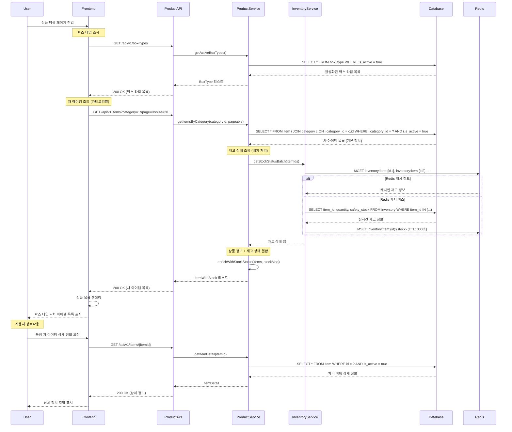

# 상품 탐색 플로우

## 개요
- **목적**: 박스 타입과 차 아이템 목록을 조회하여 사용자가 커스텀 박스를 구성할 수 있도록 함
- **핵심 비즈니스 로직**: 활성화된 상품만 노출, 카테고리별 분류, 재고 상태 표시
- **주요 검증 사항**: 상품 활성화 상태, 재고 가용성, 가격 정보 정확성

## API 엔드포인트

### 1. 박스 타입 목록 조회

#### Request
```http
GET /api/v1/box-types
Authorization: Bearer {token}
```

#### Response (성공)
```json
{
  "success": true,
  "data": [
    {
      "id": 1,
      "code": "THREE_DAYS",
      "name": "3일 박스",
      "days": 3,
      "description": "3일간 즐길 수 있는 미니 큐레이션",
      "basePrice": 15000,
      "isActive": true
    },
    {
      "id": 2,
      "code": "SEVEN_DAYS",
      "name": "7일 박스",
      "days": 7,
      "description": "일주일간 다양한 차를 경험할 수 있는 큐레이션",
      "basePrice": 29000,
      "isActive": true
    }
  ]
}
```

### 2. 차 아이템 목록 조회 (카테고리별)

#### Request
```http
GET /api/v1/items?category={categoryId}&page=0&size=20
Authorization: Bearer {token}
```

#### Response (성공)
```json
{
  "success": true,
  "data": {
    "content": [
      {
        "id": 1,
        "name": "얼그레이",
        "category": {
          "id": 1,
          "name": "홍차"
        },
        "caffeineType": "MEDIUM",
        "tasteProfile": "상큼하고 향긋한",
        "aromaProfile": "베르가못 향",
        "colorProfile": "진한 적갈색",
        "pricePer100g": 8000,
        "bagPerWeight": 3,
        "stockStatus": "AVAILABLE",
        "ingredients": "홍차, 베르가못 오일",
        "origin": "스리랑카",
        "isActive": true
      }
    ],
    "pageable": {
      "pageNumber": 0,
      "pageSize": 20,
      "totalElements": 45,
      "totalPages": 3
    }
  }
}
```

## 시퀀스 다이어그램



## 비즈니스 로직 상세

### 1. 박스 타입 조회 로직
- **활성화 상태 필터링**: `is_active = true`인 박스 타입만 조회
- **정렬 순서**: 일수 오름차순 (3일 → 7일 → 14일)
- **가격 정보**: 기본 용기 가격 + 포장 비용 포함

### 2. 차 아이템 조회 로직
- **카테고리별 필터링**: 선택한 카테고리의 활성화된 아이템만 조회
- **페이징 처리**: 한 페이지당 20개 아이템 (성능 고려)
- **재고 상태 계산**:
  ```kotlin
  fun calculateStockStatus(quantity: Int, safetyStock: Int): StockStatus {
      return when {
          quantity <= 0 -> StockStatus.OUT_OF_STOCK
          quantity <= safetyStock -> StockStatus.LOW_STOCK
          else -> StockStatus.AVAILABLE
      }
  }
  ```

### 3. 성능 최적화
- **Redis 캐싱**: 재고 정보 5분간 캐시 (변동 빈도 고려)
- **배치 조회**: 여러 아이템의 재고 정보를 한 번에 조회
- **인덱스 활용**: category_id, is_active 복합 인덱스

## 에러 처리

| 에러 코드 | HTTP 상태 | 시나리오 | 메시지 |
|----------|----------|----------|--------|
| PRODUCT001 | 404 | 존재하지 않는 카테고리 | "해당 카테고리를 찾을 수 없습니다" |
| PRODUCT002 | 400 | 잘못된 페이징 파라미터 | "페이지 번호는 0 이상이어야 합니다" |
| SYSTEM001 | 500 | 데이터베이스 연결 실패 | "일시적인 오류가 발생했습니다" |
| SYSTEM002 | 503 | Redis 연결 실패 | "재고 정보를 불러올 수 없습니다" |

상세한 에러 코드는 [../api-specification.md#8-에러-코드](../api-specification.md#8-에러-코드) 참조

## 비즈니스 정책 반영

### 재고 관리 정책 (BP-INVENTORY-001)
- 안전 재고 이하일 때 "재고 부족" 표시
- 재고 0일 때 "품절" 표시로 주문 방지

### 상품 노출 정책 (BP-PRODUCT-001)
- 활성화된 상품만 API 응답에 포함
- 중단된 상품은 기존 주문 내역에서만 확인 가능

### 가격 정책 (BP-PRICING-001)
- 100g당 가격 기준으로 표시
- 박스별 용기 비용 별도 산정

## 성능 고려사항

### 1. 데이터베이스 최적화
```sql
-- 카테고리별 상품 조회 인덱스
CREATE INDEX idx_item_category_active ON item(category_id, is_active, id);

-- 박스 타입 조회 인덱스
CREATE INDEX idx_box_type_active ON box_type(is_active, days);
```

### 2. 캐싱 전략
- **상품 기본 정보**: 1시간 캐시 (변경 빈도 낮음)
- **재고 정보**: 5분 캐시 (실시간성 필요)
- **카테고리 목록**: 24시간 캐시 (거의 변경 없음)

### 3. API 응답 최적화
- **지연 로딩**: 상품 상세 정보는 별도 API로 분리
- **압축**: 이미지 URL은 CDN 최적화 링크 제공
- **페이징**: 무한 스크롤을 위한 cursor 기반 페이징 지원

## 테스트 시나리오

### 기능 테스트
1. **정상 케이스**
   - 박스 타입 목록 정상 조회
   - 카테고리별 차 아이템 목록 조회
   - 페이징 처리 확인

2. **예외 케이스**
   - 존재하지 않는 카테고리 조회
   - 잘못된 페이징 파라미터
   - 비활성화된 상품 필터링 확인

### 성능 테스트
1. **동시 접속 테스트**: 100명 동시 상품 조회
2. **캐시 효율성 테스트**: Redis 히트율 90% 이상 목표
3. **응답 시간 테스트**: 평균 응답 시간 200ms 이하

### 부하 테스트
1. **재고 조회 부하**: 1000개 아이템 배치 조회 성능
2. **데이터베이스 부하**: 동시 쿼리 처리 능력
3. **Redis 부하**: 캐시 서버 안정성