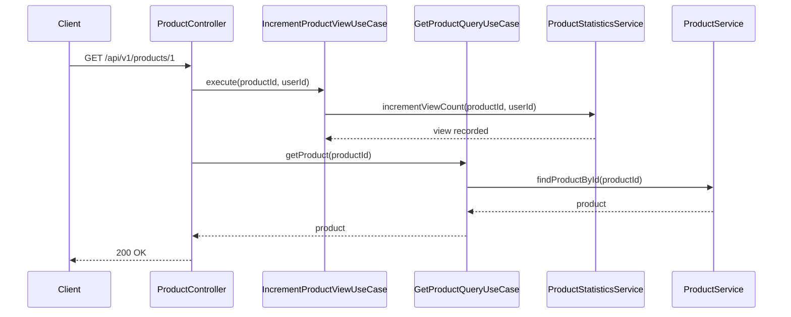
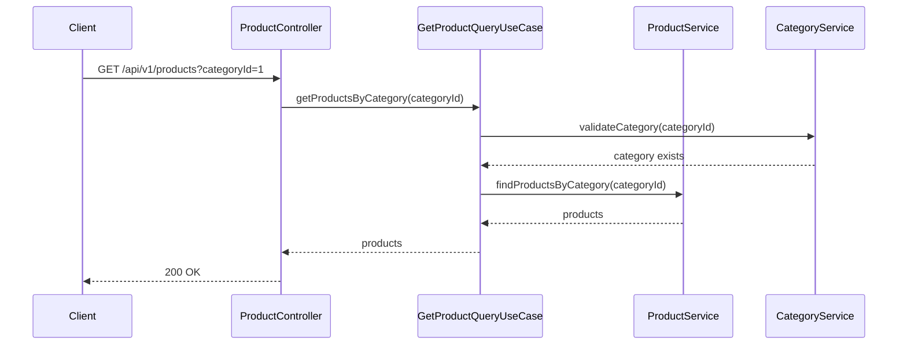
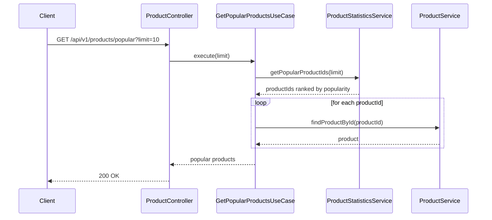

# 상품 API 명세서

## 개요
상품 조회, 생성, 수정 및 인기 상품 통계를 위한 REST API입니다. 간단한 상품-수량 기반 전자상거래 모델을 지원하며, 재고 관리와 조회수 추적을 포함합니다.

## 기본 정보
- **Base URL**: `/api/v1/products`
- **Content-Type**: `application/json`
- **인증**: JWT 토큰 (Bearer 방식, 일부 조회 API는 인증 불필요)

## API 엔드포인트

### 1. 카테고리 목록 조회
**UseCase**: `GetCategoriesQueryUseCase.getCategories()`

```http
GET /api/v1/categories
```

**Response**:
```json
{
  "success": true,
  "data": [
    {
      "id": 1,
      "name": "홍차",
      "description": "진한 맛의 홍차류",
      "productCount": 15
    },
    {
      "id": 2,
      "name": "녹차",
      "description": "상쾌한 맛의 녹차류",
      "productCount": 12
    },
    {
      "id": 3,
      "name": "허브차",
      "description": "향긋한 허브차류",
      "productCount": 8
    }
  ]
}
```

### 2. 상품 조회 (단일)
**UseCase**: `GetProductQueryUseCase.getProduct()`

```http
GET /api/v1/products/{productId}
```

**Path Parameters**:
- `productId` (Long, required): 상품 ID

**Response**:
```json
{
  "success": true,
  "data": {
    "id": 1,
    "name": "프리미엄 얼그레이 티백",
    "description": "영국 전통 얼그레이의 깊은 향이 나는 프리미엄 티백",
    "category": {
      "id": 1,
      "name": "홍차",
      "description": "진한 맛의 홍차류"
    },
    "price": 25000,
    "stockQuantity": 150,
    "unit": "박스",
    "weight": "100g",
    "ingredients": "홍차, 베르가못 오일",
    "origin": "영국",
    "status": "ACTIVE",
    "viewCount": 1250,
    "createdAt": "2024-11-01T10:00:00Z",
    "updatedAt": "2024-11-07T10:00:00Z"
  }
}
```

### 3. 상품 목록 조회
**UseCase**: `GetProductQueryUseCase.getProducts()`

```http
GET /api/v1/products?categoryId={categoryId}&status={status}&page=0&size=20
```

**Query Parameters**:
- `categoryId` (Long, optional): 카테고리 ID로 필터링
- `status` (String, optional, default=ACTIVE): 상품 상태 필터
  - `ACTIVE`: 판매중
  - `INACTIVE`: 판매중단
  - `OUT_OF_STOCK`: 재고없음
  - `ALL`: 전체
- `page` (Int, optional, default=0): 페이지 번호
- `size` (Int, optional, default=20): 페이지 크기

**Response**:
```json
{
  "success": true,
  "data": {
    "content": [
      {
        "id": 1,
        "name": "프리미엄 얼그레이 티백",
        "description": "영국 전통 얼그레이의 깊은 향이 나는 프리미엄 티백",
        "categoryName": "홍차",
        "price": 25000,
        "stockQuantity": 150,
        "status": "ACTIVE",
        "viewCount": 1250
      }
    ],
    "pagination": {
      "page": 0,
      "size": 20,
      "totalElements": 1,
      "totalPages": 1,
      "hasNext": false,
      "hasPrev": false
    }
  }
}
```

### 4. 인기 상품 조회
**UseCase**: `GetPopularProductsUseCase`

```http
GET /api/v1/products/popular?days={days}&limit={limit}
```

**Query Parameters**:
- `days` (Int, optional, default=7): 통계 기간 (일)
- `limit` (Int, optional, default=10): 조회할 상품 수

**Response**:
```json
{
  "success": true,
  "data": {
    "period": {
      "days": 7,
      "from": "2024-10-31T00:00:00Z",
      "to": "2024-11-07T23:59:59Z"
    },
    "products": [
      {
        "rank": 1,
        "product": {
          "id": 1,
          "name": "프리미엄 얼그레이 티백",
          "categoryName": "홍차",
          "price": 25000,
          "viewCount": 1250
        },
        "statistics": {
          "totalViews": 856,
          "totalOrders": 124,
          "viewGrowth": "+15.2%",
          "orderGrowth": "+8.7%"
        }
      }
    ]
  }
}
```

### 5. 상품 생성
**UseCase**: `CreateProductUseCase`

```http
POST /api/v1/products
```

**Request Body**:
```json
{
  "name": "유기농 카모마일 티백",
  "description": "독일산 유기농 카모마일로 제작된 프리미엄 허브차",
  "categoryId": 3,
  "price": 22000,
  "stockQuantity": 200,
  "unit": "박스",
  "weight": "80g",
  "ingredients": "유기농 카모마일, 레몬밤",
  "origin": "독일",
  "createdBy": 1
}
```

**Request Fields**:
- `name` (String, required): 상품명 (2-100자)
- `description` (String, required): 상품 설명 (10-500자)
- `categoryId` (Long, required): 카테고리 ID
- `price` (Long, required): 가격 (최소 1,000원)
- `stockQuantity` (Int, required): 초기 재고 (0-99,999)
- `unit` (String, required): 판매 단위 (예: "박스", "개", "팩")
- `weight` (String, optional): 중량 정보 (예: "100g", "50개입")
- `ingredients` (String, optional): 원재료 정보
- `origin` (String, optional): 원산지
- `createdBy` (Long, required): 생성자 ID

**Response**:
```json
{
  "success": true,
  "data": {
    "id": 2,
    "name": "유기농 카모마일 티백",
    "description": "독일산 유기농 카모마일로 제작된 프리미엄 허브차",
    "categoryId": 3,
    "price": 22000,
    "stockQuantity": 200,
    "status": "ACTIVE",
    "createdAt": "2024-11-07T12:00:00Z"
  }
}
```

### 6. 상품 정보 수정
**UseCase**: `UpdateProductUseCase`

```http
PUT /api/v1/products/{productId}
```

**Path Parameters**:
- `productId` (Long, required): 수정할 상품 ID

**Request Body**:
```json
{
  "name": "프리미엄 유기농 카모마일 티백",
  "description": "독일산 유기농 카모마일로 제작된 최고급 허브차",
  "price": 28000,
  "status": "ACTIVE",
  "updatedBy": 1
}
```

**Response**:
```json
{
  "success": true,
  "data": {
    "id": 2,
    "name": "프리미엄 유기농 카모마일 티백",
    "description": "독일산 유기농 카모마일로 제작된 최고급 허브차",
    "price": 28000,
    "status": "ACTIVE",
    "updatedAt": "2024-11-07T13:00:00Z"
  }
}
```

### 7. 상품 조회수 증가
**UseCase**: `IncrementProductViewUseCase`

```http
POST /api/v1/products/{productId}/view
```

**Path Parameters**:
- `productId` (Long, required): 상품 ID

**Request Body**:
```json
{
  "userId": 1,
  "sessionId": "session-123",
  "userAgent": "Mozilla/5.0..."
}
```

**Response**:
```json
{
  "success": true,
  "data": {
    "productId": 1,
    "totalViewCount": 1251,
    "viewedAt": "2024-11-07T14:00:00Z"
  }
}
```

## 상품 상태

### ProductStatus
1. **ACTIVE**: 판매중
   - 정상 판매 가능
   - 재고 있음

2. **INACTIVE**: 판매중단
   - 일시적 판매 중단
   - 관리자가 수동으로 중단

3. **OUT_OF_STOCK**: 재고없음
   - 재고가 0이 되어 자동으로 중단
   - 재고 입고 시 자동으로 ACTIVE로 변경

4. **DISCONTINUED**: 단종
   - 영구적 판매 중단
   - 더 이상 판매하지 않는 상품

## 에러 코드

| 코드 | HTTP 상태 | 메시지 | 설명 |
|-----|----------|--------|------|
| PRODUCT001 | 404 | 존재하지 않는 상품입니다 | 상품 ID 무효 |
| PRODUCT002 | 400 | 판매가 중단된 상품입니다 | INACTIVE 상태 |
| PRODUCT003 | 400 | 재고가 부족한 상품입니다 | OUT_OF_STOCK 상태 |
| PRODUCT004 | 400 | 유효하지 않은 가격입니다 | 1,000원 미만 |
| PRODUCT005 | 400 | 상품명이 너무 짧습니다 | 2자 미만 |
| PRODUCT006 | 400 | 상품명이 너무 깁니다 | 100자 초과 |
| PRODUCT007 | 400 | 상품 설명이 필요합니다 | 10자 미만 설명 |
| PRODUCT008 | 400 | 유효하지 않은 재고 수량입니다 | 99,999 초과 |
| PRODUCT009 | 404 | 존재하지 않는 카테고리입니다 | 카테고리 ID 무효 |
| PRODUCT010 | 409 | 동일한 상품명이 이미 존재합니다 | 상품명 중복 |

## Value Object 사용

### ProductPrice (상품 가격)
```kotlin
@JvmInline
value class ProductPrice private constructor(val value: Long) {
    companion object {
        private const val MIN_PRICE = 1000L
        private const val MAX_PRICE = 1_000_000L

        fun of(value: Long): ProductPrice {
            require(value >= MIN_PRICE) { "최소 가격: ${MIN_PRICE}원" }
            require(value <= MAX_PRICE) { "최대 가격: ${MAX_PRICE}원" }
            return ProductPrice(value)
        }
    }

    fun getFormattedPrice(): String = "${String.format("%,d", value)}원"
}
```

### Stock (재고)
```kotlin
@JvmInline
value class Stock private constructor(val value: Int) {
    companion object {
        private const val MAX_STOCK = 99_999

        fun of(value: Int): Stock {
            require(value >= 0) { "재고는 0 이상이어야 합니다" }
            require(value <= MAX_STOCK) { "최대 재고: ${MAX_STOCK}개" }
            return Stock(value)
        }

        fun empty(): Stock = Stock(0)
    }

    fun isAvailable(): Boolean = value > 0
    fun canReserve(quantity: Int): Boolean = value >= quantity

    operator fun minus(quantity: Int): Stock = Stock(value - quantity)
    operator fun plus(quantity: Int): Stock = Stock(value + quantity)
}
```

## 재고 관리

### 재고 차감 로직
```kotlin
// 비관적 락을 사용한 안전한 재고 차감
@Lock(LockModeType.PESSIMISTIC_WRITE)
fun reserveStock(productId: Long, quantity: Int): Boolean {
    val product = productRepository.findById(productId)

    if (product.canReserveStock(quantity)) {
        product.reserveStock(quantity)
        return true
    }

    throw InsufficientStockException(productId, quantity)
}
```

### 상태 자동 변경
- **재고 0 → OUT_OF_STOCK**: 재고가 0이 되면 자동으로 상태 변경
- **재고 입고 → ACTIVE**: OUT_OF_STOCK에서 재고가 추가되면 ACTIVE로 변경

## 통계 및 분석

### 인기 상품 산정 기준
1. **조회수**: 상품 상세 페이지 방문 수
2. **주문 수**: 실제 주문에 포함된 횟수
3. **증가율**: 이전 기간 대비 성장률

### 조회수 추적
- **중복 방지**: 동일 사용자/세션의 연속 조회 중복 제거
- **봇 필터링**: 의심스러운 트래픽 필터링
- **실시간 업데이트**: 조회수 실시간 반영

## 카테고리 시스템

### 상품-카테고리 관계
- **다대일**: 한 상품은 하나의 카테고리에만 속함
- **계층 구조**: 카테고리는 트리 구조 가능 (향후 확장)

### 상품 기본 정보
- **단위**: 판매 단위 (박스, 개, 팩 등) 명시 필수
- **중량**: 상품의 중량 또는 용량 정보
- **원재료**: 상품의 구성 성분 정보

## 검색 및 필터링

### 상품 검색 (향후 확장)
- **제목/설명**: 텍스트 기반 검색
- **카테고리**: 카테고리별 필터링
- **가격대**: 최소/최대 가격 범위
- **재고 여부**: 재고 있는 상품만

### 정렬 옵션
- **인기순**: 조회수 + 주문수 기반
- **최신순**: 등록일 기준
- **가격순**: 낮은가격/높은가격
- **이름순**: 가나다순

## 시퀀스 다이어그램

### 1. 상품 조회 및 조회수 증가 플로우


### 2. 카테고리별 상품 조회 플로우


### 3. 인기 상품 조회 플로우


## 관련 도메인
- **Cart**: 장바구니에 상품 추가 (상품ID + 수량)
- **Order**: 주문에 상품 포함 (상품ID + 수량 + 단가)
- **Inventory**: 재고 관리 연동
- **Category**: 상품 분류 관리