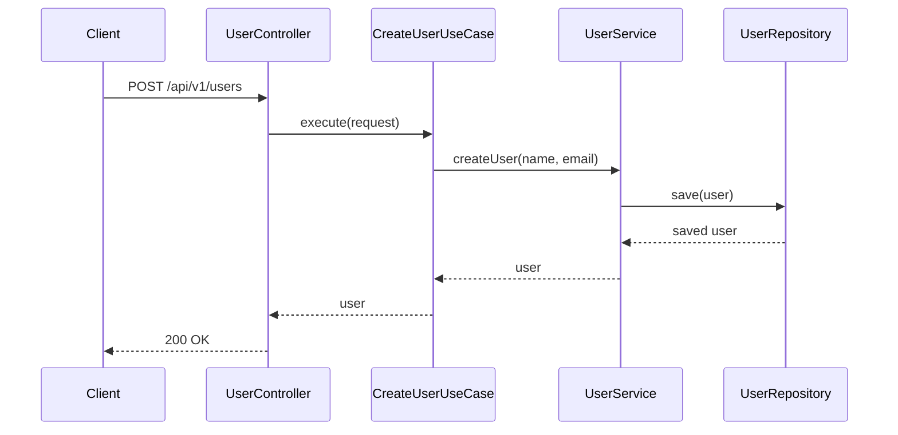
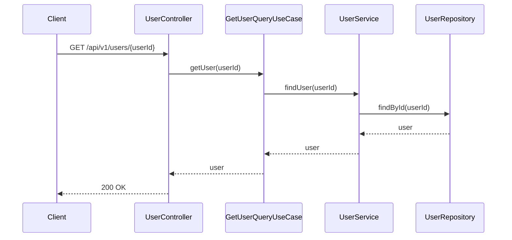
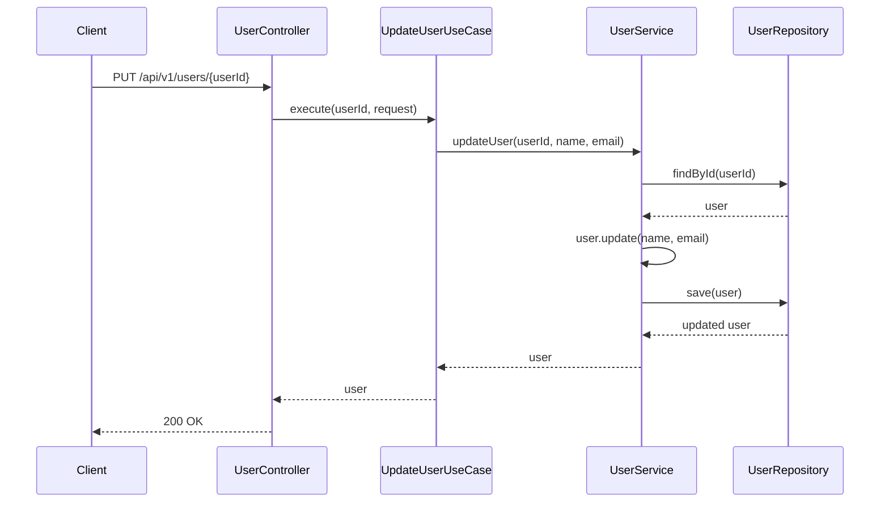

# 사용자 API 명세서

## 개요
사용자 계정 관리를 위한 REST API입니다. 사용자 생성, 조회, 수정, 활성화/비활성화 기능을 제공합니다.

## 기본 정보
- **Base URL**: `/api/v1/users`
- **Content-Type**: `application/json`
- **인증**: JWT 토큰 (Bearer 방식)

## API 엔드포인트

### 1. 사용자 생성
**UseCase**: `CreateUserUseCase`

```http
POST /api/v1/users
```

**Request Body**:
```json
{
  "name": "김철수",
  "email": "user@example.com"
}
```

**Request Fields**:
- `name` (String, required): 사용자 이름
- `email` (String, required): 이메일 주소

**Response**:
```json
{
  "success": true,
  "data": {
    "id": 1,
    "loginType": "EMAIL",
    "loginId": "user@example.com",
    "email": "user@example.com",
    "name": "김철수",
    "phone": "010-1234-5678",
    "providerId": null,
    "isActive": true,
    "createdAt": "2024-11-07T10:00:00Z",
    "updatedAt": "2024-11-07T10:00:00Z"
  }
}
```

### 2. 사용자 조회
**UseCase**: `GetUserQueryUseCase.getUser()`

```http
GET /api/v1/users/{userId}
```

**Path Parameters**:
- `userId` (Long, required): 사용자 ID

**Response**:
```json
{
  "success": true,
  "data": {
    "id": 1,
    "loginType": "EMAIL",
    "loginId": "user@example.com",
    "email": "user@example.com",
    "name": "김철수",
    "phone": "010-1234-5678",
    "providerId": null,
    "isActive": true,
    "createdAt": "2024-11-07T10:00:00Z",
    "updatedAt": "2024-11-07T10:00:00Z"
  }
}
```

### 3. 모든 사용자 목록 조회
**UseCase**: `GetUserQueryUseCase.getAllUsers()`

```http
GET /api/v1/users
```

**Response**:
```json
{
  "success": true,
  "data": [
    {
      "id": 1,
      "loginType": "EMAIL",
      "loginId": "user@example.com",
      "email": "user@example.com",
      "name": "김철수",
      "phone": "010-1234-5678",
      "providerId": null,
      "isActive": true,
      "createdAt": "2024-11-07T10:00:00Z",
      "updatedAt": "2024-11-07T10:00:00Z"
    }
  ]
}
```

### 4. 사용자 정보 수정
**UseCase**: `UpdateUserUseCase`

```http
PUT /api/v1/users/{userId}
```

**Path Parameters**:
- `userId` (Long, required): 수정할 사용자 ID

**Request Body**:
```json
{
  "name": "김철수",
  "email": "updated@example.com"
}
```

**Request Fields**:
- `name` (String, optional): 수정할 이름
- `email` (String, optional): 수정할 이메일

**Response**:
```json
{
  "success": true,
  "data": {
    "id": 1,
    "loginType": "EMAIL",
    "loginId": "user@example.com",
    "email": "updated@example.com",
    "name": "김철수",
    "phone": "010-1234-5678",
    "providerId": null,
    "isActive": true,
    "updatedAt": "2024-11-07T11:00:00Z"
  }
}
```

### 5. 사용자 비활성화
**UseCase**: `DeactivateUserUseCase`

```http
POST /api/v1/users/{userId}/deactivate
```

**Path Parameters**:
- `userId` (Long, required): 비활성화할 사용자 ID

**Response**:
```json
{
  "success": true,
  "data": {
    "id": 1,
    "loginType": "EMAIL",
    "loginId": "user@example.com",
    "email": "user@example.com",
    "name": "김철수",
    "phone": "010-1234-5678",
    "providerId": null,
    "isActive": false,
    "updatedAt": "2024-11-07T12:00:00Z"
  }
}
```

### 6. 사용자 활성화
**UseCase**: `ActivateUserUseCase`

```http
POST /api/v1/users/{userId}/activate
```

**Path Parameters**:
- `userId` (Long, required): 활성화할 사용자 ID

**Response**:
```json
{
  "success": true,
  "data": {
    "id": 1,
    "loginType": "EMAIL",
    "loginId": "user@example.com",
    "email": "user@example.com",
    "name": "김철수",
    "phone": "010-1234-5678",
    "providerId": null,
    "isActive": true,
    "updatedAt": "2024-11-07T12:00:00Z"
  }
}
```

### 7. 사용자 배송지 목록 조회
**UseCase**: `GetUserAddressQueryUseCase.getUserAddresses()`

```http
GET /api/v1/users/{userId}/addresses
```

**Path Parameters**:
- `userId` (Long, required): 사용자 ID

**Response**:
```json
{
  "success": true,
  "data": [
    {
      "id": 1,
      "userId": 1,
      "addressType": "HOME",
      "isDefault": true,
      "recipientName": "김철수",
      "phone": "010-1234-5678",
      "zipCode": "06234",
      "address": "서울시 강남구 테헤란로 123",
      "addressDetail": "456호",
      "deliveryMessage": "문 앞에 놓아주세요",
      "isActive": true,
      "createdAt": "2024-11-07T10:00:00Z",
      "updatedAt": "2024-11-07T10:00:00Z"
    },
    {
      "id": 2,
      "userId": 1,
      "addressType": "OFFICE",
      "isDefault": false,
      "recipientName": "김철수",
      "phone": "010-1234-5678",
      "zipCode": "06234",
      "address": "서울시 강남구 역삼로 789",
      "addressDetail": "3층 개발팀",
      "deliveryMessage": "경비실에 맡겨주세요",
      "isActive": true,
      "createdAt": "2024-11-07T11:00:00Z",
      "updatedAt": "2024-11-07T11:00:00Z"
    }
  ]
}
```

### 8. 배송지 추가
**UseCase**: `CreateUserAddressUseCase`

```http
POST /api/v1/users/{userId}/addresses
```

**Path Parameters**:
- `userId` (Long, required): 사용자 ID

**Request Body**:
```json
{
  "addressType": "HOME",
  "isDefault": false,
  "recipientName": "김철수",
  "phone": "010-1234-5678",
  "zipCode": "06234",
  "address": "서울시 강남구 테헤란로 123",
  "addressDetail": "456호",
  "deliveryMessage": "문 앞에 놓아주세요"
}
```

**Request Fields**:
- `addressType` (String, required): 주소 타입 (HOME/OFFICE/CUSTOM)
- `isDefault` (Boolean, optional, default=false): 기본 배송지 설정 여부
- `recipientName` (String, required): 수령인 이름
- `phone` (String, required): 연락처
- `zipCode` (String, required): 우편번호
- `address` (String, required): 기본 주소
- `addressDetail` (String, optional): 상세 주소
- `deliveryMessage` (String, optional): 배송 메시지

**Response**:
```json
{
  "success": true,
  "data": {
    "id": 3,
    "userId": 1,
    "addressType": "HOME",
    "isDefault": false,
    "recipientName": "김철수",
    "phone": "010-1234-5678",
    "zipCode": "06234",
    "address": "서울시 강남구 테헤란로 123",
    "addressDetail": "456호",
    "deliveryMessage": "문 앞에 놓아주세요",
    "isActive": true,
    "createdAt": "2024-11-07T12:00:00Z",
    "updatedAt": "2024-11-07T12:00:00Z"
  }
}
```

### 9. 배송지 수정
**UseCase**: `UpdateUserAddressUseCase`

```http
PUT /api/v1/users/{userId}/addresses/{addressId}
```

**Path Parameters**:
- `userId` (Long, required): 사용자 ID
- `addressId` (Long, required): 배송지 ID

**Request Body**:
```json
{
  "recipientName": "김철수",
  "phone": "010-9876-5432",
  "deliveryMessage": "경비실에 맡겨주세요"
}
```

**Response**:
```json
{
  "success": true,
  "data": {
    "id": 3,
    "userId": 1,
    "addressType": "HOME",
    "isDefault": false,
    "recipientName": "김철수",
    "phone": "010-9876-5432",
    "zipCode": "06234",
    "address": "서울시 강남구 테헤란로 123",
    "addressDetail": "456호",
    "deliveryMessage": "경비실에 맡겨주세요",
    "isActive": true,
    "updatedAt": "2024-11-07T13:00:00Z"
  }
}
```

### 10. 배송지 삭제
**UseCase**: `DeleteUserAddressUseCase`

```http
DELETE /api/v1/users/{userId}/addresses/{addressId}
```

**Path Parameters**:
- `userId` (Long, required): 사용자 ID
- `addressId` (Long, required): 배송지 ID

**Response**:
```json
{
  "success": true,
  "data": {
    "message": "배송지가 삭제되었습니다"
  }
}
```

### 11. 기본 배송지 설정
**UseCase**: `SetDefaultAddressUseCase`

```http
POST /api/v1/users/{userId}/addresses/{addressId}/default
```

**Path Parameters**:
- `userId` (Long, required): 사용자 ID
- `addressId` (Long, required): 기본 배송지로 설정할 배송지 ID

**Response**:
```json
{
  "success": true,
  "data": {
    "id": 2,
    "userId": 1,
    "addressType": "OFFICE",
    "isDefault": true,
    "recipientName": "김철수",
    "phone": "010-1234-5678",
    "zipCode": "06234",
    "address": "서울시 강남구 역삼로 789",
    "addressDetail": "3층 개발팀",
    "deliveryMessage": "경비실에 맡겨주세요",
    "isActive": true,
    "updatedAt": "2024-11-07T14:00:00Z"
  }
}
```

## 시퀀스 다이어그램

### 1. 사용자 생성 플로우


### 2. 사용자 조회 플로우


### 3. 사용자 수정 플로우


## 에러 코드

| 코드 | HTTP 상태 | 메시지 | 설명 |
|-----|----------|--------|------|
| USER001 | 404 | 존재하지 않는 사용자입니다 | 사용자 ID 무효 |
| USER002 | 409 | 이미 사용중인 이메일입니다 | 이메일 중복 |
| USER003 | 400 | 유효하지 않은 이메일 형식입니다 | 이메일 형식 오류 |
| USER004 | 400 | 이름은 필수입니다 | 이름 누락 |
| USER005 | 400 | 유효하지 않은 전화번호 형식입니다 | 전화번호 형식 오류 |
| USER006 | 403 | 비활성화된 사용자입니다 | 비활성 사용자 |
| USER007 | 404 | 존재하지 않는 배송지입니다 | 배송지 ID 무효 |
| USER008 | 403 | 배송지 접근 권한이 없습니다 | 다른 사용자의 배송지 |
| USER009 | 400 | 기본 배송지는 삭제할 수 없습니다 | 기본 배송지 삭제 시도 |
| USER010 | 400 | 배송지는 최대 10개까지 등록 가능합니다 | 배송지 개수 초과 |

## 비즈니스 규칙

### 사용자 생성 규칙
- **이메일**: 유니크해야 함
- **이름**: 필수 입력
- **전화번호**: 010-XXXX-XXXX 형식 (생성 시 검증)

### 사용자 상태 관리
- **isActive**: true (활성) / false (비활성)
- **비활성화**: 로그인 불가, 서비스 이용 제한
- **활성화**: 정상적인 서비스 이용 가능

### 배송지 관리 규칙
- **최대 배송지 개수**: 사용자당 최대 10개
- **기본 배송지**: 사용자당 반드시 1개의 기본 배송지 존재
- **기본 배송지 변경**: 새로운 기본 배송지 설정 시 기존 기본 배송지는 자동 해제
- **기본 배송지 삭제**: 기본 배송지는 직접 삭제 불가, 다른 배송지를 기본으로 설정 후 삭제 가능
- **첫 배송지**: 첫 번째 등록된 배송지는 자동으로 기본 배송지로 설정

### Value Object 사용
- 전화번호 형식 검증: `validatePhoneFormat()`
- 이메일 유효성 검증

## 관련 도메인
- **Point**: 사용자별 포인트 잔액 관리
- **Order**: 주문자 정보 연동
- **Coupon**: 쿠폰 발급 및 사용자 검증
- **Cart**: 사용자별 장바구니 관리
- **Payment**: 결제자 정보 연동